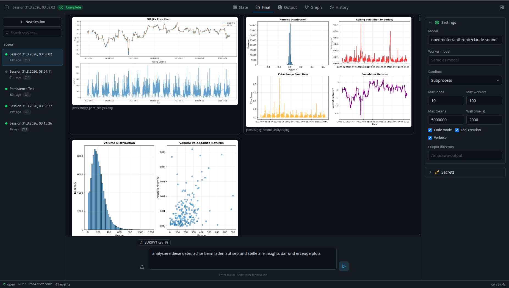
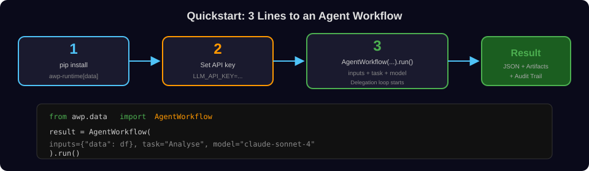
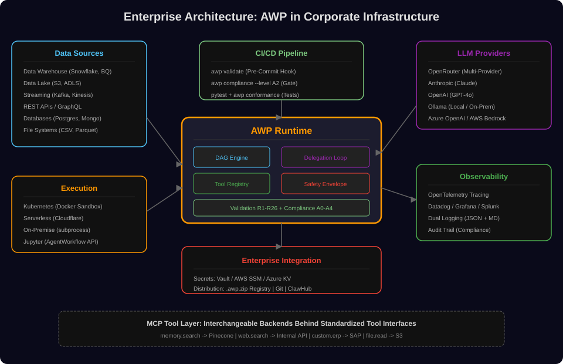
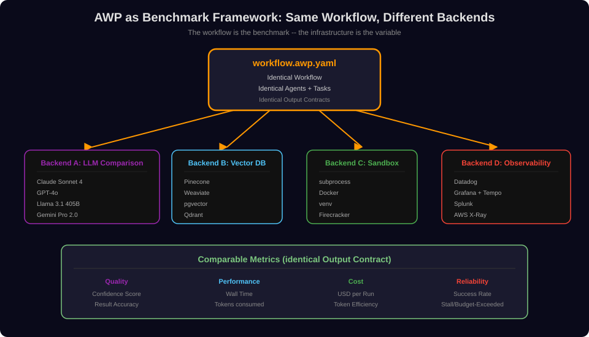

<p align="center">
  
</p>

<h1 align="center">AWP - Agent Workflow Protocol</h1>

<p align="center">
  <strong>The open standard for orchestrating multi-agent AI workflows.</strong><br/>
  Agents that adapt to the problem at runtime — building their own tools, skills, and strategies as they go.<br/>
  Define in YAML. Run in Python. Scale from a single agent to recursive delegation loops.
</p>

<p align="center">
  <a href="https://pypi.org/project/awp-agents/"></a>
  <a href="https://pypi.org/project/awp-agents/"></a>
  <a href="https://pypi.org/project/awp-agents/"></a>
  <a href="LICENSE"></a>
  <a href="https://github.com/veegee82/agent-workflow-protocol/stargazers"></a>
</p>

<p align="center">
  <code>pip install awp-agents && python -m awp studio</code>
</p>

<p align="center">
  <a href="docs/">Docs</a> &middot;
  <a href="docs/architecture.md">Architecture</a> &middot;
  <a href="examples/">Examples</a> &middot;
  <a href="spec/versions/1.0/spec.md">Specification</a> &middot;
  <a href="https://pypi.org/project/awp-agents/">PyPI</a> &middot;
  <a href="skill/SKILL.md">AWP Skill</a> &middot;
  <a href="examples/jupyter/playground.ipynb">Playground</a> &middot;
  <a href="docs/ui.md">Workflow Studio</a> &middot;
  <a href="README_GENERATION.md">Workflow Generation</a> &middot;
  <a href="README_NERD.md">Theory</a> &middot;
  <a href="README_SUPER_NERD.md">Deep Theory</a> &middot;
  <a href="docs/openclaw_integration.md">OpenClaw Integration</a>
</p>

---

## Table of Contents

**From concrete to abstract:**
1. [Quickstart: 3 Lines of Code](#1-quickstart-3-lines-of-code)
2. [Data Science Integration](#2-data-science-integration)
3. [Workflow Studio (UI)](#3-workflow-studio-ui)
4. [Enterprise Architecture](#4-enterprise-architecture)
5. [Infrastructure Benchmarking](#5-infrastructure-benchmarking)
6. [YAML Workflows & CLI](#6-yaml-workflows--cli)
7. [The Delegation Loop in Detail](#7-the-delegation-loop-in-detail)
8. [Budget, Safety, Validation](#8-budget-safety-validation)
9. [The Autonomy Spectrum (A0-A4)](#9-the-autonomy-spectrum-a0-a4)
10. [The 7-Layer Model](#10-the-7-layer-model)
11. [Repository & Links](#11-repository--links)

---

## 1. Quickstart: 3 Lines of Code

### Quick Start

```bash
pip install awp-agents && awp studio
```

If `awp` is not recognized after install (common on Windows), use the universal fallback:

```bash
pip install awp-agents && python -m awp studio
```

This launches **[Workflow Studio](#3-workflow-studio-ui)** at `http://127.0.0.1:8420` — a browser-based UI where you can configure tasks, attach files, pick a model, and watch agents solve problems live. No code required.

<p align="center">
  
</p>

Options: `--port 9000`, `--no-open`, `--base-dir ./my-workflows`, `--dev` (Vite hot-reload).

### Installation

```bash
pip install awp-agents
```

> **Windows/macOS/Linux PATH issues?** If `awp` is not found after install, use `python -m awp` instead — it works identically on every platform, no PATH configuration needed. See [Platform Notes](#platform-notes) below.

**For local development** (editable install from this repo):

```bash
pip install -e "reference/python/"
```

<p align="center">
  
</p>

### What's Inside

| Module | What it provides |
|--------|------------------|
| `awp.models` | Pydantic models for all 7 AWP layers |
| `awp.parser` | Parse `workflow.awp.yaml` and `agent.awp.yaml` into typed objects |
| `awp.validator` | Rule engine (R1-R26): naming, graph structure, budgets |
| `awp.runtime` | DAG engine + delegation loop engine, LLM client, tool registry, code executors |
| `awp.data` | Programmatic API — `AgentWorkflow` for 3-line workflows |
| `awp.cli` | CLI: `awp studio`, `awp validate`, `awp compliance`, `awp visualize`, `awp run` |

```python
from awp.models import AWPManifest
from awp.validator import validate_rules
from awp.runtime import WorkflowRunner
from awp.data import AgentWorkflow
```

### Configure LLM Provider

```python
import os

# Option A: OpenRouter (50+ models, one key)
os.environ["LLM_API_KEY"] = "sk-or-v1-..."
os.environ["LLM_BASE_URL"] = "https://openrouter.ai/api/v1"

# Option B: Ollama (local, free)
os.environ["LLM_API_KEY"] = "ollama"
os.environ["LLM_BASE_URL"] = "http://localhost:11434/v1"

# Option C: OpenAI / Azure / Bedrock
os.environ["LLM_API_KEY"] = "sk-..."
os.environ["LLM_BASE_URL"] = "https://api.openai.com/v1"
```

### Temperature Configuration

Temperature controls how deterministic or creative agent responses are (`0.0` = deterministic, `1.0` = creative).

**In Python (AgentWorkflow):** The delegation loop defaults to `temperature=0.2` for the manager. In A2+ workflows, the manager can set temperature per worker via the delegation envelope — use low values for analysis/validation tasks, higher for brainstorming/writing.

**In YAML (`agent.awp.yaml`):** Set it under `model.parameters`:

```yaml
model:
  name: "openrouter/anthropic/claude-sonnet-4"
  parameters:
    temperature: 0.2    # 0.0 = deterministic, 1.0 = creative
    max_tokens: 4096
```

**Defaults:** Manager = `0.2`, YAML agent definition = `0.0`, delegation workers = `0.2` (overridable by manager). Validation gates always use `0.1` for consistency.

### First Workflow

```python
import numpy as np
import pandas as pd
from awp.data import AgentWorkflow

df = pd.DataFrame({
    "date": pd.date_range("2024-01-01", periods=100, freq="D"),
    "revenue": [100 + i * 2.5 + (i % 7) * 10 for i in range(100)],
    "region": ["EU", "US", "APAC", "EU", "US"] * 20,
})

# Inputs: DataFrames, numpy arrays, images (by path), dicts, strings, ...
result = AgentWorkflow(
    inputs={
        "sales_data": df,                             # pandas DataFrame -> CSV
        "weights": np.array([0.5, 0.3, 0.2]),        # numpy -> .npy
        "logo": "/path/to/company_logo.png",          # image -> copy + metadata
    },
    task="Analyze the sales data: trends per region, weighted growth rates, summary.",
    model="openrouter/anthropic/claude-sonnet-4",
    max_loops=5,
    output_dir="./analysis",
).run()

print(result["status"])      # "complete"
print(result["artifacts"])   # ["./analysis/output/chart.png", ...]
print(result["metadata"])    # {"loops": 3, "tokens_used": 45000, "wall_time": 42.5, ...}
```

**What happens**: AWP creates a manager agent that analyzes the problem and decomposes it into subtasks. Worker agents adapt at runtime — they write Python code, create domain-specific tools, and build on each other's results, all inside sandboxes. The manager validates, iterates, and aggregates. No pre-built tooling needed: agents construct what they need to solve *your specific problem*.

---

## 2. Data Science Integration

<p align="center">
  
</p>

### The Notebook Problem -- and AWP's Solution

| Problem | AWP Solution |
|---------|-------------|
| Monolithic notebooks without structure | Agent-based decomposition into subtasks |
| "It worked on my machine" | Sandbox execution, complete artifact documentation |
| One analysis, many datasets | Delegation loop with dynamic worker creation |
| Every domain needs custom tooling | Agents build domain-specific tools at runtime (A3+) |
| Results lost in Slack | Persistent workspace artifacts with Markdown reports |

### Supported Input Types

AWP classifies inputs automatically:

| Python Type | InputType | Workspace Format | Processing |
|------------|-----------|-----------------|-------------|
| `pd.DataFrame` | `dataframe` | `.csv` | Schema (shape, dtypes, head, describe) |
| `np.ndarray` | `ndarray` | `.npy` | Schema (shape, dtype, min/max/mean/std) |
| `str` (image path) | `image` | copy to `inputs/` | Auto-detected by extension (.png, .jpg, .gif, .bmp, .tiff, .webp, ...), PIL metadata (width, height, mode) |
| `str` (file path) | `file_path` | copy to `inputs/` | Any files/directories |
| `dict` / `list` | `dict` / `list` | `.json` | JSON export, dicts inlined in manager prompt |
| `str` / `int` / `float` | `string` / `numeric` | inline | Directly in manager prompt |
| `bytes` | `bytes` | `.bin` | Binary file in workspace |
| `Source` | `source` | resolved → auto | Fetched at runtime (see Data Sources below) |

**numpy arrays** are stored losslessly as `.npy`. Workers load them via `np.load()`.
**Images** are detected by file extension (not MIME type). If PIL/Pillow is available, dimensions, color mode, and format are extracted and reported to the manager.

### Data Sources — Fetch Data at Runtime

The `Source` class lets you declare external data sources as inputs. AWP resolves them before the workflow starts — fetching URLs, running SQL queries, reading S3 objects, or matching local files.

```python
from awp.data import AgentWorkflow, Source

result = AgentWorkflow(
    inputs={
        "api_data": Source.url("https://api.example.com/data.json",
                               headers={"Authorization": "Bearer $API_TOKEN"}),
        "db_query": Source.sql("SELECT * FROM sales WHERE year=2025",
                               dsn="sqlite:///data.db"),
        "s3_file":  Source.s3("s3://my-bucket/reports/q4.csv", region="eu-west-1"),
        "logs":     Source.glob("logs/**/*.json", root="/var/log/app"),
        "rest_api": Source.api("https://api.github.com/repos/user/repo",
                               jq=".stargazers_count"),
        "local_df": df,  # Regular DataFrame — mixed with Sources
    },
    task="Cross-reference all data sources and produce a unified report.",
    model="openrouter/anthropic/claude-sonnet-4",
    secrets={"API_TOKEN": os.getenv("API_TOKEN", "")},
).run()
```

| Factory | Description | Extras |
|---------|-------------|--------|
| `Source.url(url)` | HTTP/HTTPS fetch | `headers`, auto-detect format |
| `Source.sql(query, dsn=)` | SQL query (SQLite/SQLAlchemy) | `params`, `format` ("dataframe" or "list_of_dicts") |
| `Source.s3(uri)` | AWS S3 object | `region` |
| `Source.glob(pattern)` | Local file matching | `root`, `merge` ("directory" or "file") |
| `Source.api(url)` | REST API call | `method`, `headers`, `body`, `jq` (JSONPath) |
| `Source.base64(data)` | Inline base64 | `format` |
| `Source.clipboard()` | System clipboard | — |

All sources support `cache` (default: True), `retries` (default: 2), and `timeout` (default: 30s). Secret references use `$SECRET_NAME` syntax in headers, DSNs, and body fields — values are substituted from the `secrets` dict without exposing them to agents.

Install extras for SQL and S3: `pip install awp-agents[sources-sql]`, `pip install awp-agents[sources-s3]`, or `pip install awp-agents[sources-all]`.

### Workflow Examples

#### Exploratory Data Analysis

```python
result = AgentWorkflow(
    inputs={"dataset": df_raw},
    task="""
    Perform a complete EDA:
    1. Data quality (null values, duplicates, outliers)
    2. Statistical summary per feature
    3. Correlation analysis
    4. Visualizations (histograms, boxplots, scatter)
    5. Actionable recommendations
    """,
    model=MODEL,
    max_loops=8,
    packages=["matplotlib", "seaborn", "scipy"],
    output_dir="./eda",
).run()
```

#### numpy as Data Source

numpy arrays are stored as `.npy` in the workspace and can be loaded by workers via `np.load()`. Schema information (shape, dtype, statistics) is automatically available to the manager.

```python
import numpy as np

# Combination: DataFrame + numpy array
embeddings = np.random.rand(1000, 768)       # e.g. sentence embeddings
labels = np.array(["pos", "neg", "neutral"] * 333 + ["pos"])

result = AgentWorkflow(
    inputs={
        "customers": df_customers,            # DataFrame with customer data
        "embeddings": embeddings,             # numpy: embedding matrix
        "labels": labels,                     # numpy: string array
        "config": {"n_clusters": 5, "metric": "cosine"},
    },
    task="Perform clustering on the embeddings (KMeans), "
         "derive cluster profiles from the customer data, visualize with t-SNE.",
    model=MODEL,
    packages=["scikit-learn", "matplotlib"],
    output_dir="./clustering",
).run()
```

Worker code looks like this:
```python
import numpy as np
import pandas as pd

embeddings = np.load(_workspace_dir + "/inputs/embeddings.npy")  # (1000, 768)
labels = np.load(_workspace_dir + "/inputs/labels.npy")          # (1000,)
df = pd.read_csv(_workspace_dir + "/inputs/customers.csv")
```

#### Image Analysis

Images are automatically detected by file extension, copied to the workspace, and enriched with PIL metadata (dimensions, color mode, format).

```python
result = AgentWorkflow(
    inputs={
        "scan": "/path/to/document_scan.png",        # image by path
        "reference": "/path/to/template.jpg",        # second image
        "rules": {"min_confidence": 0.85, "language": "en"},
    },
    task="Compare the scan with the reference template. "
         "Extract all text fields, check for deviations.",
    model=MODEL,
    packages=["Pillow", "pytesseract"],
).run()
```

#### Feature Engineering & Modeling

```python
result = AgentWorkflow(
    inputs={
        "train": df_train,
        "test": df_test,
        "config": {"target": "churn", "metric": "f1_score"},
    },
    task="Feature engineering, train three models (LogReg, RandomForest, XGBoost), "
         "cross-validation, select best model, create report.",
    model=MODEL,
    packages=["scikit-learn", "xgboost"],
).run()
```

#### Automated Quarterly Reports

```python
result = AgentWorkflow(
    inputs={
        "q4": df_q4, "q3": df_q3,
        "targets": {"revenue_target": 1_000_000, "growth_target": 0.15},
    },
    task="Quarter comparison Q3 vs Q4: target achievement, deviation analysis, "
         "top/bottom products, visualizations, executive summary.",
    model=MODEL,
    output_dir="./quarterly_report",
).run()
```

#### NLP & Sentiment Analysis

```python
result = AgentWorkflow(
    inputs={"reviews": df_reviews},
    task="Sentiment analysis: sentiment distribution, topic modeling, "
         "word clouds, temporal trends.",
    model=MODEL,
    packages=["nltk", "wordcloud"],
).run()
```

### Pipeline Integration

AWP integrates seamlessly into existing data science toolchains:

```python
# In Airflow
def analysis_task(**ctx):
    df = ctx["ti"].xcom_pull(task_ids="load_data")
    return AgentWorkflow(inputs={"data": df}, task="...", model=MODEL).run()

# In FastAPI
@app.post("/analyze")
async def analyze(data: UploadFile):
    df = pd.read_csv(data.file)
    return AgentWorkflow(inputs={"upload": df}, task="...", model=MODEL).run()

# In CI/CD (automated report)
result = AgentWorkflow(
    inputs={"data": "/data/daily_export.csv"},
    task="Daily anomaly report",
    model=MODEL,
).run()
```

### Parameter Reference

| Parameter | Default | Description |
|-----------|---------|-------------|
| `model` | *(required)* | LLM model (e.g. `openrouter/anthropic/claude-sonnet-4`) |
| `worker_model` | = `model` | Separate model for workers |
| `max_loops` | 100 | Max delegation iterations |
| `max_total_tokens` | 1,000,000 | Total token limit |
| `max_wall_time` | 3000 | Time limit in seconds |
| `max_tool_calls` | 100 | Max tool invocations |
| `max_total_workers` | 100 | Max worker agents |
| `max_depth` | 10 | Recursion depth (A4) |
| `sandbox` | `"subprocess"` | subprocess / docker / venv / none |
| `packages` | `[]` | Extra pip packages for sandbox |
| `output_dir` | *(temp)* | Artifact directory |
| `verbose` | `False` | Enable debug logging |
| `tools` | code.execute + file.* | Available worker tools |
| `forbidden_tools` | shell.execute, file.write_outside_workspace | Blocked tools |
| `secrets` | `None` | API keys injected into tool registry (e.g. `{"YFINANCE_API_KEY": "..."}`) |
| `skills` | `None` | External skills: paths to `.md` files, directories, or `.zip`/`.skill` archives |
| `external_tools` | `None` | Custom tools: callables, dicts, or MCP server URLs |

### Secrets, Skills & External Tools

Three new parameters give you full control over what your agents can access:

#### Secrets — API Keys for Tools

Secrets are injected into the tool registry and transparently passed to tools that declare
`required_secrets`. The manager and workers never see secret values.

```python
result = AgentWorkflow(
    inputs={"ticker": "AAPL"},
    task="Fetch stock data for the ticker and analyze YTD performance.",
    model="openrouter/anthropic/claude-sonnet-4",
    secrets={
        "YFINANCE_API_KEY": os.getenv("YFINANCE_API_KEY", ""),
        "SERP_API_KEY": os.getenv("SERP_API_KEY", ""),
    },
    packages=["yfinance"],
).run()
```

#### Skills — Domain Knowledge for the Manager

The manager sees all skills and selectively forwards only relevant ones to each worker,
saving tokens. Skills can be Markdown files, directories, or ZIP archives.

```python
result = AgentWorkflow(
    inputs={"data": df},
    task="Analyze according to our internal methodology.",
    model="openrouter/anthropic/claude-sonnet-4",
    skills=[
        "skills/financial_analysis.md",           # Single Markdown file
        "skills/data_science/",                    # Directory with SKILL.md + references/
        "skills/domain_knowledge.skill",           # ZIP archive (.skill or .zip)
    ],
).run()
```

Skill directory structure:
```
my_skill/
├── SKILL.md              # Main content (required)
├── references/           # Optional reference documents
│   └── api_spec.md
└── examples/             # Optional examples
    └── example_query.py
```

#### External Tools — Custom Functions for All Agents

Register your own tools so workers can call them like built-in AWP tools.

```python
from awp.data import AgentWorkflow, ExternalTool, ExternalToolSpec

# Decorated callable — schema auto-generated from type hints
@ExternalTool(name="finance.stock_price", secrets=["YFINANCE_API_KEY"])
def get_stock_price(*, ticker: str, period: str = "1mo") -> dict:
    """Get stock price data for a ticker."""
    import yfinance as yf
    data = yf.download(ticker, period=period)
    return {"prices": data.to_dict(), "ticker": ticker}

# Dict with handler (OpenAI function calling format)
search_tool = {
    "name": "custom.search",
    "description": "Search internal knowledge base",
    "parameters": {
        "type": "object",
        "properties": {"query": {"type": "string"}},
        "required": ["query"],
    },
    "handler": my_search_function,
    "secrets": ["SEARCH_API_KEY"],
}

# MCP server (discovers tools automatically via JSON-RPC)
mcp_tools = ExternalTool.from_mcp("http://localhost:8080/mcp")

result = AgentWorkflow(
    inputs={"tickers": ["AAPL", "MSFT", "GOOGL"]},
    task="Compare stock performance and create a report.",
    model="openrouter/anthropic/claude-sonnet-4",
    external_tools=[get_stock_price, search_tool, *mcp_tools],
    secrets={"YFINANCE_API_KEY": os.getenv("YFINANCE_API_KEY", "")},
).run()
```

#### Runtime Adaptation: Skills and Tools (A3+)

The real power emerges when you combine all three — secrets, skills, and tool creation —
into a single workflow. At autonomy level A3+, agents don't just execute predefined steps:
they **analyze the problem, build the tools they need, and wire them together at runtime**.

**Why this matters:** Every domain has unique data formats, APIs, and analysis patterns.
Instead of pre-building a tool for every possible scenario, you give agents the *capability*
to construct domain-specific tools on the fly — each one validated, sandboxed, and governed
by the same AWP security envelope.

```python
result = AgentWorkflow(
    inputs={"portfolio": portfolio_df, "market_data_api": "https://api.example.com/v2"},
    task="Analyze portfolio risk exposure and generate a hedging strategy.",
    model="openrouter/anthropic/claude-sonnet-4",

    # Domain knowledge: agents learn HOW to solve the problem
    skills=[
        "skills/risk_methodology.md",       # Internal risk framework
        "skills/derivatives_pricing/",       # Black-Scholes, Greeks, etc.
    ],

    # Secrets: agents get ACCESS to external systems (without seeing keys)
    secrets={
        "MARKET_DATA_KEY": os.getenv("MARKET_DATA_KEY", ""),
        "BLOOMBERG_TOKEN": os.getenv("BLOOMBERG_TOKEN", ""),
    },

    # External tools: pre-built integrations for common operations
    external_tools=[pricing_engine, bloomberg_search],

    # The agents CREATE additional tools at runtime for problem-specific logic
    code_mode=True,        # Workers can execute Python
    tool_creation=True,    # Workers can register new tools mid-workflow
).run()
```

What happens at runtime:

1. **Problem analysis** — The manager reads the skill files to understand the risk methodology, then decomposes the task into sub-problems (e.g., "calculate VaR", "price hedging options", "stress-test correlations").

2. **Tool construction** — Workers build tools they need but that don't exist yet: a `risk.var_calculator` that implements the specific VaR model from the skill docs, a `portfolio.correlation_matrix` that fetches live data through secrets-backed APIs, a `hedge.optimizer` that uses scipy to find optimal hedge ratios.

3. **Tool composition** — Later workers call tools created by earlier workers. The correlation matrix tool feeds into the VaR calculator, which feeds into the hedge optimizer. Each tool is AST-validated, namespace-restricted, and runs in the sandbox.

4. **Iterative refinement** — If stress-test results reveal edge cases, the manager spawns new workers that create specialized tools for those scenarios — without any human intervention or pre-configured tooling.

The key insight: **skills teach the agents *what* to build, secrets give them *access* to build it,
and tool creation gives them the *ability* to build it.** This triad turns a generic agent framework
into one that adapts to arbitrary domains — financial risk, genomics pipelines, supply chain optimization —
without domain-specific code in the framework itself.

All of this stays within the AWP safety envelope: budgets enforce termination, forbidden tools
block dangerous operations, namespace capabilities restrict imports, and every dynamic tool is
validated against rules DT1-DT8 before registration.

---

## 3. Workflow Studio (UI)

<p align="center">
  
</p>

AWP ships with **Workflow Studio**, a browser-based UI for running, monitoring, and inspecting agent workflows in real time. No code required -- configure a task, hit Run, and watch agents solve problems live.

**Key capabilities:**

- **Live execution** -- Start workflows from the browser, see output stream in real time via WebSocket
- **Agent graph** -- Hierarchical tree view of Manager, Iterations, Workers, and Tool Calls with expandable details (reasoning, confidence, inputs/outputs)
- **Final outputs** -- Dedicated tab for all generated artifacts: images, CSV tables, HTML visualizations, Markdown documents, Python code with syntax highlighting
- **Session persistence** -- Every run is fully saved (events, graph, config, results) and can be restored by clicking on a session in the sidebar
- **Settings management** -- Model, budget, sandbox, code mode, tool creation, secrets -- all persisted across restarts
- **File attachments** -- Upload files as inputs directly from the task bar
- **Syntax highlighting** -- Prism-based code rendering for Python, JSON, YAML, SQL, and more

**Quick start (2 commands):**

```bash
pip install awp-agents
awp studio
# Opens http://127.0.0.1:8420
```

Options: `awp studio --port 9000`, `--no-open`, `--base-dir ./my-workflows`, `--dev` (Vite hot-reload).

See the full guide: **[docs/ui.md](docs/ui.md)**

---

## 4. Enterprise Architecture

<p align="center">
  
</p>

### AWP in Enterprise Infrastructure

AWP replaces nothing -- it **plugs into existing systems**:

```
  AWP Tool Interface              Your Backend
  ──────────────────              ──────────────────────
  memory.search    ──────────→   Pinecone / Weaviate / pgvector
  web.search       ──────────→   Internal Search API
  custom.erp       ──────────→   SAP / Salesforce
  file.read        ──────────→   S3 / ADLS / GCS
  Skills (.md)     ──────────→   Confluence Export
  Tracing          ──────────→   Datadog / Grafana / Splunk
  Secrets          ──────────→   Vault / AWS SSM / Azure KV
```

The YAML never changes -- only the backend behind the MCP tool interface.

### Governance by Design

| Enterprise Requirement | AWP Mechanism |
|------------------------|----------------|
| **Audit Trail** | Dual logging: JSON (machines) + Markdown (humans) per iteration |
| **Cost Control** | Budget system: 6 hard limits (tokens, time, workers, loops, tools, depth) |
| **Isolation** | Sandbox: subprocess, Docker, venv -- code never runs directly on the host |
| **Compliance** | `awp validate` (R1-R26) + `awp compliance --level A2` as CI/CD gate |
| **Versioning** | YAML in Git, `.awp.zip` for registry and distribution |
| **Secrets** | `required_secrets` mechanism, never stored in YAML |
| **Traceability** | Every manager decision, worker delegation, and tool call documented |

### CI/CD Integration

```bash
# Pre-commit hook: workflow validation
awp validate ./workflows/quarterly-report/

# Pipeline gate: check autonomy level
awp compliance ./workflows/quarterly-report/ --level A2

# Conformance tests
pytest conformance/ -x
```

### Industry Scenarios

#### Finance

```python
AgentWorkflow(
    inputs={"portfolio": df_portfolio, "market_data": df_market,
            "regulation": {"framework": "Basel III"}},
    task="VaR calculation, stress tests, regulatory report.",
    model=MODEL, sandbox="docker",  # max isolation
).run()
```

#### Manufacturing & IoT

```python
AgentWorkflow(
    inputs={"sensors": df_iot},
    task="Anomaly detection on sensor time series, predictive maintenance.",
    model=MODEL, packages=["prophet", "scikit-learn"],
    max_wall_time=120,  # time-critical
).run()
```

#### Healthcare

```python
AgentWorkflow(
    inputs={"study_data": df_clinical,
            "protocol": {"phase": "III", "endpoints": ["primary", "secondary"]}},
    task="Statistical analysis, subgroup analyses, safety report.",
    model=MODEL, sandbox="docker", packages=["scipy", "lifelines"],
).run()
```

### Workspace Artifacts (Audit Trail)

Every run produces complete documentation:

```
output_dir/
+-- workspace/
|   +-- inputs/                     # Prepared inputs
|   +-- input_manifest.json         # Metadata for all inputs
|   +-- runs/{run_id}/
|       +-- RUN_SUMMARY.md          # Human-readable summary
|       +-- run_manifest.json       # Run configuration
|       +-- iterations/
|       |   +-- 001/
|       |   |   +-- ITERATION_SUMMARY.md
|       |   |   +-- manager_decision.json    # Raw manager decision
|       |   |   +-- budget_snapshot.json     # Budget after iteration
|       |   |   +-- delegations/
|       |   |       +-- worker_a/
|       |   |           +-- envelope.json    # Worker assignment
|       |   |           +-- result.json      # Worker result
|       |   |           +-- tool_calls.json  # Executed tools
|       |   |           +-- RESULT.md        # Human-readable
|       |   +-- 002/, 003/, ...
|       +-- history/
|       |   +-- rolling_summary.json         # Context management
|       +-- artifacts/
|           +-- skills/                      # Generated skills
|           +-- tools/                       # Tool calls
+-- output/                                  # Final output files
```

---

## 5. Infrastructure Benchmarking

<p align="center">
  
</p>

### The Core Idea: The Workflow Is the Benchmark

Because AWP separates workflow definition from infrastructure, organizations can **run identical agent workflows on different backends** and compare results objectively. No synthetic benchmarks, no framework bias -- real agents, real tasks, different backends.

### What Can Be Benchmarked

| Infrastructure Component | How AWP Benchmarks | Example |
|--------------------------|-------------------|---------|
| **LLM Providers** | Same workflow, different models | Claude vs. GPT-4o vs. Llama: quality, speed, cost |
| **Vector Databases** | Same RAG workflow, different `memory.search` backends | Pinecone vs. Weaviate vs. pgvector: recall, latency |
| **Sandbox Technologies** | Same code-mode workflow, different sandboxes | subprocess vs. Docker vs. venv: startup time, isolation |
| **Observability Platforms** | Same workflow, different tracing backends | Datadog vs. Grafana: overhead, completeness |
| **Orchestration Runtimes** | Same YAML, different engines | Python runtime vs. Cloudflare Workers: throughput |
| **Security Implementations** | Same A3 workflow, different sandbox configs | Rate limiter comparison, sandbox escape tests |

### Example: Setting Up an LLM Benchmark

```python
import json

MODELS = [
    "openrouter/anthropic/claude-sonnet-4",
    "openrouter/openai/gpt-4o",
    "openrouter/meta-llama/llama-3.1-405b-instruct",
    "openrouter/google/gemini-pro-1.5",
]

results = {}
for model in MODELS:
    result = AgentWorkflow(
        inputs={"data": df_benchmark},
        task="Analyze the dataset: trends, outliers, top 3 insights.",
        model=model,
        max_loops=5,
        max_wall_time=300,
        output_dir=f"./benchmark/{model.split('/')[-1]}",
    ).run()

    results[model] = {
        "status": result["status"],
        "confidence": result["result"].get("confidence", 0),
        "tokens": result["metadata"]["tokens_used"],
        "wall_time": result["metadata"]["wall_time"],
        "loops": result["metadata"]["loops"],
        "workers": result["metadata"]["workers_spawned"],
    }

# Result: objective comparison across identical tasks
print(json.dumps(results, indent=2))
```

### Comparable Metrics

Because all runs share the same output contract, results are directly comparable:

| Metric | What It Measures | Source |
|--------|-------------|--------|
| **Confidence** | Result quality (self-reported) | `result.confidence` |
| **Wall Time** | Total runtime | `metadata.wall_time` |
| **Tokens Used** | LLM consumption | `metadata.tokens_used` |
| **Workers Spawned** | How many agents were needed | `metadata.workers_spawned` |
| **Loops** | Iteration efficiency | `metadata.loops` |
| **Status** | Success rate | `result.status` |
| **Artifacts** | What was produced | `result.artifacts` |

### Community Benchmark Suites

AWP enables standardized benchmark suites:

```bash
# Run all example workflows as benchmarks
for dir in examples/0{1..6}*/; do
    awp run "$dir" --task "Standard benchmark" \
        --manager-model "$MODEL_A" \
        --output-dir "./bench/model_a/$(basename $dir)"
done

# Same workflows with a different backend
for dir in examples/0{1..6}*/; do
    awp run "$dir" --task "Standard benchmark" \
        --manager-model "$MODEL_B" \
        --output-dir "./bench/model_b/$(basename $dir)"
done

# Comparison: same workflows, same tasks, different models
```

**The paradigm shift**: Instead of "who has the best framework?" the question becomes "who has the best infrastructure?" -- which is what the real competition should be.

---

## 6. YAML Workflows & CLI

### For Reproducible, Versionable Pipelines

In addition to the programmatic API (`AgentWorkflow`), AWP offers declarative YAML workflows:

#### A0: Static DAG

```yaml
awp: "1.0.0"
name: analysis_pipeline
execution:
  mode: sequential
agents:
  - id: load_data
    path: agents/load_data
  - id: analyze
    path: agents/analyze
    depends_on: [load_data]
  - id: report
    path: agents/report
    depends_on: [analyze]
state:
  sharing:
    - from: load_data
      share_output: [dataframe_path]
```

#### A1: DAG with Conditions

```yaml
- id: deep_analysis
  agent: deep_analyzer
  depends_on: [initial_scan]
  when: "state.initial_scan.risk_score > 0.7"
```

#### A2: Delegation Loop

```yaml
orchestration:
  engine: delegation_loop
  delegation_loop:
    manager: agents/manager
    models:
      manager: openrouter/anthropic/claude-sonnet-4
      worker: openrouter/anthropic/claude-sonnet-4
    budget:
      max_loops: 10
      max_total_workers: 20
      max_total_tokens: 500000
      max_wall_time: 600
    worker_policy:
      enforced:
        sandbox: { type: subprocess }
        forbidden_tools: [shell.execute]
      manager_controlled:
        - instructions
        - skills
        - tools_allowed
        - codemode.enabled
```

### CLI Reference

```bash
awp run <dir> --task "..."                        # Execute workflow
awp run <dir> --task "..." --manager-model opus   # Model split
awp validate <dir>                                # Check rules R1-R26
awp compliance <dir> --level A2                   # Check autonomy level
awp visualize <dir> --format mermaid              # Visualize DAG
awp pack <dir>                                    # Create .awp.zip
awp identity-card <agent.awp.yaml>                # Show agent capabilities
```

### Design Patterns

```
Pipeline (A0-A1)         planner -> researcher -> writer
Fan-Out/Fan-In (A1)      splitter -> [w1, w2, w3] -> aggregator
Conditional (A1)         analyzer -> (risk>0.7) -> deep | summary
Manager-Worker (A2)      manager -> [workers] -> validate -> iterate
Tool Builder (A3)        iter1: build tools -> iter2: use tools
Self-Organizing (A4)     manager -> [sub_mgr_a, sub_mgr_b] -> recursive
```

---

## 7. The Delegation Loop in Detail

The delegation loop is the engine behind A2-A4 -- and behind `AgentWorkflow`:

<p align="center">
  
</p>

### Flow per Iteration

1. **Manager receives**: Task + previous results + rolling summary + budget status
2. **Manager decides**: `DELEGATE` (new workers) | `COMPLETE` (done) | `FAIL` (give up)
3. **On DELEGATE**:
   - Generate worker envelopes (instructions, skills, tools, output_contract)
   - Start workers in parallel in sandboxes (**fan-out**)
   - Collect results
4. **Two-Tier Validation**:
   - Tier 1: Deterministic (schema, required fields, types) -- always runs
   - Tier 2: Semantic (LLM checks plausibility) -- only at low confidence
5. **Budget check** + **stall detection**
6. **Update rolling summary** -> next iteration

### Fan-Out: Parallel Workers

```json
{
  "decision": "delegate",
  "delegations": [
    { "worker_id": "trend_analysis", "instructions": "..." },
    { "worker_id": "outlier_detection", "instructions": "..." },
    { "worker_id": "visualization", "instructions": "..." }
  ]
}
```

All workers run in parallel -- like a DAG within a single iteration.

### Code Mode: Full Programs Instead of Individual Tool Calls

```
Classic:    Agent -> LLM -> tool -> result -> LLM -> tool -> result  (3 roundtrips)
Code Mode:  Agent -> LLM -> Python program -> sandbox executes      (1 roundtrip)
```

Workers write complete programs with `_workspace_dir` and `_output_dir` as predefined variables.

### Rolling Summary: Context Window Management

Older iterations are compressed, latest remain in full text:

```yaml
history:
  rolling_summary: true       # Enabled
  full_results_window: 3      # Last 3 iterations in full
  persist_to_disk: true       # Older ones to disk
```

---

## 8. Budget, Safety, Validation

### Budget System (Required from A2)

Six hard limits -- the manager cannot override them:

```yaml
budget:
  max_loops: 20              # Delegation iterations
  max_total_workers: 30      # Total workers
  max_total_tokens: 1000000  # LLM token cap
  max_wall_time: 600         # Seconds
  max_tool_calls: 200        # Tool invocations
  max_depth: 5               # Recursion depth (A4)
```

On exceeding a limit: graceful termination with a report of which limit was reached.

### Run Budget Limits (for any workflow type)

Independent of the delegation loop budget, there are global limits:

```yaml
orchestration:
  run_budget:
    max_wall_time: 300
    max_total_tokens: 500000
    max_cost_usd: 5.0
    enabled_limits: [max_wall_time, max_total_tokens]
```

For free models (`:free` suffix), `max_cost_usd` is automatically disabled.

### Safety Envelope (Required from A3)

The manager controls *what* workers do -- but not *how safely*:

```yaml
worker_policy:
  enforced:                         # IMMUTABLE
    sandbox: {type: subprocess, max_memory_mb: 512}
    rate_limiting: {max_llm_calls_per_minute: 30}
    forbidden_tools: [shell.execute]
    codemode: {max_tools_per_worker: 10}
  manager_controlled:               # Manager may change
    - instructions
    - skills
    - tools_allowed
    - output_contract
    - codemode.enabled
```

### Stall Detection

```yaml
termination:
  enabled: true
  window: 3                    # Last 3 iterations
  min_confidence_delta: 0.05   # Minimum progress
  action: warn_then_stop
```

### Validation Rules R1-R26

```bash
awp validate ./my-workflow/    # Checks all 26 rules
```

| Category | Rules | Checks |
|-----------|--------|--------|
| Identity | R1-R4 | Naming, uniqueness, conventions |
| Structure | R5-R10 | Directories, config files, prompts |
| Graph | R11-R13 | No cycles, dependencies, state sharing |
| Tools & Output | R14-R18 | Tool references, **confidence (R17)**, JSON schema |
| Budget & Security | R19-R26 | Budget limits, memory, namespaces, sandbox |

### Two-Tier Validation

<p align="center">
  
</p>

- **Tier 1** (deterministic, always): Schema, required fields, types
- **Tier 2** (semantic, optional): LLM checks whether the result *makes sense* -- only at low confidence

---

## 9. The Autonomy Spectrum (A0-A4)

<p align="center">
  
</p>

### Five Levels, Proportional Safety

| Level | Name | Orchestration | Safety |
|-------|------|---------------|------------|
| **A0** | Prescribed | Static DAG, fixed agents | Schema validation |
| **A1** | Adaptive | DAG + conditions (`when`) | + state sharing validation |
| **A2** | Delegating | Manager-worker loop, dynamic workers | + **budget (required)** |
| **A3** | Self-Tooling | + agents adapt to the problem at runtime: build tools, generate skills | + **safety envelope (required)** |
| **A4** | Self-Organizing | + recursive delegation, sub-managers spawn sub-managers | + **full observability (required)** |

### Runtime Adaptation: Skills and Tools (A3+)

**This is AWP's key differentiator.** At autonomy level A3 and above, agents don't just execute — they **adapt to the problem at runtime**. The manager analyzes the task, identifies what tools and knowledge are missing, and has workers build them on the fly. A financial analysis creates a custom VaR calculator. A genomics pipeline builds a sequence aligner. A supply chain workflow constructs demand forecasters. None of these tools existed before the workflow started — agents created exactly what the problem required.

The mechanism: the manager creates domain-specific knowledge (skills as Markdown) and delegates tool creation to workers, who produce Python functions validated via AST and executed in sandboxed subprocesses. Each tool is validated against rules DT1-DT8, namespace-restricted, and reusable by subsequent workers. This enables dynamic data-processing pipelines, custom scorers, converters, and analyzers without pre-registration.

**Namespace Capabilities:** By default, generated tools run in a restricted sandbox (pure computation only). The workflow author can selectively grant additional capabilities **per namespace** — without giving agents blanket access:

```yaml
dynamic_tools:
  enabled: true
  allowed_namespaces:
    - "scoring"                           # compute only (default)
    - name: "api_client"                  # can make HTTP requests
      capabilities: [compute, network]
      network_allowlist: ["api.weatherapi.com", "api.github.com"]
    - name: "data_proc"                   # can use pathlib, shutil, glob
      capabilities: [compute, filesystem]
```

| Capability | Unlocks | Always denied |
|------------|---------|---------------|
| `compute` | pandas, numpy, math, json, csv, ... (default) | `os`, `subprocess`, `sys`, `ctypes`, `importlib`, `signal`, `multiprocessing` |
| `network` | `requests`, `httpx`, `urllib`, `http`, `socket` | (same as above) |
| `filesystem` | `pathlib`, `glob`, `shutil`, `tempfile` | (same as above) |

**Security invariant:** The "always denied" imports (`os`, `subprocess`, `sys`, `ctypes`, `importlib`, `signal`, `multiprocessing`) cannot be unlocked by any capability or sandbox type. Capabilities are declared by the **workflow author** in YAML — agents cannot grant themselves additional permissions at runtime.

See [Example 10](examples/workflows/10-skill-and-tool-generation/) (skill generation) and [Example 11](examples/workflows/11-tool-creation-loop/) (tool creation loop) for working demonstrations.

### Safety Scales with Autonomy

<p align="center">
  
</p>

**Core principle**: More autonomy requires proportionally more safety. An A3 workflow without a safety envelope fails the compliance check. This is by design.

```bash
awp compliance ./workflow/ --level A3   # Checks whether safety envelope is present
```

### Cross-Cutting: Available at Every Level

Memory, Communication, Observability, and Security are **not** tied to autonomy levels:

| Capability | Available | Required |
|------------|-----------|---------|
| Memory (4 tiers) | Every level | Never |
| Message Bus | Every level | Never |
| Observability | Every level | From A4 |
| Security | Every level | From A3 |

---

## 10. The 7-Layer Model

<p align="center">
  
</p>

Every AWP workflow is organized into 7 semantic layers:

| Layer | Name | Question | Required |
|-------|------|-------|---------|
| 0 | **Manifest** | What is this workflow? | Always |
| 1 | **Agent Identity** | Who is this agent? | Always |
| 2 | **Capabilities** | What can it do? (Tools, Skills, Code Mode) | Optional |
| 3 | **Communication** | How do agents talk? (Message Bus) | Optional |
| 4 | **Memory & State** | What does the system remember? | Optional |
| 5 | **Orchestration** | In what order? (DAG / Loop) | Multi-Agent |
| 6 | **Observability** | How do I monitor? (Tracing, Audit) | Optional (A4: required) |
| | **Security** | Cross-cutting across all layers | Optional (A3: required) |

**Opt-in principle**: Only layers 0+1 are required. A minimal workflow needs 5 lines of YAML. Complexity is only introduced where it's needed.

For the complete theoretical derivation of all concepts (mental models, emergence theory, cybernetics parallels, analogies) see the [Theory Reference (README_NERD.md)](README_NERD.md).

---

## Platform Notes

After `pip install awp-agents`, the `awp` console command should be available. If it is not, use `python -m awp` as a drop-in replacement.

| Platform | Issue | Fix |
|----------|-------|-----|
| **Windows** | `awp` not recognized | `python -m awp studio` or add `Scripts\` to PATH: `setx PATH "%PATH%;%APPDATA%\Python\Python3XX\Scripts"` |
| **macOS** | `awp` not found after `--user` install | `python3 -m awp studio` or `echo 'export PATH="$HOME/Library/Python/3.X/bin:$PATH"' >> ~/.zshrc` |
| **Linux** | `awp` not found after `--user` install | `python3 -m awp studio` or `echo 'export PATH="$HOME/.local/bin:$PATH"' >> ~/.bashrc` |
| **All** | Best practice | Use a virtual environment: `python -m venv .venv && source .venv/bin/activate && pip install awp-agents && awp studio` |

---

## 11. Repository & Links

### Directory Structure

```
agent-workflow-protocol/
  reference/python/           PyPI package: awp-agents (pip install awp-agents)
    src/awp/                    models/, parser/, validator/, runtime/, data/, cli.py
    tests/                      Unit + E2E tests
    pyproject.toml              Build config
  packages/                   Development split (awp-core + awp-runtime + awp-ui)
    awp-core/                   Protocol layer: models, parser, validator
    awp-runtime/                Execution layer: engines, LLM, tools
    awp-ui/                     Workflow Studio: FastAPI backend + React frontend
  spec/versions/1.0/          Normative specification (RFC 2119)
  schemas/                    JSON Schemas
  docs/                       Complete protocol reference (16 files)
  examples/                   12 workflows (A0-A4) + Jupyter
    workflows/
      01-hello-world/         A0: Minimal workflow
      02-research-pipeline/   A1: 3-agent DAG with state sharing
      03-chat-team/           A1 + Message Bus
      04-memory-workflow/     A1 + 4-tier memory
      05-observable-analytics/ A1 + Tracing & Metrics
      06-enterprise/          A1 + All features
      07-dynamic-tools/       A3: Dynamic Tool Creation
      08-delegation-loop/     A2: Manager-Worker Loop
      09-recursive-delegation/ A4: Recursive Sub-Managers
      10-skill-and-tool-gen/  A3: Skill Generation
      11-tool-creation-loop/  A3: Iterative Tool Creation
      12-full-autonomy-test/  A4: Full A4 Test
    jupyter/                  Programmatic API (Notebook)
  skill/                      AWP Skill for Claude
  conformance/                Conformance tests
  assets/                     SVG diagrams
  README_NERD.md              Theory reference
```

### SVG Diagrams (assets/)

| File | Content |
|-------|--------|
| `quickstart-flow.svg` | 3-step quickstart |
| `data-science-workflow.svg` | Data science integration |
| `enterprise-architecture.svg` | Enterprise architecture |
| `benchmark-framework.svg` | Infrastructure benchmarking |
| `7-layer-model.svg` | 7-layer model |
| `autonomy-spectrum.svg` | A0-A4 spectrum |
| `safety-scaling.svg` | Safety scales with autonomy |
| `delegation-loop.svg` | Delegation loop flow |
| `dag-engine.svg` | DAG engine |
| `recursive-delegation.svg` | Recursive delegation (A4) |
| `validation-pipeline.svg` | Two-tier validation |
| `agent-output-contract.svg` | Output contract |
| `concept-map.svg` | Concept map |
| `impact-levels.svg` | Impact analysis |
| `generation-pipeline.svg` | Workflow generation pipeline |
| `architecture-selection.svg` | LLM architecture selection tree |

### Quick Links

| Resource | When you... |
|-----------|------------|
| [Docs](docs/) | need the complete protocol reference |
| [Workflow Generation](README_GENERATION.md) | want to understand how skills generate workflows |
| [Theory Reference](README_NERD.md) | want to understand the conceptual foundations |
| [Orchestration Engines](docs/ORCHESTRATION_ENGINES.md) | want to compare DAG vs. Delegation Loop |
| [OpenClaw Integration](docs/openclaw_integration.md) | want to see how to give OpenClaw a real brain |
| [Specification](spec/versions/1.0/spec.md) | want to read the normative specification |
| [Examples](examples/) | want to see runnable workflows |
| [Jupyter Notebook](examples/jupyter/) | want to try the programmatic API |
| [Playground](examples/jupyter/playground.ipynb) | want to test all AgentWorkflow parameters interactively |
| [Skill](skill/SKILL.md) | want to generate workflows with Claude |

### Built With

#### Language & Core

| Technology | Purpose |
|------------|---------|
|  | Runtime language |
|  | Data validation & models for all 7 layers |
|  | Workflow & agent manifest format |
|  | Schema validation for manifests |

#### LLM Providers

| Provider | Status |
|----------|--------|
|  | Recommended — universal gateway |
|  | Direct API support |
|  | Via OpenRouter or proxy |
|  | Free, local inference |
|  | Ultra-low latency |
|  | Reasoning models |
|  | European provider |
| Any OpenAI-compatible API | Fully supported |

#### Execution & Sandboxing

| Technology | Purpose |
|------------|---------|
|  | Isolated code execution (pre-built image with numpy, pandas, matplotlib, scikit-learn) |
|  | Virtual environment isolation with runtime pip install |
| Subprocess | Default executor with timeout and output limits |

#### Networking & Data

| Technology | Purpose |
|------------|---------|
|  | Async-ready HTTP for LLM API calls |
|  | Data science input/output (optional) |
|  | Numerical computing (optional) |
|  | Image processing (optional) |

#### Testing & Quality

| Technology | Purpose |
|------------|---------|
|  | 295+ tests (unit, integration, E2E) |
|  | Fast Python linter and formatter |
|  | Static type analysis |
|  | Lint, test (Python 3.10-3.13 matrix), build, publish |

### License

MIT License. See [LICENSE](LICENSE).
