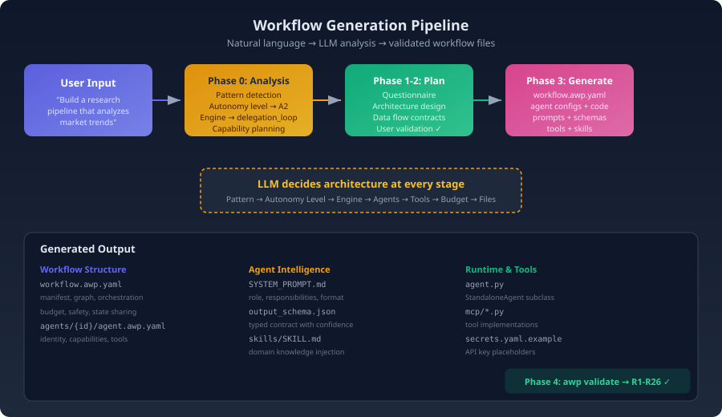
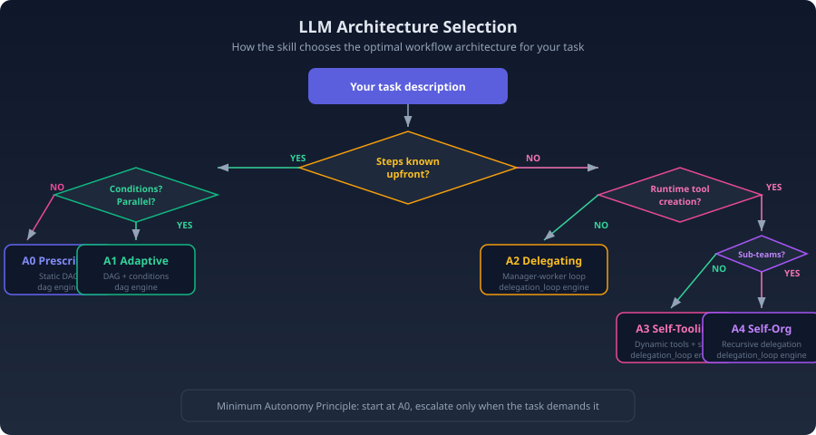

# Workflow Generation with Skills

**How an LLM plans, architects, and generates complete AWP workflows from a single sentence.**

<p align="center">
  <a href="skill/SKILL.md">AWP Skill</a> &middot;
  <a href="README.md">Main README</a> &middot;
  <a href="examples/">Examples</a> &middot;
  <a href="README_NERD.md">Theory Reference</a>
</p>

---

## Table of Contents

1. [Generate a Workflow in 30 Seconds](#1-generate-a-workflow-in-30-seconds)
2. [What the Skill Produces](#2-what-the-skill-produces)
3. [The Generation Pipeline](#3-the-generation-pipeline)
4. [How the LLM Chooses Your Architecture](#4-how-the-llm-chooses-your-architecture)
5. [From Task to Topology](#5-from-task-to-topology)
6. [Dynamic Skill and Tool Generation](#6-dynamic-skill-and-tool-generation)
7. [Programmatic API: No YAML Required](#7-programmatic-api-no-yaml-required)
8. [Input Pipeline and Worker File Access](#8-input-pipeline-and-worker-file-access)
9. [Runtime Policy Enforcement](#9-runtime-policy-enforcement)
10. [Iterative Refinement](#10-iterative-refinement)
11. [The Bigger Picture: LLM as Architect](#11-the-bigger-picture-llm-as-architect)

---

## 1. Generate a Workflow in 30 Seconds

The AWP Skill (`skill/SKILL.md`) is a structured prompt that turns any LLM with tool access into a workflow architect. You describe what you want. The LLM designs and generates a complete, validated AWP workflow.

### Invocation

In Claude Desktop or any MCP-compatible environment:

```
/awp-workflow-builder

Build a research pipeline that scrapes competitor websites,
extracts pricing data, compares it to our catalog, and
generates a weekly report with visualizations.
```

That's it. The skill takes over from here.

### What Happens Next

The LLM doesn't just template-fill. It:

1. **Analyzes** the task to detect the optimal pattern and autonomy level
2. **Asks** targeted questions (pre-filled with smart defaults you can accept or override)
3. **Plans** the full architecture — agents, data flow, tools, budget — and presents it for approval
4. **Generates** every file: YAML configs, Python agents, system prompts, output schemas, tool implementations
5. **Validates** the result against rules R1-R30

The output is a directory you can `awp run` immediately.

---

## 2. What the Skill Produces

A generated workflow is a self-contained directory with everything AWP needs:

```
competitor_analysis/
├── workflow.awp.yaml              # Orchestration, graph, budget, safety
├── agents/
│   ├── scraper/
│   │   ├── agent.awp.yaml         # Identity, tools, capabilities
│   │   ├── agent.py               # StandaloneAgent subclass
│   │   └── workflow/
│   │       ├── instructions/SYSTEM_PROMPT.md
│   │       ├── prompt/00_INTRO.md
│   │       ├── output_schema/output_schema.json
│   │       └── output_schema_desc/output_schema_desc.json
│   ├── analyzer/
│   │   └── ...                    # Same structure
│   └── reporter/
│       └── ...
├── mcp/
│   ├── web_search.py              # Tool implementations (optional)
│   └── file_tools.py
├── skills/
│   └── pricing_analysis/SKILL.md  # Domain knowledge for agents
└── secrets.yaml.example           # API key placeholders
```

Every file is generated with correct cross-references: the workflow graph references agents that exist, output schemas match `share_output` declarations, tool names resolve to implementations, and the `confidence` field (R17) is present in every schema.

---

## 3. The Generation Pipeline

<p align="center">
  
</p>

The skill operates in four phases. The first two involve the LLM reasoning about architecture. The last two produce files and validate them.

### Phase 0: Silent Analysis

Before asking a single question, the LLM reads your task description and makes four decisions internally:

| Decision | Method | Example |
|----------|--------|---------|
| **Pattern** | Signal words in the task | "compare" + "parallel" → Fan-Out/Fan-In |
| **Autonomy Level** | Minimum-autonomy decision tree | Known steps? Yes → A0/A1. Dynamic? → A2+ |
| **Engine** | Follows from autonomy | A0-A1 → DAG, A2-A4 → delegation_loop |
| **Capabilities** | Task requirements | Needs web scraping → `web.search` tool, >5 tools → Code Mode |

This analysis is invisible to the user — it drives the recommendations in Phase 1.

### Phase 1: Targeted Questionnaire

The LLM presents 11 question groups covering workflow name, agents, tools, output format, memory, autonomy level, and more. Every question comes pre-filled with the Phase 0 recommendation marked `← recommended`. The user confirms, adjusts, or types custom answers.

Key design: **the LLM asks all questions at once** in a single message. No back-and-forth ping-pong. One round of answers is usually enough.

### Phase 2: Architecture Plan

The LLM produces a structured plan document:

1. **Goal Statement** — What the workflow does, inputs, outputs (2-3 sentences)
2. **Agent Roles** — Each agent's job in plain language
3. **Data Flow** — Which fields move between agents, with types
4. **Tool & Capability Mapping** — Concrete tools per agent
5. **File Manifest** — Every file that will be generated
6. **Validation Preview** — Which rules apply and how they'll be satisfied
7. **Validation Menu** — 11 specific checkpoints the user confirms or corrects

The plan is a contract. No files are generated until the user approves.

### Phase 3: File Generation

Files are generated in dependency order: manifest → agent configs → implementations → prompts → schemas → tools → skills. This ensures every reference resolves.

### Phase 4: Validation

```bash
awp validate ./competitor_analysis/    # R1-R30 pass
awp compliance ./competitor_analysis/ --level A1  # Autonomy check
```

The skill runs validation mentally during generation. If something would fail a rule, it's fixed before writing the file.

---

## 4. How the LLM Chooses Your Architecture

<p align="center">
  
</p>

The core insight: **the LLM applies the minimum autonomy principle**. It starts at A0 and only escalates when the task genuinely requires it.

### Pattern Detection

The LLM maps signal words in your description to design patterns:

| You say... | LLM detects | Result |
|-----------|-------------|--------|
| "step by step", "pipeline", "then" | Sequential process | A0 Pipeline |
| "compare", "analyze multiple", "batch" | Independent parallel work | A1 Fan-Out/Fan-In |
| "if risk is high, then...", "depending on" | Conditional branches | A1 Conditional |
| "research", "investigate", "deep dive" | Open-ended exploration | A2 Manager-Worker |
| "score each item", "evaluate with custom criteria" | Runtime tool needs | A3 Tool Builder |
| "comprehensive", "multi-dimensional", "teams" | Multi-team coordination | A4 Self-Organizing |

### Why This Matters

A simple three-step pipeline doesn't need a delegation loop with budget management. An open-ended research task shouldn't be forced into a static DAG. The LLM matches the architecture to the problem — not the other way around.

This is fundamentally different from template-based generators that always produce the same structure. The architecture adapts to the task.

---

## 5. From Task to Topology

Here's how the same skill produces radically different workflows from different inputs.

### Input A: "Extract text from PDFs and summarize"

```
Detected: sequential pipeline, known steps
→ A0 Prescribed, DAG engine

  [extractor] → [summarizer]
  2 agents, no conditions, no budget needed
```

### Input B: "Analyze customer feedback — sentiment, topics, trends — and generate a report"

```
Detected: parallel independent analyses + aggregation
→ A1 Adaptive, DAG engine

  [sentiment] ─┐
  [topics]   ──┼→ [report_generator]
  [trends]   ──┘
  4 agents, fan-out/fan-in, state sharing
```

### Input C: "Research the competitive landscape for our product"

```
Detected: open-ended, unknown number of steps
→ A2 Delegating, delegation_loop engine

  [manager] → spawns workers dynamically
  Budget: 10 loops, 20 workers, 300s wall time
  Workers: web_researcher, analyst, writer (created on demand)
```

### Input D: "Build a scoring system that evaluates job candidates against custom rubrics"

```
Detected: needs runtime tool creation (custom scoring functions)
→ A3 Self-Tooling, delegation_loop engine

  [manager] → iteration 1: create scoring tools
            → iteration 2: apply tools to candidates
            → iteration 3: aggregate and rank
  Safety envelope: sandbox enforced, forbidden_tools locked
```

The topology emerges from the task. The user describes *what* they want. The LLM determines *how* to structure it.

---

## 6. Dynamic Skill and Tool Generation

At A2 and above, the LLM doesn't just generate static files. It creates intelligence that adapts at runtime.

### Generated Skills

Skills are Markdown documents injected into agent system prompts. The skill generates domain-specific knowledge for each agent:

```markdown
## Market Analysis Framework

### TAM/SAM/SOM Model
- TAM: Total addressable market — entire market demand
- SAM: Serviceable addressable market — segment you can reach
- SOM: Serviceable obtainable market — realistic capture

### Porter's Five Forces
1. Supplier power: ...
2. Buyer power: ...
```

This skill is written *by the LLM during planning*, not copied from a template. It reflects the specific domain of the user's task.

### Generated Tools

At A3, the manager agent creates tools at runtime. But the initial tool *capabilities* are set up by the skill during generation:

```yaml
# In workflow.awp.yaml (generated by skill)
dynamic_tools:
  enabled: true
  persist: true
  max_total: 20
  allowed_namespaces: [scoring, analysis]
```

The generated manager prompt includes instructions for *how* to create tools:

```markdown
You can create custom scoring tools using sdk.tools.create().
Each tool must:
- Return {ok, status, data, error} format
- Use _workspace_dir and _output_dir for file I/O
- Declare required_secrets for any API keys
```

The skill sets up the framework. The runtime fills it with task-specific implementations.

### The Two Levels of LLM Planning

| Level | When | What the LLM decides |
|-------|------|---------------------|
| **Generation time** (skill) | Before the workflow runs | Architecture, agents, tools, budget, prompts |
| **Runtime** (manager agent) | During workflow execution | Which workers to spawn, what instructions to give, when to stop |

The skill creates the *structure* for runtime intelligence. It doesn't try to predict every decision the manager will make — it creates the space in which good decisions can emerge.

---

## 7. Programmatic API: No YAML Required

The Skill-based generation pipeline (sections 1-6) is one entry point. The second is `AgentWorkflow` — a pure Python API that wraps the A4 delegation loop engine without any YAML files.

### Three Lines to a Working Workflow

```python
from awp.data import AgentWorkflow

result = AgentWorkflow(
    inputs={"sales_data": df},
    task="Analyze trends per region, calculate growth rates, summarize insights.",
    model="openrouter/anthropic/claude-sonnet-4",
).run()
```

This creates a manager agent, breaks the task into subtasks, spawns worker agents that execute Python in sandboxes, validates results, and returns a structured dict.

### Supported Input Types

`AgentWorkflow` accepts arbitrary Python objects as inputs. Each is automatically classified, serialized to the workspace, and described in the manager prompt:

| Python Type | Classification | Workspace Format | What the Manager Sees |
|------------|---------------|-----------------|----------------------|
| `pd.DataFrame` | `dataframe` | `inputs/{key}.csv` | Schema (shape, dtypes, column list, head, describe) |
| `np.ndarray` | `ndarray` | `inputs/{key}.npy` | Shape, dtype, min/max/mean/std statistics |
| `str` (image path) | `image` | `inputs/{filename}` | Dimensions, color mode, format (via PIL) |
| `str` (file path) | `file_path` | `inputs/{filename}` | File name and size |
| `dict` | `dict` | `inputs/{key}.json` | **Full JSON content inline** in the prompt |
| `list` | `list` | `inputs/{key}.json` | Item count |
| `str` / `int` / `float` | `string` / `numeric` | inline (no file) | Value directly in the prompt |

Dict and string inputs are shown inline in the manager prompt so the manager can use configuration values (thresholds, target metrics, regions of interest) directly when planning delegations — without requiring a worker to read the file first.

### Code Mode and Tool Creation Defaults

In the programmatic API, `code_mode` and `tool_creation` default to `true`:

```python
AgentWorkflow(
    inputs={...},
    task="...",
    model="...",
    code_mode=True,       # default — workers execute Python via code.execute
    tool_creation=True,   # default — workers can create dynamic tools at runtime
)
```

This is the opposite of the YAML-based workflow where these capabilities must be explicitly enabled. The rationale: the programmatic API targets interactive environments (Jupyter notebooks, scripts) where maximum flexibility is expected. A loaded YAML workflow can restrict these capabilities as needed.

### When to Use Which Entry Point

| Criterion | Skill (YAML) | `AgentWorkflow` (Python) |
|-----------|-------------|--------------------------|
| **Structure** | Full directory with agents, prompts, schemas | Single Python call, no files on disk |
| **Autonomy** | A0-A4 (any level) | A4 only (delegation loop) |
| **Reproducibility** | YAML is version-controlled, auditable | Parameters in code, output artifacts on disk |
| **Use case** | Production pipelines, team workflows | Notebooks, ad-hoc analysis, prototyping |
| **Code mode** | Opt-in per agent | On by default |

---

## 8. Input Pipeline and Worker File Access

Understanding how data flows from `inputs={}` to worker code execution is critical for debugging and extending workflows.

### The Path from Python to Worker

<svg viewBox="0 0 560 340" xmlns="http://www.w3.org/2000/svg" font-family="system-ui, -apple-system, sans-serif" font-size="11">
<rect x="110" y="5" width="300" height="28" rx="6" fill="#e8d5f5" stroke="#7b4ea3" stroke-width="1.5"/>
  <text x="260" y="24" text-anchor="middle" font-weight="600" fill="#5a2d82" font-size="12">AgentWorkflow(inputs={"data": df})</text>

  <rect x="130" y="53" width="260" height="40" rx="6" fill="#dce6f7" stroke="#4a6fa5" stroke-width="1.2"/>
  <text x="260" y="68" text-anchor="middle" font-weight="600" fill="#2a3f5f">prepare_workspace()</text>
  <text x="260" y="84" text-anchor="middle" fill="#5a7aa5" font-size="10">Serialize inputs → workspace/inputs/</text>

  <rect x="130" y="113" width="260" height="40" rx="6" fill="#dce6f7" stroke="#4a6fa5" stroke-width="1.2"/>
  <text x="260" y="128" text-anchor="middle" font-weight="600" fill="#2a3f5f">Manager Prompt</text>
  <text x="260" y="144" text-anchor="middle" fill="#5a7aa5" font-size="10">"data (dataframe) — inputs/data.csv" + schema</text>

  <rect x="130" y="173" width="260" height="40" rx="6" fill="#fef3cd" stroke="#d4a017" stroke-width="1.2"/>
  <text x="260" y="188" text-anchor="middle" font-weight="600" fill="#856404">Manager LLM Decision</text>
  <text x="260" y="204" text-anchor="middle" fill="#a88a04" font-size="10">Creates delegation envelope</text>

  <rect x="130" y="233" width="260" height="40" rx="6" fill="#d5e8d4" stroke="#5b8c5a" stroke-width="1.2"/>
  <text x="260" y="248" text-anchor="middle" font-weight="600" fill="#2d5a2d">Worker System Prompt</text>
  <text x="260" y="264" text-anchor="middle" fill="#5a8c5a" font-size="10">_workspace_dir + _output_dir injected</text>

  <rect x="130" y="293" width="260" height="40" rx="6" fill="#d5f5e3" stroke="#27ae60" stroke-width="1.5"/>
  <text x="260" y="308" text-anchor="middle" font-weight="700" fill="#1a6b3c">code.execute</text>
  <text x="260" y="324" text-anchor="middle" fill="#27ae60" font-size="10">df = pd.read_csv(...) → plt.savefig(...)</text>

  <line x1="260" y1="35" x2="260.0" y2="49.0" stroke="#4a6fa5" stroke-width="1.3"/>
  <polygon points="260.0,51.0 257.0,45.0 263.0,45.0" fill="#4a6fa5"/>
  <line x1="260" y1="95" x2="260.0" y2="109.0" stroke="#4a6fa5" stroke-width="1.3"/>
  <polygon points="260.0,111.0 257.0,105.0 263.0,105.0" fill="#4a6fa5"/>
  <line x1="260" y1="155" x2="260.0" y2="169.0" stroke="#4a6fa5" stroke-width="1.3"/>
  <polygon points="260.0,171.0 257.0,165.0 263.0,165.0" fill="#4a6fa5"/>
  <line x1="260" y1="215" x2="260.0" y2="229.0" stroke="#4a6fa5" stroke-width="1.3"/>
  <polygon points="260.0,231.0 257.0,225.0 263.0,225.0" fill="#4a6fa5"/>
  <line x1="260" y1="275" x2="260.0" y2="289.0" stroke="#4a6fa5" stroke-width="1.3"/>
  <polygon points="260.0,291.0 257.0,285.0 263.0,285.0" fill="#4a6fa5"/>
</svg>

### Path Resolution

All workspace paths are stored **relative to the workspace directory** (e.g. `inputs/data.csv`, not absolute paths). This keeps the manifest portable and the manager prompt clean.

When workers access files via `file.read` or `file.list`, the tool registry resolves paths using this search order:

1. Literal path as-is
2. `workspace/{path}`
3. `workspace/inputs/{path}`
4. `workspace/inputs/{basename}` (fallback for wrong directory prefixes)

This multi-level fallback means that even if an LLM provides an imprecise path (e.g. `data.csv` instead of `inputs/data.csv`), the file is still found.

For `code.execute`, the subprocess runs with its working directory set to `workspace/`. The pre-defined `_workspace_dir` variable contains the **absolute path** to the workspace, so workers can always use:

```python
pd.read_csv(_workspace_dir + "/inputs/data.csv")  # always works
```

### Worker Input File Discovery

Every worker with `codemode.enabled=true` receives a system prompt section listing all available input files:

```
## Available Input Files

The following files are available in the workspace inputs directory:
- `_workspace_dir + "/inputs/sales_data.csv"`
- `_workspace_dir + "/inputs/config.json"`
```

This eliminates the need for workers to guess file names or scan directories.

---

## 9. Runtime Policy Enforcement

LLMs — especially smaller or free-tier models — frequently ignore prompt instructions. They may set `codemode.enabled: false` despite a mandatory rule saying otherwise, or omit `code.execute` from `tools_allowed`. AWP's runtime enforces policies regardless of what the LLM decides.

### What Gets Enforced

When the worker policy lists a field in `manager_controlled`, the delegation loop runner enforces it:

| Policy Field | Enforcement |
|-------------|-------------|
| `codemode.enabled` | Forced to `true` if in `manager_controlled`, even when the LLM sets `false` |
| `codemode.tool_creation` | Forced to `true` if in `manager_controlled`, even when the LLM sets `false` |
| `code.execute` in tools | Auto-injected into `tools_allowed` whenever `codemode.enabled=true` |
| `forbidden_tools` | Workers can never use tools on this list, regardless of what the manager specifies |
| `sandbox.type` | Worker sandbox type cannot be overridden by the manager |

### How It Works

```yaml
# In the DelegationLoopConfig (generated by AgentWorkflow or workflow.awp.yaml):
worker_policy:
  manager_controlled:
    - instructions
    - skills
    - tools_allowed
    - output_contract
    - codemode.enabled        # ← runtime enforces this
    - codemode.tool_creation  # ← runtime enforces this
  enforced:
    sandbox:
      type: subprocess
    forbidden_tools:
      - shell.execute
      - file.write_outside_workspace
```

The manager LLM controls *what* workers do (instructions, skills, output contracts). The runtime controls *how* they do it (sandbox, code mode, forbidden tools). This separation means an unreliable LLM cannot accidentally create an unsafe or underpowered worker.

### The Enforcement Flow

<svg viewBox="0 0 560 220" xmlns="http://www.w3.org/2000/svg" font-family="system-ui, -apple-system, sans-serif" font-size="11">
<!-- Manager envelope -->
  <rect x="60" y="5" width="440" height="45" rx="6" fill="#fde2e2" stroke="#c0392b" stroke-width="1.2"/>
  <text x="280" y="22" text-anchor="middle" font-weight="600" fill="#922b21">Manager LLM sends envelope</text>
  <text x="280" y="40" text-anchor="middle" fill="#c0392b" font-size="10" font-family="monospace">codemode.enabled: false, tools_allowed: [file.read]</text>
  <!-- Policy check -->
  <rect x="60" y="70" width="440" height="80" rx="6" fill="#fef3cd" stroke="#d4a017" stroke-width="1.5"/>
  <text x="280" y="88" text-anchor="middle" font-weight="700" fill="#856404">Runtime Policy Check</text>
  <text x="80" y="106" fill="#666" font-size="10">codemode.enabled in manager_controlled? → Force = true</text>
  <text x="80" y="121" fill="#666" font-size="10">codemode.tool_creation in manager_controlled? → Force = true</text>
  <text x="80" y="136" fill="#666" font-size="10">codemode.enabled=true but code.execute missing? → Auto-inject</text>
  <!-- Actual envelope -->
  <rect x="60" y="170" width="440" height="45" rx="6" fill="#d5f5e3" stroke="#27ae60" stroke-width="1.5"/>
  <text x="280" y="187" text-anchor="middle" font-weight="600" fill="#1a6b3c">Actual Worker Envelope</text>
  <text x="280" y="205" text-anchor="middle" fill="#27ae60" font-size="10" font-family="monospace">codemode: {enabled: true, tool_creation: true}, tools: [file.read, code.execute]</text>
  <!-- Arrows -->
  <line x1="280" y1="52" x2="280.0" y2="66.0" stroke="#4a6fa5" stroke-width="1.5"/>
  <polygon points="280.0,68.0 277.0,62.0 283.0,62.0" fill="#4a6fa5"/>
  <line x1="280" y1="152" x2="280.0" y2="166.0" stroke="#4a6fa5" stroke-width="1.5"/>
  <polygon points="280.0,168.0 277.0,162.0 283.0,162.0" fill="#4a6fa5"/>
</svg>

This enforcement happens transparently. The manager LLM is never informed that its choices were overridden — it simply sees the worker succeed where it would have failed without code execution.

---

## 10. Iterative Refinement

The generation pipeline is not fire-and-forget. The skill builds in three feedback loops:

### Loop 1: Plan Validation (Phase 2)

The user reviews the architecture before any files are generated. The validation menu covers agent count, execution order, data flow, tools, output fields, autonomy level, memory, and platform. Adjustments are applied incrementally — only changed sections are re-presented.

### Loop 2: Post-Generation Tuning

After generation, the user can:

```bash
awp validate ./workflow/          # Check structural correctness
awp run ./workflow/ --task "..."   # Test with real data
```

Results inform manual edits or a second skill invocation to add features.

### Loop 3: Runtime Adaptation (A2+)

In delegation loop workflows, the manager agent itself is a feedback loop. It observes worker results, detects stalls, adjusts strategy, and iterates. The skill sets up the conditions for this:

- **Budget**: How many iterations the manager gets
- **Stall detection**: When to stop if progress flatlines
- **Termination strategy**: `warn_then_stop` vs. immediate halt
- **Validation tiers**: When to apply LLM-based semantic validation

---

## 11. The Bigger Picture: LLM as Architect

Traditional workflow tools require the user to be the architect. You design the DAG, configure the agents, write the prompts, define the schemas. The tool executes what you specified.

AWP's skill inverts this. The user states the goal. The LLM acts as architect:

| Traditional | AWP Skill |
|------------|-----------|
| User designs the graph | LLM designs the graph |
| User picks autonomy level | LLM picks minimum viable autonomy |
| User writes system prompts | LLM writes domain-specific prompts |
| User defines output schemas | LLM infers schemas from task requirements |
| User maps tools to agents | LLM maps tools based on agent responsibilities |
| User sets budget parameters | LLM estimates budget from task complexity |

### What Makes This Work

Three properties of AWP enable LLM-driven generation:

1. **Layered architecture** — The 7-layer model gives the LLM a structured decision space. It doesn't face a blank canvas; it fills in layers bottom-up, each constrained by the previous.

2. **Validation rules** — R1-R30 are checkable constraints. The LLM can verify its own output against them during generation, catching errors before the user sees them.

3. **Separation of definition and execution** — The LLM generates YAML and Markdown, never runtime code beyond thin `StandaloneAgent` subclasses. The runtime engine handles execution. This keeps the generated surface area small and auditable.

### The Possibility Space

As LLMs improve, the skill can:

- **Generate from examples**: "Build something like this workflow, but for healthcare data"
- **Optimize existing workflows**: "This workflow uses too many tokens — restructure it"
- **Cross-pollinate patterns**: "Take the fan-out pattern from workflow A and the validation from workflow B"
- **Explain its decisions**: "Why did you choose A2 instead of A1 for this task?"

The workflow becomes a conversation artifact — not a static configuration file, but a living document that evolves through dialogue between the user and the LLM architect.

---

## Quick Links

| Resource | Description |
|----------|-------------|
| [AWP Skill](skill/SKILL.md) | The full skill prompt — read this to understand every generation detail |
| [Skill Templates](skill/templates/) | Base templates the skill starts from |
| [Skill Adapters](skill/adapters/) | Platform-specific agent generation (Standalone, Cloudflare) |
| [Jupyter Notebook](examples/jupyter/) | Interactive `AgentWorkflow` examples with DataFrames |
| [Examples](examples/) | 12 generated workflows across A0-A4 |
| [Main README](README.md) | Project overview and quickstart |
| [Theory Reference](README_NERD.md) | Theoretical foundations |
