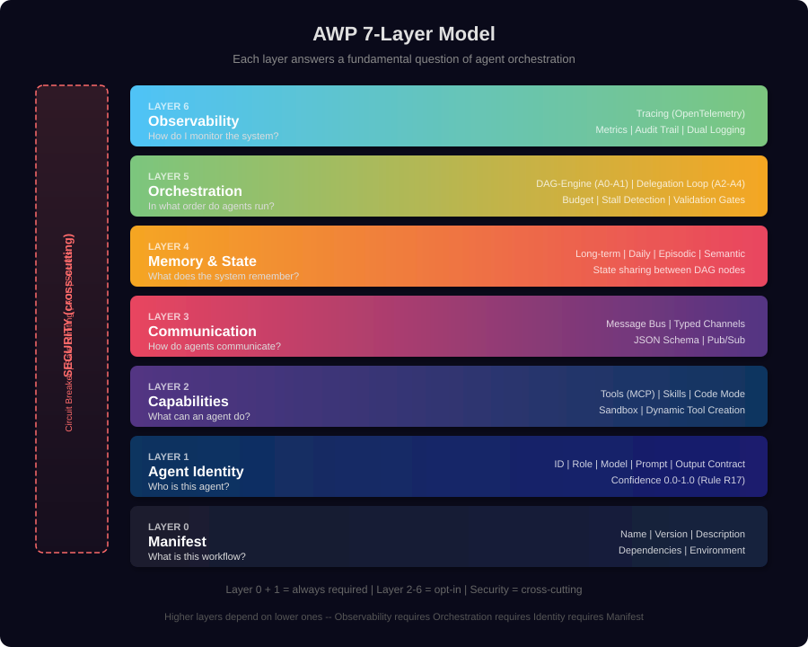
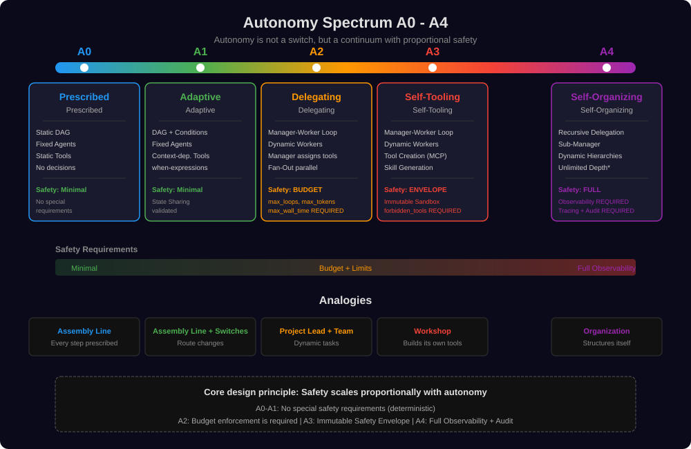
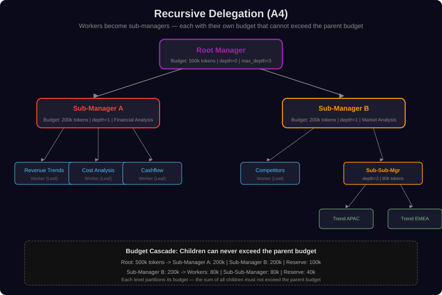
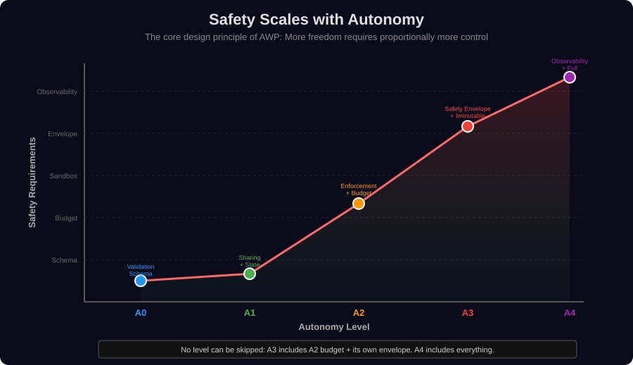
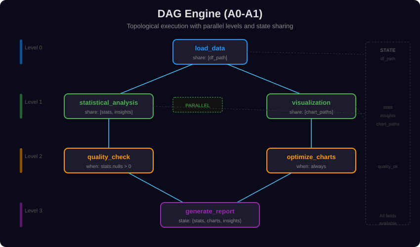
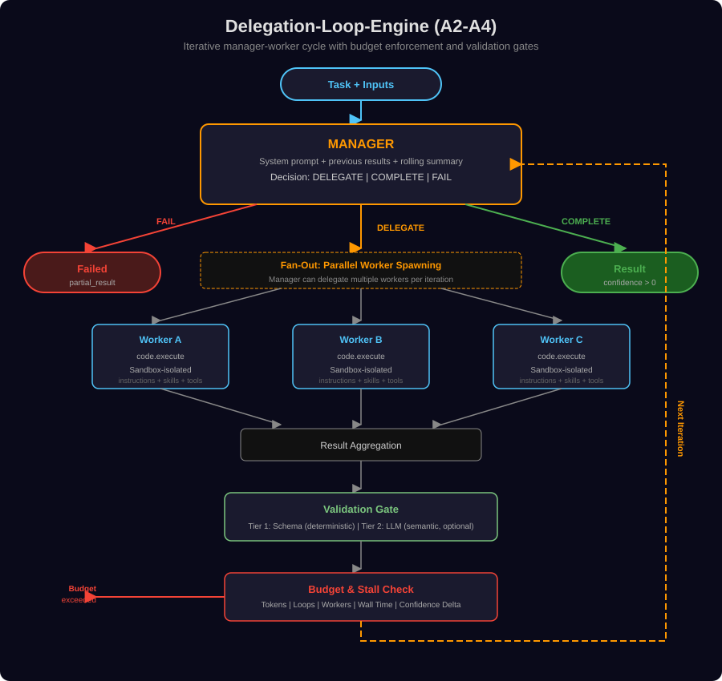
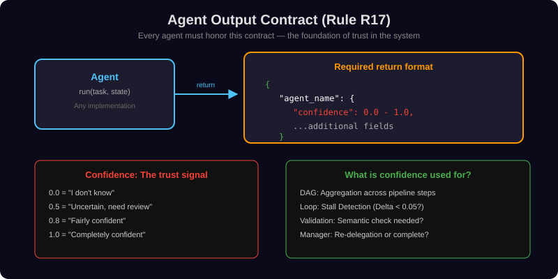
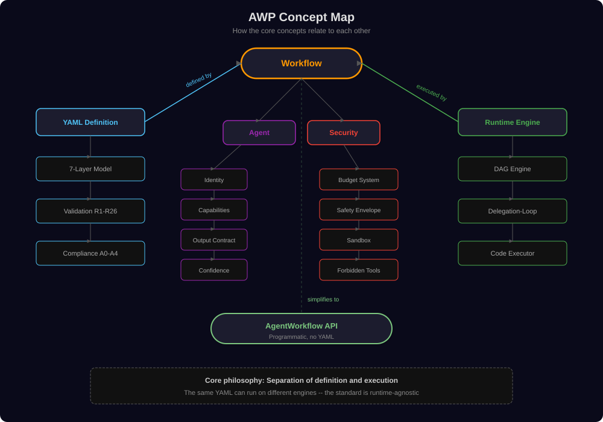
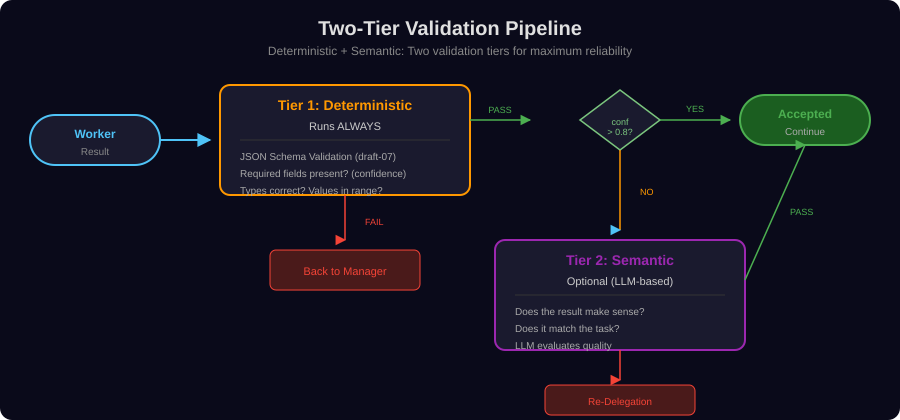
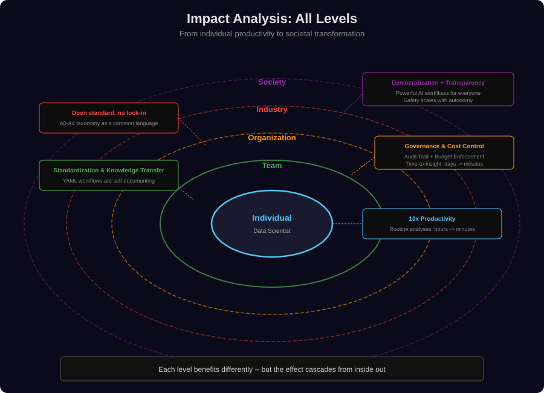

# Agent Workflow Protocol (AWP)

**An open standard for defining, orchestrating, and executing multi-agent workflows.**

AWP solves a fundamental problem in modern AI development: How do you orchestrate multiple autonomous agents safely, traceably, and scalably? The answer is a layered model that separates *what* (declarative definition) from *how* (runtime engine) and scales safety proportionally with autonomy.

---

## Table of Contents

**Part I -- Theory & Concepts**
1. [The Core Problem: Why Multi-Agent Orchestration?](#1-the-core-problem-why-multi-agent-orchestration)
2. [Philosophy: Separation of Definition and Execution](#2-philosophy-separation-of-definition-and-execution)
3. [The 7-Layer Model](#3-the-7-layer-model)
4. [The Autonomy Spectrum (A0-A4)](#4-the-autonomy-spectrum-a0-a4)
5. [The Safety Principle: Safety Scales with Autonomy](#5-the-safety-principle-safety-scales-with-autonomy)
6. [Orchestration Theory: DAG vs. Delegation Loop](#6-orchestration-theory-dag-vs-delegation-loop)
7. [The Agent Output Contract: Trust through Structure](#7-the-agent-output-contract-trust-through-structure)
8. [Concept Map: How Everything Connects](#8-concept-map-how-everything-connects)
9. [Two-Tier Validation: Determinism Meets Semantics](#9-two-tier-validation-determinism-meets-semantics)
10. [Mental Models: Analogies and Metaphors](#10-mental-models-analogies-and-metaphors)
11. [Emergence and Control: The Paradox of Autonomous Systems](#11-emergence-and-control-the-paradox-of-autonomous-systems)
12. [Validation Rules R1-R26: Formal Guarantees](#12-validation-rules-r1-r26-formal-guarantees)

**Part II -- Implementation**
13. [SDK Implementation: The Programmatic API](#13-sdk-implementation-the-programmatic-api)
14. [YAML Workflows: Declarative Pipelines](#14-yaml-workflows-declarative-pipelines)
15. [CLI Tools](#15-cli-tools)

**Part III -- Application & Impact**
16. [Data Science: Workflows Instead of Notebooks](#16-data-science-workflows-instead-of-notebooks)
17. [Enterprise: Governance, Costs, Scaling](#17-enterprise-governance-costs-scaling)
18. [Impact Analysis: All Levels](#18-impact-analysis-all-levels)
19. [Architecture Reference](#19-architecture-reference)

---

# Part I -- Theory & Concepts

## 1. The Core Problem: Why Multi-Agent Orchestration?

### The Limits of the Single Agent

A single LLM agent can solve impressive tasks -- generating text, writing code, analyzing data. But it hits fundamental limits:

**Context Window Limit**: An agent can only process a limited amount of information at once. Complex tasks -- a comprehensive market analysis, a multi-stage ETL process, a thorough codebase refactoring -- exceed this limit.

**Competence Dilemma**: A single agent would need to simultaneously be an expert in data analysis, visualization, statistical methods, and report writing. In the human world, that's what teams are for.

**Feedback Loops**: Many tasks require iterative work -- analyze, evaluate, improve. A single agent has no external authority to review its work and trigger corrections.

**Parallelization**: Some subtasks are independent of each other and could be processed simultaneously. A single agent works sequentially.

### The Solution: Specialization and Coordination

Multi-agent systems solve these problems through the same principle that human organizations use: **division of labor with coordination**.

But division of labor alone is not enough. You need:
- A **common protocol** so agents can communicate
- An **orchestration logic** that determines who does what and when
- A **safety system** that ensures control
- A **validation layer** that ensures quality

That is exactly what AWP provides.

### Why a Standard?

Without a standard, every team builds its own LLM orchestration wrappers. The result: incompatible systems, duplicated work, missing safety guarantees. AWP addresses this through:

- **Runtime-agnostic**: The same workflow definition can run on different engines
- **Portability**: Distribute, version, and share workflows as `.awp.zip`
- **Formal validation**: 26 rules check every workflow before execution
- **Compliance levels**: A common language for "how autonomous is this system?"

---

## 2. Philosophy: Separation of Definition and Execution

### The Design Principle

AWP follows a principle that has proven itself many times in software development: **separate declaration from implementation**.

| Analogy | Definition | Execution |
|---------|-----------|-----------|
| SQL | `SELECT * FROM users WHERE age > 30` | Query Optimizer + Storage Engine |
| HTML | `<div class="card">` | Browser Rendering Engine |
| Kubernetes | `deployment.yaml` | kubelet + Container Runtime |
| **AWP** | `workflow.awp.yaml` | DAG Engine or Delegation Loop |

**What this means**: An AWP workflow describes *what* should happen (which agents, in which dependency order, with which capabilities), not *how* it is technically implemented. The runtime engine decides on parallelization, resource allocation, and error handling.

### Why This Separation Matters

1. **Portability**: The same workflow can run on a local Python runtime today and on a cloud service tomorrow
2. **Verifiability**: YAML definitions can be statically analyzed *before* code is executed
3. **Versioning**: Workflows are text -- they live in Git, go through code review, have a history
4. **Reusability**: An agent defined once can be used in different workflows
5. **Testability**: The structure (graph, dependencies, budget) can be tested independently of LLM execution

### The Third Option: Programmatic Access

In addition to YAML, AWP also offers a programmatic path with `AgentWorkflow`. This path sacrifices some portability for maximum flexibility and is ideal for exploratory work in Jupyter notebooks.

```python
from awp.data import AgentWorkflow

result = AgentWorkflow(
    inputs={"data": df},
    task="Analyze the data.",
    model="openrouter/anthropic/claude-sonnet-4",
).run()
```

Internally, `AgentWorkflow` creates the same delegation loop that is also used by YAML workflows -- except that configuration and agent definition happen programmatically rather than declaratively.

---

## 3. The 7-Layer Model

### Inspiration and Core Idea

The 7-layer model of AWP is inspired by the **OSI model** of network communication. Just as the OSI model breaks down the complexity of networks into manageable layers (Physical -> Data Link -> Network -> ... -> Application), AWP breaks down the complexity of multi-agent systems into semantic layers.

Each layer answers exactly one fundamental question. Higher layers require lower ones, but not vice versa.

<p align="center">
  
</p>

### Layer 0: Manifest -- "What is this workflow?"

The foundation. Every workflow begins with metadata: name, version, description. Without a manifest, no workflow exists.

**Mental model**: The manifest is like the title and ISBN of a book. It uniquely identifies the workflow and makes it discoverable.

```yaml
awp: "1.0.0"
name: quarterly_analysis
description: Quarterly revenue analysis with trend detection
```

### Layer 1: Agent Identity -- "Who is this agent?"

Every agent has a unique identity: an ID, a role, an LLM model, a prompt architecture, an output contract. The identity defines *who* the agent is, not *what* it can do (that comes in Layer 2).

**Mental model**: The agent identity is like an employment contract. It defines the role ("Senior Data Analyst"), the qualifications (model, temperature), and what is expected as a work result (output contract with `confidence`).

**Central concept -- Output Contract (Rule R17)**:
Every agent *must* return a result in this form:
```json
{ "agent_name": { "confidence": 0.85, "...additional fields...": "..." } }
```
The `confidence` field (0.0-1.0) is the universal trust signal throughout the entire system. It drives stall detection, validation gates, and manager decisions.

### Layer 2: Capabilities -- "What can an agent do?"

Capabilities are an agent's toolbox: tools (MCP-compatible), skills (Markdown knowledge), code execution, sandbox configuration.

**Mental model**: Capabilities are like a craftsman's workshop. The tools are ready, the expertise (skills) is learned, and the safety regulations (sandbox) are defined.

Three capability dimensions:
- **Tools**: Actions an agent can perform (read files, execute code, call APIs)
- **Skills**: Passive knowledge injected into the prompt (domain knowledge as Markdown)
- **Code Mode**: The ability to write and execute complete Python programs -- instead of individual tool calls, an entire program in one step

#### Code Mode: A Paradigm Shift

Classical tool usage is step-by-step: `read_file` -> `parse_data` -> `calculate` -> `write_result`. Each step is an LLM round-trip.

Code Mode changes this fundamentally: The agent writes a complete program that is executed in a sandbox. One round-trip instead of many.

```python
# Code Mode: One round-trip for a complete analysis
import pandas as pd
import matplotlib.pyplot as plt

df = pd.read_csv(_workspace_dir + "/inputs/data.csv")
summary = df.groupby("region")["revenue"].agg(["mean", "sum", "std"])
plt.figure(figsize=(10, 6))
summary["sum"].plot(kind="bar")
plt.savefig(_output_dir + "/chart.png")
print(summary.to_json())
```

#### Dynamic Tool Creation (A3+): Agents Build Their Own Tools

Starting at autonomy level A3, agents can create new MCP tools at runtime:

```python
await sdk.tools.create(
    name="scoring.risk_assessment",
    description="Calculates risk score",
    parameters={"type": "object", "properties": {...}},
    code="def handler(**kwargs): ..."
)
```

This is conceptually significant: The agent extends not just its knowledge, but its *action capabilities*. It can solve problems for which it was not originally equipped.

### Layer 3: Communication -- "How do agents talk to each other?"

Inter-agent communication via typed channels. Decouples sender and receiver (pub/sub pattern).

**Mental model**: Layer 3 is like a typed Slack channel. Agents post to channels with a defined schema. Other agents subscribe to these channels and react to new messages.

### Layer 4: Memory & State -- "What does the system remember?"

Four memory levels, inspired by human cognition:

| Level | Analogy | Function |
|-------|---------|----------|
| **Long-term** | Long-term memory | Persistent knowledge across sessions |
| **Daily Logs** | Daily journal | Summaries per session |
| **Episodic** | Experiential memory | Specific events and their context |
| **Semantic** | Factual knowledge | Structured knowledge base |

Plus **state sharing** between DAG nodes: Agent A declares `share_output: [findings]`, and Agent B automatically receives `findings` in its state.

**Mental model**: Memory is the bridge between statelessness (LLMs have no persistent memory) and the need for contextuality (agents must know what happened before).

### Layer 5: Orchestration -- "In what order?"

The core layer for multi-agent systems. Determines *how* agents are coordinated:

- **DAG Engine** (A0-A1): Static graph, topological execution
- **Delegation Loop** (A2-A4): Dynamic manager-worker cycle

Includes the budget system, stall detection, and validation gates. See [Section 6](#6-orchestration-theory-dag-vs-delegation-loop) for the detailed theory.

### Layer 6: Observability -- "How do I monitor the system?"

Tracing (OpenTelemetry-compatible), metrics, audit trail. Dual logging: JSON for machines, Markdown for humans.

**Mental model**: Observability is the nervous system of the workflow. Without it, nobody knows what actually happened -- especially critical in autonomous systems (A4), where agents make their own decisions.

**Mandatory from A4**: In self-organizing systems, observability is not optional but a hard compliance requirement.

### Security: The Cross-Cutting Layer

Security permeates all layers:

| Mechanism | Function | From Level |
|-----------|----------|------------|
| Schema validation | Structural correctness | A0 |
| State sharing validation | Data integrity between agents | A1 |
| Budget system | Hard resource limits | A2 |
| Safety envelope | Immutable safety boundaries | A3 |
| Full observability | Complete traceability | A4 |
| Rate limiting | Protection against overload | Optional |
| Circuit breaker | Automatic shutdown on error accumulation | Optional |
| Forbidden tools | Blacklist of dangerous actions | A3 (mandatory) |

### The Opt-in Principle

Crucially: **Only Layers 0 and 1 are mandatory**. A minimal workflow needs only a manifest and an agent identity. All other layers are activated as needed. This means:

- A simple A0 workflow is easy to create (5 lines of YAML)
- Complexity is only introduced where it is needed
- The learning curve is gentle: you start simple and add layers when necessary

---

## 4. The Autonomy Spectrum (A0-A4)

### Autonomy as a Continuum

Most AI frameworks treat autonomy as binary: an agent is autonomous or not. AWP argues that **autonomy is a spectrum** -- with five clearly defined levels, each unlocking different capabilities and imposing different safety requirements.

<p align="center">
  
</p>

### A0 -- Prescribed: The Deterministic Graph

**Core idea**: All steps are known in advance. No agent makes decisions.

- **Orchestration**: Static DAG (Directed Acyclic Graph)
- **Agents**: Pre-defined and immutable
- **Tools**: Statically assigned
- **Safety**: Minimal -- the system is fully predictable

**When to use**: Nightly batch jobs, ETL pipelines, data validation -- anywhere the steps are known and stable.

**Philosophical background**: A0 is the *safe harbor*. There is no emergence, no surprises. The workflow does exactly what is defined -- no more and no less. This is valuable when predictability is more important than flexibility.

### A1 -- Adaptive: Decision Points in the Graph

**Core idea**: Same structure as A0, but with conditional execution.

- **Orchestration**: DAG with `when` expressions
- **Agents**: Pre-defined, but can skip steps
- **New concept**: State sharing between agents

**When to use**: Pipelines with quality checks, conditional transformations, error handling.

**Philosophical background**: A1 introduces the first form of *decision-making capability* -- but a limited one. The set of possible paths is finite and known in advance. An A1 workflow is like a decision tree: all branches already exist; the workflow simply selects the appropriate one.

### A2 -- Delegating: The Manager-Worker Paradigm Shift

**Core idea**: A manager agent dynamically decides which tasks are delegated to which workers.

- **Orchestration**: Manager-worker loop (no more static graph structure)
- **Agents**: Manager is static, workers are *created at runtime*
- **Decision**: Manager decides in each iteration: DELEGATE, COMPLETE, or FAIL
- **Safety**: **Budget system is mandatory** -- no A2 without hard limits

**When to use**: Open-ended tasks where the sub-steps are not known in advance. Research, exploratory analysis, creative tasks.

**The conceptual leap**: A2 is the biggest leap in the autonomy spectrum. For the first time, the *steps themselves are no longer pre-defined*. The manager autonomously decides how the task is decomposed. This brings enormous flexibility -- but also the necessity for budget enforcement.

**Why budget is mandatory**: Without budget limits, an A2 manager could theoretically spawn infinite workers, consume infinite tokens, and run indefinitely. The budget system is the *necessary condition* for dynamic delegation to be responsible at all.

### A3 -- Self-Tooling: Agents Extend Their Own Capabilities

**Core idea**: Workers can create new tools at runtime.

- **Everything from A2**, plus:
- **Dynamic tool creation**: Agents create MCP tools via Code Mode
- **Skill generation**: Manager generates domain-specific knowledge and injects it into worker prompts
- **Safety**: **Immutable safety envelope is mandatory**

**The conceptual leap**: A3 crosses a boundary that is rarely crossed in classical software development: The system modifies its own capabilities. An A3 agent facing a problem for which no suitable tool exists can *invent* a new tool.

This is analogous to a craftsman who not only uses existing tools but builds new ones when needed. The implication: The solution space is expanded at runtime.

**Why safety envelope is mandatory**: When agents can create their own tools, there must be *immutable boundaries* that they cannot change:

```yaml
enforced:                              # Manager CANNOT change:
  sandbox: { type: subprocess }        # - Isolation type
  forbidden_tools: [shell.execute]     # - Forbidden tools
  rate_limiting: { max_llm_calls_per_minute: 30 }
  codemode: { max_tools_per_worker: 10 }

manager_controlled:                    # Manager MAY change:
  - instructions                       # - What the worker should do
  - skills                             # - What knowledge it has
  - tools_allowed                      # - Which tools are allowed
  - codemode.enabled                   # - Whether Code Mode is active
```

**The principle**: The manager has freedom over the *what*, but not over the *how safe*.

### A4 -- Self-Organizing: Recursive Self-Organization

**Core idea**: Workers become managers themselves and delegate further. Dynamic hierarchies emerge at runtime.

<p align="center">
  
</p>

- **Everything from A3**, plus:
- **Recursive delegation**: Workers can become sub-managers
- **Budget cascade**: Each sub-manager receives a partial budget that can never exceed the parent budget
- **Safety**: **Full observability is mandatory**

**The conceptual leap**: A4 is the highest level of autonomy. The system organizes itself -- it determines not only *what* is done (A2) and *with which tools* (A3), but also *which organizational structure* is needed for it.

**Budget cascade**: The elegant safety feature of A4. When the root manager has a budget of 500k tokens and creates two sub-managers, the sum of sub-budgets cannot exceed the root budget:

```
Root Manager: 500k Tokens
  -> Sub-Manager A: 200k (Financial Analysis)
       -> Worker A1: 60k | Worker A2: 60k | Reserve: 80k
  -> Sub-Manager B: 200k (Market Analysis)
       -> Worker B1: 80k | Sub-Sub-Manager: 80k | Reserve: 40k
  -> Reserve: 100k
```

**Why full observability is mandatory**: With recursive delegation, the depth and breadth of the agent tree can become substantial. Without complete tracing and an audit trail, it would be impossible to trace which agent made which decision. Observability at A4 is not a nice-to-have but a safety requirement.

---

## 5. The Safety Principle: Safety Scales with Autonomy

### The Central Design Principle

AWP is based on a simple but profound insight: **More autonomy requires proportionally more safety mechanisms**. This principle is not optional -- it is anchored in the compliance check.

<p align="center">
  
</p>

### The Safety Ladder

Each autonomy level inherits all safety requirements from lower levels and adds its own:

| Level | Inherits from | New Requirement | Rationale |
|-------|---------------|-----------------|-----------|
| A0 | -- | Schema validation | Structural correctness |
| A1 | A0 | State sharing validation | Data integrity between agents |
| A2 | A0+A1 | **Budget system (mandatory)** | Dynamic agents need resource limits |
| A3 | A0+A1+A2 | **Immutable safety envelope (mandatory)** | Tool creation needs immutable boundaries |
| A4 | A0+A1+A2+A3 | **Full observability (mandatory)** | Recursive delegation needs complete traceability |

### Why This Principle Is Revolutionary

Most AI frameworks offer safety as an optional feature: "You *can* enable rate limiting." AWP inverts the logic: **Safety is a hard prerequisite for autonomy**. A workflow cannot be classified as A3 if it lacks a safety envelope. The compliance check (`awp compliance --level A3`) fails.

This is a fundamental difference from an approach where safety is added after the fact ("security as an afterthought"). In AWP, safety is an *integral part of the autonomy model*.

### The Budget System in Detail

The budget system (mandatory from A2) defines six hard limits:

| Parameter | What It Limits | Why It Matters |
|-----------|---------------|----------------|
| `max_loops` | Iteration loops | Prevents endless delegation |
| `max_total_workers` | Spawned workers | Prevents worker explosion |
| `max_total_tokens` | LLM token usage | Cost control |
| `max_wall_time` | Runtime in seconds | Prevents hangs |
| `max_tool_calls` | Tool invocations | Prevents excessive actions |
| `max_depth` | Recursion depth (A4) | Prevents endless nesting |

**Hard limits vs. soft limits**: AWP budgets are *hard*. When `max_loops: 10` is defined and the manager is not finished at loop 10, the loop terminates -- regardless of the task's state. The manager cannot override budget limits. This is intentional: The safety envelope protects against the manager's autonomy.

### The Safety Envelope: Immutable Boundaries

Starting at A3, there is a safety framework that the manager *cannot change*:

**Enforced (immutable)**:
- Sandbox type (subprocess, Docker, venv)
- Forbidden tools (shell.execute, file.write_outside_workspace)
- Rate limits (max LLM calls per minute)
- Max tools per worker

**Manager-controlled**:
- Instructions (what the worker should do)
- Skills (what knowledge it receives)
- Tools allowed (which tools it may use)
- Output contract (what it should return)
- Code Mode on/off

**Mental model**: The safety envelope is like a constitution. The manager is the government -- it has broad discretion, but the fundamental rights (sandbox, rate limits, forbidden tools) cannot be changed. Only the workflow creator (the "constitutional author") defines the envelope.

---

## 6. Orchestration Theory: DAG vs. Delegation Loop

AWP implements two fundamentally different orchestration models that address different classes of problems.

### DAG Engine (A0-A1): Deterministic Coordination

<p align="center">
  
</p>

**Algorithm**:
1. Build dependency graph from YAML
2. Topological sort (Kahn's algorithm)
3. Start agents with no open dependencies in parallel
4. After completion: write `share_output` fields to state dict
5. Downstream agents receive shared fields automatically
6. Conditional execution: evaluate `when` expressions before each node
7. Start next level until all nodes are processed

**Properties**:
- **Determinism**: Same inputs -> same execution path (modulo LLM stochasticity)
- **Parallelization**: Nodes at the same level without mutual dependencies run in parallel
- **Static analysis**: The entire graph is known and verifiable before execution
- **Easy debugging**: Each node has clear inputs and outputs

**Theoretical background**: The DAG engine is based on the same principle as build systems (Make, Bazel) and workflow engines (Airflow, Luigi). Topological sorting guarantees that dependencies are always executed before their dependents. The problem of optimal parallelization on a DAG is related to *critical path scheduling* from operations research.

**Limitations**: All steps must be known in advance. The DAG cannot *add new nodes at runtime*. When the task is open-ended ("analyze this data"), a DAG is not suitable.

### Delegation Loop Engine (A2-A4): Adaptive Coordination

<p align="center">
  
</p>

**Algorithm**:
```
1. Manager receives: Task + previous results + Rolling Summary
2. Manager decides: DELEGATE | COMPLETE | FAIL
3. On DELEGATE:
   a. Generate worker envelopes (instructions, skills, tools, contract)
   b. Create workers in parallel and execute in sandboxes (fan-out)
   c. Collect worker results
   d. Two-tier validation:
      - Tier 1: Deterministic (schema, required fields)
      - Tier 2: Semantic (LLM-based, optional at high confidence)
   e. Budget check (all 6 limits)
   f. Stall detection (confidence delta over window)
   g. Update rolling summary
4. Next iteration (back to step 1)
```

**Properties**:
- **Dynamic**: Steps are determined at runtime
- **Adaptive**: Manager can change strategy based on previous results
- **Self-correcting**: If a worker fails, the manager can re-delegate
- **Budget-controlled**: Hard limits prevent endless execution

**Theoretical background**: The delegation loop is conceptually related to the *Observe-Orient-Decide-Act (OODA) Loop* from military strategy and the *Plan-Do-Check-Act (PDCA) cycle* from quality management:

| OODA/PDCA | AWP Delegation Loop |
|-----------|-------------------|
| Observe / Plan | Manager reads previous results |
| Orient / Do | Manager decides and delegates |
| Decide / Check | Validation gate checks worker results |
| Act / Act | Budget check, stall detection, next iteration |

### Decision Guide: When to Use Which Engine?

| Criterion | DAG (A0-A1) | Delegation Loop (A2-A4) |
|-----------|-------------|------------------------|
| Steps known in advance? | Yes | No |
| Determinism needed? | Yes | No |
| Task open-ended/exploratory? | No | Yes |
| LLM costs critical? | DAG is cheaper | Loop consumes more tokens |
| Fault tolerance? | Limited (retry per node) | High (re-delegation) |
| Debugging? | Easy (clear graph) | More complex (dynamic paths) |

### Fan-Out: Parallel Worker Creation

An often-overlooked feature of the delegation loop: The manager can **delegate multiple workers simultaneously**. In one iteration, the manager can decide:

```json
{
  "decision": "delegate",
  "delegations": [
    { "worker_id": "trend_analysis", "instructions": "..." },
    { "worker_id": "outlier_detection", "instructions": "..." },
    { "worker_id": "visualization", "instructions": "..." }
  ]
}
```

All three workers run in parallel. This combines the flexibility of the delegation loop with the parallelization efficiency of the DAG.

### Stall Detection: Recognizing Standstill

The delegation loop has a built-in mechanism to detect stalls:

```yaml
termination:
  enabled: true
  window: 3                    # Consider last 3 iterations
  min_confidence_delta: 0.05   # Minimum progress
  action: warn_then_stop       # First warn, then stop
```

When confidence over `window` iterations increases by less than `min_confidence_delta`, the system detects a stall. The action can be: warn (manager gets a hint) or stop (loop terminates with partial result).

**Mental model**: Stall detection is like the deadlock detector in an operating system. It recognizes when the system is stuck in a loop where no progress is being made.

### Rolling Summary: Context Window Management

A practical problem: In later iterations, the context (all previous results) becomes too large for the context window. The solution: **Rolling Summary**.

```yaml
history:
  rolling_summary: true      # Enabled
  full_results_window: 3     # Last 3 iterations in full text
  persist_to_disk: true      # Older iterations to disk
```

Older iterations are compressed into a compact summary. The most recent iterations remain in full text. This guarantees that the manager always has the current context without exceeding the context window.

---

## 7. The Agent Output Contract: Trust through Structure

<p align="center">
  
</p>

### Why Confidence?

The `confidence` field is the *universal trust signal* in the AWP system. It is the only field that *every* agent must return (Rule R17). Why?

1. **Stall detection**: If confidence doesn't rise, the workflow is stagnating
2. **Validation control**: High confidence -> deterministic checking suffices. Low confidence -> additionally check semantically
3. **Manager decision**: Manager uses confidence to decide: "Delegate again?" or "Done?"
4. **Aggregation**: In DAGs, confidence is aggregated across the pipeline -- a quality signal for the overall workflow

### The Confidence Dilemma

Confidence is *self-reported* -- the agent evaluates itself. This raises the question: Can you trust the agent? AWP's answer is pragmatic:

- **Validate deterministically**: Schema, required fields, types -- these can be checked regardless of confidence
- **Validate semantically**: At low confidence, ask a second LLM whether the result makes sense
- **Stall detection**: If confidence doesn't rise over iterations, an external signal intervenes

Confidence is therefore not the sole source of trust -- it is a *signal* that is verified through external mechanisms.

---

## 8. Concept Map: How Everything Connects

<p align="center">
  
</p>

The concept map shows the three pillars of AWP:

1. **Definition** (left): YAML files, 7-layer model, validation, compliance
2. **Agents & Safety** (center): Identity, capabilities, output contract, budget, envelope
3. **Execution** (right): DAG engine, delegation loop, code executor

The **programmatic API** (`AgentWorkflow`) forms a bridge: It simplifies the definition to a Python function call but internally uses the same execution infrastructure.

**Core philosophy**: Definition and execution are decoupled. The same YAML can run on different engines. The standard is runtime-agnostic.

---

## 9. Two-Tier Validation: Determinism Meets Semantics

<p align="center">
  
</p>

### Tier 1: Deterministic (always runs)

- JSON Schema validation (draft-07)
- Required fields present? (`confidence`)
- Types correct? Values in valid range?
- **Guarantee**: Reproducible, fast, free

### Tier 2: Semantic (optional, LLM-based)

- Is the result *meaningful* in the context of the task?
- Does it answer the question asked?
- **Cost**: Additional LLM call
- **When**: Only if Tier 1 passed *and* confidence is below threshold

### The Elegance of the Two-Tier Model

The model combines the strengths of both approaches:
- **Deterministic validation** catches structural errors (wrong format, missing fields) -- fast and reliable
- **Semantic validation** catches *content* errors ("The answer is formally correct but meaningless") -- more expensive, but necessary under uncertainty

The confidence threshold controls when Tier 2 is activated. High confidence -> Tier 2 is skipped (cost savings). Low confidence -> Tier 2 runs (quality assurance).

---

## 10. Mental Models: Analogies and Metaphors

### AWP as an Organization

The best analogy for AWP is a modern organization:

| AWP Concept | Organizational Analogy |
|-------------|----------------------|
| Workflow | Project |
| Manifest | Project charter |
| Agent Identity | Job description |
| Capabilities | Qualification profile |
| Communication | Meeting channels (Slack, email) |
| Memory | Knowledge base / wiki |
| Orchestration | Project management methodology |
| Observability | Reporting / controlling |
| Security | Compliance department |
| Budget | Project budget (hard-capped) |
| Safety Envelope | Corporate policies (immutable) |
| Confidence | Self-assessment in performance review |

### AWP as an Operating System

An alternative perspective:

| AWP Concept | OS Analogy |
|-------------|------------|
| Agent | Process |
| Sandbox | Container / cgroup |
| Budget | ulimit / cgroup Limits |
| Message Bus | Inter-Process Communication (IPC) |
| State Sharing | Shared Memory |
| DAG Engine | Job Scheduler (cron, systemd) |
| Delegation Loop | Interactive Shell with Subprocesses |
| Stall Detection | Watchdog / OOM Killer |
| Validation | Syscall Filter (seccomp) |
| Observability | strace / eBPF |

### AWP as a Political System

For the security architecture:

| AWP Concept | Political Analogy |
|-------------|-------------------|
| Safety Envelope | Constitution |
| Manager | Government (executive branch) |
| Validation Rules R1-R26 | Laws (legislative branch) |
| Compliance check | Constitutional court (judicial branch) |
| Budget | National budget (approved by parliament) |
| Forbidden Tools | Fundamental rights (immutable) |
| Observability | Freedom of the press / transparency laws |

**Insight**: In all three analogies, the same pattern applies -- *freedom of action is bounded by overarching, immutable rules*. This is the core principle of AWP.

---

## 11. Emergence and Control: The Paradox of Autonomous Systems

### The Fundamental Paradox

Autonomous systems are meant to exhibit *emergent behavior* -- surprising, creative problem-solving that goes beyond explicit programming. At the same time, they should remain *controllable*. This is a paradox: control and emergence are in natural tension.

### AWP's Solution: Controlled Emergence

AWP resolves the paradox not through avoidance, but through **graduated release**:

```
A0: No emergence (deterministic)
A1: Minimal emergence (conditional paths, but finite possibilities)
A2: Controlled emergence (dynamic delegation, but budget-limited)
A3: Extended emergence (tool creation, but safety-envelope-limited)
A4: Maximum emergence (self-organization, but observability-monitored)
```

**The principle**: Emergence is not suppressed but *contained*. The more emergence is allowed, the stronger the safety barriers become.

### Information Asymmetry: Manager vs. Safety Envelope

A subtle but important concept: In A3+, there is an *intentional information asymmetry* between the manager and the safety system:

- The **manager** knows *what* should be done (task, previous results, context)
- The **safety system** knows *which boundaries apply* (sandbox, forbidden tools, rate limits)

The manager cannot see and cannot change the safety boundaries. It operates within a framework it does not know. This is intentional: If the manager knew the boundaries, it could try to circumvent them.

### Stall Detection as Emergent Feedback

An elegant example of controlled emergence: Stall detection observes not the *content* of the work (that would be too complex), but an *emergent signal* -- the confidence trend over time.

When an agent is making real progress, its confidence rises. When it is stuck in a loop, confidence stagnates. The system doesn't need to *understand* the work to *detect* standstill. It uses an emergent pattern as a control instrument.

### Parallels to Cybernetics

AWP's approach has parallels to Ashby's *Law of Requisite Variety* from cybernetics: A control system must have at least as much variety (action possibilities) as the system it controls.

AWP implements this: With increasing autonomy (more variety of the agent system), the control mechanisms increase (budget + envelope + observability). The system remains controllable because control *grows with* autonomy, not despite it.

### The Tradeoff: Freedom vs. Efficiency

Every safety layer has costs:
- **Budget enforcement** (A2): Can terminate a workflow prematurely, even if it is close to completion
- **Safety envelope** (A3): May prevent creative solutions that would require forbidden tools
- **Observability** (A4): Creates overhead through logging and tracing

AWP makes this tradeoff *explicit* and lets the workflow creator decide which autonomy level is appropriate. The answer is not always A4 -- often A0 or A1 is the better choice.

---

## 12. Validation Rules R1-R26: Formal Guarantees

AWP enforces 26 rules that check every workflow before execution. These rules form a formal safety net:

### Identity & Structure (R1-R10)

| Rule | Check | Philosophy |
|------|-------|------------|
| R1 | Workflow name = directory name | Unique identification |
| R2 | Agent IDs: unique, snake_case | Consistent naming |
| R3 | Agent class is named "Agent" | Convention over configuration |
| R4 | `Agent.name` returns agent ID | Self-identification |
| R5-R10 | Directory structure complete | Reproducible file layouts |

### Graph & Dependencies (R11-R13)

| Rule | Check | Philosophy |
|------|-------|------------|
| R11 | No cycles in DAG | Termination guaranteed |
| R12 | All dependencies exist | No dangling references |
| R13 | share_output fields in schema | Type safety for state sharing |

### Tools & Output (R14-R18)

| Rule | Check | Philosophy |
|------|-------|------------|
| R14 | Tool references exist | No phantom tools |
| R15 | Output mode valid | Consistent result formats |
| R16 | Execution mode valid | Correct engine assignment |
| **R17** | **All outputs: confidence 0.0-1.0** | **Universal trust signal** |
| R18 | Output schemas: JSON Schema draft-07 | Formal contract definition |

### Budget & Extended (R19-R26)

| Rule | Check | Philosophy |
|------|-------|------------|
| R19-R22 | Budget limits defined and valid | Resource control from A2 |
| R23-R24 | Memory configuration consistent | Correct persistence |
| R25-R26 | Tool namespaces, sandbox config | Security perimeter |

### Why 26 Rules?

Each rule addresses a specific class of errors that has occurred in practice:

- **R11 (no cycles)**: A cycle in the DAG leads to endless execution
- **R17 (confidence mandatory)**: Without confidence, stall detection and validation gates don't work
- **R19 (budget mandatory from A2)**: Without a budget, a manager can consume resources without control

The rules are not arbitrary -- they are the *formalized sum of errors* that can occur in multi-agent systems.

---

# Part II -- Implementation

## 13. SDK Implementation: The Programmatic API

### Three Lines to an Agent Workflow

```python
from awp.data import AgentWorkflow

result = AgentWorkflow(
    inputs={"data": df},
    task="Analyze the data and find trends.",
    model="openrouter/anthropic/claude-sonnet-4",
).run()
```

### What Happens Internally

1. **Input classification**: Each input is automatically typed (DataFrame -> CSV, Dict -> JSON, String -> inline, etc.)
2. **Workspace preparation**: Files are copied into a structured directory, an `input_manifest.json` is generated
3. **Manager agent generation**: A system prompt is built that describes the available inputs, worker capabilities, and decision options
4. **Delegation loop start**: The A4 engine takes over -- manager delegates, workers execute, results are validated
5. **Result aggregation**: Status, result, artifacts, and metadata are returned

### Supported Input Types

| Python Type | AWP Classification | Processing |
|-------------|-------------------|------------|
| `pd.DataFrame` | `dataframe` | Export as CSV + schema extraction (shape, columns, dtypes, head, describe) |
| `str` (existing path) | `file_path` | Copy to workspace |
| `dict` | `dict` | Export as JSON |
| `list` | `list` | Export as JSON |
| `str` | `string` | Inline in prompt |
| `int`, `float` | `numeric` | Inline in prompt |
| `bytes` | `bytes` | Binary file in workspace |
| `bool` | `boolean` | Inline in prompt |

### Provider Configuration

```python
import os

# OpenRouter
os.environ["LLM_API_KEY"] = "sk-or-v1-..."
os.environ["LLM_BASE_URL"] = "https://openrouter.ai/api/v1"

# Ollama (local)
os.environ["LLM_API_KEY"] = "ollama"
os.environ["LLM_BASE_URL"] = "http://localhost:11434/v1"

# OpenAI
os.environ["LLM_API_KEY"] = "sk-..."
os.environ["LLM_BASE_URL"] = "https://api.openai.com/v1"
```

### Complete Parameter Reference

| Parameter | Default | Description |
|-----------|---------|------------|
| `model` | *(required)* | LLM model identifier |
| `worker_model` | = `model` | Model for worker agents |
| `max_loops` | 10 | Max iteration loops |
| `max_total_tokens` | 500,000 | Max total LLM tokens |
| `max_wall_time` | 300 | Max runtime in seconds |
| `max_tool_calls` | 100 | Max tool invocations |
| `max_total_workers` | 30 | Max spawned workers |
| `max_depth` | 5 | Max recursion depth |
| `sandbox` | `"subprocess"` | subprocess / docker / venv / none |
| `packages` | `[]` | Additional pip packages |
| `output_dir` | *(temp)* | Output directory |
| `verbose` | `False` | Debug logging |
| `tools` | code.execute + file tools | Available tools |
| `forbidden_tools` | shell.execute, file.write_outside_workspace | Forbidden tools |

### Result Structure

```python
{
    "status": "complete",                    # complete | failed | budget_exceeded | stall_detected | error
    "result": { ... },                       # Final manager result
    "artifacts": ["/path/chart.png", ...],   # Generated files
    "metadata": {
        "loops": 3,                          # Completed loops
        "tokens_used": 45000,                # Consumed tokens
        "wall_time": 42.5,                   # Seconds
        "workers_spawned": 4,                # Worker agents
        "tool_calls": 12,                    # Tool invocations
        "workspace": "/path/...",            # Workspace path
    },
}
```

### Jupyter Examples

The repository contains a complete notebook under `examples/jupyter/` with three examples:

1. **DataFrame analysis**: Trends per region, growth rates, summary
2. **Mixed inputs**: DataFrame + config dict + text context
3. **File path input**: Load and analyze CSV file

---

## 14. YAML Workflows: Declarative Pipelines

### A0 Workflow (Static DAG)

```yaml
awp: "1.0.0"
name: analysis_pipeline
execution:
  mode: sequential
agents:
  - id: load_data
    path: agents/load_data
  - id: analyze
    path: agents/analyze
    depends_on: [load_data]
  - id: report
    path: agents/report
    depends_on: [analyze]
state:
  sharing:
    - from: load_data
      share_output: [dataframe_path]
    - from: analyze
      share_output: [results, confidence]
```

### A2 Workflow (Delegation Loop)

```yaml
awp: "1.0.0"
name: research
orchestration:
  delegation_loop:
    manager: agents/manager
    models:
      manager: openrouter/anthropic/claude-sonnet-4
      worker: openrouter/anthropic/claude-sonnet-4
    budget:
      max_loops: 10
      max_total_workers: 20
      max_total_tokens: 500000
      max_wall_time: 600
    worker_policy:
      enforced:
        sandbox: { type: subprocess }
        forbidden_tools: [shell.execute]
      manager_controlled:
        - instructions
        - skills
        - tools_allowed
        - codemode.enabled
```

---

## 15. CLI Tools

```bash
# Validate against R1-R26
awp validate <path>

# Check autonomy level compliance
awp compliance <path> --level A2

# Visualize DAG
awp visualize <path> --format mermaid

# Package workflow as .awp.zip
awp pack <path>

# Execute workflow
awp run <path> --task "..."
```

---

# Part III -- Application & Impact

## 16. Data Science: Workflows Instead of Notebooks

### The Notebook Problem

Data science work today primarily takes place in Jupyter notebooks. Notebooks are excellent for exploration but problematic for:

- **Reproducibility**: Cell order, global state, hidden dependencies
- **Scaling**: A notebook cannot "be multiple analysts simultaneously"
- **Quality assurance**: No review process for notebook contents
- **Automation**: Notebooks are hard to integrate into CI/CD

### AWP's Answer

AWP doesn't replace notebooks -- it *complements* them with an orchestration layer:

```python
# Exploratory data analysis
result = AgentWorkflow(
    inputs={"dataset": df_raw},
    task="Complete EDA: data quality, statistics, correlation, visualizations, recommendations.",
    model=MODEL,
    packages=["matplotlib", "seaborn", "scipy"],
    output_dir="./eda",
).run()

# Feature engineering + modeling
result = AgentWorkflow(
    inputs={"train": df_train, "test": df_test, "config": {"target": "churn", "metric": "f1"}},
    task="Feature engineering, train three models, cross-validation, select best model.",
    model=MODEL,
    packages=["scikit-learn", "xgboost"],
).run()

# NLP + Sentiment
result = AgentWorkflow(
    inputs={"reviews": df_reviews},
    task="Sentiment analysis, topic modeling, word clouds, temporal sentiment trends.",
    model=MODEL,
    packages=["nltk", "wordcloud"],
).run()
```

### Pipeline Integration

```python
# Airflow
def analysis_task(**ctx):
    df = ctx["ti"].xcom_pull(task_ids="load_data")
    return AgentWorkflow(inputs={"data": df}, task="...", model=MODEL).run()

# FastAPI
@app.post("/analyze")
async def analyze(data: UploadFile):
    df = pd.read_csv(data.file)
    return AgentWorkflow(inputs={"upload": df}, task="...", model=MODEL).run()
```

---

## 17. Enterprise: Governance, Costs, Scaling

### Governance by Design

AWP offers enterprise governance not as a feature, but as an *inherent property*:

| Requirement | AWP Mechanism |
|-------------|--------------|
| Audit trail | Dual logging (JSON + Markdown) per iteration |
| Cost control | Budget system with 6 hard limits |
| Isolation | Sandbox (subprocess / Docker / venv) |
| Compliance | Validation R1-R26 + compliance levels A0-A4 |
| Versioning | YAML in Git, `.awp.zip` for distribution |
| Secrets | `required_secrets` mechanism |

### Industry Scenarios

**Finance**: Risk analysis with Docker isolation and regulatory constraints

**Manufacturing & IoT**: Predictive maintenance on sensor data with time-critical budgets

**Marketing & CRM**: Customer segmentation and campaign ROI with parallel worker analyses

**Healthcare & Pharma**: Clinical trial evaluation in maximally isolated Docker sandbox

### Infrastructure Integration

- **CI/CD**: `awp validate` + `awp compliance` as pipeline gates
- **Containers**: Docker sandbox for Kubernetes deployments
- **Monitoring**: OpenTelemetry tracing (Layer 6)
- **Distribution**: `.awp.zip` for workflow registry

---

## 18. Impact Analysis: All Levels

<p align="center">
  
</p>

### Individual (Data Scientist)

**10x productivity increase**: Routine analyses that take hours run in minutes. The data scientist transitions from *executor* to *commissioner* -- they define the task, the delegation loop executes.

**Skill amplification**: AWP democratizes capabilities. A junior data scientist can perform analyses through AWP workflows that would otherwise require senior expertise. The knowledge resides in the skills (Markdown), not just in the analyst's head.

### Team

**Standardization and knowledge transfer**: YAML workflows are self-documenting. New team members understand workflows by reading the definition. Code review becomes easier because the structure is declarative.

**Onboarding**: Instead of weeks of familiarization with team-specific toolchains, a new team member can immediately use and modify existing AWP workflows.

### Organization

**Governance and cost control**: Budget enforcement prevents uncontrolled LLM costs. Audit trail fulfills compliance requirements. Time-to-insight drops from days to minutes.

**Risk reduction**: Every agent decision is documented and traceable. In case of errors, it can be precisely reconstructed which agent made which decision and why.

### Industry

**Open standard**: No vendor lock-in. A0-A4 as a common taxonomy for autonomy levels. Workflows are portable between organizations and platforms.

**Interoperability**: The same YAML format enables the exchange of workflows between teams, companies, and communities. A workflow that works at Company A can be executed at Company B on a different runtime.

### Society

**Democratization and transparency**: Powerful AI workflows become accessible -- not just for Big Tech. Every agent decision is documented and verifiable. Safety scales with autonomy -- the principle addresses upcoming AI regulation (EU AI Act).

**Trust through structure**: The combination of formal validation (R1-R26), deterministic + semantic checking, and complete traceability creates a foundation of trust that monolithic AI systems cannot offer.

---

## 19. Architecture Reference

### Source Code Structure

```
reference/python/src/awp/
+-- models/                      # Pydantic models (7 layers)
|   +-- manifest.py              # Layer 0: Workflow root
|   +-- agent.py                 # Layer 1: Identity + output
|   +-- capabilities.py          # Layer 2: Tools, skills, sandbox
|   +-- communication.py         # Layer 3: Message bus
|   +-- memory.py                # Layer 4: 4 memory levels
|   +-- orchestration.py         # Layer 5: DAG, loop, budget
|   +-- observability.py         # Layer 6: Tracing, metrics
|   +-- security.py              # Cross-cutting: Safety
|   +-- state.py                 # State model, sharing
+-- parser/                      # YAML -> Pydantic
+-- validator/                   # Rule engine R1-R26
+-- runtime/                     # Execution engines
|   +-- runner.py                # DAG engine (A0-A1)
|   +-- delegation_loop_runner.py # Delegation loop (A2-A4)
|   +-- tools.py                 # Tool registry + dynamic tools
|   +-- llm.py                   # LLM client abstraction
|   +-- code_executor.py         # Sandbox execution
|   +-- docker_executor.py       # Docker sandbox
|   +-- venv_executor.py         # venv sandbox
+-- data/                        # Programmatic API
|   +-- workflow.py              # AgentWorkflow class
|   +-- inputs.py                # Input classification
|   +-- prompts.py               # Manager prompt templates
+-- cli.py                       # CLI entry point
```

### SVG Diagrams (assets/)

| File | Content |
|------|---------|
| `7-layer-model.svg` | The 7-layer model |
| `autonomy-spectrum.svg` | A0-A4 autonomy spectrum |
| `delegation-loop.svg` | Delegation loop flowchart |
| `dag-engine.svg` | DAG engine with parallelization |
| `safety-scaling.svg` | Safety scales with autonomy |
| `recursive-delegation.svg` | Recursive delegation (A4) |
| `impact-levels.svg` | Impact at all levels |
| `agent-output-contract.svg` | Output contract and confidence |
| `concept-map.svg` | Concept map |
| `validation-pipeline.svg` | Two-tier validation |

### Example Workflows

| No. | Name | Level | Demonstrates |
|-----|------|-------|-------------|
| 01 | Hello World | A0 | Minimal workflow |
| 02 | Research Pipeline | A1 | State sharing |
| 03 | Chat Team | A1 | Inter-agent communication |
| 04 | Memory Workflow | A1 | Memory levels |
| 05 | Observable Analytics | A1 | Observability |
| 06 | Enterprise | A1 | All features |
| 07 | Dynamic Tools | A3 | Tool creation |
| 08 | Delegation Loop | A2 | Manager-worker |
| 09 | Recursive Delegation | A4 | Sub-manager |
| 10 | Skill Generation | A3 | Dynamic skills |
| 11 | Tool Creation Loop | A3 | Iterative tools |
| 12 | Full Autonomy | A4 | Complete A4 test |
| jupyter | Data Analysis | A4 | Programmatic API |
