# The Philosophy of Orchestrated Intelligence: AWP as a New Computing Paradigm

*This document is for the reader who wants to understand not just what AWP does, but why it matters at the deepest level — and what entirely new categories of computation it unlocks in data science, enterprise, and beyond.*

---

## Table of Contents

**Part I — Foundations: Why This Changes Everything**
1. [The Paradigm Shift: From Programs to Orchestrated Cognition](#1-the-paradigm-shift-from-programs-to-orchestrated-cognition)
2. [Compositional Intelligence: Why Agents Compose Like Functions](#2-compositional-intelligence-why-agents-compose-like-functions)
3. [The Autonomy Lattice: A Formal Framework for Trust](#3-the-autonomy-lattice-a-formal-framework-for-trust)
4. [Information Flow Theory: How Knowledge Moves Through Agent Networks](#4-information-flow-theory-how-knowledge-moves-through-agent-networks)

**Part II — Data Science: The End of the Notebook Era**
5. [From Notebooks to Cognitive Pipelines](#5-from-notebooks-to-cognitive-pipelines)
6. [The Self-Improving Analysis: Feedback Loops in Data Workflows](#6-the-self-improving-analysis-feedback-loops-in-data-workflows)
7. [Autonomous Feature Engineering: When Agents Invent Their Own Tools](#7-autonomous-feature-engineering-when-agents-invent-their-own-tools)

**Part III — Enterprise: Governance at the Speed of AI**
8. [Organizational Isomorphism: Agent Hierarchies Mirror Human Ones](#8-organizational-isomorphism-agent-hierarchies-mirror-human-ones)
9. [The Compliance Paradox: More Freedom Through More Structure](#9-the-compliance-paradox-more-freedom-through-more-structure)
10. [Enterprise-Scale Orchestration: From Department to Organism](#10-enterprise-scale-orchestration-from-department-to-organism)

**Part IV — Emergence and the Future**
11. [Emergent Behavior in Bounded Systems](#11-emergent-behavior-in-bounded-systems)
12. [The Economics of Agent Workflows](#12-the-economics-of-agent-workflows)
13. [Toward Cognitive Architectures: AWP as a Foundation](#13-toward-cognitive-architectures-awp-as-a-foundation)

---

# Part I — Foundations: Why This Changes Everything

## 1. The Paradigm Shift: From Programs to Orchestrated Cognition

### The Three Eras of Computation

Software engineering has gone through two fundamental paradigm shifts. We are now at the threshold of a third.

**Era 1 — Imperative Computation (1950s–1990s):** The programmer specifies every step. The machine executes instructions in sequence. The programmer is the sole source of intelligence; the machine is a deterministic executor. FORTRAN, C, Pascal — the programmer thinks, the machine computes.

**Era 2 — Declarative Computation (1990s–2020s):** The programmer specifies *what* should happen, not *how*. SQL does not describe index lookups; Kubernetes does not describe packet routing; React does not describe DOM mutations. The runtime — query optimizer, scheduler, reconciler — makes the *how* decisions. Intelligence shifts partially to the runtime.

**Era 3 — Orchestrated Cognition (2024–):** Neither the programmer nor the runtime alone holds the intelligence. Instead, multiple *cognitive entities* (LLM-backed agents) collaborate under a declarative protocol. The protocol defines structure, safety, and communication patterns. The agents bring reasoning, creativity, and adaptation. Intelligence is *distributed and emergent*.

<p align="center">
  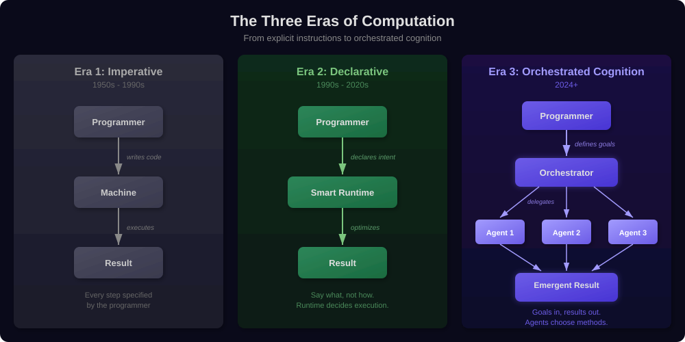
</p>

AWP is the protocol for Era 3. It does not replace SQL or Kubernetes — it operates at a higher level of abstraction, where the fundamental unit of computation is not an instruction or a declaration, but a *cognitive act performed by an autonomous entity under structured constraints*.

### What Makes This Different From "Just Calling an LLM"

A single LLM call is to orchestrated cognition what a single CPU instruction is to a distributed system. Yes, the instruction is the primitive — but the *system* exhibits properties that no single instruction possesses:

- **Specialization**: Each agent can have a different model, different temperature, different tools, different domain knowledge. A statistical analyst agent and a visualization agent are fundamentally different cognitive entities with different strengths.
- **Verification through diversity**: When one agent's output is validated by another agent with a different prompt, different model, or different perspective, the result has a reliability that no single agent can achieve. This is the computational equivalent of peer review.
- **Bounded autonomy**: A single LLM call either has full freedom (dangerous) or rigid constraints (limiting). Multi-agent orchestration introduces *graduated freedom* — the autonomy spectrum from A0 to A4 — where freedom and safety scale together.
- **Emergent problem-solving**: When agents communicate through structured state sharing, the collective can solve problems that no individual agent was designed to solve. The topology of the workflow *is itself a form of intelligence*.

### The Philosophical Core

At the deepest level, AWP embodies a philosophical position: **intelligence is not a property of individual entities but of the protocols between them**. A single neuron is not intelligent. A single ant is not intelligent. But networks of neurons produce consciousness, and colonies of ants produce sophisticated collective behavior. The protocol — the rules of interaction — is where intelligence lives.

AWP's 7-layer model, its autonomy spectrum, its budget system, and its validation rules are not engineering conveniences. They are the *grammar* of a new kind of intelligence — one that is distributed, bounded, observable, and composable.

---

## 2. Compositional Intelligence: Why Agents Compose Like Functions

### The Composition Problem

In mathematics and computer science, *composition* is the fundamental operation of building complex things from simple things. Functions compose: if `f: A → B` and `g: B → C`, then `g ∘ f: A → C`. This property — that the output of one operation can be the input of another — is what makes computation scalable.

AWP agents compose in exactly this way. Every agent adheres to the **Agent Output Contract** (Rule R17):

```
Agent.run(state) → { agent_name: { confidence: float, ...data } }
```

This contract is the compositional interface. It guarantees that every agent produces a typed, structured output with a universal trust signal (confidence). This means agents can be:

- **Chained**: Agent A's output feeds Agent B's input
- **Parallelized**: Agents A and B run concurrently, their outputs merged
- **Nested**: Agent A delegates sub-problems to agents B, C, D
- **Substituted**: Agent A can be replaced by Agent A' if it implements the same contract

<p align="center">
  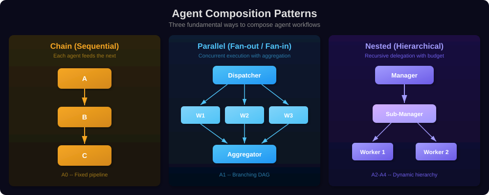
</p>

### Why Confidence is the Universal Currency

The `confidence` field in every agent output is not a nicety — it is the compositional glue that makes the entire system work. Consider what confidence enables:

**Validation gates**: A downstream agent can refuse to proceed if upstream confidence is below a threshold. This creates *quality barriers* in the workflow that are enforced structurally, not by hope.

**Stall detection**: If a delegation loop's confidence does not increase across iterations, the system can detect that it is stuck and terminate gracefully. Without confidence, the system would have no way to distinguish "making progress" from "spinning in circles."

**Manager decisions**: In A2+ workflows, the manager agent uses worker confidence scores to decide whether to accept results, request rework, or delegate to a different specialist. Confidence is the signal that drives the entire delegation loop.

**Compositional trust**: When Agent A (confidence 0.92) feeds Agent B (confidence 0.87), the system can reason about compound confidence. The final output's trustworthiness is not a mystery — it is a function of the confidence chain.

This is analogous to type systems in programming languages. Just as types ensure that function compositions are structurally sound (`String → Int → Bool` chains type-check), confidence ensures that agent compositions are *epistemically sound* — the system knows how much to trust each link in the chain.

### The Algebra of Workflows

AWP workflows form an algebraic structure with well-defined operations:

| Operation | Symbol | Meaning | Example |
|-----------|--------|---------|---------|
| Sequential composition | `A ; B` | Run A, then B with A's state | ETL pipeline |
| Parallel composition | `A ‖ B` | Run A and B concurrently | Independent analyses |
| Conditional | `A ? B : C` | Run A; if confident, B; else C | Quality gate |
| Delegation | `A → [B, C, D]` | A dynamically creates B, C, D | Manager-worker |
| Recursion | `A → A'` | Agent spawns sub-instance of itself | Hierarchical decomposition |

These operations are closed — applying any operation to valid AWP agents produces a valid AWP workflow. This closure property is what makes AWP a *composable system* rather than just a collection of ad-hoc agent calls.

---

## 3. The Autonomy Lattice: A Formal Framework for Trust

### Beyond a Linear Spectrum

While the autonomy spectrum A0–A4 is often presented as a linear progression, the deeper structure is a **lattice** — a partially ordered set where each level introduces orthogonal capabilities and constraints.

<p align="center">
  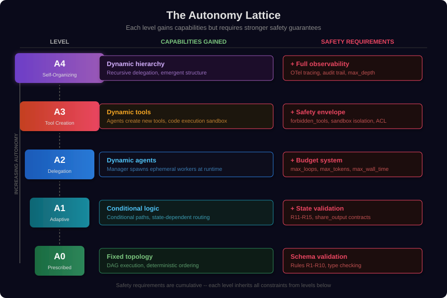
</p>

### The Fundamental Invariant

At every level, AWP maintains a fundamental invariant:

> **Capability(level) ≤ Safety(level)**

No agent can exercise a capability for which the system has not established the corresponding safety mechanism. This is not a guideline — it is enforced by the validator (rules R1–R32) and the compliance checker.

This invariant has a deep consequence: **you cannot accidentally build an unsafe system**. If you give an agent the ability to create tools (A3 capability) without defining a safety envelope (A3 requirement), the validator rejects the workflow. Safety is not something you add later — it is a structural precondition.

### The Trust Thermodynamics Analogy

Think of autonomy as *temperature* and safety as *containment*:

- A0 is a room-temperature experiment on a desk. Minimal containment needed.
- A1 is a Bunsen burner. You need a fire-resistant surface (state validation).
- A2 is a furnace. You need a sealed chamber with pressure limits (budgets).
- A3 is a nuclear reactor. You need containment structures that the reactor itself cannot breach (safety envelope).
- A4 is a fusion experiment with nested plasma chambers. You need full instrumentation of every sub-system (observability).

The temperature (capability) can go as high as you want — *as long as the containment scales with it*. AWP's autonomy lattice is a formal expression of this physical principle applied to cognitive systems.

---

## 4. Information Flow Theory: How Knowledge Moves Through Agent Networks

### The Agent Network as an Information Graph

Every AWP workflow is, at its core, a directed graph where nodes are cognitive entities and edges are information flows. Understanding how information moves through this graph reveals deep properties about what the workflow can and cannot compute.

<p align="center">
  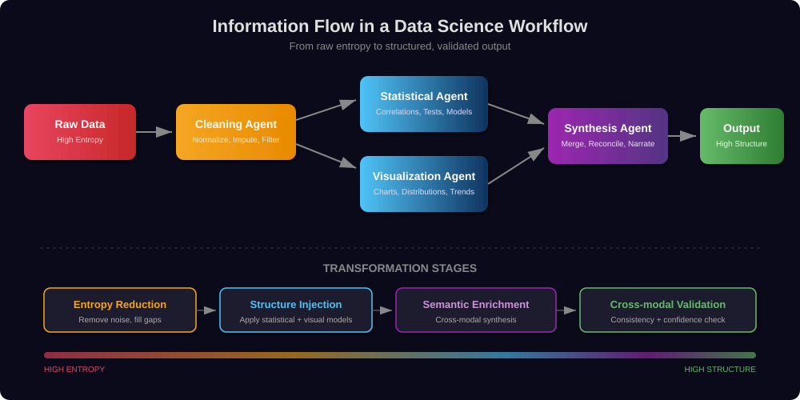
</p>

### Information Theory Perspective

Each agent in a workflow performs an *information transform*. From an information-theoretic perspective:

**Cleaning agents** reduce entropy. Raw data contains noise, missing values, inconsistencies. The cleaning agent's job is to reduce the Shannon entropy of the data while preserving the signal. This is lossy compression guided by domain knowledge.

**Analysis agents** extract mutual information. A statistical agent computes the mutual information between variables — identifying which features correlate, which distributions matter, which patterns are significant. The output has lower entropy but higher *meaning* than the input.

**Visualization agents** perform cross-modal translation. They transform numerical distributions into spatial and color encodings that exploit the human visual system's pattern-recognition capabilities. This is a form of information-preserving transform between representational modalities.

**Synthesis agents** perform information fusion. They combine outputs from multiple agents, cross-validate findings, resolve contradictions, and produce a unified narrative. This is where compositional intelligence manifests most clearly — the synthesis agent has access to information that no individual upstream agent possessed.

### The State Sharing Protocol

AWP's `share_output` mechanism is the formal channel through which information flows between agents. It has two critical properties:

1. **Explicitness**: Only fields declared in `share_output` are shared. An agent cannot accidentally leak internal state. This is the *principle of least privilege* applied to information flow.

2. **Typed contracts**: Shared fields follow the agent output contract. Downstream agents know exactly what to expect — not just the data, but the confidence with which it was produced.

This creates a system where information flow is **auditable** at the protocol level. You can look at a workflow definition and trace exactly which information reaches which agent — without running the workflow. This is impossible with ad-hoc agent frameworks where communication happens through unstructured context passing.

---

# Part II — Data Science: The End of the Notebook Era

## 5. From Notebooks to Cognitive Pipelines

### Why Notebooks Fail at Scale

The Jupyter notebook revolutionized exploratory data science. But it has fundamental limitations that become critical as analyses grow in complexity:

**Linear execution model**: Notebooks are a sequence of cells. Real analyses are graphs — some steps depend on others, some can run in parallel, some need to iterate. Forcing a graph into a sequence creates artificial ordering, hidden state dependencies, and the infamous "restart and run all" problem.

**Single-intelligence bottleneck**: Every insight, every decision, every line of code comes from one person (or one LLM). There is no specialization, no parallel exploration of hypotheses, no automated quality checks. The notebook is a monologue, not a conversation.

**No separation of concerns**: In a notebook, data loading, cleaning, analysis, visualization, and reporting are interleaved in a single document. Changing the data source means changing the analysis cells. Changing the visualization library means touching code next to statistical computations. Everything is coupled.

**No formal quality guarantees**: A notebook can produce a chart that looks right but is based on a subtle data error. There is no structural mechanism for validation, confidence tracking, or automated review.

### The Cognitive Pipeline Alternative

AWP replaces the notebook monologue with a *cognitive pipeline* — a structured workflow where specialized agents collaborate on different aspects of the analysis:

<p align="center">
  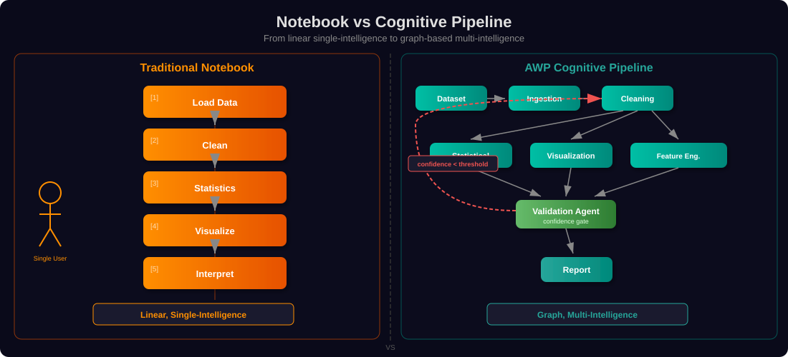
</p>

The differences are fundamental:

| Property | Notebook | AWP Cognitive Pipeline |
|----------|----------|----------------------|
| Execution model | Linear cells | Directed graph (DAG or dynamic) |
| Intelligence | Single (one person/LLM) | Multiple specialized agents |
| Quality assurance | Manual ("does this look right?") | Structural (confidence gates, validation agents) |
| Parallelism | None | Automatic (independent DAG branches) |
| Reproducibility | "Restart and run all" | Deterministic topology + recorded state |
| Iteration | Manual re-run | Automatic feedback loops (A2+) |
| Separation of concerns | None — everything in one file | Each agent has a single responsibility |

### What This Means in Practice

Consider a quarterly revenue analysis. In a notebook, one person writes 200 lines of code across 30 cells, hoping they did not introduce a bug in cell 14 that invisibly corrupts cell 27.

In an AWP workflow:

1. An **ingestion agent** loads and parses the data, reporting confidence in data completeness
2. A **cleaning agent** handles missing values and outliers, reporting how much data was modified
3. A **statistical agent** computes trends, seasonality, and significance tests
4. A **visualization agent** creates charts optimized for the specific data distributions found
5. A **validation agent** cross-checks statistical findings against visualizations — if the trend line does not match the bar chart, something is wrong
6. A **report agent** synthesizes everything into a narrative, citing confidence scores for every claim

Each agent is a specialist. Each produces a confidence score. The workflow has structural quality guarantees that no notebook can match. And the entire analysis is *auditable* — you can trace every number in the final report back through the agent chain that produced it.

---

## 6. The Self-Improving Analysis: Feedback Loops in Data Workflows

### The Iteration Problem

Real data analysis is never linear. You clean the data, run statistics, discover an anomaly, go back and re-clean with different parameters, re-run statistics, and iterate until the results are robust. In notebooks, this iteration is manual and error-prone. In AWP A2+ workflows, it is structural.

### The Delegation Loop as a Cognitive Iteration

The delegation loop — AWP's orchestration engine for A2–A4 workflows — is fundamentally an *iterative refinement* mechanism:

<p align="center">
  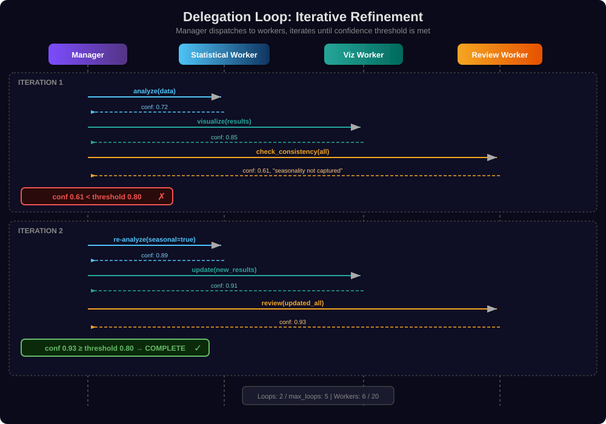
</p>

This is not just automation of manual iteration — it is *cognitively richer* iteration. The manager agent can:

- **Diagnose why confidence is low** by reading the review agent's critique
- **Synthesize information across workers** (the visualization revealed a pattern the statistician missed)
- **Adjust strategy dynamically** (switch from linear regression to seasonal decomposition)
- **Know when to stop** (confidence threshold met across all validators)

### The Data Science Feedback Taxonomy

AWP enables four categories of feedback loops in data science workflows, each corresponding to a different autonomy level:

<p align="center">
  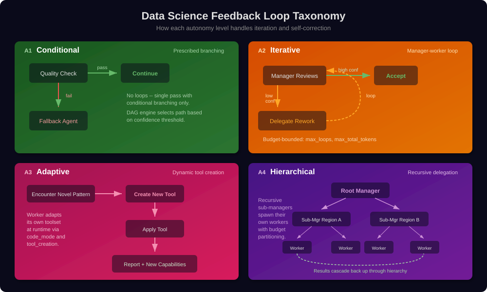
</p>

**A1 — Adaptive Branching**: The simplest feedback: if the data quality check fails, take a different path. This is analogous to `if/else` — the paths are predefined, but the choice is data-driven.

**A2 — Iterative Refinement**: The manager-worker loop enables true iteration. The manager delegates analysis, reviews results, and re-delegates with refined instructions. This is the cognitive equivalent of the scientist who runs an experiment, observes results, formulates a new hypothesis, and runs another experiment.

**A3 — Adaptive Methodology**: The most profound data science capability. When a worker encounters a data pattern that existing tools cannot handle (a non-standard distribution, a novel correlation structure), it can *create a new tool* at runtime. The agent does not just analyze data — it invents new methods of analysis. This is what happens when a skilled data scientist writes a custom statistical test for a unique dataset — except automated and reproducible.

**A4 — Hierarchical Decomposition**: For enterprise-scale analyses spanning multiple regions, product lines, or time horizons, A4 enables recursive decomposition. A root manager splits the problem geographically; each regional sub-manager splits by product line; each product-line worker performs the actual analysis. Results cascade back up with confidence scores at every level.

---

## 7. Autonomous Feature Engineering: When Agents Invent Their Own Tools

### The Tool Creation Revolution

A3-level workflows unlock something genuinely new in data science: agents that create their own analytical tools at runtime.

In traditional data science, the toolkit is fixed: pandas, scikit-learn, matplotlib, and whatever custom functions the data scientist has written. If the data requires a novel transformation or a domain-specific metric, someone has to write it manually.

In an A3 AWP workflow, the agent *writes the tool itself*:

```python
# An A3 worker encounters customer churn data with a novel pattern.
# No existing tool handles time-weighted recency-frequency scoring.
# The agent creates one:

await sdk.tools.create(
    name="analytics.recency_frequency_score",
    description="Computes time-weighted RF score with exponential decay",
    parameters={
        "type": "object",
        "properties": {
            "transactions": {"type": "array", "description": "List of transaction timestamps"},
            "decay_rate": {"type": "number", "default": 0.1}
        }
    },
    code="""
import numpy as np
from datetime import datetime

def handler(transactions, decay_rate=0.1):
    now = datetime.now()
    deltas = [(now - t).days for t in transactions]
    weights = np.exp(-decay_rate * np.array(deltas))
    recency = weights[0]  # most recent transaction weight
    frequency = np.sum(weights)  # weighted transaction count
    return {"recency": float(recency), "frequency": float(frequency),
            "rf_score": float(recency * frequency)}
"""
)
```

This is not a pre-built function called with different parameters. The agent *reasoned about the data*, identified what was needed, *designed the algorithm*, and made it available as a reusable tool — all at runtime, within the safety envelope.

### Why This Matters for Data Science

The traditional data science workflow has a fundamental bottleneck: the gap between "I know what analysis I need" and "I have the code to do it." This gap is where projects stall, where corners are cut, where approximations replace proper methods.

A3 agents close this gap. The analytical methodology becomes as dynamic as the data. The implications are far-reaching:

**Domain-specific metrics on demand**: Every industry has unique KPIs that do not exist in standard libraries. An A3 agent can create domain-specific scoring functions, validation metrics, and visualization helpers tailored to the exact data at hand.

**Adaptive preprocessing**: Instead of applying standard normalization, an A3 agent can inspect the data distribution and create a custom transformation that preserves the specific statistical properties the downstream analysis needs.

**Novel statistical tests**: When standard tests (t-test, chi-squared, ANOVA) do not fit the data's assumptions, an A3 agent can implement bootstrap-based or permutation-based alternatives tuned to the specific violation.

**Self-documenting methodology**: Because every dynamically created tool has a name, description, and parameter schema, the methodology is automatically documented. The audit trail shows not just *what* was computed, but *why* this specific method was chosen and *how* it works.

---

# Part III — Enterprise: Governance at the Speed of AI

## 8. Organizational Isomorphism: Agent Hierarchies Mirror Human Ones

### The Structural Parallel

There is a deep structural parallel between how human organizations work and how AWP agent hierarchies operate. This is not a coincidence — it is a design principle.

<p align="center">
  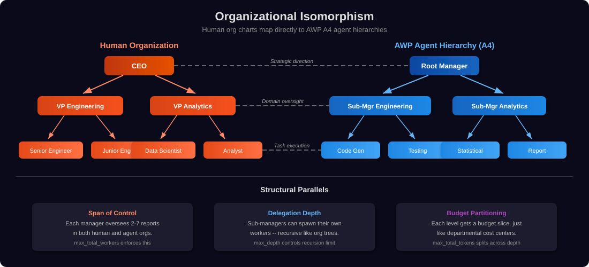
</p>

### Why This Isomorphism is Powerful

**Intuitive governance mapping**: Enterprise governance structures — who can approve what, what requires review, what has budget limits — map directly to AWP's safety mechanisms. The CEO's budget authority maps to the root manager's token budget. The VP's domain authority maps to the sub-manager's tool permissions. The compliance team's veto power maps to the immutable safety envelope.

**Organizational knowledge encoding**: When you model an enterprise workflow in AWP, you are encoding organizational knowledge. The hierarchy, the delegation patterns, the quality gates — these represent decades of institutional wisdom about how to decompose problems, distribute work, and ensure quality.

**Scalability through delegation**: Human organizations scale by delegation, not by making individuals smarter. AWP scales the same way. An A4 workflow can handle problems of arbitrary complexity by creating deeper hierarchies — just as a company can handle larger projects by adding management layers.

### The Conway's Law Corollary

Conway's Law states that organizations design systems that mirror their communication structures. AWP inverts this: **AWP workflows mirror organizational structures because they solve the same coordination problem**.

Both human organizations and AWP agent hierarchies must solve:
- **Task decomposition**: How to break a large goal into manageable pieces
- **Resource allocation**: How to distribute limited resources (time, money, tokens) across tasks
- **Quality assurance**: How to verify that results meet standards
- **Information flow**: How to ensure the right information reaches the right decision-maker
- **Escalation**: How to handle problems that exceed a worker's capability

AWP's formal framework makes these patterns explicit, auditable, and reproducible — which is exactly what enterprise compliance requires.

---

## 9. The Compliance Paradox: More Freedom Through More Structure

### The Paradox Explained

At first glance, AWP's graduated safety requirements seem restrictive: more autonomy means more rules. Budget systems, safety envelopes, full observability — each level adds constraints.

But the paradox is this: **without these constraints, enterprises cannot use AI agents at all**.

Consider the reality of enterprise AI adoption:

- Legal requires audit trails for any AI-generated analysis that influences business decisions
- Finance requires cost controls for any system that consumes cloud resources dynamically
- Security requires sandboxing for any system that executes code
- Compliance requires explainability for any system that touches customer data

Without AWP's structural guarantees, the enterprise response to these requirements is simple: **do not deploy autonomous agents**. The risk is unquantifiable, the audit trail is nonexistent, the cost is unpredictable.

AWP's constraints *enable* enterprise adoption by making the risk quantifiable:

<p align="center">
  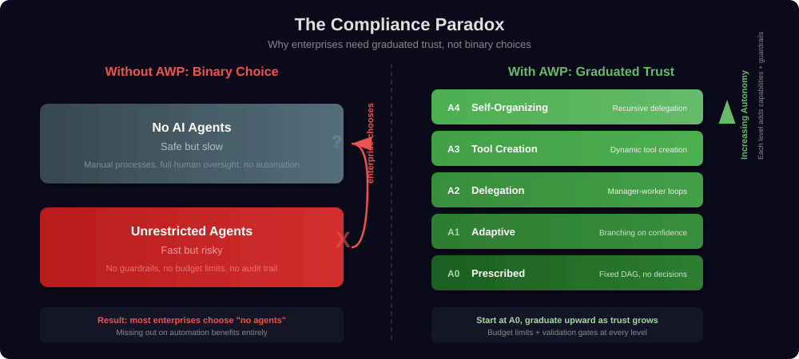
</p>

### The Budget System as Enterprise Enabler

The budget system (mandatory at A2+) is the single most important enterprise feature of AWP. It transforms AI agent costs from unpredictable to bounded:

```yaml
budget:
  max_loops: 15
  max_total_workers: 8
  max_total_tokens: 500000
  max_wall_time: 300
  max_depth: 3
```

These are not suggestions — they are hard limits enforced by the runtime. A workflow with a 500,000 token budget *cannot* spend 500,001 tokens. The CFO can sign off on this. The compliance team can audit it. The infrastructure team can capacity-plan for it.

This is the paradox resolved: **the constraints are not restrictions on what you can do — they are the preconditions for doing anything at all** in a governed environment.

### Compliance as Competitive Advantage

Organizations that adopt AWP's compliance framework gain a structural advantage:

1. **Faster approval cycles**: When the governance team can see the safety envelope, the budget limits, and the observability guarantees in the workflow YAML, approval is a checklist — not a months-long risk assessment
2. **Reproducible audits**: Every workflow execution produces an audit trail that maps to the 7-layer model. Auditors can verify compliance against a known framework, not ad-hoc documentation
3. **Progressive deployment**: Start with A0 for low-risk use cases, demonstrate compliance, and gradually move to higher autonomy levels. Each step has clear safety criteria

---

## 10. Enterprise-Scale Orchestration: From Department to Organism

### The Vision: The Intelligent Enterprise

The ultimate promise of AWP in the enterprise is not automating individual tasks — it is enabling the enterprise to function as an intelligent organism where information flows, decisions are made, and work is executed through a network of specialized agents operating under unified governance.

<p align="center">
  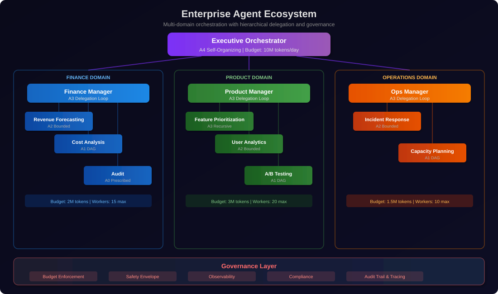
</p>

### What This Makes Possible

**Cross-domain intelligence**: When the product team's A/B test analysis reveals a revenue impact, the finance workflow automatically incorporates this signal. When operations detects a capacity constraint, the product prioritization workflow adjusts. Information flows through the agent network like signals through a nervous system.

**Consistent methodology**: Every analysis across every department uses the same validation framework (R1–R32), the same confidence scoring, the same output contracts. The CFO can compare a finance team's quarterly forecast (confidence: 0.87) with a product team's growth projection (confidence: 0.73) using the same trust framework.

**Elastic scaling**: When quarter-end reporting creates a spike in analytical demand, the A4 orchestrator can dynamically allocate more workers to the finance domain by increasing its budget allocation — within the global safety envelope. This is infrastructure-as-code for cognitive work.

**Institutional memory**: The memory layer (Layer 4) enables persistent knowledge across workflow executions. Patterns discovered in Q1's analysis are available to Q2's agents. The enterprise builds a *growing knowledge base* that informs every subsequent analysis — without any individual having to remember and communicate it.

---

# Part IV — Emergence and the Future

## 11. Emergent Behavior in Bounded Systems

### The Emergence Paradox

One of the most philosophically interesting properties of AWP workflows is *emergence* — the appearance of system-level behaviors that were not explicitly programmed into any individual agent.

In an A2+ workflow, the manager agent decides how to decompose tasks, which workers to create, and how to synthesize results. No one programmed the specific decomposition strategy for a specific input. The manager *reasons about the problem* and creates a solution structure dynamically. The resulting workflow topology is emergent.

But this emergence is *bounded*. The budget system ensures it terminates. The safety envelope ensures it stays within permitted actions. The validation rules ensure the outputs are structurally correct. The observability layer ensures every step is recorded.

This is the key insight: **emergence and control are not opposites in AWP — they are complementary**. The constraints do not prevent emergence; they *channel* it into productive directions.

<p align="center">
  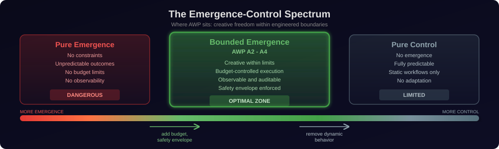
</p>

### Emergence in Practice: The Unexpected Solution

Consider a real scenario: An A3 data science workflow is tasked with analyzing customer churn. The manager delegates initial analysis to a statistical worker, who reports low confidence (0.55) — the standard features (recency, frequency, monetary value) are not predictive for this particular dataset.

In a traditional pipeline, this is where the analysis stops or a human intervenes. In an A3 workflow:

1. The manager reads the low-confidence report and identifies the problem: standard features are insufficient
2. It delegates to a new worker with instructions to explore interaction features
3. The worker uses code mode to programmatically generate feature combinations
4. It *creates a new tool* (`analytics.interaction_scorer`) that computes pairwise feature interactions
5. Using this new tool, it discovers that the interaction between "support_ticket_count" and "last_login_days_ago" is highly predictive
6. The statistical worker re-runs with this new feature, achieving confidence 0.91

Nobody programmed this solution. The manager did not have a rule that says "if RFM features fail, try interaction features." The worker did not have a pre-built interaction scorer. The solution *emerged* from the agents' reasoning within AWP's structured framework.

This is the kind of analysis that, in a traditional setting, would require a senior data scientist with domain intuition and custom coding skills. AWP makes it *structurally possible* — not guaranteed, but enabled by the framework.

---

## 12. The Economics of Agent Workflows

### The Cost Model Revolution

Traditional software has a simple cost model: development cost (fixed) + infrastructure cost (variable with usage). AI agent workflows introduce a third dimension: **cognitive cost** — the tokens consumed by LLM calls, which scale with problem complexity and autonomy level.

AWP's budget system makes cognitive cost a first-class concern:

<p align="center">
  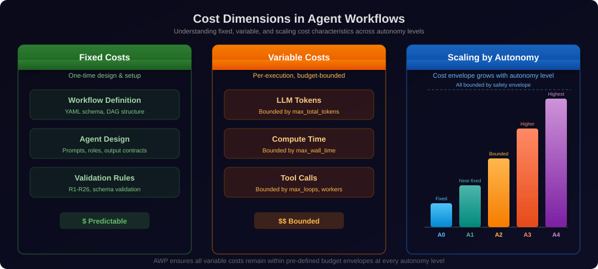
</p>

### The ROI Framework

The return on investment for AWP workflows comes from four sources:

**Time compression**: An A2 workflow that replaces a week of manual analysis with a 5-minute automated pipeline saves analyst time. At enterprise scale with hundreds of recurring analyses, this adds up to thousands of analyst-hours per quarter.

**Quality improvement**: Structural validation, confidence tracking, and multi-agent cross-validation produce more reliable results. The cost of a bad business decision based on flawed analysis far exceeds the token cost of a thorough automated analysis.

**Reproducibility**: Once defined, an AWP workflow produces consistent results on new data. The marginal cost of running the same analysis on next quarter's data approaches zero (just token costs). In a notebook world, each re-analysis requires significant manual effort.

**Capability expansion (A3+)**: Dynamically created tools persist and can be reused. An A3 workflow that creates a domain-specific scoring function today makes tomorrow's analyses faster and cheaper. The agent system *amortizes its cognitive investment* across future executions.

### The Budget as a Business Contract

AWP's budget system transforms the relationship between AI capabilities and business planning:

```
budget:
  max_total_tokens: 500000   # cost depends on model choice
  max_wall_time: 300         # 5 minutes maximum
  max_total_workers: 8       # bounded parallelism
```

This is a *business contract*, not just a technical parameter. The finance team can budget for AI agent costs with the same precision as cloud infrastructure costs. The operations team can plan capacity. The business unit can calculate ROI per workflow run.

No other agent framework makes this possible. Without hard budget limits, AI agent costs are inherently unpredictable — and unpredictable costs in an enterprise environment mean no deployment approval.

---

## 13. Toward Cognitive Architectures: AWP as a Foundation

### The Bigger Picture

AWP is not the end state — it is a foundation. The protocol's layered architecture, compositional agent model, and graduated autonomy spectrum position it as the infrastructure layer for increasingly sophisticated cognitive systems.

### The Cognitive Architecture Stack

<p align="center">
  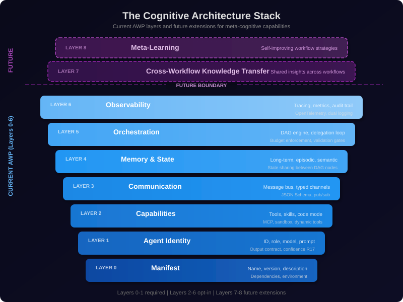
</p>

### What the Future Holds

**Meta-learning workflows**: Workflows that analyze their own execution history and optimize their structure. An A4 workflow that discovers it consistently creates the same sub-manager pattern could learn to start with that pattern, reducing iteration time. The observability layer already provides the data; the meta-learning layer would act on it.

**Cross-domain knowledge transfer**: When the finance workflow discovers a seasonal pattern in revenue data, this insight could propagate to the product workflow's demand forecasting and the operations workflow's capacity planning. AWP's memory layer provides the mechanism; cross-workflow protocols would provide the routing.

**Collaborative human-agent workflows**: AWP's current model is human-defines-agents-execute. The next evolution is workflows where human experts are nodes in the DAG — contributing domain knowledge, making judgment calls, and validating agent outputs — all within the same protocol framework.

**Federated agent networks**: Multiple organizations running AWP workflows that can securely share validated insights (but not raw data or prompts). The output contract with confidence scores provides a universal interface for inter-organizational agent communication.

### The Philosophical Horizon

At the deepest level, AWP points toward a question that will define the next decade of computing: **how do we build systems that think, within boundaries that we set?**

The answer AWP proposes is both elegant and practical:

1. Define what agents are (identity) and what they can do (capabilities)
2. Structure how they communicate (communication) and what they remember (memory)
3. Orchestrate how they collaborate (orchestration) under observation (observability)
4. Scale safety with autonomy, always, without exception
5. Make everything composable, auditable, and reproducible

This is not just a protocol for orchestrating LLM calls. It is a framework for **governed intelligence** — a way to harness the power of cognitive computation while maintaining the control, predictability, and accountability that real-world deployment demands.

The super nerd knows: the most powerful systems are not the ones with the fewest constraints, but the ones with the *right* constraints — constraints that channel creativity rather than suppress it, that enable trust rather than require it, and that scale gracefully from a single notebook cell to an enterprise-wide cognitive architecture.

---

<p align="center">
  <em>AWP: Where the rigor of protocol engineering meets the creativity of cognitive systems.</em>
</p>
