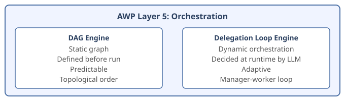
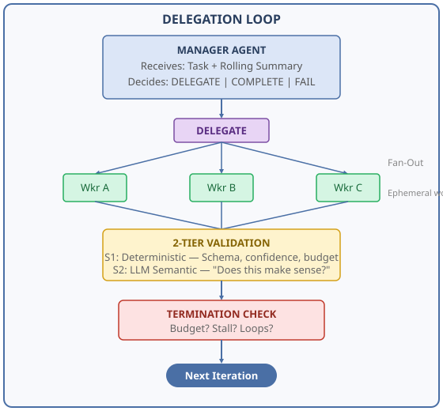

# AWP Orchestration Engines

AWP Layer 5 (Orchestration) supports two execution engines. Each engine answers
the same question -- *"In what order and under what conditions do agents run?"* --
but with fundamentally different philosophies.

  

---

## Engine 1: DAG (Directed Acyclic Graph)

**Status:** Available since AWP 1.0.0
**Best for:** Predictable pipelines with known steps

### How It Works

You define a static graph of agents and their dependencies in `workflow.awp.yaml`.
The runtime topologically sorts the graph into execution levels and runs agents
in order, respecting dependencies.

```yaml
orchestration:
  engine: dag
  graph:
    - id: planner
      agent: planner
      depends_on: []
    - id: researcher
      agent: researcher
      depends_on: [planner]
    - id: writer
      agent: writer
      depends_on: [researcher]
```

### Execution Model

  

Agents at the same level with no mutual dependencies run in parallel.

### Features

| Feature | Support |
|---------|---------|
| Sequential execution | Yes |
| Parallel execution | Yes (same-level, independent agents) |
| Conditional execution | Yes (`when` expressions) |
| State sharing | Yes (full, selective, isolated) |
| Retry with backoff | Yes |
| Fan-out | Yes (via FanOutConfig) |
| Loops | Yes (per-agent LoopConfig) |
| Tools | Yes (full MCP tool registry) |
| Code Mode | Yes |
| Dynamic Tool Creation | Yes |

### When to Use DAG

- The number of steps is known before execution
- Each agent's role is fixed and well-defined
- Data flows in one direction (pipeline pattern)
- You need maximum predictability and auditability
- Budget planning is straightforward (N agents × cost per agent)

### Configuration Reference

```yaml
orchestration:
  engine: dag
  execution:
    mode: parallel          # sequential | parallel | conditional
    timeout:
      per_agent: 120        # seconds
      total: 300
    max_parallel_agents: 4
    error_handling:
      default: continue     # continue | stop | retry
      max_retries: 1
      retry_delay: 2.0
  graph:
    - id: agent_name
      agent: agent_dir_name
      enabled: true
      depends_on: [other_agent]
      share_output: [field1, field2]
      on_failure: continue  # continue | skip | abort
      when: "state.other_agent.score > 0.5"
      timeout: 60
      retry: 2
```

---

## Engine 2: Delegation Loop

**Status:** Available since AWP 1.1.0
**Best for:** Open-ended tasks where the steps emerge during execution

### How It Works

A **manager agent** receives the task and dynamically decides what to do:
1. **DELEGATE** — Generate instructions, skills, and tool configs for worker agents
2. **COMPLETE** — The task is done, return the final result
3. **FAIL** — The task cannot be completed

Workers are **ephemeral** — they don't exist as static `agent.awp.yaml` files.
The manager creates them at runtime by generating a **Delegation Envelope**
containing everything the worker needs: instructions, domain knowledge (skills),
allowed tools, and output contract.

  

### The Delegation Envelope

The manager generates this for each worker:

```json
{
  "worker_id": "market_researcher",
  "instructions": "Research current market trends for electric vehicles...",
  "skills": [
    "## Market Analysis\n- Focus on TAM/SAM/SOM...\n- Use Porter's Five Forces..."
  ],
  "tools_allowed": ["web.search", "file.read"],
  "output_contract": {
    "required_fields": ["trends", "market_size", "confidence"],
    "description": "Market research findings"
  },
  "codemode": {
    "enabled": false,
    "tool_creation": false
  }
}
```

The manager dynamically generates:
- **Instructions** — What the worker should do
- **Skills** — Domain knowledge as Markdown, injected into the worker's prompt
- **Tool configuration** — Which MCP tools the worker can use
- **Output contract** — What the worker must return

### Budget System

Instead of a simple depth limit, the delegation loop uses a **budget system**
that tracks resource consumption across the entire execution tree:

```yaml
budget:
  max_loops: 20              # Maximum manager iterations
  max_total_workers: 30      # Total workers across all iterations
  max_total_tokens: 1000000  # LLM token limit
  max_wall_time: 600         # Wall clock seconds
  max_tool_calls: 200        # Total tool invocations
  max_depth: 5               # Safety limit for recursive sub-delegation
```

The budget enforces a hard stop when any resource limit is hit. This prevents
runaway loops and guarantees cost predictability.

When workers sub-delegate (recursive delegation), they must allocate portions
of their budget to sub-workers. The invariant `sum(children) + self <= allocation`
is enforced deterministically, not by the LLM.

### Safety Envelope

The manager controls worker instructions, skills, and tools — but it **cannot**
override security-critical parameters:

```yaml
worker_policy:
  enforced:                          # Manager CANNOT change these
    sandbox:
      type: subprocess
      max_memory_mb: 512
      max_cpu_seconds: 30
      network: false
    codemode:
      max_tools_per_worker: 10
    rate_limiting:
      max_llm_calls_per_minute: 30
    forbidden_tools:
      - "shell.execute"

  manager_controlled:                # Manager CAN set these
    - instructions
    - skills
    - tools_allowed
    - output_contract
    - codemode.enabled
    - codemode.tool_creation
    - temperature                    # Per-worker LLM temperature
```

The model selection is also outside the manager's control — it's set by the user
via `--manager-model` and `--worker-model` CLI flags. However, the manager **can**
set `temperature` per worker in the delegation envelope to control creativity
(e.g., low for analysis, high for brainstorming). If omitted, defaults to 0.2.

### Two-Tier Validation

Every worker result passes through two validation stages:

**Tier 1: Deterministic (always runs, free)**
- Is the result a valid JSON object?
- Does it contain the required `confidence` field?
- Is confidence in range [0.0, 1.0]?
- Is the budget still within limits?

**Tier 2: LLM Semantic (conditional, costs tokens)**
- Does the result actually address the task?
- Is the confidence score realistic?
- Does it contradict previous findings?

The LLM validator runs on the **worker model** (not the expensive manager model)
and can be skipped when confidence is very high or budget is low.

### Stall Detection

The loop automatically detects when it's making no progress:

```yaml
termination:
  enabled: true
  window: 3                  # Compare last 3 iterations
  min_confidence_delta: 0.05 # Must improve by at least 0.05
  action: warn_then_stop     # warn once, stop on second stall
```

If confidence doesn't improve over `window` iterations, the system:
1. First occurrence: warns the manager ("confidence is stagnating")
2. Second occurrence: terminates the loop with partial results

### Context Budget & Smart Spillover

Worker results can be large (DataFrames, analysis outputs, etc.). The context budget
controls how much data is inlined into worker prompts vs spilled to files:

```yaml
context_budget:
  total_chars: 64000    # Total character budget for all context (~16K tokens)
  min_per_entry: 4000   # Floor per entry even with many workers
  preview_chars: 2000   # Preview length for spilled results
```

**Auto-detect** (default): The `total_chars` budget is divided equally among the
number of context entries. Each entry gets at least `min_per_entry` characters.

**Spillover behavior**:
- Results **under** budget: inlined fully as JSON in the worker prompt
- Results **over** budget: written to `workspace/context/<worker_id>.json`,
  with a truncated preview and file path shown in the prompt
- Workers can read the full spilled file via `code.execute`:
  `json.load(open(_workspace_dir + "/context/worker_1.json"))`

**Input Registry**: Workers automatically receive a listing of all available
data files in `workspace/inputs/` and `workspace/context/`, including:
- File name, size, and access path
- Schema preview for CSV files (column names, first 3 rows, row count)
- Structure preview for JSON files (top-level keys, array sizes)
- Read hints for binary formats (Parquet, Feather, etc.)

This is configured at the orchestration level (`context_budget` field) and
applies to both DAG and delegation loop engines.

### Rolling Summary

To prevent context window overflow, the loop maintains a **rolling summary**:

- **Last N iterations**: Full results (configurable via `full_results_window`)
- **Older iterations**: Summarized as key findings + confidence
- **On disk**: `ROLLING_SUMMARY.md` (human-readable) + `rolling_summary.json` (machine-readable)

The manager receives the rolling summary in every iteration, keeping its context
size constant regardless of how many iterations have run.

### Logging Structure

Every run produces a complete audit trail on disk:

```
workspace/runs/{run_id}/
├── RUN_SUMMARY.md                 # Human-readable overview
├── run_manifest.json              # Machine-readable config
├── run_completion.json            # Final status and budget
│
├── iterations/
│   ├── 001/
│   │   ├── ITERATION_SUMMARY.md   # What happened
│   │   ├── manager_decision.json  # Manager's raw output
│   │   ├── budget_snapshot.json   # Budget after this iteration
│   │   ├── validation.json        # Validation results
│   │   └── delegations/
│   │       ├── worker_a/
│   │       │   ├── envelope.json  # What the worker received
│   │       │   ├── result.json    # What the worker returned
│   │       │   ├── RESULT.md      # Human-readable result
│   │       │   └── generated_skills/
│   │       │       └── skill_0.md
│   │       └── worker_b/
│   │           └── ...
│   └── 002/
│       └── ...
│
├── history/
│   ├── ROLLING_SUMMARY.md         # Current summary
│   └── rolling_summary.json       # Machine-readable history
│
└── artifacts/
    ├── skills/                    # All generated skills
    └── tools/                     # All generated tools
```

Both JSON (for machines/agents) and Markdown (for humans/debugging) are generated
by default. Use `logging.format: json` or `logging.format: md` for single-format.

### Model Configuration

The user controls which models are used:

```bash
# Manager gets the strong model, workers get the fast model
awp run my-workflow/ \
  --task "Analyze market trends" \
  --manager-model openrouter/anthropic/claude-opus-4 \
  --worker-model openrouter/anthropic/claude-sonnet-4
```

Resolution order:
```
--manager-model  →  workflow YAML models.manager  →  LLM_MODEL env  →  Error
--worker-model   →  workflow YAML models.worker   →  manager model  →  Error
```

The manager **cannot** override the worker model. This prevents a hallucinating
manager from upgrading workers to expensive models.

### Recursive Sub-Delegation

Workers can act as managers and spawn their own sub-workers:

```
Manager (depth 0)
├── Worker A (depth 1) → becomes sub-manager
│   ├── Sub-Worker A1 (depth 2)
│   └── Sub-Worker A2 (depth 2)
├── Worker B (depth 1)
└── Worker C (depth 1)
```

This is controlled by the budget system, not just depth limits. A worker
that sub-delegates must allocate portions of its budget to sub-workers.

### Configuration Reference

```yaml
orchestration:
  engine: delegation_loop

  delegation_loop:
    manager: agents/manager        # Agent directory for the manager

    models:
      manager: null                # CLI → YAML → LLM_MODEL
      worker: null                 # CLI → YAML → manager model

    worker_policy:
      enforced:
        sandbox:
          type: subprocess
          max_memory_mb: 512
          max_cpu_seconds: 30
          network: false
        codemode:
          max_tools_per_worker: 10
        rate_limiting:
          max_llm_calls_per_minute: 30
        forbidden_tools:
          - "shell.execute"
      manager_controlled:
        - instructions
        - skills
        - tools_allowed
        - output_contract
        - codemode.enabled
        - codemode.tool_creation
        - temperature

    budget:
      max_loops: 20
      max_total_workers: 30
      max_total_tokens: 1000000
      max_wall_time: 600
      max_tool_calls: 200

    context_budget:
      total_chars: 64000   # auto-divided among workers
      min_per_entry: 4000  # floor per entry
      preview_chars: 2000  # preview for spilled results
      max_depth: 5

    termination:
      enabled: true
      window: 3
      min_confidence_delta: 0.05
      action: warn_then_stop

    validation:
      deterministic:
        always: true
        checks: [schema, required_fields, confidence, budget]
      llm:
        enabled: true
        skip_when_confidence_above: 0.95
        skip_when_budget_remaining_below: 0.1

    history:
      rolling_summary: true
      full_results_window: 3
      persist_to_disk: true

    logging:
      format: dual              # dual | json | md
      persist_artifacts: true
```

---

## Composing Engines: DAG + Delegation Loop

The two engines can be composed. A DAG node can **be** a delegation loop:

```yaml
orchestration:
  engine: dag
  graph:
    - id: gather_requirements
      agent: requirements_gatherer

    - id: dynamic_analysis
      type: delegation_loop
      config:
        manager: agents/analysis_manager
        budget: {max_loops: 10, max_total_workers: 15}
      depends_on: [gather_requirements]

    - id: write_report
      agent: report_writer
      depends_on: [dynamic_analysis]
```

In this pattern:
1. `gather_requirements` runs first (DAG agent)
2. `dynamic_analysis` runs as a delegation loop (multiple iterations)
3. `write_report` runs after the loop completes (DAG agent)

This gives you the predictability of a DAG for the overall flow, with the
flexibility of a delegation loop for the complex middle step.

---

## Choosing an Engine

| Factor | DAG | Delegation Loop |
|--------|-----|-----------------|
| **Steps known upfront** | Yes | No |
| **Cost predictability** | High (N agents) | Medium (budget-bounded) |
| **Adaptability** | Low | High |
| **Debugging** | Simple (trace the graph) | Rich (full audit trail on disk) |
| **Best for** | Pipelines, ETL, fixed workflows | Research, analysis, open-ended tasks |
| **Agent definition** | Static (agent.awp.yaml) | Manager: static, Workers: dynamic |
| **LLM calls** | 1 per agent | 1 per manager iteration + 1 per worker |
| **Parallelism** | Same-level agents | Fan-out workers per iteration |

### Rules of Thumb

1. **Start with DAG.** If you can enumerate the steps, use a DAG.
2. **Use Delegation Loop when** the number of steps depends on the task content.
3. **Compose both** when you have a predictable outer flow with an adaptive inner step.
4. **Budget aggressively.** Set conservative limits and increase if needed.
5. **Enable stall detection.** It's your safety net against infinite loops.

---

## Design Patterns

### Pattern 1: Pipeline (DAG)

A linear chain of agents where each builds on the previous output. Classic ETL or research-then-write flow.

```yaml
orchestration:
  engine: dag
  graph:
    - id: researcher
      agent: researcher
      depends_on: []
      share_output: [findings]
    - id: writer
      agent: writer
      depends_on: [researcher]
      share_output: [article]
```

**Autonomy level:** A1 Adaptive

### Pattern 2: Fan-Out / Fan-In (DAG)

Multiple agents run in parallel, then a synthesizer combines results.

```yaml
orchestration:
  engine: dag
  graph:
    - id: analyst_a
      agent: analyst
      depends_on: []
      share_output: [analysis]
    - id: analyst_b
      agent: analyst
      depends_on: []
      share_output: [analysis]
    - id: synthesizer
      agent: synthesizer
      depends_on: [analyst_a, analyst_b]
```

**Autonomy level:** A1 Adaptive

### Pattern 3: Dynamic Delegation (Delegation Loop)

A manager decomposes a task into subtasks and spawns workers dynamically. The number and type of workers depend on the task.

```yaml
orchestration:
  engine: delegation_loop
  delegation_loop:
    manager: agents/project_manager
    budget:
      max_loops: 10
      max_total_workers: 20
    termination:
      enabled: true
      window: 3
      min_confidence_delta: 0.05
```

**Autonomy level:** A2 Delegating

### Pattern 4: DAG with Delegation Loop Inner Step (Composed)

A predictable outer pipeline wraps a dynamic inner step.

```yaml
orchestration:
  engine: dag
  graph:
    - id: gather_requirements
      agent: requirements_gatherer
    - id: dynamic_analysis
      type: delegation_loop
      config:
        manager: agents/analysis_manager
        budget: { max_loops: 10, max_total_workers: 15 }
      depends_on: [gather_requirements]
    - id: write_report
      agent: report_writer
      depends_on: [dynamic_analysis]
```

**Autonomy level:** A2 Delegating

### Pattern 5: Self-Tooling Workers (Delegation Loop + CodeMode)

Workers create MCP tools at runtime to handle unfamiliar APIs or data formats.

```yaml
orchestration:
  engine: delegation_loop
  delegation_loop:
    manager: agents/integration_manager
    budget:
      max_loops: 15
      max_total_workers: 20
      max_tool_calls: 300
    worker_policy:
      enforced:
        codemode:
          max_tools_per_worker: 5
        forbidden_tools: ["shell.execute"]
      manager_controlled:
        - instructions
        - skills
        - tools_allowed
        - codemode.enabled
        - codemode.tool_creation
        - temperature
```

**Autonomy level:** A3 Self-Tooling

### Pattern 6: Recursive Delegation (Delegation Loop, A4)

Workers act as sub-managers, spawning their own workers. Budget flows down the hierarchy with the invariant `sum(children) + self <= allocation`.

```
Manager (depth 0, budget: 1000000 tokens)
├── Team Lead A (depth 1, budget: 400000 tokens) → sub-manager
│   ├── Specialist A1 (depth 2, budget: 150000 tokens)
│   └── Specialist A2 (depth 2, budget: 150000 tokens)
├── Team Lead B (depth 1, budget: 400000 tokens) → sub-manager
│   └── Specialist B1 (depth 2, budget: 300000 tokens)
└── Worker C (depth 1, budget: 100000 tokens)
```

Requires `budget.max_depth`, observability tracing, and circuit breaker.

**Autonomy level:** A4 Self-Organizing
