# Architecture & Design Decisions

**How AWP differs from every other agent framework — and why it matters.**

---

## The Core Insight

Every multi-agent framework asks the same question: *How do you get multiple AI agents to collaborate?* But most frameworks answer it at the wrong level of abstraction. They give you code primitives — classes, decorators, function calls — and leave the architecture to you. AWP inverts this: **the architecture is the product**. The code is just a runtime that interprets it.

This document traces a single idea — *separation of intent from execution* — from abstract principle to concrete implementation. Along the way, it reveals why this separation unlocks capabilities that code-first frameworks structurally cannot provide.

---

## Table of Contents

1. [The Landscape: Why Another Framework?](#1-the-landscape-why-another-framework)
2. [The Separation Principle](#2-the-separation-principle)
3. [Architectural Comparison](#3-architectural-comparison-awp-vs-the-field)
4. [The Autonomy Spectrum: A Design Innovation](#4-the-autonomy-spectrum-a-design-innovation)
5. [Runtime Capability Genesis](#5-runtime-capability-genesis-tools--skills-from-nothing)
6. [The Problem-Solving Paradigm](#6-the-problem-solving-paradigm)
7. [Solving Complex Problems](#7-solving-complex-problems-the-delegation-architecture)
8. [The Safety Architecture](#8-the-safety-architecture)
9. [What Scientists Can Do Now](#9-what-scientists-can-do-now)
10. [From Abstract Idea to Running System](#10-from-abstract-idea-to-running-system)
11. [Conclusion: The Insight](#11-conclusion-the-insight)

---

## 1. The Landscape: Why Another Framework?

The multi-agent ecosystem in 2024-2026 produced a wave of frameworks, each solving a piece of the puzzle:

| Framework | Core Idea | Strength | Structural Limitation |
|-----------|-----------|----------|----------------------|
| **LangChain/LangGraph** | Chains of LLM calls as graphs | Composability, huge ecosystem | Graph = code. No declarative layer. Migration requires rewriting. |
| **CrewAI** | Role-playing agents with delegation | Intuitive mental model | Flat hierarchy. No budget enforcement. Tools are static. |
| **AutoGen (Microsoft)** | Conversational agent groups | Multi-turn dialogue patterns | Conversation-centric — struggles with non-chat workflows. |
| **Semantic Kernel (Microsoft)** | Plugin-based AI orchestration | Enterprise integration | Plugin model doesn't support dynamic capability creation. |
| **Google A2A** | Agent-to-Agent communication protocol | Interoperability standard, vendor-neutral | Communication only — no orchestration, no workflow definition, no safety envelope. |
| **Google ADK** | Code-first agent development kit | Deep Google Cloud integration, function calling | Code-first. No declarative workflow layer. Tightly coupled to Gemini ecosystem. |
| **OpenAI Agents SDK** | Agent handoffs with guardrails (Swarm successor) | Simple API, built-in tracing, guardrails | No declarative layer. No budget enforcement. No dynamic capability creation. |
| **Amazon Bedrock Agents** | Managed agent service with knowledge bases | Fully managed, enterprise-grade, AWS integration | Vendor-locked. No custom orchestration. Limited autonomy — agents can't create tools or sub-agents. |
| **MetaGPT** | Software-company metaphor (PM, Architect, Engineer) | Strong for code generation | Domain-locked metaphor. Hard to adapt to non-software tasks. |
| **DSPy** | Programmatic prompt optimization | Systematic prompt engineering | Not an orchestration framework. Single-agent focus. |
| **Haystack** | Pipeline-based NLP/RAG | Strong RAG patterns | Pipeline paradigm limits agent autonomy. |

Each framework makes a fundamental trade-off. They either give you **freedom without structure** (LangGraph, Google ADK) or **structure without freedom** (MetaGPT, Bedrock Agents). Some — like Google A2A — solve interoperability at the communication layer but leave orchestration and safety to the developer. AWP's thesis is that you don't have to choose.

<p align="center">
<p align="center">
  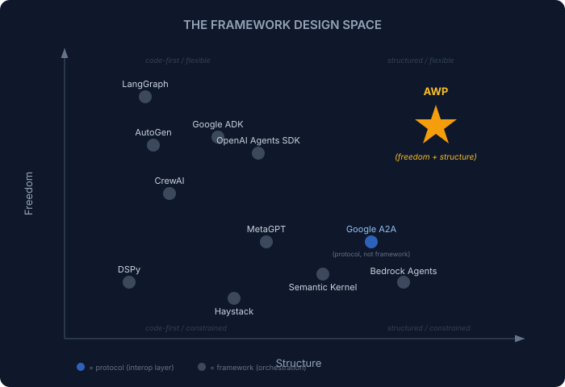
</p>
</p>

**AWP occupies a unique position**: maximum structural guarantees (formal validation, budget enforcement, safety layers) combined with maximum runtime freedom (agents create their own tools, skills, and sub-agents).

---

## 2. The Separation Principle

The central design decision in AWP is the **separation of workflow definition from workflow execution**.

<p align="center">
<p align="center">
  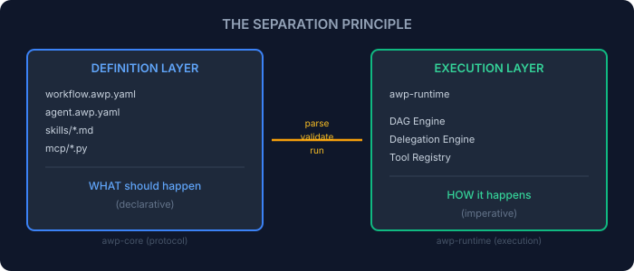
</p>
</p>

This separation has consequences that ripple through every design decision:

**1. Portability.** A `workflow.awp.yaml` is a contract. Any runtime that speaks AWP can execute it. Today that runtime is Python. Tomorrow it could be Rust, Go, or a cloud service. The workflow doesn't change.

**2. Validation before execution.** Because the intent is declarative, AWP can statically analyze a workflow *before any LLM call is made*. The 24 validation rules (R1-R24) catch structural errors, naming violations, missing dependencies, and unsafe configurations at parse time — not at runtime.

**3. Reproducibility.** The same YAML produces the same execution plan. The LLM outputs vary, but the orchestration topology, budget constraints, and safety boundaries are deterministic.

**4. Governance.** A YAML file can be reviewed, versioned, diffed, and approved — just like infrastructure-as-code. You can't meaningfully review a LangGraph program without running it.

### Why Other Frameworks Don't Separate

| Framework | Definition | Execution | Separation? |
|-----------|-----------|-----------|-------------|
| LangGraph | Python code (StateGraph) | Same Python code | No — code IS the workflow |
| CrewAI | Python classes (Agent, Task, Crew) | Method calls | No — imperative only |
| AutoGen (Microsoft) | Python agent config | Conversation runtime | Partial — config is shallow |
| Semantic Kernel (Microsoft) | Plugin definitions + planners | Kernel execution | Partial — plugins are code, planners are internal |
| Google A2A | JSON Agent Cards + Task protocol | Any compliant runtime | Partial — defines interop, not workflow structure |
| Google ADK | Python agent classes + tools | Google Cloud runtime | No — code-first, agents are classes |
| OpenAI Agents SDK | Python agent definitions | Runner execution | No — imperative, agents defined in code |
| Amazon Bedrock Agents | Console/API config + action groups | Managed AWS runtime | Partial — config is GUI/API, limited expressiveness |
| MetaGPT | Python roles + actions | Subscription bus | No — roles are classes |
| **AWP** | YAML (7-layer model) | Python runtime engines | **Full separation** |

The analogy is **Docker Compose vs. shell scripts**. Both can start containers. But only Compose gives you a declarative specification that tools can parse, validate, visualize, and transform without executing anything.

---

## 3. Architectural Comparison: AWP vs. The Field

### 3.1 The 7-Layer Model vs. Flat Abstractions

Most frameworks organize agents as flat collections of objects. AWP structures the *entire system* into seven semantic layers:

<p align="center">
<p align="center">
  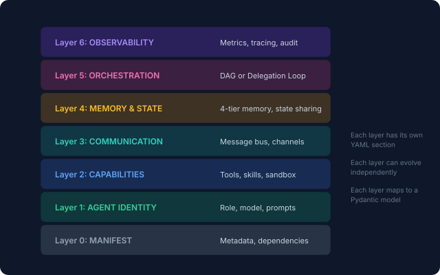
</p>
</p>

**Why layers matter:**
- **Modularity.** Change your orchestration strategy (Layer 5) without touching agent identity (Layer 1) or tool definitions (Layer 2).
- **Progressive disclosure.** A simple A0 workflow only needs Layer 0, 1, and 5. You add layers as complexity demands.
- **Formal boundaries.** Each layer has its own validation rules. A Layer 2 violation (bad tool namespace) doesn't cascade into Layer 5 failures.

**Comparison:**
- LangGraph: Everything is one graph object. Agent config, tools, state, and orchestration are mixed in a single `StateGraph`.
- CrewAI: Agent and Task are separate, but there's no formal layer for communication, memory, or observability.
- AutoGen: Agents and group chats, but memory, tools, and orchestration are all informal.

### 3.2 Two Engines vs. One Paradigm

Every other framework commits to a single execution paradigm:

| Framework | Paradigm | Limitation |
|-----------|----------|-----------|
| LangGraph | State machine | All workflows must be expressible as state transitions |
| CrewAI | Sequential/hierarchical crew | No true DAG support, limited parallelism |
| AutoGen (Microsoft) | Conversation turns | Non-conversational workflows feel forced |
| Semantic Kernel (Microsoft) | Planner + plugins | Plugins are static; planner is a single-step coordinator, not a multi-agent orchestrator |
| Google ADK | Code-first agent classes | Agents are Python objects — no declarative topology, no formal validation |
| Google A2A | Agent-to-Agent protocol | Defines communication, not orchestration — no workflow engine, no safety envelope |
| OpenAI Agents SDK | Handoff chains | Linear handoff model — no DAG, no budget, no recursive delegation |
| Amazon Bedrock Agents | Managed action groups | Vendor-locked execution — no custom engines, no dynamic capability creation |
| MetaGPT | Pub/sub actions | Overkill for simple sequential workflows |

AWP provides **two engines** optimized for different workflow topologies:

<p align="center">
<p align="center">
  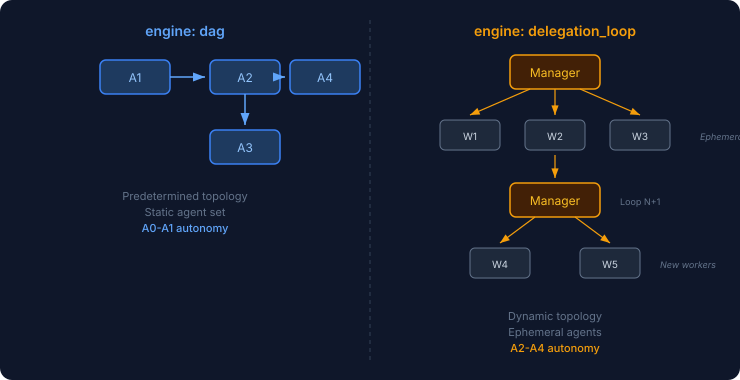
</p>
</p>

**DAG Engine** (A0-A1): Topological execution of a predetermined graph. Agents run in dependency order. State flows along edges. Simple, fast, predictable. Use this when you know the exact workflow at design time.

**Delegation Loop Engine** (A2-A4): A manager agent dynamically spawns ephemeral workers, each configured with custom instructions, tools, and skills. The manager iterates — analyzing results, spawning new workers, refining strategy — until the task is complete or the budget is exhausted. Use this when the workflow must adapt at runtime.

The choice is a single YAML field: `engine: dag` or `engine: delegation_loop`. The rest of the workflow definition is compatible with both.

### 3.3 Feature Matrix

| Capability | AWP | LangGraph | CrewAI | AutoGen | Google ADK | Google A2A | OpenAI Agents SDK | Bedrock Agents | Semantic Kernel | MetaGPT | Haystack |
|-----------|-----|-----------|--------|---------|------------|------------|-------------------|----------------|-----------------|---------|----------|
| Declarative workflow definition | YAML | Code | Code | Code | Code | JSON (Agent Cards) | Code | Console/API | Code | Code | YAML (pipelines) |
| Static validation before execution | 26 rules | No | No | No | No | Schema only | No | Partial | No | No | No |
| DAG orchestration | Yes | Yes | Limited | No | Sequential | N/A | No | No | Planner | No | Yes |
| Dynamic agent spawning | Yes (A2+) | Manual | Limited | Yes | Limited | N/A | Handoffs | No | No | No | No |
| Runtime tool creation | Yes (A3+) | No | No | No | Possible | No | No | No | No | No | No |
| Runtime skill generation | Yes (A3+) | No | No | No | No | No | No | No | No | No | No |
| Budget enforcement | Formal | No | No | No | No | No | No | Partial (timeouts) | No | No | No |
| Recursive delegation | Yes (A4) | Manual | No | Nested | No | N/A | No | No | No | No | No |
| Stall detection | Automatic | No | No | No | No | No | No | No | No | No | No |
| Sandboxed code execution | 5 sandbox types | No | No | Docker | Cloud Run | No | No | Lambda | No | No | No |
| Multi-tier memory | 4 tiers | Custom | Short/Long | Custom | Session-based | No | No | Knowledge bases | Custom | Custom | No |
| Formal observability | OpenTelemetry | LangSmith | No | No | Cloud Trace | No | Built-in tracing | CloudWatch | No | No | No |
| Provider agnostic | Any OpenAI-compat | LangChain | Limited | OpenAI-first | Gemini-first | Vendor-neutral | OpenAI-only | AWS-only | OpenAI/Azure | OpenAI | Any |
| Cross-vendor interop | YAML portable | No | No | No | No | Yes (core purpose) | No | No | No | No | No |
| Autonomy governance | A0-A4 levels | No | No | No | No | No | Guardrails | IAM policies | No | No | No |

---

## 4. The Autonomy Spectrum: A Design Innovation

Most frameworks give you a binary choice: either agents follow instructions, or they don't. AWP introduces a **graduated autonomy model** — five levels where safety requirements scale proportionally with agent freedom.

<p align="center">
<p align="center">
  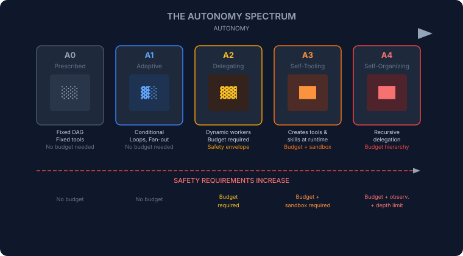
</p>
</p>

**Why this matters for design:**

**A0-A1 (Prescribed/Adaptive):** The workflow author defines everything. Agents execute a known plan. This is comparable to what LangGraph and CrewAI provide — but expressed declaratively.

**A2 (Delegating):** The manager agent decides *what work to do and who does it*. Workers are ephemeral — they exist only for the task. This is where AWP diverges from every other framework: the manager doesn't call functions, it *generates agent configurations at runtime*.

**A3 (Self-Tooling):** Agents create their own tools and skills during execution. A data scientist agent might create a `dynamic.normalize_timeseries` tool because no built-in tool fits the data shape. This capability doesn't exist in any other framework.

**A4 (Self-Organizing):** Workers can themselves become managers. A CEO agent delegates to department managers, who delegate to specialists. Budget flows hierarchically — each level receives a fraction of the parent's allocation.

### The Governance Gap

No other framework provides formal autonomy governance:

<p align="center">
<p align="center">
  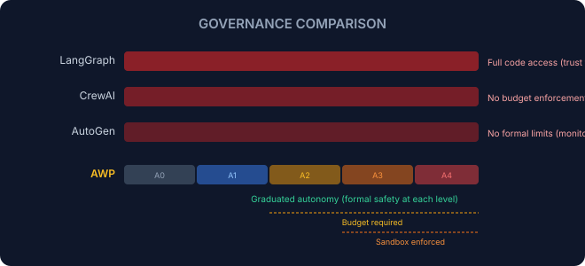
</p>
</p>

---

## 5. Runtime Capability Genesis: Tools & Skills from Nothing

This is AWP's most radical departure from the field. At A3 and above, agents don't just *use* tools — they *create* them.

### 5.1 The Problem

Traditional agent frameworks provide a fixed toolbox:

```python
# LangGraph / CrewAI / AutoGen pattern:
tools = [search_tool, calculator_tool, file_tool]
agent = Agent(tools=tools)  # Tools fixed at instantiation
```

This creates the **competence dilemma**: you either give agents too many tools (wasting context, increasing hallucination risk) or too few (limiting their problem-solving ability). Neither option is good.

### 5.2 AWP's Solution: Code Mode + Dynamic Tool Factory

AWP solves this with two mechanisms that work together:

<p align="center">
<p align="center">
  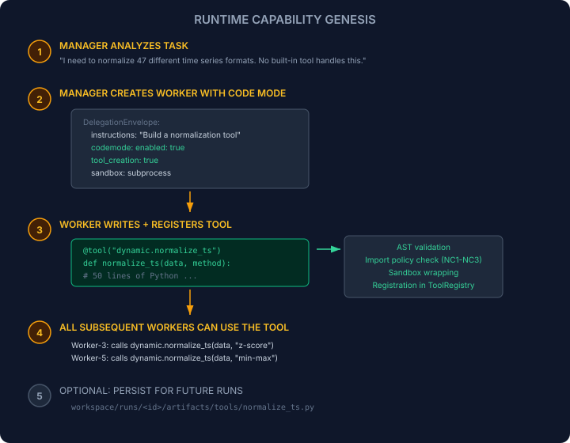
</p>
</p>

**Code Mode** is the paradigm shift. Instead of agents making dozens of individual tool calls (search, extract, transform, analyze — one LLM round-trip each), an agent writes a **complete Python program** and executes it in a single round-trip. For data-heavy tasks, this reduces LLM calls from 50+ to 3-5.

**Dynamic Tool Factory** validates and sandboxes agent-created tools:
- **AST analysis** ensures no forbidden imports (`os`, `subprocess`, `sys`, `ctypes`)
- **Capability gating** (NC1-NC3) controls what each namespace can access
- **Sandbox wrapping** ensures tools run within resource limits
- **Registry integration** makes tools available to all agents in the workflow

### 5.3 Skill Generation

Tools handle computation. Skills handle *knowledge*. An agent can generate a Markdown skill at runtime that captures domain expertise:

<p align="center">
<p align="center">
  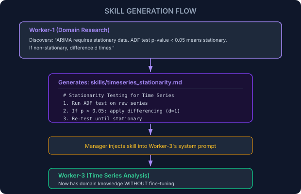
</p>
</p>

**No other framework supports runtime skill/knowledge generation.** CrewAI has "memory" but it's conversation history, not structured domain knowledge. LangGraph has no equivalent concept.

### 5.4 Why This Changes Everything

The combination of runtime tool creation and skill generation means AWP workflows are **self-improving within a single run**:

1. **Iteration 1:** Manager discovers the problem space
2. **Iteration 2:** Workers create specialized tools for the domain
3. **Iteration 3:** Workers create skills capturing discovered knowledge
4. **Iteration 4+:** Workers use both tools and skills to solve the actual problem — with capabilities that didn't exist 30 seconds ago

This is emergent specialization. The workflow adapts its own toolkit to the problem, rather than hoping the pre-defined tools are sufficient.

---

## 6. The Problem-Solving Paradigm

Most agent frameworks answer the question: *"How do I solve this problem?"* AWP asks a deeper question: *"What capability am I missing — and how do I build it?"*

This distinction defines three fundamentally different paradigms for AI problem-solving.

### 6.1 Three Paradigms of Agent Problem-Solving

<p align="center">
<p align="center">
  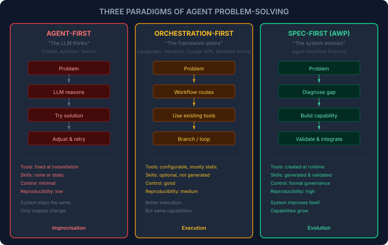
</p>
</p>

The difference is fundamental:
- **Agent-first** systems optimize *outputs*. The system stays the same; only the answers change.
- **Orchestration-first** systems optimize *execution*. The workflow is better, but the capabilities are static.
- **AWP** optimizes *the system itself*. Capabilities grow. Each run leaves the system more capable than before.

### 6.2 The Capability Evolution Loop

When AWP encounters a problem it cannot solve with existing tools, it doesn't just retry harder. It identifies what's missing, builds it, validates it, and integrates it — under strict governance.

<p align="center">
<p align="center">
  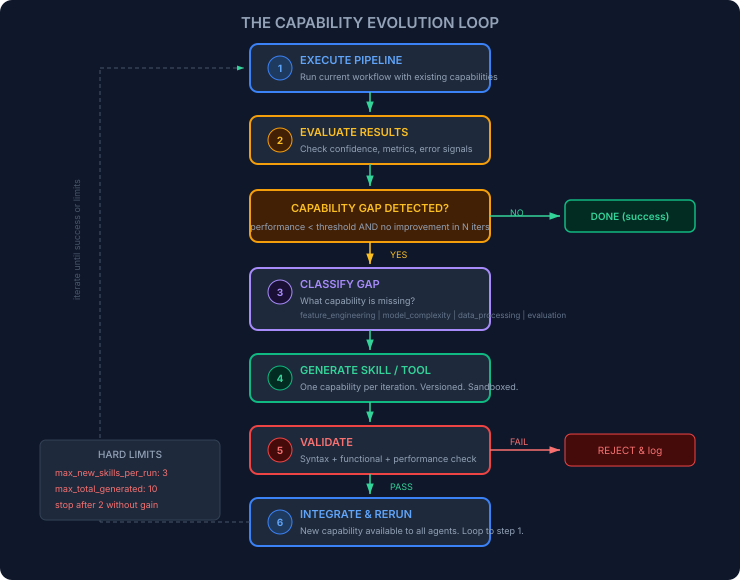
</p>
</p>

This is not a theoretical pattern. It's how AWP's delegation loop actually operates at A3+:

1. **Execute** — the manager runs workers against the current task
2. **Evaluate** — confidence scores and result quality are checked
3. **Detect gap** — if confidence stalls and no progress in N iterations, the system identifies a missing capability
4. **Classify** — is this a data processing gap? A feature engineering gap? A model complexity gap? An evaluation gap?
5. **Generate** — a worker creates exactly one new tool or skill, versioned and sandboxed
6. **Validate** — syntax check, functional test, performance comparison against baseline
7. **Integrate** — the new capability enters the ToolRegistry; all subsequent workers can use it
8. **Rerun** — the pipeline executes again, now with an expanded capability set

**Governance rules prevent runaway complexity:**
- Maximum 3 new skills per run (configurable)
- Stop generation after 2 consecutive skills with no metric improvement
- No overwriting existing skills — versioned only
- No duplicate functionality (similarity detection)
- All generated code must pass AST validation and sandbox wrapping

### 6.3 Why This Is a Paradigm Shift

The capability evolution loop creates a fundamentally different relationship between the system and the problem:

<p align="center">
<p align="center">
  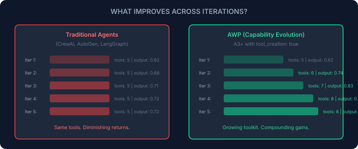
</p>
</p>

Traditional agents hit a ceiling because their capabilities are fixed. They can retry with different prompts, temperatures, or strategies — but the underlying toolkit doesn't change. When the problem requires a capability the agent doesn't have, it's stuck.

AWP breaks through that ceiling because each iteration can *expand what the system is capable of*. A generated tool persists. A generated skill compounds. The next iteration starts with a strictly larger capability set than the previous one.

**In one sentence:** Other frameworks optimize outputs. AWP optimizes the system that produces outputs.

### 6.4 Framework Comparison: Problem-Solving & Capability Evolution

| Capability | AWP | LangGraph | CrewAI | AutoGen | Google ADK | Google A2A | OpenAI Agents SDK | Bedrock Agents | Semantic Kernel | MetaGPT | Haystack |
|-----------|-----|-----------|--------|---------|------------|------------|-------------------|----------------|-----------------|---------|----------|
| **Structured problem decomposition** | Formal (delegation envelope) | Graph states | Role-based | Conversation | Code-first | N/A (protocol) | Handoff-based | Action groups | Planner-based | SOPs | Pipeline |
| **Deterministic decision flow** | Yes (rules + budget) | Partial (edges) | No | No | Partial | No | No | Partial | Partial | Partial | Yes |
| **Root cause analysis** | Gap classification (data/feature/model/eval) | No | No | No | No | No | No | No | No | No | No |
| **Runtime tool creation** | Yes (Dynamic Tool Factory + AST validation) | No | No (code only) | Emergent (code exec) | Possible | No | No | No | No | Artifacts | No |
| **Runtime skill generation** | Yes (Markdown skills + injection) | No | No | No | No | No | No | No | No | No | No |
| **Skill/tool validation** | 3-tier (syntax + functional + performance) | No | No | No | No | No | No | No | No | No | No |
| **Skill/tool governance** | Versioned, limits, duplicate detection | No | No | No | No | No | No | No | No | No | No |
| **Cumulative capability growth** | Yes (ToolRegistry persists across iterations) | No | No | No | No | No | No | No | No | No | No |
| **Controlled self-extension** | Budget + max_skills + stall detection | N/A | N/A | N/A | N/A | N/A | N/A | N/A | N/A | N/A | N/A |
| **Cross-vendor interop** | Protocol-level (YAML portable) | No | No | No | Gemini-centric | Yes (core purpose) | No | AWS-only | Microsoft-centric | No | No |
| **Reproducibility** | High (declarative + audit trail) | Medium | Low | Low | Medium | N/A | Low | Medium | Medium | Medium | High |

### 6.5 The External Skill Pattern

In AWP, the capability gap detection itself is implemented as a manager skill — not hardcoded into the orchestration engine. The manager receives a skill like `detect_capability_gap_and_propose_extension.md` that teaches it *when* and *how* to identify missing capabilities:

```yaml
# In the manager's delegation loop config:
worker_policy:
  manager_controlled:
    - instructions       # Manager decides what each worker does
    - skills             # Manager selectively forwards skills
    - tools_allowed      # Manager configures worker tools
    - codemode.enabled   # Manager enables code execution
    - codemode.tool_creation  # Manager enables tool creation
```

The manager doesn't contain hardcoded capability-detection logic. Instead:
1. The **skill** teaches the manager to recognize capability gaps
2. The **delegation loop** provides the iteration mechanism
3. The **budget system** enforces limits on self-extension
4. The **validation pipeline** ensures generated capabilities are safe

This keeps the manager slim, deterministic, and replaceable — while the complex gap-analysis logic lives in a modular, swappable skill file.

---

## 7. Solving Complex Problems: The Delegation Architecture

### 6.1 The Problem with Flat Orchestration

Most frameworks orchestrate agents in a flat structure:

<p align="center">
<p align="center">
  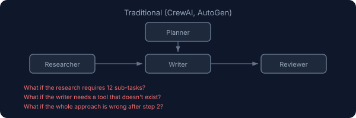
</p>
</p>

Flat orchestration breaks down when:
- The problem decomposes into an unknown number of sub-tasks
- Agents need capabilities that weren't anticipated
- The approach itself needs to change mid-execution
- Resource consumption must be bounded

### 6.2 AWP's Delegation Loop: Adaptive Problem-Solving

The delegation loop is a **feedback-driven orchestration pattern** that mirrors how expert teams actually work:

<p align="center">
<p align="center">
  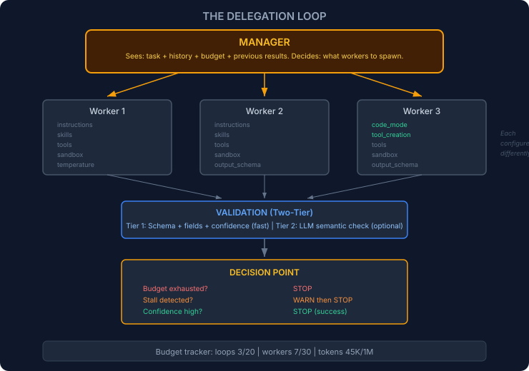
</p>
</p>

**Key differences from other frameworks:**

1. **Workers are ephemeral.** They don't persist between iterations. The manager creates fresh workers with new configurations each loop. This prevents accumulated context pollution.

2. **The manager generates configurations, not code.** The `DelegationEnvelope` is a structured specification — instructions, skills, tools, temperature, output schema — not a function call. This is why the declarative separation matters at execution time too.

3. **Two-tier validation catches both structural and semantic errors.** Deterministic checks (fast, free) catch malformed output. LLM validation (slow, costs tokens) catches *wrong* output. The system adaptively skips LLM validation when confidence is high or budget is low.

4. **Stall detection prevents infinite loops.** If the last N iterations show no confidence improvement above a threshold, the system warns and stops. No other framework has automatic stall detection.

5. **Budget is a first-class architectural concept.** Not an afterthought. Not a configuration option you might set. A *required* structural element at A2+.

### 6.3 Recursive Delegation (A4): Hierarchical Problem Decomposition

At A4, the architecture goes fractal. Workers can themselves become managers:

<p align="center">
<p align="center">
  
</p>
</p>

**Budget flows down, results flow up.** Each level receives a subset of the parent's budget. A department manager cannot spend more than the CEO allocated. This hierarchical budget enforcement is unique to AWP.

---

## 7. The Safety Architecture

Safety in AWP is not a feature — it's a structural property. Every design decision supports the principle: **safety scales with autonomy**.

### 7.1 Defense in Depth

<p align="center">
<p align="center">
  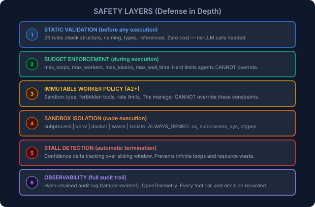
</p>
</p>

### 7.2 The Immutable Envelope

At A2+, the workflow author declares a **safety envelope** that the manager cannot modify:

```yaml
worker_policy:
  enforced:                          # IMMUTABLE — manager cannot override
    sandbox:
      type: subprocess
      max_memory_mb: 512
      network: false
    forbidden_tools:
      - shell.execute
      - file.write_outside_workspace
    rate_limiting:
      max_llm_calls_per_minute: 30

  manager_controlled:                # Manager CAN vary these per worker
    - instructions
    - skills
    - tools_allowed
    - temperature
    - output_contract
```

**Why this matters:** In frameworks like CrewAI or AutoGen, if an agent "goes rogue" (hallucinated tool calls, infinite loops, excessive API usage), there's no structural barrier. AWP's immutable policy means the *workflow definition* — not the runtime agent — sets the safety boundaries.

### 7.3 The Output Contract: Confidence as Universal Signal

Every agent in AWP must return a confidence score (0.0-1.0). This is not optional — it's validation rule R17:

<p align="center">
<p align="center">
  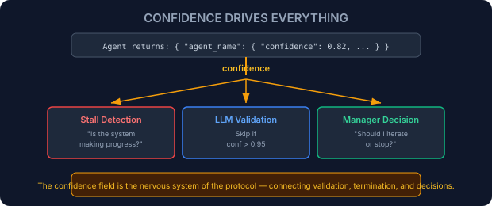
</p>
</p>

---

## 8. What Scientists Can Do Now

AWP was designed with a specific user in mind: the domain expert who needs multi-agent AI but shouldn't need to be a software engineer to use it. Here's what's now possible.

### 8.1 Three Lines to Multi-Agent Analysis

```python
from awp.data import AgentWorkflow
import pandas as pd

result = AgentWorkflow(
    inputs={"data": pd.read_csv("experiment_results.csv")},
    task="Identify statistically significant patterns and generate publication-ready visualizations",
    model="openrouter/anthropic/claude-sonnet-4",
).run()
```

Behind these three lines, the system:
1. Creates a delegation loop with a manager agent
2. The manager analyzes the data shape and creates specialized workers
3. Workers run statistical tests, create visualizations, write interpretations
4. Results are validated, aggregated, and returned

**No YAML. No agent configuration. No tool setup.** The `AgentWorkflow` API is a zero-configuration entry point that creates an A4 delegation loop internally.

### 8.2 Research Workflows That Were Previously Impossible

<p align="center">
<p align="center">
  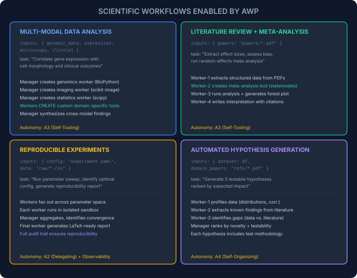
</p>
</p>

### 8.3 The Jupyter Integration

AWP's `AgentWorkflow` API is designed for notebook-first workflows:

```python
# Cell 1: Load data
import pandas as pd
df = pd.read_csv("measurements.csv")
df.head()

# Cell 2: Run multi-agent analysis
from awp.data import AgentWorkflow

result = AgentWorkflow(
    inputs={"measurements": df, "sensor_layout": "layout.png"},
    task="Detect anomalies in sensor readings, correlate with spatial layout, suggest root causes",
    max_loops=10,
    max_total_tokens=500_000,
    code_mode=True,
    tool_creation=True,
    verbose=True,      # Stream progress to notebook
).run()

# Cell 3: Inspect results
print(result["final_answer"])

# Cell 4: Use generated artifacts
# AWP saves all generated code, tools, and visualizations to workspace/
!ls workspace/outputs/
```

**Key insight:** The `code_mode=True` + `tool_creation=True` flags enable the full self-tooling capability. Without YAML, without configuration, a scientist in a Jupyter notebook gets the same A3+ capabilities that the full protocol provides.

---

## 9. From Abstract Idea to Running System

Let's trace the journey of a single idea — "analyze this data" — from abstract intention through every architectural layer to concrete execution.

### 9.1 The Full Stack: Idea to Execution

<p align="center">
<p align="center">
  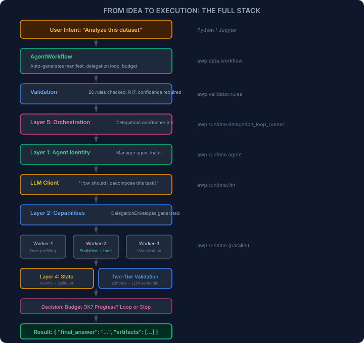
</p>
</p>

### 9.2 Concrete Example: Financial Time Series

Let's follow a real workflow through the system:

**Input:**
```python
result = AgentWorkflow(
    inputs={"prices": pd.read_csv("stock_prices.csv")},
    task="Identify regime changes, compute risk metrics, forecast next 30 days",
    max_loops=8,
    code_mode=True,
    tool_creation=True,
).run()
```

**Iteration 1 — Manager analyzes:**
```
Manager sees: DataFrame with columns [date, open, high, low, close, volume]
Manager decides: Need 3 workers
  Worker-1: "Profile the data — distributions, stationarity, seasonality"
  Worker-2: "Detect structural breaks using CUSUM or Bai-Perron"
  Worker-3: "Compute VaR, CVaR, Sharpe, max drawdown"
```

**Iteration 2 — Workers execute:**
```
Worker-1: Runs ADF test → non-stationary. Computes returns → stationary.
          Creates skill: "Use log returns, not raw prices, for all analysis"
          confidence: 0.91

Worker-2: Needs Bai-Perron test → no built-in tool.
          Creates tool: dynamic.structural_breaks(series, max_breaks=5)
          Finds 3 regime changes at dates [2024-03, 2024-08, 2025-01]
          confidence: 0.85

Worker-3: Computes VaR(95%)=-2.3%, CVaR=-3.1%, Sharpe=1.4
          confidence: 0.93
```

**Iteration 3 — Manager synthesizes:**
```
Manager sees: All results, confidence > 0.85
Manager decides: Need forecast worker using regime-aware model
  Worker-4: "Forecast using regime-switching model. Use the structural
             breaks from Worker-2. Use log returns per Worker-1's skill."
  Worker-4 receives: Worker-1's skill + Worker-2's tool + all results
```

**Iteration 4 — Final worker:**
```
Worker-4: Uses dynamic.structural_breaks tool (created by Worker-2!)
          Applies regime-switching ARIMA
          Generates forecast plot → workspace/outputs/forecast.png
          confidence: 0.88

Manager: All tasks complete. Aggregate confidence: 0.89. STOP.
```

**Total: 4 iterations, 7 workers, ~180K tokens. Budget: well within limits.**

### 9.3 The Architecture Map

Here is how the packages, layers, and runtime components relate:

<p align="center">
<p align="center">
  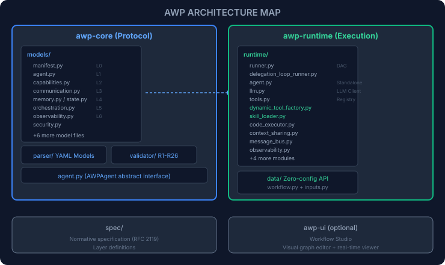
</p>
</p>

---

## 10. Conclusion: The Insight

The journey through AWP's architecture reveals a single organizing principle:

**Declare what you want. Let the system figure out how.**

This is not a new idea — it's the principle behind SQL, Kubernetes, Terraform, and every successful declarative system. But it hadn't been applied to multi-agent AI orchestration until AWP.

The consequences compound:

1. **Because** the workflow is declarative, it can be validated before execution → 26 rules catch errors for free.
2. **Because** validation exists, the runtime can trust the structure → it can safely grant agents more autonomy.
3. **Because** agents have more autonomy, they can create tools and skills → emergent capability genesis.
4. **Because** capability genesis exists, workflows solve problems their authors didn't anticipate → true adaptivity.
5. **Because** adaptivity is powerful, it must be bounded → formal budget and safety architecture.
6. **Because** safety is structural (not optional), the system scales → from 3-line scripts to recursive delegation hierarchies.

Each step enables the next. Remove any one, and the chain breaks.

This is the insight: **the right constraints create freedom.** A budget isn't a limitation — it's what makes autonomous delegation safe enough to deploy. A validation rule isn't bureaucracy — it's what lets you trust agent output enough to feed it to other agents. A sandbox isn't restriction — it's what makes runtime tool creation possible.

Other frameworks give you either safety or freedom. AWP gives you both — because it understands they're the same thing.

---

<p align="center">
  <a href="overview.md">Overview</a> &middot;
  <a href="layer-model.md">7-Layer Model</a> &middot;
  <a href="orchestration.md">Orchestration</a> &middot;
  <a href="tools.md">Tools</a> &middot;
  <a href="../README.md">Back to README</a>
</p>
