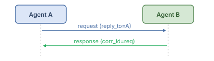
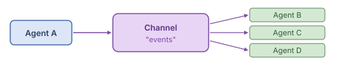
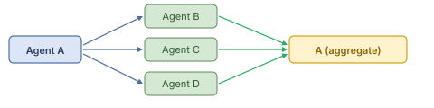

# Communication Reference

## Mental Model

Layer 3 is the **out-of-band nervous system** of an AWP workflow. Where the [orchestration](orchestration.md) graph defines *predictable* data flow ("agent A's output reaches agent B because B `depends_on` A"), communication exists for the cases the DAG cannot express: real-time notifications, dynamic peer-to-peer routing, request/response patterns between unrelated agents, and broadcast events that any subscriber may pick up.

Conceptually, communication sits **next to** orchestration, not under it. The DAG is the spine; the message bus is the lateral wiring. Most A0/A1 workflows can ignore this layer entirely. It becomes important when (a) agents need to react to events emitted by peers, (b) workers in the [delegation loop](ORCHESTRATION_ENGINES.md) need to coordinate without going through the manager, or (c) you want to integrate AWP with external systems via Kafka/NATS/Redis.

The layer is designed around three primitives: a **bus** (transport), **channels** (named topics with ACLs and schemas), and a strict **message envelope** (the only thing that goes on the wire). All three are wired into [security](security.md) (channel ACLs, payload redaction) and [observability](observability.md) (every message carries a `trace_id` and is countable via `awp.bus.messages`).

Communication is configured in the `communication` section of [workflow.awp.yaml](manifest.md).

## When to Use Communication vs State Sharing

- **State sharing** (Layer 4) is the primary mechanism for passing data between agents in the DAG. It is implicit -- the orchestrator manages it based on `depends_on` and `share_output`.
- **Communication** (Layer 3) is for messaging outside the DAG: real-time notifications, dynamic routing, request-response patterns between agents that do not have a direct DAG dependency.

Use communication when agents need to collaborate dynamically rather than following a fixed execution order.

## Message Bus

The `communication.bus` section configures the message transport.

### Fields

| Field | Type | Required | Default | Description |
|-------|------|----------|---------|-------------|
| `type` | string | Yes | -- | Bus implementation: `"internal"`, `"redis"`, `"nats"`, `"kafka"`, or `"rabbitmq"`. |
| `persistence` | boolean | No | `false` | Whether messages are persisted to durable storage. |
| `max_message_size` | integer | No | `65536` | Maximum message size in bytes. |
| `delivery` | string | No | `"at_least_once"` | Delivery guarantee: `"at_most_once"`, `"at_least_once"`, or `"exactly_once"`. |
| `ordering` | string | No | `"fifo"` | Message ordering: `"fifo"`, `"causal"`, or `"none"`. |
| `connection` | object | No | -- | Connection configuration for external bus implementations. |

### Bus Type: `internal`

The default in-process message bus. All AWP-conformant runtimes must support this type.

- Messages are stored in memory for the duration of the run.
- Delivery guarantee is `at_least_once`.
- Ordering is `fifo` per channel.
- Messages are discarded when the run completes unless `persistence` is `true`.

### External Bus Types

External buses (`redis`, `nats`, `kafka`, `rabbitmq`) require a `connection` object:

| Field | Type | Required | Description |
|-------|------|----------|-------------|
| `connection.url` | string | Yes | Connection URL or endpoint. |
| `connection.auth` | object | No | Authentication credentials. Must be marked sensitive. |
| `connection.options` | object | No | Provider-specific connection options. |

## Channels

The `communication.channels` section defines named communication channels.

### Channel Definition

| Field | Type | Required | Default | Description |
|-------|------|----------|---------|-------------|
| `name` | string | Yes | -- | Unique channel name within the workflow. |
| `type` | string | Yes | -- | `"direct"`, `"broadcast"`, `"topic"`, or `"request_response"`. |
| `participants.publishers` | list | No | `["*"]` | Agent IDs that may publish. `"*"` means all agents. |
| `participants.subscribers` | list | No | `["*"]` | Agent IDs that may subscribe. `"*"` means all agents. |
| `schema` | object | No | -- | JSON Schema for message content validation. |
| `acl` | object | No | -- | Fine-grained access control list. |

### Channel Types

#### `direct`

Point-to-point messaging between two specific agents.

- The sender must specify the recipient agent ID in the `to` field.
- Only the designated recipient receives the message.

#### `broadcast`

One-to-many messaging where all subscribers receive every message.

- The sender publishes to the channel.
- All agents listed in `participants.subscribers` receive the message.

#### `topic`

Topic-based publish-subscribe with filtering.

- Messages include `metadata.tags` for topic matching.
- Subscribers may filter messages based on tags.

#### `request_response`

Synchronous-style request-response communication.

- The sender sends a request and waits for a response.
- The `reply_to` field must be set to a unique correlation address.
- The responder must set `correlation_id` to match the request's `id`.
- The runtime should enforce a timeout for responses.

## Message Envelope

Every message on the bus must conform to the AWP Message Envelope format.

### Envelope Fields

| Field | Type | Required | Description |
|-------|------|----------|-------------|
| `id` | string | Yes | Unique message identifier (UUID v7, time-ordered). |
| `timestamp` | string | Yes | ISO 8601 timestamp (UTC). |
| `version` | string | Yes | Envelope schema version. Must be `"1.0"`. |
| `from` | string | Yes | Agent ID of the sender. |
| `to` | string | Yes | Recipient agent ID, channel name, or `"*"` for broadcast. |
| `channel` | string | No | Channel name, if sent via a named channel. |
| `reply_to` | string | No | Address for responses. Required for `request_response`. |
| `type` | string | Yes | `"request"`, `"response"`, `"event"`, `"error"`, or `"ack"`. |
| `correlation_id` | string | No | ID of the message this is responding to. Required for `type: "response"`. |
| `content_type` | string | No | MIME type. Default: `"application/json"`. |
| `content` | any | Yes | The message payload. |
| `metadata` | object | No | Additional metadata. |

### Metadata Fields

| Field | Type | Default | Description |
|-------|------|---------|-------------|
| `metadata.priority` | string | `"normal"` | `"low"`, `"normal"`, `"high"`, or `"critical"`. |
| `metadata.ttl` | integer | -- | Time-to-live in seconds. Expired messages should be discarded. |
| `metadata.requires_ack` | boolean | `false` | Whether the sender expects an acknowledgment. |
| `metadata.trace_id` | string | -- | Distributed tracing ID for correlation with [observability](observability.md). |
| `metadata.tags` | list | -- | Topic tags for filtering in `topic` channels. |

### Envelope Example

```json
{
  "id": "01912f3e-7b6c-7def-8abc-1234567890ab",
  "timestamp": "2026-03-23T14:30:00.000Z",
  "version": "1.0",
  "from": "research_analyst",
  "to": "report_writer",
  "channel": "research_results",
  "type": "event",
  "content_type": "application/json",
  "content": {
    "topic": "quantum computing",
    "findings": [
      {"title": "Recent advances", "summary": "...", "confidence": 0.92}
    ]
  },
  "metadata": {
    "priority": "normal",
    "ttl": 3600,
    "requires_ack": false,
    "trace_id": "abc123def456",
    "tags": ["research", "quantum"]
  }
}
```

## Communication Patterns

### Request-Response

Synchronous-style interaction between two agents.

  

- The requester sets `type: "request"` and `reply_to`.
- The responder sets `type: "response"` and `correlation_id` matching the request `id`.
- The runtime should enforce a configurable timeout.

### Publish-Subscribe

One-to-many event distribution.

  

- The publisher sets `to` to the channel name.
- All subscribers receive the message.
- No response is expected.

### Pipeline

Sequential message passing through a chain of agents.

  

Each agent receives output from the previous agent. This pattern is typically implemented via the DAG in [orchestration](orchestration.md) but may also use the message bus for dynamic routing.

### Scatter-Gather

Fan-out a request to multiple agents, then aggregate responses.

  

- The coordinator sends requests to multiple agents.
- Each target responds independently.
- The coordinator collects responses with a configurable timeout.

## Complete Example

```yaml
communication:
  bus:
    type: internal
    persistence: true
    max_message_size: 131072
    delivery: at_least_once
    ordering: fifo

  channels:
    - name: research_results
      type: direct
      participants:
        publishers:
          - research_analyst
        subscribers:
          - report_writer
      schema:
        type: object
        required:
          - topic
          - findings
        properties:
          topic:
            type: string
          findings:
            type: array
            items:
              type: object

    - name: status_updates
      type: broadcast
      participants:
        publishers:
          - "*"
        subscribers:
          - "*"

    - name: review_requests
      type: request_response
      participants:
        publishers:
          - report_writer
        subscribers:
          - quality_reviewer

    - name: domain_events
      type: topic
      participants:
        publishers:
          - "*"
        subscribers:
          - research_analyst
          - report_writer
```

## Processing Rules

1. A runtime implementing Layer 3 must support the `internal` bus type.
2. External bus types are optional; a runtime may support any subset.
3. The runtime must validate that `from` matches the agent actually sending the message.
4. The runtime must enforce channel ACLs: messages from unauthorized publishers must be rejected.
5. If `schema` is defined on a channel, the runtime must validate `content` against the schema before delivery. See [R15](validation.md).
6. Messages with expired `metadata.ttl` should be discarded rather than delivered.
7. When `metadata.requires_ack` is `true`, the runtime should track acknowledgment and notify the sender on timeout.
