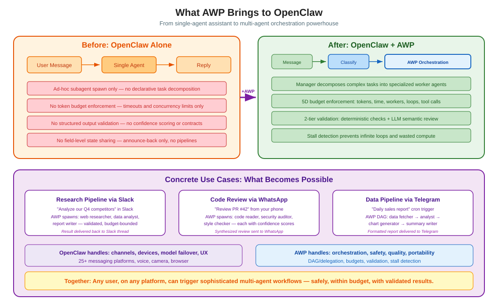
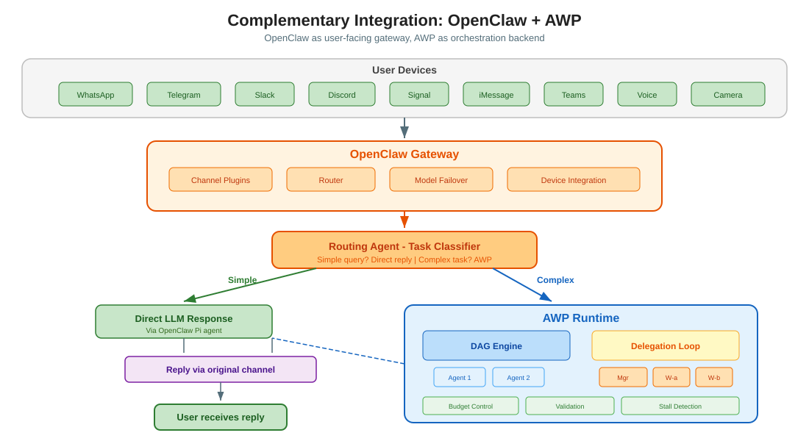
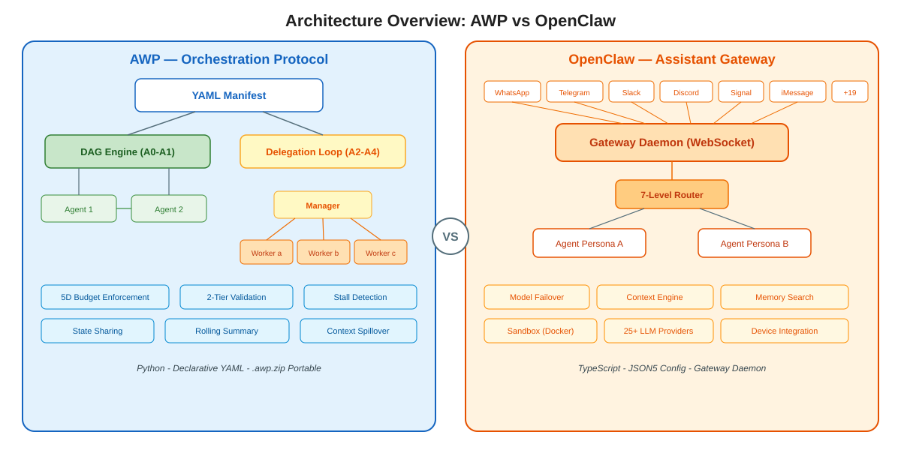
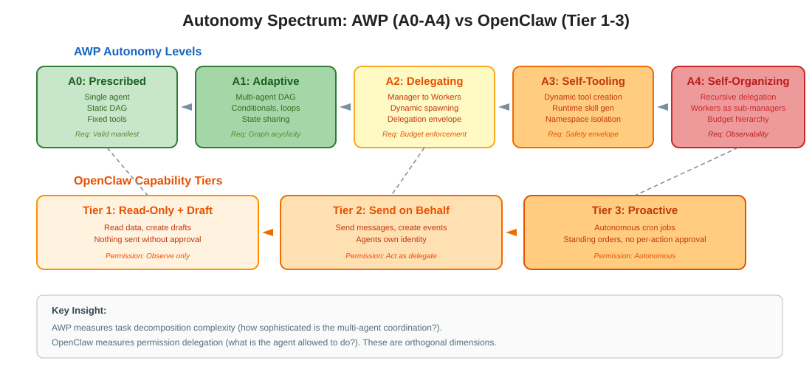
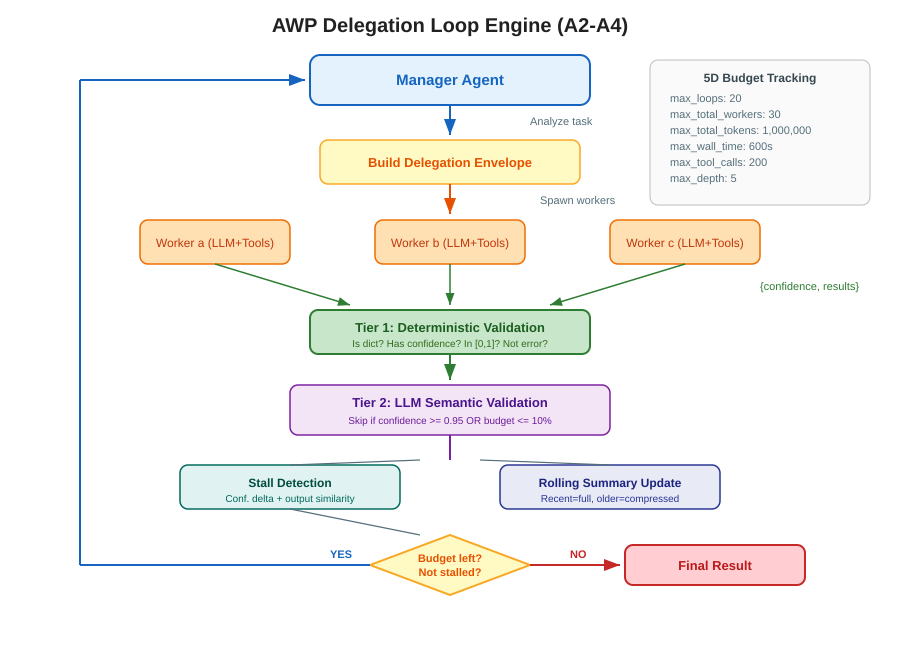
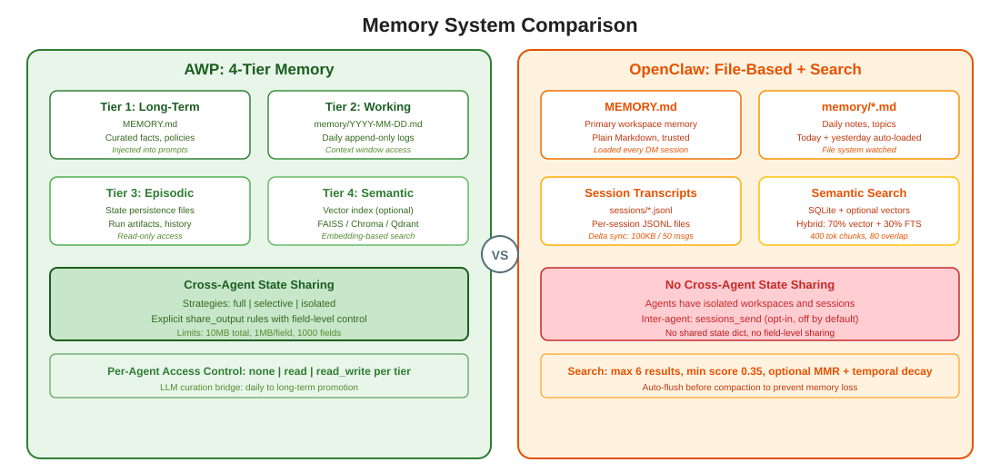
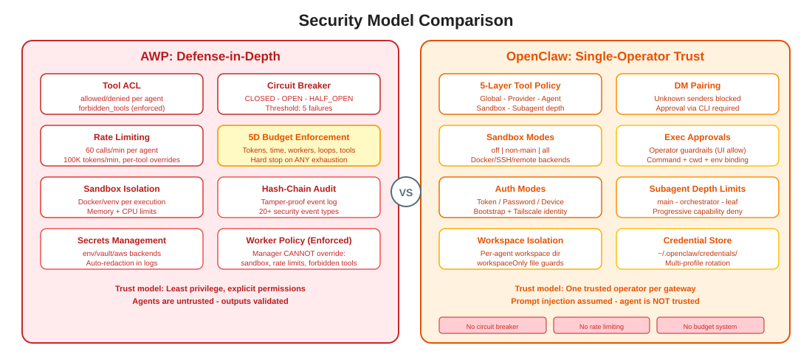

# How to Give OpenClaw a Real Brain

> **OpenClaw has the best nervous system in open source — 25+ channels, 25+ providers, device integration. But it's missing a brain. AWP is that brain.**

[OpenClaw](https://github.com/openclaw/openclaw) is the most connected AI assistant gateway out there. It reaches users on WhatsApp, Telegram, Slack, Discord, Signal, iMessage, Teams, and 19 more platforms. It manages 25+ LLM providers with failover. It integrates cameras, voice, screens, and location. It is, without question, the best open-source **nervous system** for AI assistants.

But a nervous system without a brain can only do one thing: **relay signals.** Every message goes in, one LLM call happens, one response comes back. That is not thinking. That is a reflex.

AWP gives OpenClaw the ability to actually **think** — to decompose problems, coordinate specialists, validate results, control costs, and most critically: **to build its own tools at runtime.** A brain that can only use pre-installed tools is limited to what its creators anticipated. A brain that can create new tools on the fly can adapt to any task it encounters. That is the real differentiator.

---

## 1. The Problem: OpenClaw Hits a Ceiling on Complex Tasks

OpenClaw routes each message to one agent. That agent makes one LLM call and returns the result. For simple tasks — answering questions, drafting messages, quick lookups — this is perfect. OpenClaw can also spawn subagents (up to depth 5) with an orchestrator pattern, and it has tool-loop detection to catch repetitive tool calls. These are real capabilities.

But for genuinely complex tasks — multi-step pipelines, parallel research, iterative refinement — OpenClaw's ad-hoc subagent spawning hits its limits. There is no declarative workflow definition, no structured state sharing between agents, no output validation with confidence scoring, and no multi-dimensional budget enforcement:

| Task | What It Actually Requires | OpenClaw Alone | OpenClaw + AWP |
|------|--------------------------|----------------|----------------|
| "Analyze our competitors and write a strategy report" | Web research, data analysis, chart generation, report writing — 4 distinct skill sets | One agent (or ad-hoc subagents) attempts all without structured state flow between steps. No output validation, no token budget. | Manager decomposes into 4 specialized workers with explicit state sharing. Each validated. Budget-capped at 500K tokens. |
| "Review this PR for security issues, code quality, and performance" | Security auditing, style analysis, performance profiling — 3 independent evaluations | Agent can spawn subagents, but results flow back via announce — no structured merge, no confidence scoring. | DAG fans out to 3 parallel reviewers, fans in with merge strategy. Each produces confidence scores. |
| "Build a daily sales dashboard from our API data" | Data fetching, cleaning, statistical analysis, visualization, summary writing — 5-step pipeline | No pipeline concept. Subagents work in isolated sessions — each step cannot build on the previous step's structured output. | DAG pipeline: fetcher → cleaner → analyst → visualizer → writer. Each step's output flows to the next via `share_output`. |
| "Research 20 companies and rank them by growth potential" | 20 parallel research tasks, then aggregation and ranking | Can spawn subagents (maxChildrenPerAgent: 5-20) but no declarative fan-out/fan-in, no merge strategies, no token budget. | Declarative fan-out to 20 parallel workers. Fan-in with reduce strategy. Budget prevents runaway costs. |
| "Investigate why our API latency spiked, check logs, metrics, and recent deploys" | Log analysis, metrics correlation, deploy diff review, root cause synthesis | Subagent orchestrator pattern can handle this to some extent — but without structured state sharing, budget hierarchy, or formal validation. | Delegation loop with parallel investigators. Manager validates findings, re-dispatches on low confidence. Budget-bounded. |

**The pattern**: OpenClaw has the building blocks for multi-agent work (subagent spawn, tool-loop detection, timeouts). But it lacks the **formal orchestration layer** — declarative workflows, structured state sharing, output validation, and multi-dimensional budget enforcement — that makes complex tasks reliable and predictable. AWP provides exactly this layer.

---

## 2. The Brain: How AWP Turns Reflexes Into Thinking

### 2.1 The Architecture

Think of it like this: OpenClaw is the **nervous system** — it senses (channels), moves (devices), and communicates (messaging). AWP is the **brain** — it plans (task decomposition), delegates (worker agents), evaluates (validation), and learns when to stop (budget + stall detection).

Simple reflexes still go through OpenClaw directly — no overhead for a weather check. But when a task requires actual thinking, AWP takes over.

<p align="center">
  
</p>

### 2.2 How the Brain Works — Step by Step

**Step 1: Reflex or Thought?**

When a message arrives, the first decision is: does this need thinking? A lightweight classification checks whether the task requires multiple skills, intermediate artifacts, or parallel execution. "What's the weather?" is a reflex. "Analyze our competitors and write a strategy" requires a brain.

**Step 2: The Brain Plans**

For tasks that require thinking, AWP's manager agent plans the approach — like a prefrontal cortex deciding how to tackle a problem:

- **DAG Engine** for tasks with clear structure: "first research, then analyze, then write" — like following a recipe
- **Delegation Loop** for tasks where the plan itself is unclear: "investigate this problem, see what you find, then dig deeper" — like exploring unknown territory

**Step 3: Specialists Execute**

AWP spawns specialized ephemeral workers — each with its own model, tools, instructions, and output contract. This is the key difference: instead of one generalist agent fumbling through everything, you get a team of specialists.

Every worker result passes through the brain's quality filters:
- Deterministic checks (is it structured? does it have a confidence score?) catch garbage instantly
- LLM semantic checks (does this actually answer the question?) catch subtle failures
- Stall detection (is the worker going in circles?) prevents wasted compute

The 5-dimensional budget system ensures the brain never overthinks — hard limits on tokens, time, workers, loops, and tool calls. OpenClaw has timeouts and concurrency caps, but no token-level cost control or multi-dimensional budget enforcement.

**Step 4: One Clean Result**

The synthesized result flows back to OpenClaw, which delivers it through the original channel. The user sees one polished reply. They do not know — and do not need to know — that a team of 5 specialists collaborated behind the scenes.

### 2.3 The Real Brain: Runtime Tool and Skill Generation

Task decomposition and budget control are important. But the feature that truly makes AWP a **brain** — not just a scheduler — is **runtime tool creation**. This is the A3 capability, and it changes what is fundamentally possible.

#### The Problem With Fixed Tools

Every AI assistant — OpenClaw included — ships with a fixed set of tools: file read/write, web search, code execution, browser automation. When a user asks for something that does not fit these tools, the assistant is stuck. It can try to hack together an answer with what it has, but it cannot create the tool it actually needs.

This is like a brain that can only use its hands. Useful, but limited. A real brain also builds hammers, telescopes, and calculators — tools that extend what it can do.

#### How AWP Workers Create Tools at Runtime

When a manager delegates with `codemode.tool_creation: true`, the worker can do something no OpenClaw agent can: **write a Python function, register it as a new tool, and make it available to itself and other workers** — all within the same workflow run.

**How it works in practice:**

1. The manager dispatches a worker with tool creation enabled
2. The worker analyzes the task, realizes it needs a custom scoring function (or API client, or data transformer, or anything)
3. The worker writes the tool as a Python `handler()` function and returns it in `tools_created`
4. AWP's `DynamicToolFactory` validates the code via AST analysis — checking for banned imports, namespace compliance, and structural correctness
5. The tool is registered in the `ToolRegistry` and becomes callable by any worker in the workflow
6. Subsequent workers use the tool as if it were built-in — they call it by name, pass parameters, get results

**What makes this safe:**

Every dynamically created tool runs in a **subprocess sandbox** with strict guardrails:

- **Import restrictions by sandbox type**: `os`, `subprocess`, `sys`, `ctypes`, `importlib`, `signal`, and `multiprocessing` are ALWAYS denied — they cannot be unlocked by any capability or configuration
- **Namespace isolation**: Workers can only create tools in their declared namespace (e.g., `scoring.*`, `api_client.*`). Reserved namespaces like `web`, `file`, `shell` are blocked
- **Capability-based import policies**: A namespace declared with `capabilities: ["network"]` unlocks `requests` and `httpx`. A namespace with `capabilities: ["compute"]` only gets standard library math. Each namespace has its own import allowlist
- **Secret injection without exposure**: If a tool needs an API key, it declares `required_secrets: ["API_KEY"]`. The factory injects only the declared keys into the sandbox as `_secrets` — the LLM never sees the actual values, and the tool only gets keys it explicitly requested
- **Per-worker limits**: Max 10 tools per worker, max 50 globally. Tools cannot exceed these limits
- **AST validation before execution**: Code is parsed, not executed, during validation. Denied imports are caught before the tool ever runs
- **Fresh subprocess per call**: Each tool invocation runs in a new subprocess — no persistent state, no cross-tool memory leaks, 10-second timeout

#### Why This Is the Real Differentiator

Consider what this means for an OpenClaw + AWP integration:

**User sends via Slack**: *"Calculate the Sharpe ratio for these 5 ETFs over the last 3 years and rank them."*

OpenClaw alone has no "calculate Sharpe ratio" tool. The agent would try to compute it in a single LLM response — probably getting the math wrong, and definitely not pulling real data.

With AWP:

1. The manager identifies that no built-in tool can calculate Sharpe ratios
2. It dispatches a **tool builder** worker with `codemode.tool_creation: true` and `capabilities: ["compute", "network"]`
3. The tool builder creates two tools:
   - `finance.fetch_prices` — uses `requests` to pull historical price data from a financial API (with the API key injected via `_secrets`)
   - `finance.sharpe_ratio` — calculates the Sharpe ratio from a price series using standard library `math`
4. AWP validates both tools (AST check, import policy check, namespace check) and registers them
5. The manager dispatches a **data analyst** worker that calls `finance.fetch_prices` for each ETF, then `finance.sharpe_ratio` on each result
6. A **report writer** worker formats the rankings into a clean comparison table

The system **adapted to the task**. It did not have a Sharpe ratio tool before this request. Now it does. And those tools ran in sandboxed subprocesses with only the imports and secrets they needed — no more.

**This is what a brain does that a nervous system cannot**: it encounters an unfamiliar problem and builds the cognitive tools to solve it.

#### What OpenClaw Has vs. What AWP Adds

| Capability | OpenClaw | AWP (A3+) |
|-----------|----------|-----------|
| **Built-in tools** | 30+ categories (bash, files, browser, messaging, media) | code.execute, web.search, file.* |
| **Tool customization** | Skills (pre-configured, JSON5) | Dynamic tool creation at runtime |
| **Runtime adaptation** | Fixed tool set — agent must work with what exists | Workers create Python tools on the fly |
| **Tool safety** | 5-layer allow/deny policy | AST validation + import policies + namespace isolation + subprocess sandbox |
| **Secret handling in tools** | Credential store + env vars | Declarative `required_secrets` — only requested keys injected, LLM never sees values |
| **Tool reuse across agents** | Each agent has its own tool access | Created tools available to all workers in the workflow |
| **Tool persistence** | Skills persist across sessions | Optional persistence to workspace (tools can outlive the worker that created them) |

OpenClaw has more built-in tools. But its tools are **static** — they are what they are. AWP has fewer built-in tools, but it can **create new ones at runtime**. This is the difference between a toolbox and a workshop.

---

### 2.4 What a Brain Makes Possible — Five Real Scenarios

#### Scenario A: Enterprise Research Pipeline via Slack

A product manager types in Slack: *"Compare our pricing against the top 5 competitors in the European market. Include market share data and a recommendation."*

**Without AWP**: OpenClaw's agent produces a surface-level response from a single LLM call. No real data, no structured comparison, no confidence in the numbers.

**With AWP**: The message flows through OpenClaw to an AWP delegation loop:

1. The **manager** analyzes the request and identifies 3 work streams
2. A **market researcher** worker uses `web.search` to find pricing data for each competitor — producing structured findings with sources and a confidence score of 0.87
3. A **data analyst** worker receives the researcher's findings (via `share_output`), cross-references market share databases, runs statistical comparisons, and produces charts — confidence 0.91
4. A **strategy writer** worker receives both the findings and analysis, synthesizes a recommendation with risk assessment — confidence 0.94
5. The manager validates each output (Tier 1: structured? Tier 2: relevant?), detects that the researcher's initial confidence was low, re-dispatches with refined instructions, gets 0.93 on retry
6. Total cost: 180K tokens (budget was 500K). Wall time: 45 seconds (budget was 300s). 4 workers spawned (budget was 20).

The formatted report arrives in the Slack thread. The product manager has a structured comparison they can take into their next meeting — not a generic LLM ramble.

#### Scenario B: Multi-Stage Code Review via WhatsApp

A developer on the go sends from WhatsApp: *"Review PR #247 — focus on security and performance."*

**Without AWP**: OpenClaw's agent reads the PR diff (if it even has access) and provides a single-pass review. It cannot deeply analyze both security and performance in one context window — one or both will be shallow.

**With AWP**: AWP sets up a parallel DAG:

1. **Code reader** worker fetches the full PR diff and file context
2. Three parallel workers receive the code reader's output:
   - **Security auditor**: checks for injection vulnerabilities, auth bypasses, secret leaks — confidence 0.96
   - **Performance profiler**: identifies N+1 queries, unnecessary allocations, missing caching — confidence 0.89
   - **Architecture reviewer**: checks for design pattern violations, API contract breaks — confidence 0.92
3. **Synthesis writer** receives all three reviews, merges them into a structured report with severity ratings
4. Fan-in strategy: `merge` (combine all findings, deduplicate)

The developer gets a comprehensive review on their phone — three specialist perspectives merged into one actionable document. Each finding has a confidence score so they know what to prioritize.

#### Scenario C: Automated Daily Intelligence Brief via Telegram

An executive's OpenClaw cron job fires every morning at 7:00 AM, triggering an AWP workflow:

1. **News scanner** worker searches for industry news, regulatory changes, and competitor announcements from the last 24 hours
2. **Relevance filter** worker receives all articles and scores each one by relevance to the company's strategic priorities (loaded from long-term memory)
3. **Impact analyst** worker takes the top 10 most relevant items and assesses business impact — categorized as opportunity, threat, or informational
4. **Brief writer** worker synthesizes everything into a 500-word executive summary with action items

Every morning, a crisp intelligence brief appears in the executive's Telegram. The pipeline runs within a budget of 200K tokens and 120 seconds. If the news scanner finds nothing relevant, the workflow short-circuits via conditional execution — no wasted compute.

#### Scenario D: Parallel Investigation via Discord

A DevOps engineer messages Discord: *"Our API latency spiked 3x in the last hour. Figure out why."*

This is a delegation loop task — the investigation requires multiple parallel lines of inquiry:

1. **Investigation manager** dispatches three parallel workers:
   - **Log analyst** searches recent application logs for errors and anomalies — confidence 0.78
   - **Metrics analyst** queries Prometheus/Grafana for correlated metric changes — confidence 0.82
   - **Deploy analyst** checks recent deployments and config changes — confidence 0.97
2. The manager sees the log analyst's low confidence and re-dispatches with refined instructions: "Focus specifically on database connection timeouts." Second attempt: confidence 0.91
3. The manager synthesizes all three findings: *"Root cause: connection pool size was reduced from 50 to 10 in deployment #1842 at 14:23 UTC. This caused connection starvation under normal load, resulting in database timeouts that cascaded into API latency."*
4. Stall detection ensured the investigation didn't loop indefinitely. Total cost: 280K tokens (budget was 500K). 5 workers spawned across 3 iterations.

The key difference to OpenClaw's subagent approach: the manager **validates** each investigator's output (is it structured? does it actually address the question?), can **re-dispatch** on low confidence, and the entire investigation is **budget-bounded**.

#### Scenario E: Creative Multi-Media Production via iMessage

A marketing lead sends from iMessage: *"Create social media content about our new product launch — I need copy for Twitter, LinkedIn, and Instagram, plus a blog post."*

**Without AWP**: OpenClaw generates all four pieces of content in one LLM call. They sound similar, lack platform-specific optimization, and nobody reviewed them.

**With AWP**: A delegation loop with platform-specialized workers:

1. **Product researcher** worker reviews the product documentation and extracts key features, differentiators, and target audience segments — shares output with all writers
2. **Twitter copywriter** worker creates 5 tweet variations optimized for engagement (character limits, hashtag strategy, hook patterns) — confidence 0.91
3. **LinkedIn writer** worker produces professional thought-leadership content with industry context — confidence 0.88
4. **Instagram copywriter** worker creates visual-first captions with emoji strategy and CTA optimization — confidence 0.93
5. **Blog writer** worker produces a 1,000-word launch announcement with SEO considerations — confidence 0.90
6. **Editorial reviewer** (Tier 2 validation) checks brand voice consistency across all pieces and flags the LinkedIn post for being too generic — manager re-dispatches with refined instructions
7. Final LinkedIn version: confidence 0.94

Five pieces of content, each optimized for its platform, all brand-consistent, all reviewed. The marketing lead gets them all in one iMessage reply, ready to schedule.

#### Scenario F: Runtime Tool Creation for Custom Data Analysis via Slack

A data scientist messages Slack: *"Calculate the Value at Risk (95% confidence) for our portfolio using the last 2 years of daily returns. Compare parametric vs. historical VaR."*

No AI assistant has a "Value at Risk" tool built in. This is a specialized financial computation that requires fetching market data, running statistical calculations, and comparing two methodologies.

**Without AWP**: OpenClaw's agent attempts the calculation in a single LLM response. It either hallucinates numbers or produces a generic explanation without real data.

**With AWP** (A3 runtime tool creation):

1. The manager identifies that no built-in tool can calculate VaR and dispatches a **tool builder** worker with `codemode.tool_creation: true` and `capabilities: ["compute", "network"]`
2. The tool builder creates three tools:
   - `risk.fetch_returns` — uses `requests` to pull historical daily returns from a financial data API (API key injected via `_secrets`, never visible to the LLM)
   - `risk.parametric_var` — calculates parametric VaR using normal distribution assumption with standard library `math` and `statistics`
   - `risk.historical_var` — calculates historical VaR by sorting actual returns and finding the percentile cutoff
3. AWP's `DynamicToolFactory` validates all three tools: AST analysis confirms no banned imports (`os`, `subprocess`, `sys` are always denied), the `risk.*` namespace is in the allowed list, and each tool has a valid `handler()` function
4. The tools are registered in the `ToolRegistry` and become available to other workers
5. A **data analyst** worker calls `risk.fetch_returns` for each portfolio position, then runs both `risk.parametric_var` and `risk.historical_var` on the aggregated returns — confidence 0.93
6. A **report writer** worker formats the comparison: parametric VaR = $47,200, historical VaR = $52,800, with an explanation of why historical VaR is higher (fat tails in the actual distribution) — confidence 0.95

The data scientist gets a real analysis with real numbers, computed from actual market data, using mathematically correct implementations that were created, validated, and sandboxed during this single workflow run. The tools ran in isolated subprocesses with 10-second timeouts, and the API key never appeared in any LLM prompt.

**This is the scenario that separates a brain from a scheduler.** Any orchestration system can dispatch workers. Only AWP lets those workers **build the tools they need** — safely, within namespace boundaries, with secret injection and import restrictions enforced by AST validation.

---

## 3. Reflex vs. Brain: The Complexity Gap

| Dimension | OpenClaw Alone | OpenClaw + AWP | What Changes |
|-----------|---------------|----------------|--------------|
| **Agents per task** | 1 + ad-hoc subagents (depth-limited, max 5-20 children) | Declaratively orchestrated workers (budget-bounded) | From ad-hoc spawn to planned coordination |
| **Task decomposition** | Manual subagent spawn or single-agent attempt | Automatic — manager agent plans the decomposition | Declarative vs. imperative |
| **Specialization** | Subagents inherit parent config | N workers, each with own model, tools, instructions, contract | True specialization per subtask |
| **Quality assurance** | Tool-loop detection (disabled by default) | 2-tier validation (structural + semantic) + stall detection | Structured output contracts with confidence scoring |
| **Cost control** | Timeouts + concurrency limits, no token budgets | 5D budget system: tokens, time, workers, loops, tool calls | Token-level cost control, hard stops |
| **State flow** | Isolated sessions (announce-back, opt-in sessions_send) | Explicit field-level `share_output` rules | Structured pipelines with declared data flow |
| **Execution patterns** | Request → Response (+ subagent orchestrator pattern) | DAG (sequential, parallel, conditional, fan-out/in) + Delegation Loop | From ad-hoc to declarative orchestration |
| **Failure recovery** | Retry the entire task or subagent | Re-dispatch individual workers with refined instructions | Surgical recovery with validation feedback |
| **Runtime adaptation** | Fixed tool set — 30+ built-in, but static | Workers create new Python tools at runtime (A3+) | The system adapts to tasks it was never designed for |
| **Tool safety** | 5-layer allow/deny on existing tools | AST validation + import policies + namespace isolation + subprocess sandbox | Created tools are as safe as built-in tools |
| **Context capacity** | Single context window (overflow → compaction) | Rolling summary + file spillover per worker | Handle tasks larger than any context window |
| **Workflow reuse** | Skills (JSON5 config) | `.awp.zip` bundles — portable, versioned, shareable | Complex workflows become distributable artifacts |

---

## 4. Nervous System + Brain: Who Does What

<p align="center">
  
</p>

| Responsibility | Handled By | Why This System |
|---------------|-----------|-----------------|
| User interaction across 25+ channels | OpenClaw | Purpose-built gateway with channel plugins for WhatsApp, Telegram, Slack, Discord, Signal, iMessage, Teams, Matrix, IRC, and more |
| Device integration (voice, camera, screen, location) | OpenClaw | Native mobile node architecture with device-local action execution |
| Model failover with 25+ provider plugins | OpenClaw | Auth profile rotation, cooldown tracking, context overflow detection |
| Browser automation | OpenClaw | CDP-based full browser control with sandbox isolation |
| DM pairing and sender authentication | OpenClaw | Approval flow for unknown senders, per-device pairing |
| Cron scheduling and webhooks | OpenClaw | Built-in job scheduler triggers both simple and complex tasks |
| Multi-agent task decomposition | AWP | Two formal engines: DAG for structured tasks, Delegation Loop for emergent decomposition |
| 5-dimensional budget enforcement | AWP | Hard limits on tokens, time, workers, loops, and tool calls that the manager cannot override |
| 2-tier output validation | AWP | Deterministic structural checks (free) + LLM semantic review (conditional) |
| Stall detection and recovery | AWP | Confidence delta monitoring + output similarity tracking across iterations |
| Cross-agent state sharing | AWP | Explicit `share_output` rules with field-level control and sensitivity annotations |
| Dynamic tool creation at runtime | AWP | A3+ workers create Python tools on the fly — AST-validated, namespace-isolated, subprocess-sandboxed, with declarative secret injection |
| Workflow portability and versioning | AWP | Declarative YAML manifests packaged as `.awp.zip` bundles |
| Iterative refinement with re-dispatch | AWP | Manager re-dispatches workers on low confidence with refined instructions |
| Hash-chain audit trail | AWP | Tamper-proof event logging with 20+ security event types |

---

## 5. Quick Comparison Table

| Dimension | **AWP** | **OpenClaw** |
|-----------|---------|--------------|
| **Core paradigm** | Declarative workflow orchestration protocol | Personal AI assistant gateway |
| **Primary question** | *How do I coordinate multiple agents for complex tasks?* | *How do I reach my AI assistant from any messaging platform?* |
| **Language** | Python 3.10+ | TypeScript/ESM (Node 22+) |
| **Architecture** | Two orchestration engines (DAG + Delegation Loop) | WebSocket Gateway daemon + embedded Pi agent |
| **Agent model** | Ephemeral workers spawned by managers | Persistent agent personas with isolated workspaces |
| **Workflow format** | Declarative YAML manifests | Imperative JSON5 configuration |
| **Autonomy model** | Formal 5-tier spectrum (A0-A4, A0-A3 implemented) | Informal 3-tier capability model |
| **Packaging** | Self-contained `.awp.zip` bundles | Gateway daemon + client apps |
| **Channel support** | None (runtime-agnostic) | 25+ messaging platforms |
| **Stars** | Growing | ~340k |

<p align="center">
  
</p>

---

## 6. Summary Assessment

| Dimension | Winner | Margin |
|-----------|--------|--------|
| **Multi-agent orchestration** | AWP | Large — fundamentally different capability |
| **Messaging integration** | OpenClaw | Large — AWP has none |
| **Budget/safety controls** | AWP | Medium — 5D enforcement vs. timeouts + concurrency limits |
| **Model management** | OpenClaw | Medium — 25+ providers with failover |
| **Memory system** | Tie | Different strengths (sharing vs. search) |
| **Security model** | Tie | Different threat models |
| **Developer experience** | OpenClaw | Medium — production-ready daily driver |
| **Protocol formalism** | AWP | Large — versioned spec with 26 rules (13 implemented) |
| **Portability** | AWP | Large — `.awp.zip` vs. single runtime |
| **Device/hardware** | OpenClaw | Large — AWP has no device concept |
| **Context management** | Tie | Different approaches, both effective |

**OpenClaw without AWP is an incredibly well-connected assistant that can only do one thing at a time. OpenClaw with AWP is a thinking machine** — it plans, delegates, validates, and iterates, all while staying within budget, all delivered through the channel the user already lives in.

---

# Technical Deep-Dive

*The sections below provide an exhaustive technical comparison for readers interested in the architectural details.*

## Table of Contents (Deep-Dive)

7. [Architectural Overview](#7-architectural-overview)
8. [Autonomy and Orchestration Models](#8-autonomy-and-orchestration-models)
9. [Agent Runtime Comparison](#9-agent-runtime-comparison)
10. [Workflow Definition and Execution](#10-workflow-definition-and-execution)
11. [Memory Systems](#11-memory-systems)
12. [Security Models](#12-security-models)
13. [Tool Systems](#13-tool-systems)
14. [Communication and Routing](#14-communication-and-routing)
15. [Context Management](#15-context-management)
16. [Observability and Debugging](#16-observability-and-debugging)
17. [Multi-Model Support](#17-multi-model-support)

---

## 7. Architectural Overview

### 7.1 AWP: Layered Protocol Architecture

AWP organizes concerns into **7 semantic layers**, each independently composable:


**Two independent PyPI packages:**
- `awp-core`: Protocol layer (models, parser, validator, CLI)
- `awp-runtime`: Execution layer (engines, LLM client, tools, data API)

### 7.2 OpenClaw: Gateway-Centric Architecture

OpenClaw follows a **hub-and-spoke model** with the Gateway as the central control plane:


**Key components:**
- **Gateway daemon**: Long-lived WebSocket server (`ws://127.0.0.1:18789`)
- **Pi agent runtime**: Embedded agent loop (intake → context → inference → tools → reply → persist)
- **Channel plugins**: Platform-specific adapters for 25+ messaging services
- **Context engine**: Pluggable lifecycle (ingest → assemble → compact → after-turn)

### 7.3 Fundamental Architectural Difference

| Aspect | AWP | OpenClaw |
|--------|-----|----------|
| **Deployment** | Any conforming runtime | Single Gateway per host |
| **Agent lifecycle** | Ephemeral (spawned per task) | Persistent (long-running personas) |
| **Coordination** | Explicit DAG or delegation | Routing-based message dispatch |
| **State flow** | Shared dict with explicit `share_output` | Isolated sessions per agent |
| **Wire protocol** | None (runtime-internal) | WebSocket JSON frames (req/res/event) |
| **Packaging** | `.awp.zip` (portable) | Gateway installation |

---

## 8. Autonomy and Orchestration Models

### 8.1 AWP: Formal A0-A4 Autonomy Spectrum

AWP defines five progressive autonomy levels with strict safety requirements at each tier:

<p align="center">
  
</p>

| Level | Agents | Coordination | Tools | Safety Requirement |
|-------|--------|-------------|-------|--------------------|
| **A0** | 1 | Static DAG | Fixed | Valid manifest |
| **A1** | N | DAG with conditionals, fan-out/in | Fixed | Graph acyclicity |
| **A2** | Dynamic | Manager → workers (delegation loop) | Fixed | **Budget enforcement** |
| **A3** | Dynamic | Delegation + tool creation | Dynamic | **Safety envelope** |
| **A4** | Recursive | Workers become sub-managers | Dynamic | **Observability required** |

**Budget enforcement at A2+** (5 independent dimensions):

```
max_loops:          20       # Manager iterations
max_total_workers:  30       # Ephemeral workers spawned
max_total_tokens:   1,000,000  # LLM token consumption
max_wall_time:      600s     # Elapsed seconds
max_tool_calls:     200      # Tool invocations
max_depth:          5        # Recursive delegation depth
```

The `budget_fraction_remaining` metric tracks the minimum remaining fraction across all dimensions — the workflow stops when **any** resource is exhausted.

### 8.2 OpenClaw: Informal 3-Tier Capability Model

OpenClaw's "autonomy" refers to **permission scope**, not orchestration complexity:

| Tier | Name | Description |
|------|------|-------------|
| **Tier 1** | Read-Only + Draft | Read data, draft messages. Nothing sent without human approval. |
| **Tier 2** | Send on Behalf | Send messages and create events under agent's own identity. |
| **Tier 3** | Proactive | Autonomous cron jobs, standing orders, no per-action approval. |

### 8.3 Autonomy Mapping


**Key insight**: AWP's autonomy spectrum measures **task decomposition complexity** (how sophisticated is the multi-agent coordination?). OpenClaw's tiers measure **permission delegation** (what is the agent allowed to do?). These are orthogonal dimensions.

OpenClaw effectively operates at **AWP A1-A2 level** in orchestration terms: agents can spawn subagents in an orchestrator pattern (comparable to informal delegation), with depth limits and concurrency caps. However, there is no declarative DAG definition, no field-level state sharing between agents, no output validation with confidence scoring, and no multi-dimensional budget enforcement. The decomposition is imperative (the agent decides at runtime) rather than declarative (defined in a workflow manifest).

---

## 9. Agent Runtime Comparison

### 9.1 AWP Agent Lifecycle

<p align="center">
  
</p>

**Delegation Envelope** (manager → worker):
```json
{
  "worker_id": "data_analyst_01",
  "instructions": "Analyze Q4 revenue trends...",
  "skills": ["Financial analysis domain knowledge..."],
  "tools_allowed": ["web.search", "code.execute"],
  "output_contract": {
    "required_fields": ["findings", "confidence"],
    "description": "Structured analysis results"
  },
  "codemode": {
    "enabled": true,
    "tool_creation": false
  },
  "temperature": 0.2
}
```

**Two-tier validation after each worker result:**

| Tier | Cost | Checks | Skip Condition |
|------|------|--------|----------------|
| **Tier 1** (Deterministic) | Free | Is dict? Has confidence? In [0,1]? Not pure error? | Never skipped |
| **Tier 2** (LLM Semantic) | Tokens | Does result address the task? Confidence accurate? | confidence >= 0.95 OR budget <= 10% |

**Stall Detection** (two independent channels):

```python
# Channel 1: Confidence delta
delta = confidence_history[-1] - confidence_history[-window]
confidence_stalled = abs(delta) < 0.05

# Channel 2: Output similarity (difflib.SequenceMatcher)
output_stalled = similarity(old_output, new_output) > 0.85

# Decision: 1st warning → "warn", 2nd warning → "stop"
```

### 9.2 OpenClaw Agent Runtime ("Pi Agent")


**Pi Agent Loop Stages:**

1. **Intake**: Message arrives via channel, routed by binding precedence
2. **Context Assembly**: Context engine selects messages fitting token budget
3. **System Prompt Construction**: Identity + skills + memory + authorized senders + time
4. **Inference**: Streaming model call via configured provider
5. **Tool Execution**: `before-tool-call` hooks → policy check → execute → `after-tool-call` hooks
6. **Reply**: Chunked delivery to source channel
7. **Persist**: `afterTurn()`, JSONL transcript append, auto-compaction trigger

### 9.3 Runtime Feature Matrix

| Feature | AWP | OpenClaw |
|---------|-----|----------|
| **Agent spawning** | Dynamic (manager spawns workers at runtime) | Subagent spawn with orchestrator pattern (depth up to 5) |
| **Agent lifespan** | Ephemeral (per-task) | Persistent (long-running) |
| **Budget tracking** | 5-dimensional (tokens, time, workers, loops, tools) | Timeouts + concurrency limits (maxChildrenPerAgent, maxSpawnDepth) |
| **Validation** | 2-tier (deterministic + LLM semantic) | Announce normalization + exec-approvals (no confidence scoring) |
| **Stall detection** | Confidence delta + output similarity | Tool-loop detection (3 detectors, disabled by default) |
| **Output contract** | Required fields + confidence [0,1] | Free-form text |
| **Streaming** | Not primary focus | Native block streaming |
| **Tool call hooks** | Policy-based enforcement | before/after hooks with gating |
| **Context compaction** | Rolling summary + spillover | LLM-based summarization |
| **Device integration** | None | Camera, screen, location, voice |

---

## 10. Workflow Definition and Execution

### 10.1 AWP: Declarative YAML Workflows

AWP workflows are defined as portable YAML manifests:

```yaml
# workflow.awp.yaml
awp: "1.0"
name: market-research-pipeline
version: "1.0.0"
autonomy_level: A2

agents:
  - id: research_analyst
    model: openai/gpt-4o
    system_prompt: "You are a senior market research analyst..."
    output_contract:
      required_fields: [findings, confidence]
  - id: report_writer
    model: openai/gpt-4o
    depends_on: [research_analyst]
    system_prompt: "You are a technical writer..."

orchestration:
  mode: delegation_loop
  delegation:
    budget:
      max_loops: 15
      max_total_workers: 20
      max_total_tokens: 500000
      max_wall_time: 300
    stall_detection:
      enabled: true
      window: 3
      min_confidence_delta: 0.05

state:
  sharing:
    strategy: selective
    rules:
      - from: research_analyst
        to: report_writer
        fields: [findings, summary]
```

**Advanced DAG features:**
- **Fan-out**: `source: "state.context.topics"` splits into parallel agents
- **Fan-in**: `strategy: merge | reduce | first | majority`
- **Conditional execution**: `expr: "state.analyst.decision == 'proceed'"`
- **Subworkflows**: DAG node references an entire sub-workflow

### 10.2 OpenClaw: Imperative JSON5 Configuration

OpenClaw uses JSON5 config files for agent setup and routing (not workflow definition):

```json5
{
  agents: {
    defaults: {
      model: "anthropic/claude-sonnet-4-20250514",
      systemPrompt: "full"
    },
    list: [
      {
        id: "main",
        displayName: "Assistant",
        workspace: "~/workspace"
      },
      {
        id: "code-reviewer",
        displayName: "Code Reviewer",
        workspace: "~/projects"
      }
    ]
  },
  bindings: [
    {
      match: { channel: "slack", accountId: "*" },
      agentId: "main"
    },
    {
      match: { channel: "telegram", peer: { kind: "direct", id: "12345" } },
      agentId: "code-reviewer"
    }
  ]
}
```

**No workflow graphs**: OpenClaw does not define task pipelines. Each agent operates independently in response to routed messages.

### 10.3 Execution Model Comparison


| Capability | AWP | OpenClaw |
|-----------|-----|----------|
| **Task decomposition** | Declarative (manager → workers via manifest) | Imperative (ad-hoc subagent orchestrator pattern) |
| **Pipeline execution** | DAG with topological sort | Not supported |
| **Dynamic worker creation** | Budget-bounded delegation loop | Depth-limited subagent spawn (maxSpawnDepth 5, maxChildrenPerAgent 5-20) |
| **State passing between agents** | `share_output` + state dict | Announce-back + sessions_send (no field-level control) |
| **Conditional branching** | DAG expressions | Not supported |
| **Fan-out/fan-in** | Native with merge strategies | Not supported |
| **Recursive delegation** | A4 specified (not yet implemented) | Max spawn depth limit (up to 5) |
| **Workflow portability** | `.awp.zip` runs anywhere | Tied to OpenClaw Gateway |

---

## 11. Memory Systems

<p align="center">
  
</p>

### 11.1 AWP: 4-Tier Memory Architecture

**Access control per agent per tier:**
```yaml
memory.access_control:
  research_analyst:
    long_term: read_write
    working: read_write
    episodic: read
  report_writer:
    long_term: read
    working: read_write
```

**State sharing** (explicit field declarations):
```yaml
state:
  sharing:
    strategy: selective
    rules:
      - from: research_analyst
        to: report_writer
        fields: [findings, summary]
    never_share: [raw_api_responses]
    sensitive_fields: [api_keys]
  limits:
    max_state_size_mb: 10.0
    max_field_size_mb: 1.0
    max_fields: 1000
```

### 11.2 OpenClaw: File-Based Memory with Semantic Search


**Search configuration:**
- Hybrid search: vector weight 0.7, text weight 0.3
- Chunking: 400 tokens/chunk, 80 token overlap
- Max results: 6, min score: 0.35
- Temporal decay: optional (half-life 30 days)
- MMR (Maximal Marginal Relevance): optional

**Sync policies:**
- `onSessionStart`, `onSearch`, `watch` (filesystem)
- Delta triggers: 100KB or 50 messages
- Force sync post-compaction

### 11.3 Memory Comparison

| Feature | AWP | OpenClaw |
|---------|-----|----------|
| **Architecture** | 4-tier (long-term → semantic) | File-based + SQLite search |
| **Cross-agent sharing** | Explicit `share_output` rules | Announce-back + shared workspaces (no field-level control) |
| **Access control** | Per-agent per-tier permissions | Per-agent workspace isolation |
| **Persistence** | JSON/msgpack checkpoints | JSONL transcripts + Markdown |
| **Semantic search** | Optional vector index | Hybrid (vector + FTS) |
| **Curation** | LLM-based promotion to long-term | Manual Markdown editing |
| **State limits** | 10MB total, 1MB/field, 1000 fields | No formal limits |
| **Inter-agent state** | Shared dict with field-level control | Not supported |

---

## 12. Security Models

<p align="center">
  
</p>

### 12.1 AWP: Defense-in-Depth with Cross-Cutting Security

**Circuit breaker state machine:**
```yaml
security.circuit_breaker:
  failure_threshold: 5      # Failures before OPEN
  reset_timeout: 60         # Seconds in OPEN before HALF_OPEN
  half_open_max: 2          # Test requests in HALF_OPEN
  monitored_exceptions: [timeout, rate_limit, server_error]
```

**Worker policy enforcement** (manager CANNOT override):
- `sandbox.type`, `sandbox.max_memory_mb`, `sandbox.max_cpu_seconds`
- `rate_limiting.max_llm_calls_per_minute`
- `forbidden_tools` list
- `codemode.max_tools_per_worker`

### 12.2 OpenClaw: Single-Operator Trust Model


**Sandbox modes:**
- `"off"`: No sandboxing (default)
- `"non-main"`: Sandbox non-main sessions only
- `"all"`: Sandbox everything

**Sandbox backends:** Docker, SSH, OpenShell

**Tool policy pipeline** (5 layers, evaluated in order):
1. Global `tools.allow/deny`
2. Provider-specific overrides
3. Agent-specific overrides
4. Sandbox policy
5. Subagent depth-based denials

### 12.3 Security Comparison

| Feature | AWP | OpenClaw |
|---------|-----|----------|
| **Trust model** | Least privilege, explicit permissions | Single trusted operator |
| **Agent trust** | Untrusted (output validated) | Untrusted (prompt injection assumed) |
| **Tool control** | `allowed`/`denied` per agent + `forbidden_tools` | 5-layer allow/deny pipeline |
| **Sandboxing** | Docker/venv per execution | Docker/SSH/OpenShell per session or agent |
| **Budget limits** | 5-dimensional hard enforcement | Timeouts + concurrency limits (no token budgets) |
| **Circuit breaker** | Native (failure threshold + recovery) | Tool-loop detection (3 detectors, tiered thresholds) + provider failover cooldowns |
| **Rate limiting** | Per-agent + per-tool (proactive) | Reactive only (429 retry, auth profile cooldowns with exponential backoff) |
| **Secrets** | `security.secrets` with redaction | `secrets.resolve` + credential store |
| **Audit trail** | Hash-chain integrity, 20+ event types | Session transcripts + logs |
| **Multi-tenant** | Runtime-dependent | Explicitly single-tenant |
| **DM/pairing security** | N/A | DM pairing with approval flow |
| **Device auth** | N/A | Token + device pairing + challenge |

---

## 13. Tool Systems

### 13.1 AWP Tool Model

AWP uses **MCP (Model Context Protocol)** for tool definition with namespace enforcement:

```yaml
capabilities:
  tools:
    allowed:
      - web.search
      - file.read
      - code.execute
    denied:
      - shell.execute
    mcp_servers:
      - url: "http://localhost:3000/mcp"
        namespace: "data"
```

**Dynamic tool creation** (A3+):
- Workers generate Python tools at runtime
- Stored in `codemode.tools_created` with full specs
- Secrets injected via `_secrets` dict (not in function signature)
- Pre-defined variables: `_workspace_dir`, `_output_dir`
- Namespace isolation for generated tools

### 13.2 OpenClaw Tool Ecosystem

OpenClaw ships with 30+ built-in tools:

| Category | Tools |
|----------|-------|
| **Execution** | bash (host/Docker/PTY), background processes, script preflight |
| **File system** | read, write, edit, apply_patch (workspace-only guards) |
| **Browser** | CDP-based control, snapshots, profiles |
| **Canvas** | A2UI push/reset, eval, snapshot |
| **Sessions** | spawn, send, list, history |
| **Messaging** | Cross-channel send, polls, reactions, inline buttons |
| **Media** | Camera snap/clip, screen recording, image generation |
| **Search** | Memory search, web search |
| **Device** | Location, voice/TTS |
| **Admin** | Cron, gateway control, PDF reading |

**MCP integration** via mcporter bridge (external, decoupled from core).

### 13.3 Tool System Comparison

| Feature | AWP | OpenClaw |
|---------|-----|----------|
| **Tool standard** | MCP-native | Custom + MCP bridge |
| **Built-in tools** | code.execute, web.search, file.* | 30+ categories |
| **Dynamic creation** | A3+ agents create tools at runtime | Not supported |
| **Namespace isolation** | Per-agent namespaces | Global with allow/deny |
| **Approval flow** | Policy-based (enforced/selectable) | Interactive exec approval |
| **Browser automation** | Not built-in | CDP-based, full browser control |
| **Device tools** | None | Camera, screen, location, voice |

---

## 14. Communication and Routing

### 14.1 AWP: Agent Communication

AWP agents communicate through **state sharing** and **message bus**:


**State sharing strategies:**
- `full`: All outputs visible to all downstream agents
- `selective`: Only declared `share_output` fields exposed
- `isolated`: Agents see only their own state + explicit inputs

### 14.2 OpenClaw: Binding-Based Message Routing

OpenClaw routes messages through a **precedence hierarchy**:


**7-level binding precedence** (most specific wins):
1. Direct peer match
2. Thread parent peer
3. Guild + member roles (Discord)
4. Guild (Discord)
5. Team (Microsoft Teams)
6. Account-specific
7. Channel-wide
8. Default fallback

**Inter-agent communication:**
- `sessions_send`: Message another session (opt-in)
- `agentToAgent` tool: Direct agent-to-agent (default off)
- Subagent announce: Push-based completion events

### 14.3 Communication Comparison

| Feature | AWP | OpenClaw |
|---------|-----|----------|
| **Primary model** | State sharing + message bus | Binding-based routing |
| **Cross-agent data flow** | Explicit `share_output` fields | Announce-back chain + opt-in `sessions_send` + shared workspaces |
| **Routing** | DAG dependency order | 7-level binding precedence |
| **External channels** | None (protocol-level) | 25+ messaging platforms |
| **Threading** | N/A | Native thread binding for subagents |
| **Session model** | Per-workflow run | Per-conversation, DM-scope modes |

---

## 15. Context Management

### 15.1 AWP: Rolling Summary + Context Spillover

AWP manages context growth through two mechanisms:

**Rolling Summary:**
- Recent N iterations (default 3): full results preserved
- Older iterations: summarized as confidence + key findings only
- Stored in `ROLLING_SUMMARY.md` + `rolling_summary.json`
- Injected into manager prompt each iteration

**Context Spillover:**
```
If serialized_length <= per_entry_budget:
    → Inline as JSON in worker prompt

If serialized_length > per_entry_budget:
    → Write to workspace/context/{key}.json
    → Show preview (2,000 chars) + file path in prompt
    → Worker reads full file via _workspace_dir
```

Budget allocation: `total_chars / num_entries` (minimum 4,000 chars per entry).

### 15.2 OpenClaw: Pluggable Context Engine

OpenClaw's context engine has 6 lifecycle methods:


**Compaction details:**
- Multi-part chunked summarization
- Safety margin: 1.2x (20% buffer for token estimation)
- Base chunk ratio: 0.4, minimum: 0.15
- Identifier preservation: `strict` | `custom` | `off`
- Preserves: active tasks, batch progress, last user request, decisions/rationale

**Subagent context management:**
- `prepareSubagentSpawn()`: Prepare context for child agent
- `onSubagentEnded()`: Cleanup child context
- Rollback handles for failed spawns

### 15.3 Context Management Comparison

| Feature | AWP | OpenClaw |
|---------|-----|----------|
| **Strategy** | Rolling summary + file spillover | Pluggable context engine |
| **Compaction** | Windowed summary (recent vs. old) | LLM-based chunked summarization |
| **Large results** | Spill to file, show preview + path | Token budget assembly |
| **Budget tracking** | Per-entry allocation from total | Model-specific token counting |
| **Subagent context** | Delegation envelope (fresh context) | `prepareSubagentSpawn()` lifecycle |
| **Plugin support** | Fixed implementation | Fully pluggable interface |
| **Transcript rewriting** | Not supported | `rewriteTranscriptEntries()` |

---

## 16. Observability and Debugging

### 16.1 AWP: Layer 6 Observability

AWP treats observability as a first-class protocol layer:

```yaml
observability:
  metrics:
    enabled: true
    exporters: [prometheus, otlp]
  tracing:
    enabled: true
    exporter: otlp
    sampling_rate: 1.0
  logging:
    level: INFO
    structured: true
  audit:
    enabled: true
    hash_chain: true
    retention:
      max_age_days: 90
      max_size_mb: 100
```

**Security events** (20+ types): `acl.tool.denied`, `rate_limit.exceeded`, `circuit_breaker.opened`, `secret.leak_prevented`, etc.

**Hash-chain audit trail**: Each entry includes `prev_hash` for tamper detection.

**Budget snapshots**: Real-time visibility into all 5 resource dimensions.

### 16.2 OpenClaw: Operational Logging

- Structured logging via `createSubsystemLogger()`
- Usage tracking and normalization per model
- Model fallback observation logging
- Session transcript events (JSONL)
- `logs.tail` Gateway method for live tailing
- No formal observability layer or distributed tracing standard

### 16.3 Observability Comparison

| Feature | AWP | OpenClaw |
|---------|-----|----------|
| **Formalization** | Dedicated protocol layer (L6) | Operational logging |
| **Distributed tracing** | OpenTelemetry-compatible | Not supported |
| **Metrics export** | Prometheus, OTLP | Usage tracking only |
| **Audit trail** | Hash-chain integrity | Session transcripts |
| **Budget visibility** | Real-time 5D snapshots | Usage tracking + cost summary (no real-time enforcement) |
| **Security events** | 20+ typed events | Log messages |
| **Live debugging** | Structured logging | `logs.tail` method |

---

## 17. Multi-Model Support

### 17.1 AWP: Model-Agnostic per Agent

```yaml
agents:
  - id: manager
    model: anthropic/claude-sonnet-4-20250514    # Expensive, capable
  - id: worker
    model: openai/gpt-4o-mini              # Cheap, fast
```

- Model specified per agent in YAML manifest
- Tier 2 validation runs on `worker_model` (cheaper) to save budget
- Temperature control per worker via delegation envelope
- No built-in failover (runtime-dependent)

### 17.2 OpenClaw: Sophisticated Model Failover


**25+ provider plugins:** Anthropic (+ Vertex), OpenAI (+ Codex), Google Gemini, DeepSeek, Ollama, Together, Venice, X.AI, Perplexity, HuggingFace, and more.

**Failover features:**
- Candidate chain: primary → fallbacks → allowlist
- Auth profile rotation with cooldown tracking
- Context overflow detection triggers model switch
- Per-session model override via `sessions.patch`
- `FallbackSummaryError` with per-attempt details + `soonestCooldownExpiry`

### 17.3 Model Support Comparison

| Feature | AWP | OpenClaw |
|---------|-----|----------|
| **Provider count** | Runtime-dependent (OpenRouter typical) | 25+ built-in |
| **Failover** | Not in protocol (runtime feature) | Sophisticated chain + cooldown |
| **Per-agent model** | Yes (YAML manifest) | Yes (config + session override) |
| **Auth management** | Environment variables | Multi-profile rotation + cooldown |
| **Context overflow handling** | Context spillover to files | Auto-switch to larger model |

---

*Article generated 2026-03-30. Technical details based on source code analysis of both repositories.*
