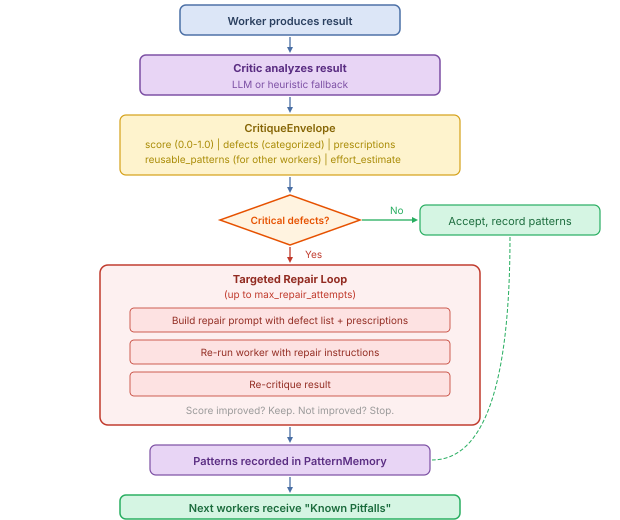

# Reflective Critique Loop

> **See also** — **Parent**: [docs/README.md](README.md#dynamic-concepts-what-happens-at-runtime), [layer-model.md](layer-model.md) (cross-cutting mechanism hosted in Layer 5 + Layer 6, not a new layer) · **Engine context**: [ORCHESTRATION_ENGINES.md](ORCHESTRATION_ENGINES.md) (A2+ delegation loop only), [orchestration.md](orchestration.md) · **Complementary quality mechanisms**: [validation.md](validation.md) (static R1–R32), [evaluation.md](evaluation.md) (workflow-level score) · **Completion gate chain placement**: [runtime.md](runtime.md) · **Feeds**: [manager-intelligence.md](manager-intelligence.md) (decision journal via pattern memory), [refinement.md](refinement.md) (critique defects are a gradient source) · **Fixpoint guard (R35)**: this doc

## Mental Model

The critique loop is the delegation loop's **inner self-correction reflex**. Where the manager decides *what* to do next, the critic asks — for every worker output, before the manager ever sees it — *"is this output actually any good, and if not, can we fix it right here?"* This turns each worker call into a small, reviewable artifact instead of a blind hand-off, and lets later workers in the same run learn from earlier failures via accumulated *patterns*.

Critique sits **inside** the [delegation loop engine](ORCHESTRATION_ENGINES.md) (A2+ only). It is one of three quality subsystems in AWP, each operating at a different scope:

| Subsystem | Scope | When | Where to read |
|-----------|-------|------|---------------|
| **Validation** (R1-R32) | Static schema/graph correctness | Before/during run | [validation.md](validation.md) |
| **Critique** (this doc) | Per-worker output, inside delegation loop | After every worker call | here |
| **Evaluation** | Whole-workflow score | After the run | [evaluation.md](evaluation.md) |

> **Heads-up — Critique vs. Evaluation.** Critique is a *worker-level repair tool*: it diagnoses specific defects in a single worker output and tells *that same worker* how to fix them. Evaluation is a *workflow-level scoring tool*: it produces a numeric quality score for the entire run and can trigger full retries. They are designed to be complementary and can be enabled independently — see the table below.

The critique system also feeds the [manager intelligence](manager-intelligence.md) decision journal: each defect pattern becomes a hint the manager uses on the next iteration.

## Critique vs Evaluation

| Aspect | Critique | Evaluation |
|--------|----------|------------|
| Scope | Per-worker output | Per-workflow result |
| Question | "What's wrong with this output?" | "How good is the overall result?" |
| Output | Defect list + repair instructions | 0.0-1.0 score |
| Action | Targeted repair of specific defects | Retry/accept/fail the workflow |
| Location | `delegation_loop.critique` | `observability.evaluation` |
| Engine | A2+ (delegation loop only) | Any engine (DAG or delegation loop) |

Both can be enabled independently. When both are active, critique repairs happen **before** evaluation scoring.

## Configuration

Critique is configured under `orchestration.delegation_loop.critique` in `workflow.awp.yaml`:

```yaml
orchestration:
  engine: delegation_loop
  delegation_loop:
    critique:
      enabled: true
      mode: inline                    # "inline" or "dedicated"
      model: null                     # LLM model (null = inherit worker model)
      max_repair_attempts: 2          # Per-worker repair cycles
      repair_budget_fraction: 0.15    # Max 15% of total budget for repairs
      min_score_to_complete: 0.6      # Block COMPLETE/DELEGATE below this mean critique score
      pattern_memory: true            # Accumulate cross-worker failure patterns
      defect_categories:
        - missing_data
        - wrong_format
        - incomplete
        - hallucinated
        - stale
        - policy_violation
```

When `enabled: false` (the default), critique is completely disabled and has zero runtime overhead.

### Configuration Fields

| Field | Type | Default | Description |
|-------|------|---------|-------------|
| `enabled` | bool | `false` | Enable/disable the critique system |
| `mode` | string | `"inline"` | `"inline"` (uses worker model, cheap) or `"dedicated"` (separate critic agent) |
| `model` | string | `null` | LLM model for the critic. `null` inherits from the worker model |
| `max_repair_attempts` | int | `2` | Maximum repair cycles per worker before escalation |
| `repair_budget_fraction` | float | `0.15` | Maximum fraction of total budget that can be spent on repairs |
| `min_score_to_complete` | float | `0.6` | Minimum mean critique score required for the manager to be allowed to `complete`. Below this, a COMPLETE decision is overridden into another iteration. The same gate also blocks a DELEGATE decision that re-issues an already-dispatched subtask signature (redundancy guard), forcing the manager into diagnose/repair instead. Setting to `0.0` disables the gate. |
| `pattern_memory` | bool | `true` | Accumulate failure patterns across workers within a run |
| `defect_categories` | list | see above | Types of defects the critic should diagnose |

## How It Works

### Critique Flow

  

### Defect Categories

| Category | Description | Typical Severity |
|----------|-------------|-----------------|
| `missing_data` | Required data absent from output | critical |
| `wrong_format` | Output format doesn't match contract | critical |
| `incomplete` | Partial result, missing sections | warning |
| `hallucinated` | Fabricated data or unsupported claims | critical |
| `stale` | Outdated information | warning |
| `policy_violation` | Violates workflow policies | critical |

### Severity Levels

- **critical** — Defect that makes the output unusable. Triggers repair.
- **warning** — Quality issue but output is usable. Included in repair if repair is triggered.
- **info** — Minor observation. Never triggers repair.

## Critique Scoring

### LLM Critic Scoring Bands

| Score Range | Assessment | Action |
|-------------|-----------|--------|
| 0.9-1.0 | Excellent, no critical defects | Accept |
| 0.6-0.89 | Acceptable with warnings | Accept (log warnings) |
| 0.3-0.59 | Needs repair, critical defects present | Trigger repair |
| 0.0-0.29 | Fundamentally broken | Escalate to manager |

### Heuristic Fallback

When no LLM is available, a deterministic heuristic runs instead:

| Check | Penalty | Severity |
|-------|---------|----------|
| Missing confidence field | -0.3 | critical |
| Low confidence (< 0.3) | -0.2 | warning |
| Error field present | -0.4 | critical |
| Required field missing | -0.2 each | critical |
| Empty string in field | -0.1 each | warning |

Score starts at 1.0, penalties are subtracted, result is clamped to [0.0, 1.0].

## Pattern Memory

When `pattern_memory: true`, the critique engine accumulates failure patterns across all workers in a run.

### How Patterns Work

1. After each critique, `reusable_patterns` from the CritiqueEnvelope are recorded
2. Patterns track: category, frequency, description, prevention rule, first/last seen iteration
3. Patterns are sorted by frequency (most common first)
4. A "Known Pitfalls" section is injected into the next worker's skills

### Example Pattern Injection

```markdown
## Known Pitfalls

The following issues have occurred in prior workers during this run.
Avoid repeating them:

- [seen 3x] missing_data: Always include the 'summary' field in your output
- [seen 2x] wrong_format: Output confidence as a float, not a string
```

This creates a **learning loop within a single run** — later workers benefit from earlier mistakes without any human intervention.

## Repair Process

### Targeted Repair

Unlike evaluation retry (which re-runs the entire workflow), critique repair is **targeted**:

1. Only critical + warning defects are included in repair instructions
2. The worker receives its own previous output plus specific fix instructions
3. The repair prompt says: "Fix ONLY these defects. Keep everything else unchanged."
4. After repair, the result is re-critiqued to verify improvement
5. Repair stops if score doesn't improve (prevents infinite loops)

### Budget Controls

- Repairs consume budget (tokens, loops, worker runs)
- `repair_budget_fraction` caps the total repair spend (e.g., 15% of total budget)
- `max_repair_attempts` caps per-worker repair cycles
- If budget is exhausted, repair is skipped and the original result is kept

### Repair Artifacts

Each repair attempt is tracked:

```json
{
  "worker_id": "analyst_01",
  "attempt": 1,
  "original_score": 0.45,
  "repaired_score": 0.82,
  "defects_fixed": 3,
  "defects_remaining": 0
}
```

## Workspace Artifacts

When critique is enabled, additional artifacts are written per iteration:

```
workspace/runs/<run-id>/
  iterations/
    001/
      critique.json              # All worker critiques for this iteration
      CRITIQUE.md                # Human-readable summary
      delegations/
        <worker-id>/
          critique.json          # Per-worker critique detail
```

## Filesystem Grounding

The LLM critic is grounded in the actual filesystem state of the run so it cannot hallucinate "file missing" defects when the file really exists on disk. Before each critique call, the engine captures a ground-truth snapshot of the worker's `_workspace_dir` and the run's `_output_dir` (file list with sizes) and injects it into the critic prompt. The critic is instructed to treat the snapshot as authoritative: if a file is listed there, claiming it is missing is a hallucination and must be suppressed. This closed a class of failure modes in which pessimistic LLM narratives would reject otherwise-valid worker output and push the delegation loop into endless repair cycles.

## Completion Gates (beyond critique score)

The `min_score_to_complete` threshold is only one of several completion gates the delegation loop enforces before accepting a manager `COMPLETE` decision. The others work in concert with critique:

- **Placeholder gate.** Before accepting completion, the runner scans the manager's `final_result` and all text-based files under `_output_dir` / `workspace/outputs` for placeholder patterns ("TODO", "final output here", "XX%", stub key names like `your`, `field_name`, `<your-...>`). Any hit forces another iteration with a `_placeholder_repair_required` state entry telling the manager exactly which stubs to replace.
- **File-validator gate.** Trivial deliverables (1x1 PNGs, empty PDFs, files `< 512 B`) are rejected as placeholders even if the filename exists.
- **Deliverable presence gate.** When the task text implies a file deliverable (keywords like *image*, *chart*, *pdf*, *csv*, *dataset*, ...) the runner refuses `complete` until at least one file of `>= 512 B` exists in the run's `_output_dir`. This catches the pathological case where the manager finishes after only "investigating capabilities" without actually producing the artifact the user asked for.
- **Critique ground-truth bypass.** When a task implies a file deliverable **and** that file already exists on disk at completion time, the LLM critic's pessimistic narrative is overruled — the filesystem is authoritative. This prevents endless repair loops on output that is already correct but that the critic keeps flagging on stylistic grounds. The bypass is advisory: the placeholder and file-size gates above still apply.

All four gates share a single trace channel so the experiment UI shows which gate fired on which iteration. Gates never *accept* an incomplete run — they only *reject* premature completions. When the overall budget envelope is exhausted the runner falls back to a `partial` result rather than blocking forever.

## Manager Integration

The manager receives a critique summary after each iteration, including:

- Per-worker scores and defect counts
- Top prescriptions
- Known patterns and their frequencies
- Repair history (original vs. repaired scores)

This helps the manager make better delegation decisions in subsequent iterations.

## Example

See [Example 15: Critique Loop](../examples/workflows/15-critique-loop/) for a complete working demonstration with:

- Inline critique mode
- Pattern memory enabled
- 2 repair attempts per worker
- 20% repair budget fraction
- Evaluation metrics + retry policy combined with critique

## Layer 0 Output Contract (R34)

Before the LLM critique runs on a worker's output, a bit-level
contract chain checks for trivial defects that don't need a language
model to detect. This is the **Layer 0 Contract**: linear-time,
domain-agnostic, token-free.

Default checks (bundled with every conformant runtime):

| Check | What it rejects |
|-------|-----------------|
| `no_placeholder` | `TODO`, `XXX`, `???`, `Lorem ipsum`, `TBD`, `FIXME`, `TITLE GOES HERE`, `Author Name`, `to be filled` |
| `no_text_loop` | ≥ 20-word paragraphs whose pairwise `simhash` similarity exceeds 0.85 (detects the "produce more output by repeating yourself" anti-pattern) |
| `file_size_delta` | A repair output whose size is > 2.5× the previous attempt (detects append-leaks like the 341 MB runaway observed in practice) |
| `no_duplicate_headings` | Any Markdown `# Title` or LaTeX `\section{Title}` that appears more than once |
| `balanced_delimiters` | Unbalanced `{}` / `[]` / `()` counts (fast tokenizer, no AST) |
| `json_valid_if_claimed` | Files ending `.json` (or tools claiming JSON output) that fail `json.loads` |

Every check runs in O(n) and in under 100 ms on a 10 MB output.

### Integration with the completion gate chain

L0 runs **before** `critique → deliverable → placeholder → file →
deliverable → structural → eval`. A rejection at L0 emits a gate event
with fields `l0_check`, `l0_reason`, `violating_path` and sends the
worker back into repair mode with a specific, deterministic reason
string — no LLM tokens burned.

See [validation-rules.md §10](../spec/versions/1.0/validation-rules.md#10-layer-0-output-contract-r34)
for normative requirements.

### Workflow-specific extensions

Workflow authors add their own checks via YAML:

```yaml
observability:
  output_contract:
    checks: [default]
    extra:
      - name: citation_keys_resolve
        implementation: my_workflow.contracts:CitationCheck
```

An `OutputContractCheck` implementation is any Python callable
conforming to the `Protocol` in
`packages/awp-runtime/src/awp/runtime/critique/contracts.py`. The
callable MUST return within 100 ms on a 10 MB output. Extension
checks live in the workflow repo; AWP core ships only the generic
default set.

## Repair Fixpoint Detection (R35)

When a repair worker returns an output whose `simhash` similarity to
the previous repair output is ≥ 0.95, the runtime treats the subtask
as a fixpoint and aborts further repair. The subtask is marked
`failed` with reason `repair_fixpoint_detected` and its parent loop
decides whether to synthesise a differently-scoped subtask or
contribute the failure to the terminal status aggregation.

This prevents the "keep repairing the same wrong thing" failure mode
observed in long-running delegation runs: a worker producing
near-identical output across 4+ repair attempts is not converging, and
every further iteration burns budget without information gain.

See [validation-rules.md §11](../spec/versions/1.0/validation-rules.md#11-repair-fixpoint-detection-r35)
for normative semantics.
