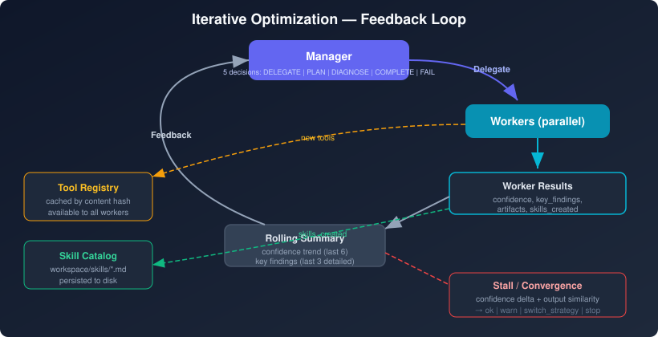
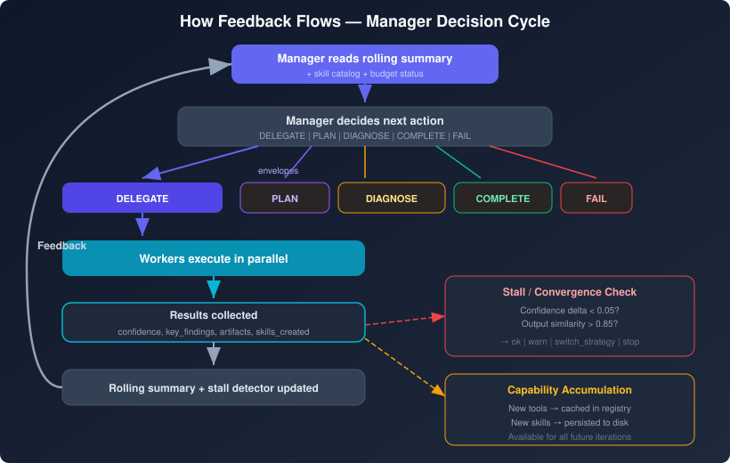
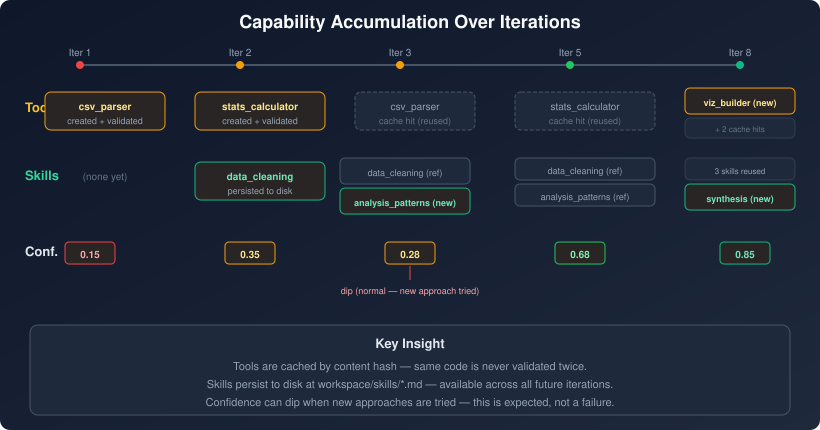
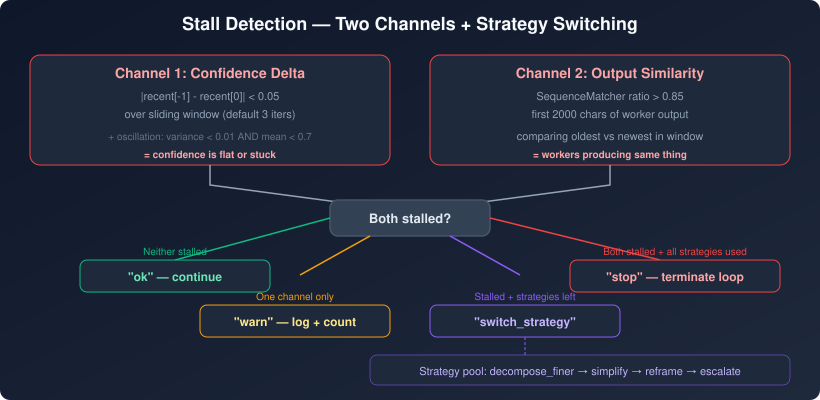
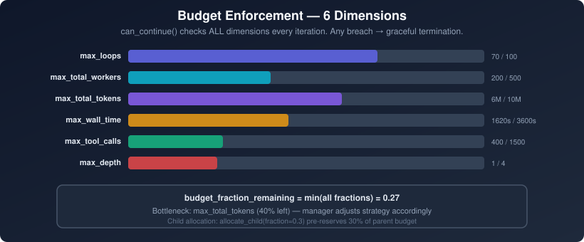

# Iterative Optimization

> **Status**: implemented in `awp-runtime` ≥ 1.0.40
> **Source**: `packages/awp-runtime/src/awp/runtime/delegation_loop_runner.py`,
> `packages/awp-runtime/src/awp/runtime/dynamic_tool_factory.py`

> **See also** — **Parent**: [docs/README.md](README.md#dynamic-concepts-what-happens-at-runtime), [ORCHESTRATION_ENGINES.md](ORCHESTRATION_ENGINES.md) · **Inner-loop mechanisms**: [manager-intelligence.md](manager-intelligence.md) (strategy + decision journal), [critique.md](critique.md) (per-worker repair inside the loop), [runtime-tool-generation.md](runtime-tool-generation.md) (capability accumulation) · **Bounded by**: [runtime.md](runtime.md) (budget envelope, completion gate chain) · **Contrast with outer axes**: [outer-loop.md](outer-loop.md) (moves θ — prompt artifacts), [refinement.md](refinement.md) (moves y — a seed run's deliverable) — iterative optimization here is the **inside-one-run** feedback loop · **Autonomy mapping**: [compliance.md](compliance.md)

## Mental Model

Most multi-agent workflows run once: define a pipeline, feed in data, get a result. This works for well-understood problems where you know the steps in advance. But for complex, open-ended problems — research synthesis, multi-constraint optimization, deep data analysis — a single pass is rarely sufficient. The right approach depends on what you learn along the way.

AWP's delegation loop implements **iterative optimization**: a closed feedback loop where the manager observes progress, adjusts strategy, delegates refined subtasks, and accumulates capabilities (tools and skills) across iterations. Each round feeds what worked — and what didn't — back into the next. The system grows its own capabilities as it works.

This is not gradient descent. There is no mathematical gradient, no differentiable loss surface, no convergence guarantee. What AWP does is closer to **how a skilled human iterates**: try an approach, observe the results, learn from them, build better tools, refine the strategy, and repeat — with hard budget limits that guarantee termination.

This document describes the four mechanisms that make iterative optimization work: the feedback loop, capability accumulation, stall detection, and budget enforcement.

  

---

## 1. The Feedback Loop

The delegation loop's feedback mechanism is the **rolling summary** — a structured record of what happened in previous iterations that feeds into the manager's next decision.

### What the Rolling Summary Contains

The rolling summary (`ROLLING_SUMMARY.md`) is rebuilt after every iteration by `update_rolling_summary()` and contains:

| Section | Content |
|---------|---------|
| **Progress** | Current iteration number and confidence score |
| **Confidence Trend** | Last 6 iterations shown as `Iter N: 0.XX → Iter N+1: 0.YY → ...` |
| **Recent Iterations (Detail)** | Last `window` iterations (default 3) with full confidence and key findings |
| **Older Iterations (Summary)** | Earlier iterations condensed to one line each: iteration number + confidence |

The window size is configured via `config.history.full_results_window` (default: 3). Recent iterations are shown in reverse chronological order (newest first) so the manager sees the most relevant information first.

### How Feedback Flows

The manager receives five decision types, not just delegate/complete. `PLAN` creates an explicit task graph before delegating. `DIAGNOSE` generates hypotheses about why progress stalled and runs lightweight diagnostic workers before retrying blindly. See [Manager Intelligence](manager-intelligence.md) for details on these decision types.

### What the Manager Does NOT See

The rolling summary is deliberately limited to **confidence scores and key findings**. It does not include:

- Raw worker outputs (too large for context windows)
- Tool creation details (tracked separately in the tool registry)
- Skill contents (tracked separately in the skill catalog)
- Budget consumption details (tracked by the budget system)

This separation keeps the manager's context focused. The skill catalog is injected separately into the manager prompt via `_build_skill_catalog_section()`, listing available skills by name and one-line description.

---

## 2. Capability Accumulation

Each iteration can expand the system's capabilities in two ways: tools and skills. Unlike the rolling summary (which is ephemeral context), accumulated tools and skills persist for the entire run and are available to all subsequent iterations.

### Dynamic Tool Creation

When a worker needs a capability that doesn't exist, it generates a tool. The `DynamicToolFactory` validates and registers it through a multi-stage pipeline:

| Stage | Code | What it checks |
|-------|------|----------------|
| **Cache lookup** | B5 | SHA-256 hash of FQN + code + schema; if hit, reuse existing tool |
| **FQN validation** | DT1-DT2 | Fully qualified name format, reserved namespace checks |
| **AST validation** | DT4 | Syntax check via `ast.parse()`, namespace-aware import policy (NC1–NC3), dangerous call detection |
| **Schema-signature check** | B2 | Handler function kwargs must match declared schema parameters |
| **Placeholder rejection** | DT9 | Detects and rejects base64 PNGs, minimal PDFs, and other dummy outputs |
| **Dry-run probe** | B3 | Runs tool with synthetic inputs in sandboxed venv (5s timeout) |

If validation fails at any stage, the error is classified as "repairable" or "terminal." Repairable errors trigger an **inline LLM repair loop** that fixes the code within the same worker iteration — the manager never sees the failure. See [Runtime Tool Generation Pipeline](runtime-tool-generation.md) for the full pipeline.

Once registered, a tool is:

- **Cached by content hash** — the same code is never validated twice
- **Available to all subsequent workers** in the same run
- **Tracked with metrics** — attempts, successes, cache hits, validation failures, repair attempts/successes

### Skill Accumulation

Skills are reusable domain knowledge saved as Markdown files. Unlike tools (executable code), skills are structured knowledge: approaches, patterns, procedures, and findings that help future workers avoid re-deriving what earlier workers already learned.

**How skills flow through the system:**

1. **Manager creates skills**: When delegating, the manager can include skills in a worker's `DelegationEnvelope`. These can be inline markdown or references to previously persisted skills.

2. **Workers produce skills**: Worker results can include a `skills_created` array. Each skill with ≥30 words is automatically persisted to `workspace/skills/{name}.md` by `_persist_worker_result_skills()`.

3. **Skills are cataloged**: `_load_skill_catalog()` reads all `*.md` files from the skills directory, extracts a one-line description from the `## Purpose` heading (or first non-heading line), and builds a name→description index.

4. **Catalog injected into manager prompt**: `_build_skill_catalog_section()` renders the catalog as a markdown section listing available skills by name. The manager can reference skills by short name in future delegation envelopes; the runtime resolves them to full content via `_resolve_skills()`.

5. **Skills can be updated**: If a worker produces a skill with the same `# Skill: Name` heading as an existing one, it overwrites the previous version (latest wins).

**The compounding effect**: Early iterations establish foundational skills. Later iterations reference them by name instead of re-deriving the knowledge. This reduces redundant work and lets the system build on itself — the same pattern as a human team building institutional knowledge over the course of a project.

---

## 3. Stall Detection and Recovery

Iterative loops can get stuck. The manager might delegate the same kind of work repeatedly, workers might produce near-identical results, or confidence might oscillate without improving. AWP uses a `StallDetector` with two independent signal channels and a strategy-switching recovery mechanism.

### Two-Channel Detection

| Channel | Signal | Threshold | What it detects |
|---------|--------|-----------|-----------------|
| **Confidence delta** | `abs(recent[-1] - recent[0])` over sliding window | < `min_confidence_delta` (default 0.05) | Progress has stopped — confidence is flat |
| **Output similarity** | `SequenceMatcher` ratio on first 2000 chars of worker output | > 0.85 | Workers are producing the same thing — no new information |

Additionally, an **oscillation detector** triggers when confidence variance is < 0.01 and mean confidence is < 0.7 over an extended window — catching loops that bounce between low values without making progress.

### Escalation Logic

The `record()` method returns one of four signals:

| Signal | Condition | Effect |
|--------|-----------|--------|
| `ok` | Neither channel stalled, or insufficient history (< `window` iterations) | Continue normally |
| `warn` | One channel stalled | Log warning, increment warning counter |
| `switch_strategy` | Stall detected AND unused strategies remain in the pool | Rotate to next meta-strategy |
| `stop` | Both channels stalled AND all strategies exhausted (or strategy switching disabled) | Terminate loop |

Both channels must agree before the loop stops. A single channel stalling triggers a warning first, giving the system a chance to recover. This prevents premature termination from temporary plateaus.

### Strategy Switching

When stall is detected, the manager rotates through configured meta-strategies before stopping. The default strategy pool (configured in `StallDetectionConfig.strategy_switching`):

1. **`decompose_finer`** — Break the current subtask into smaller pieces
2. **`simplify`** — Reduce scope or constraints
3. **`reframe`** — Approach the problem from a different angle
4. **`escalate`** — Flag for human intervention or higher-level manager

Each strategy switch resets the warning counter, giving the new strategy a fresh window to make progress. Only after all strategies are exhausted does the stall detector return `stop`.

### Convergence Detection

Separate from stall detection, `_check_convergence()` forces completion when the loop has plateaued at a satisfactory level. Two heuristics:

| Heuristic | Condition | Interpretation |
|-----------|-----------|----------------|
| **(a) Confidence plateau** | `abs(last - prev) < 0.05` AND `last < 0.95` | Confidence has stopped improving but hasn't reached high quality |
| **(b) Identical findings** | Last 3 iterations all `DELEGATE` with identical `key_findings` tuple | The loop is producing the same analysis repeatedly |

Both heuristics are gated by a **minimum iteration floor**: `max(5, pending_subtask_count + 3)`. This prevents false convergence during multi-phase tasks where confidence legitimately plateaus between phases while subtasks are still pending.

When convergence fires, the loop returns a `partial_complete` result rather than `complete` — signaling that the result is usable but the system stopped before reaching full confidence.

---

## 4. Budget Enforcement

Every iterative loop must terminate. AWP enforces this with a multi-dimensional budget system where **no single limit can be circumvented** — the manager cannot override the safety envelope.

### Budget Dimensions

| Field | Default | What it limits |
|-------|---------|----------------|
| `max_loops` | 100 | Total manager iterations |
| `max_total_workers` | 500 | Total worker spawns across all iterations |
| `max_total_tokens` | 10,000,000 | Total LLM tokens consumed (input + output) |
| `max_wall_time` | 3600 (1 hour) | Wall clock time in seconds |
| `max_tool_calls` | 1500 | Total tool invocations across all workers |
| `max_depth` | 4 | Recursion depth for sub-manager delegation |

The loop's `can_continue()` check evaluates **all dimensions** on every iteration. If any single limit is breached, the loop terminates with a graceful partial result — it does not crash or hang.

### Real-Time Tracking

The `BudgetSnapshot` class tracks consumption in real time:

- **Loops**: incremented on each manager iteration
- **Workers**: incremented on each worker spawn
- **Tokens**: accumulated from LLM response metadata
- **Wall time**: computed from `time.monotonic()` at loop start
- **Tool calls**: incremented on each tool invocation

`budget_fraction_remaining` returns the minimum fraction across all dimensions — this single number tells the manager how much runway is left. The manager receives this in its prompt context and can adjust its strategy accordingly (e.g., switching to synthesis mode when budget is low).

### Child Budget Allocation

When the manager promotes a worker to a sub-manager (recursion), the parent **pre-reserves** budget for the child via `allocate_child(fraction=0.3)`. This:

- Prevents the child from consuming the parent's entire budget
- Limits recursion depth via `max_depth`
- Caps concurrent sub-managers via `max_concurrent_submanagers` (default 3)
- Caps total sub-managers per run via `max_total_submanagers_per_run` (default 6)

---

## 5. Putting It Together

A typical iterative optimization run looks like this:

**Iteration 1**: Manager receives the task with no history. Delegates initial subtasks to workers. Workers produce results with low confidence (0.15–0.25) and possibly create first tools. Skills are empty.

**Iteration 2–3**: Manager reads rolling summary showing low confidence. May switch to PLAN mode to decompose the problem. Workers use tools from iteration 1. First skills are created and persisted. Confidence climbs (0.30–0.50), possibly with dips as new approaches are tried.

**Iteration 4–6**: Skill catalog grows. Workers reference earlier skills by name instead of re-deriving knowledge. New tools are cache-hit (not rebuilt). Manager adjusts strategy based on what's working. Confidence reaches 0.50–0.75.

**Iteration 7+**: Capabilities compound. Stall detector may fire if progress plateaus — manager switches strategy (decompose finer, simplify, reframe). If confidence reaches 0.95+, manager may decide COMPLETE. If budget runs low, manager switches to synthesis mode.

**Termination**: The loop ends when the manager decides COMPLETE, when budget is exhausted, when convergence is detected, or when stall detection stops the loop after all strategies are exhausted. The result includes all accumulated artifacts, tools, and skills.

**Key property**: Progress is not guaranteed to be monotonic. Confidence can dip when the manager tries a new approach or when workers explore a harder subtask. This is expected and healthy — the stall detector only fires when confidence is flat *and* output similarity is high (i.e., the system is stuck, not exploring).

---

## Related Documents

- [Runtime Tool Generation Pipeline](runtime-tool-generation.md) — Full pipeline for dynamic tool creation (B1–B6, AST validation, repair loop)
- [Manager Intelligence](manager-intelligence.md) — Task decomposition, hypothesis-driven debugging, strategy switching, decision journal
- [Critique Loop](critique.md) — Reflective analysis of worker outputs (defect detection, targeted repair)
- [Orchestration](orchestration.md) — Delegation loop configuration, budget fields, stall detection config
- [Evaluation](evaluation.md) — Quality scoring and threshold-based retry/repair
