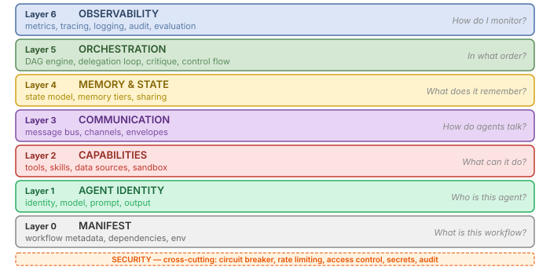
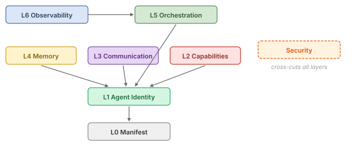

# The 7-Layer Architecture

## Why Layers At All?

A multi-agent workflow has many independent concerns: who the agents are, what they can do, how they talk, what they remember, how they are wired together, and how you observe them. Most frameworks mix these concerns in code — agent identity, tool registration and orchestration end up tangled in the same Python class. AWP refuses that mix. It assigns each concern to its own **layer**, with its own YAML section and its own validation rules, and lets you opt into layers as your workflow grows.

The layering produces three concrete benefits:

- **Progressive disclosure.** A 10-line A0 workflow needs only Layer 0 (manifest), Layer 1 (agent identity) and Layer 5 (orchestration). Memory, communication and observability are *opt-in*. You never pay for a layer you do not use.
- **Local reasoning.** Changing your orchestration strategy (Layer 5) does not touch agent identity (Layer 1) or tool definitions (Layer 2). Validation errors stay scoped to a single layer rather than cascading across the workflow.
- **Cross-cutting features compose cleanly.** The **critique loop**, **evaluation layer** and **security envelope** are not new layers — they hook into existing ones (orchestration, observability, security) without breaking the layer model. The same is true for the **delegation loop's** advanced features: complexity-scored auto-promotion, reservation budgets and recursive sub-runs all live inside Layer 5.

The diagrams below show the layers as a stack and as a dependency graph. Read them as a map: a workflow inhabits some subset of these boxes, and the rest of this document explains which subset corresponds to which autonomy level.

AWP organizes workflow concerns into seven layers. Each layer answers one question and builds on the layers below it.

## Layer Diagram

  

## Layer Dependency Diagram

Layers form a dependency graph, not a strict stack. Each layer depends only on the layers it needs:

  

Key observations:

- **Layer 0** is always required. It is the entry point for any AWP document.
- **Layer 1** is required for any workflow that contains agents (which is all of them).
- **Layers 2, 3, and 4** are independent of each other. You can have tools without communication, or memory without tools.
- **Layer 5** ties agents and state together into an executable graph.
- **Layer 6** is purely additive. Removing it changes nothing about execution semantics.

## You Always Need Layer 0 + Layer 1

The minimum viable AWP workflow requires Layer 0 (manifest) and Layer 1 (agent identity). Everything above is opt-in. A simple single-agent workflow uses only these two layers. A production enterprise system uses all seven plus the cross-cutting security layer.

## Autonomy Level to Layer Mapping

Each [autonomy level](compliance.md) uses specific layers:

| Level | Name | Required Layers | Description |
|-------|------|----------------|-------------|
| A0 | Prescribed | 0, 1, 5 (minimal) | Static DAG, predefined agents, fixed tools |
| A1 | Adaptive | 0, 1, 4, 5 | Conditional execution, loops, fan-out, multi-agent DAG |
| A2 | Delegating | 0, 1, 4, 5 | Manager spawns workers dynamically (delegation loop) |
| A3 | Self-Tooling | 0, 1, 2, 4, 5 | Agents create tools and skills at runtime |
| A4 | Self-Organizing | All (0-6 + Security) | Recursive delegation, budget distribution |

Communication (Layer 3), Memory (Layer 4), Observability (Layer 6), and Security are cross-cutting features available at any autonomy level.

### Cross-Cutting Mechanisms (Not New Layers)

Several powerful features are *not* layers of their own — they extend existing layers without breaking the seven-layer model:

| Mechanism | Hosted in | What it adds |
|-----------|-----------|--------------|
| **Delegation loop** (A2-A4) | Layer 5 | Manager/worker engine with complexity-scored auto-promotion, reservation-based budgets, recursive sub-runs |
| **Dynamic tool factory** (A3+) | Layer 2 | Six-phase B1-B6 pipeline (schema → AST → sandbox import → smoke test → registry binding → integration) with auto-repair loop |
| **Critique loop** | Layer 5 + Layer 6 | Per-iteration defect diagnosis and targeted repair inside the worker loop |
| **Evaluation layer** | Layer 6 | Workflow-level quality scoring with weighted metrics, thresholds, and retry policy |
| **Manager intelligence** | Layer 5 | Planning, hypothesis-diagnosis, strategy switching, decision journal |
| **Per-role model routing** | Layer 1 | Manager and worker LLMs configured separately; provider auto-detected from model string |
| **Experiment paradigm** | UI (Workflow Studio) | Sessions are now Experiments with Protocol/Memory tabs and scoped metadata |

These mechanisms are documented separately (`orchestration.md`, `tools.md`, `critique.md`, `evaluation.md`, `ui.md`) but they all *plug into* the layer model rather than expanding it.

## How Layers Map to YAML Sections

### In `workflow.awp.yaml`

| Layer | YAML Section(s) |
|-------|-----------------|
| Layer 0 | `awp`, `workflow` (name, version, description, runtime, dependencies, env, settings) |
| Layer 2 | `capabilities.custom_tools` (workflow-level custom tools) |
| Layer 3 | `communication` (bus, channels) |
| Layer 4 | `state`, `memory` |
| Layer 5 | `orchestration` (engine, graph, execution) |
| Layer 6 | `observability` (metrics, tracing, logging, audit, health) |
| Security | `security` (circuit_breaker, rate_limiting, secrets) |

### In `agent.awp.yaml`

| Layer | YAML Section(s) |
|-------|-----------------|
| Layer 1 | `awp_agent`, `identity`, `runtime`, `model`, `prompt`, `output`, `vision` |
| Layer 2 | `capabilities` (tools, skills, data_sources, sandbox) |
| Layer 4 | `memory` (agent-level memory configuration) |

## Layer Details

For the complete reference of each layer, see:

- Layer 0: [Manifest Reference](manifest.md)
- Layer 1: [Agent Reference](agent.md)
- Layer 2: [Tools & Capabilities Reference](tools.md)
- Layer 3: [Communication Reference](communication.md)
- Layer 4: [Memory & State Reference](memory.md)
- Layer 5: [Orchestration Reference](orchestration.md)
- Layer 6: [Observability Reference](observability.md)
- Security: [Security Reference](security.md)
