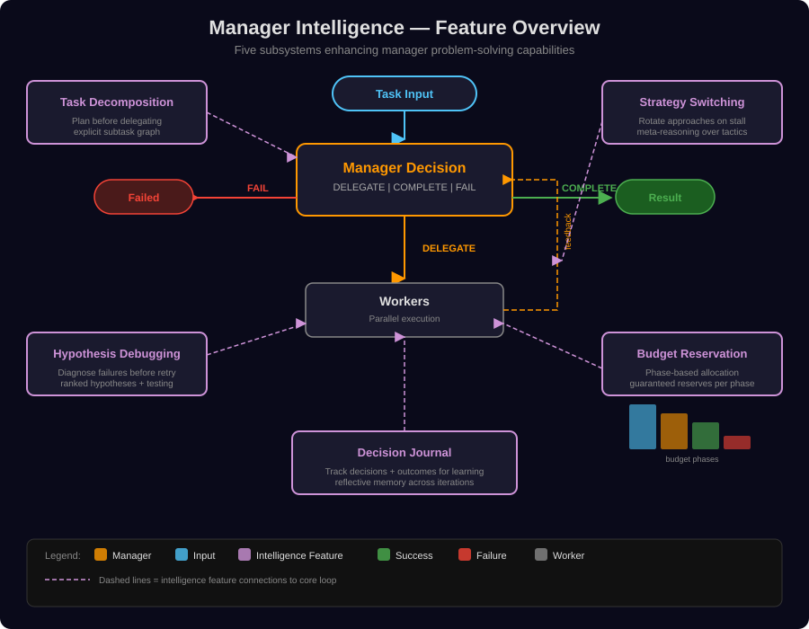
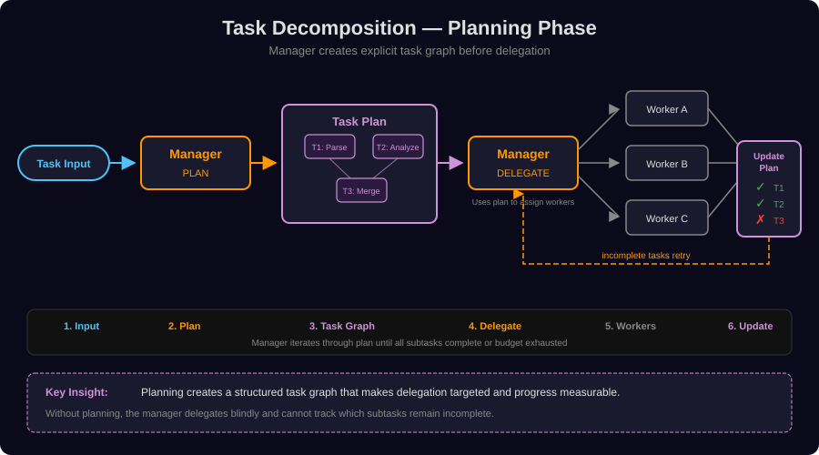
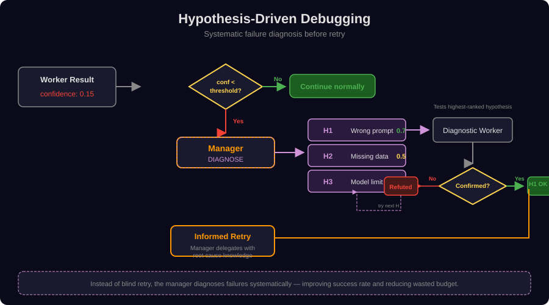
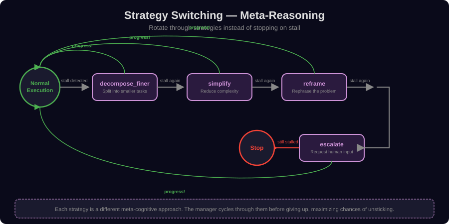
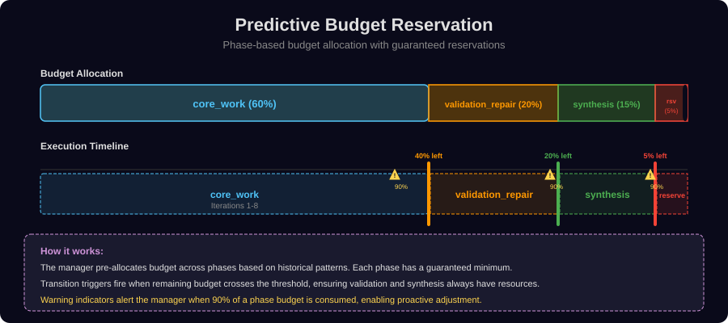
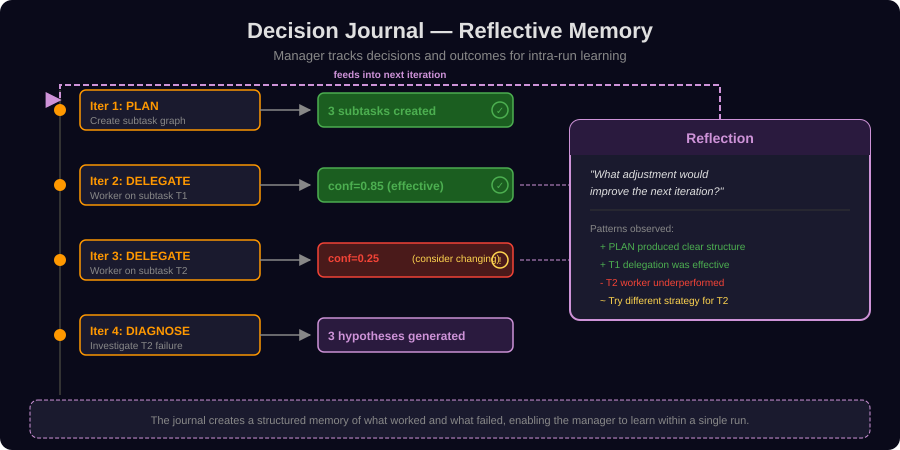

# Manager Intelligence

## Mental Model

A naive delegation loop manager just dispatches workers, reads results, and re-dispatches until something looks good. That works for simple tasks and falls apart for hard ones — the manager exhausts its budget on dead ends, retries blindly when a worker fails, and has no memory of what it has already tried. **Manager Intelligence** is a small, composable set of cognitive subsystems that turn the manager from a reactive dispatcher into a *deliberate problem solver*: it can plan before acting, diagnose before retrying, switch strategies when stuck, reserve budget for the phases it knows are coming, and keep a journal of its own decisions.

Each subsystem is independently configurable under `orchestration.delegation_loop.*` and **disabled by default**, so you only pay for the cognition you actually need. They are the runtime counterpart to AWP's higher-autonomy ambitions (A2 → A4): without them, A4 recursive delegation tends to thrash; with them, the manager behaves more like a senior engineer triaging a complex incident.

The five subsystems sit alongside two further mechanisms documented in this page: **complexity-scored auto-promotion** of workers into submanagers (the trigger that lifts a run from A2 to A4) and the **reservation model** that gives the system its hard termination guarantees.

```text
                       ┌──────────────────────────┐
                       │  Manager Intelligence    │
                       ├──────────────────────────┤
   Plan ──┐            │ 1. Task Decomposition    │
          ├──┐         │ 2. Hypothesis Diagnosis  │
   Diagnose─┤          │ 3. Strategy Switching    │
          ├──┼──> run  │ 4. Budget Reservation    │
   Switch ─┤          │ 5. Decision Journal      │
          ├──┘         ├──────────────────────────┤
   Reserve┘            │ + Complexity-scored      │
                       │   auto-promotion (A4)    │
                       │ + Reservation/refund     │
                       │   termination guarantee  │
                       └──────────────────────────┘
```

## Overview

| Feature | Purpose | Config Key | Default |
|---------|---------|------------|---------|
| Task Decomposition | Explicit planning before delegation | `planning.enabled` | `false` |
| Hypothesis-Driven Debugging | Systematic failure diagnosis | `diagnosis.enabled` | `false` |
| Strategy Switching | Meta-reasoning on stall detection | `termination.strategy_switching.enabled` | `false` |
| Predictive Budget Reservation | Phase-based budget allocation | `budget_reservation.enabled` | `false` |
| Decision Journal | Reflective decision tracking | `decision_journal.enabled` | `false` |

All features are disabled by default and can be enabled independently.

<p align="center">
  
</p>

## Task Decomposition (Planning Phase)

When enabled, the manager can issue a **PLAN** decision on the first iteration, creating an explicit task graph before delegating any work.

### How It Works

1. On iteration 1, the manager analyzes the task and creates a list of subtasks with IDs, descriptions, dependencies, priorities, and success criteria
2. The plan is stored and shown to the manager on every subsequent iteration as a progress table
3. As workers complete, their results are mapped to subtasks automatically (via matching `worker_id` to subtask `id`)
4. The manager sees which subtasks are actionable (dependencies met) and which are blocked

<p align="center">
  
</p>

### Configuration

```yaml
orchestration:
  delegation_loop:
    planning:
      enabled: true
      max_subtasks: 10    # Maximum subtasks in a plan
```

### Configuration Fields

| Field | Type | Default | Description |
|-------|------|---------|-------------|
| `enabled` | bool | `false` | Enable task decomposition |
| `max_subtasks` | int | `10` | Maximum number of subtasks in a plan |

### Example Plan Output

```json
{
  "decision": "plan",
  "reasoning": "Breaking the analysis into data loading, processing, and visualization phases",
  "subtasks": [
    {"id": "load_data", "description": "Load and validate CSV input", "dependencies": [], "priority": "high", "success_criteria": "DataFrame loaded with >0 rows"},
    {"id": "analyze", "description": "Run statistical analysis", "dependencies": ["load_data"], "priority": "high", "success_criteria": "Key metrics computed"},
    {"id": "visualize", "description": "Generate charts from analysis results", "dependencies": ["analyze"], "priority": "normal", "success_criteria": "PNG charts saved to output"}
  ]
}
```

### R31 Plan-Tool-Closure (Archetypes, Recipes, Synthesize Mode)

The PLAN decision is graded by a runtime validator before the manager is allowed to leave the planning phase. The validator enforces **R31 plan-tool-closure**: every subtask in the plan MUST declare a non-empty `tool_manifest` that closes over the capabilities it needs. Each entry in the manifest picks one of three modes, in order of preference:

1. **`reuse_or_generate: "reuse"`** — the capability is already satisfied by a concrete **pattern** in `awp.patterns` (e.g. `pandas_csv_summary`, `matplotlib_line_plot_png`, `coingecko_ohlc_daily`). The entry sets `pattern_id` to the pattern identifier. Cheapest mode — zero LLM tokens on the tool body.

2. **`reuse_or_generate: "synthesize"`** — no concrete pattern fits, but the capability matches one of the **archetypes** (`compute`, `fetch`, `parse`, `transform`, `render`, `probe`). The entry sets `archetype_id` plus the `recipe_params` required by that archetype (for `fetch` for instance: `backend`, `url_template`, `inputs`). The runtime instantiates the handler from the archetype skeleton, runs it through the smoke-test gate, and — on success — auto-captures the result as a reusable **recipe** in the recipe store for future runs. Strongly preferred over free-form generation whenever an archetype fits.

3. **`reuse_or_generate: "generate"`** — last resort. No pattern and no archetype fits. A fresh tool is generated free-form by the LLM. The entry MUST include a non-empty `assumptions` list; a `generate` entry without assumptions is a hard validator rejection and the entire PLAN is thrown out. If the manager cannot articulate at least one assumption it is a signal that the capability is too vague and should be split or re-expressed through `synthesize`.

The closed set of capability families the validator recognises is the union of `{p.capability for p in PATTERNS}` and `archetype_capability_families()`; patterns are concrete shortcuts while archetypes give the planner AWP's *structural* reach (what the runtime can always synthesise on demand).

The archetype + recipe layer is configuration-free — seeded patterns are auto-promoted to TRUSTED recipes at startup via `seed_recipes()`, synthesised recipes are captured as PROBATIONARY and promoted once their success counter reaches the public threshold. The replay gate in the tool generator consults the recipe store before invoking an LLM, so repeat capabilities across runs reuse prior work without cost.

## Hypothesis-Driven Debugging

When a worker produces low-confidence results (below a configurable threshold) or fails, the manager can issue a **DIAGNOSE** decision instead of blindly retrying.

### How It Works

1. After a worker fails or returns confidence below the threshold, the manager sees a "Diagnosis Suggested" hint
2. The manager generates up to N hypotheses about the failure cause, each with an ID, description, test method, and likelihood estimate
3. Hypotheses are shown in subsequent iterations as an "Active Hypotheses" table
4. The manager can delegate lightweight diagnostic workers to test specific hypotheses
5. Hypothesis status updates to "confirmed" or "refuted" based on diagnostic worker results
6. The confirmed root cause informs the actual retry delegation

<p align="center">
  
</p>

### Configuration

```yaml
orchestration:
  delegation_loop:
    diagnosis:
      enabled: true
      max_hypotheses: 3           # Max hypotheses per diagnosis
      confidence_threshold: 0.3   # Trigger below this confidence
```

### Configuration Fields

| Field | Type | Default | Description |
|-------|------|---------|-------------|
| `enabled` | bool | `false` | Enable hypothesis-driven debugging |
| `max_hypotheses` | int | `3` | Maximum hypotheses per DIAGNOSE decision |
| `confidence_threshold` | float | `0.3` | Worker confidence below this triggers diagnosis suggestion |

## Strategy Switching (Meta-Reasoning)

When stall detection fires (confidence not improving), instead of stopping the loop, the manager rotates through a pool of meta-strategies designed to break through plateaus.

### How It Works

1. Stall detector fires (confidence delta < threshold over N iterations)
2. Instead of warning/stopping, the system selects the next strategy from the pool
3. A "Strategy Directive" section is injected into the manager's prompt with the strategy name and explanation
4. The manager MUST change its delegation approach according to the directive
5. If the new strategy produces progress, execution continues normally
6. If stall recurs, the next strategy in the pool is tried
7. Only when ALL strategies are exhausted does the loop stop

<p align="center">
  
</p>

### Strategy Pool

| Strategy | Description |
|----------|-------------|
| `decompose_finer` | Break work into smaller, more specific subtasks |
| `simplify` | Solve a simpler version first, then extend |
| `reframe` | Reformulate the problem from a different angle |
| `escalate` | Use more powerful tools, higher temperature, or different methodology |

### Configuration

```yaml
orchestration:
  delegation_loop:
    termination:
      enabled: true
      window: 3
      min_confidence_delta: 0.05
      strategy_switching:
        enabled: true
        strategies:
          - decompose_finer
          - simplify
          - reframe
          - escalate
```

### Configuration Fields

| Field | Type | Default | Description |
|-------|------|---------|-------------|
| `enabled` | bool | `false` | Enable strategy switching on stall |
| `strategies` | list[str] | `["decompose_finer", "simplify", "reframe", "escalate"]` | Ordered list of strategies to try |

## Predictive Budget Reservation

Pre-allocates the total budget into phases with guaranteed reservations, preventing the common failure mode of exhausting all budget on analysis with nothing left for synthesis.

### How It Works

1. At the start of the run, the budget is divided into phases (default: 60/20/15/5 split)
2. The manager sees its current phase and remaining phase budget in every iteration
3. Phase transitions happen automatically based on overall budget consumption
4. When a phase's budget drops below 10%, the manager receives a warning
5. The reserve phase (5%) provides an emergency buffer for graceful completion

<p align="center">
  
</p>

### Default Phases

| Phase | Fraction | Description |
|-------|----------|-------------|
| `core_work` | 60% | Primary task execution and analysis |
| `validation_repair` | 20% | Validation, critique, and repair cycles |
| `synthesis` | 15% | Final synthesis, formatting, and output generation |
| `reserve` | 5% | Emergency buffer for graceful completion |

### Configuration

```yaml
orchestration:
  delegation_loop:
    budget_reservation:
      enabled: true
      phases:
        - name: core_work
          fraction: 0.60
          description: Primary task execution
        - name: validation_repair
          fraction: 0.20
          description: Validation and repair cycles
        - name: synthesis
          fraction: 0.15
          description: Final synthesis and output
        - name: reserve
          fraction: 0.05
          description: Emergency reserve
```

### Configuration Fields

| Field | Type | Default | Description |
|-------|------|---------|-------------|
| `enabled` | bool | `false` | Enable budget reservation |
| `phases` | list[BudgetPhase] | 4 default phases | Ordered list of budget phases (fractions must sum to 1.0) |

## Decision Journal

The manager maintains a reflective log of its decisions and their outcomes, enabling pattern recognition and self-correction within a single run.

### How It Works

1. After every manager decision, an entry is recorded: iteration, decision type, rationale, and worker IDs
2. After worker results come in, outcomes (confidence scores) are attached to the entry
3. Auto-derived lessons flag low-confidence patterns ("consider changing approach") and successful strategies ("approach is effective")
4. The journal is shown to the manager with a reflection prompt: "Given the pattern of decisions and outcomes above, what adjustment would improve the next iteration?"
5. Oldest entries are evicted when the journal exceeds `max_entries`

<p align="center">
  
</p>

### Configuration

```yaml
orchestration:
  delegation_loop:
    decision_journal:
      enabled: true
      max_entries: 20    # Oldest entries evicted when exceeded
```

### Configuration Fields

| Field | Type | Default | Description |
|-------|------|---------|-------------|
| `enabled` | bool | `false` | Enable the decision journal |
| `max_entries` | int | `20` | Maximum journal entries before eviction |

### Example Journal Entry (in manager prompt)

```
- **Iter 1** [plan]: Breaking task into 3 subtasks
- **Iter 2** [delegate]: Delegating data loading → outcomes: load_worker=0.85 | Lesson: High confidence — approach is effective
- **Iter 3** [delegate]: Delegating analysis → outcomes: analyze_worker=0.25 | Lesson: Low confidence — consider changing approach
- **Iter 4** [diagnose]: Worker failed — generating hypotheses before retrying

**Reflection**: Given the pattern of decisions and outcomes above, what adjustment would improve the next iteration?
```

## Feature Interactions

The five features are designed to compose. Here is how they interact:

| Feature A | Feature B | Interaction |
|-----------|-----------|-------------|
| Planning | Budget Reservation | Subtask count can inform core_work phase sizing |
| Planning | Decision Journal | Plan creation is recorded as the first journal entry |
| Diagnosis | Strategy Switching | Diagnosis results inform which strategy to switch to |
| Diagnosis | Decision Journal | Each hypothesis and result is logged |
| Strategy Switching | Planning | "decompose_finer" strategy tells the manager to re-plan with more granular subtasks |
| Strategy Switching | Decision Journal | Strategy switches are recorded, showing what has been tried |
| Budget Reservation | Strategy Switching | Approaching phase limits can trigger a strategy switch |

## Full Configuration Reference

All Manager Intelligence features enabled:

```yaml
orchestration:
  engine: delegation_loop
  delegation_loop:
    budget:
      max_loops: 100
      max_total_workers: 500
      max_total_tokens: 10000000
      max_wall_time: 600
    termination:
      enabled: true
      window: 3
      min_confidence_delta: 0.05
      strategy_switching:
        enabled: true
        strategies:
          - decompose_finer
          - simplify
          - reframe
          - escalate
    planning:
      enabled: true
      max_subtasks: 10
    diagnosis:
      enabled: true
      max_hypotheses: 3
      confidence_threshold: 0.3
    budget_reservation:
      enabled: true
      phases:
        - name: core_work
          fraction: 0.60
          description: Primary task execution
        - name: validation_repair
          fraction: 0.20
          description: Validation and repair cycles
        - name: synthesis
          fraction: 0.15
          description: Final synthesis and output
        - name: reserve
          fraction: 0.05
          description: Emergency reserve
    decision_journal:
      enabled: true
      max_entries: 20
```

## Complexity-Scored Auto-Promotion (A4 Trigger)

The five subsystems above all operate within a single manager. **Auto-promotion** is what turns one manager into many: when a worker's task is judged too complex to solve in a single shot, the manager promotes that worker into a *submanager* with its own delegation loop, its own budget envelope, and its own intelligence stack.

### How the score is computed

For every delegation, the manager computes a **complexity score** in `[0.0, 1.0]` that combines several signals:

- Estimated subtask count vs. configured `auto_promote_threshold`
- Worker confidence history (low confidence on related tasks raises the score)
- Task description length and structural cues (numbered lists, sub-questions)
- Tool diversity required (network + compute + file → higher score)
- Inherited recursion depth (deeper sub-trees promote more conservatively)

If the score exceeds the threshold and `max_depth` has not been reached, the worker is spawned with `role: submanager` instead of `role: worker`. The submanager receives a *fraction* of the parent's remaining budget (see Reservation Model below) and runs its own delegation loop until it returns a single consolidated result to the parent. This makes the lift from A2 to A4 **autonomous** — the workflow YAML no longer needs to declare the recursion depth up front.

Auto-promotion decisions are recorded in the [decision journal](#decision-journal) and surfaced in the [Workflow Studio graph view](ui.md) as nested cluster nodes — see *A4 sub-run clusters*.

### Configuration

```yaml
orchestration:
  delegation_loop:
    auto_promotion:
      enabled: true
      threshold: 0.65          # Score above which a worker is promoted
      max_depth: 2             # Hard cap on recursion depth (safety envelope, default 2)
      min_budget_fraction: 0.15  # Refuse promotion if <15% of parent budget left
```

In addition to `max_depth`, `budget.max_concurrent_submanagers` (default **3**) and `budget.max_total_submanagers_per_run` (default **6**) cap the submanager fan-out. When either cap is hit, the spawn is transparently downgraded to an ephemeral worker instead of failing the dispatch. The submanager child-budget fraction is computed dynamically as `min(0.3, 0.8 / n)` where *n* is the number of submanagers spawned in the same dispatch, so total concurrent submanager spend never exceeds 80% of the parent envelope.

Cross-references: the [runtime tool generation pipeline](runtime-tool-generation.md) interacts with auto-promotion — submanagers inherit the parent's `dynamic_tools` policy and can register tools visible to their entire sub-tree.

### Submanager state inheritance (default inherit-all + selective forget)

Submanagers inherit the parent's full state dict by default so children are never "born blind". The precedence for resolving the inherited slice is:

1. **Explicit whitelist (legacy, still wins).** If the envelope carries a non-empty `inherited_state_keys` list, only those keys are copied. Existing workflows that rely on explicit filtering keep working unchanged.
2. **Selective-forget blacklist.** Otherwise, every parent key is inherited *except* those listed in the envelope's `forbidden_inheritance_keys` or in the workflow-wide `delegation_loop.forbidden_inheritance_keys` config (per-envelope overrides merge with the config-level default). Use this for secrets, oversized blobs, or scratch data that would only confuse the child.
3. **Default.** If neither is set, the child sees the full parent state. This is the common case for recursive decomposition where a submanager needs the same context as its parent to reason about the sub-task.

Because the blacklist can live on the config (not just the envelope), workflow authors can set a single forget-list once and every spawned submanager honours it automatically.

## Budget Reservation Model and Termination Guarantees

The [predictive phase reservation](#predictive-budget-reservation) above splits a single manager's budget across phases. The **reservation model** described here is the broader, A4-aware version: it guarantees that *every sub-tree* gets a hard, refundable budget envelope, so a runaway submanager can never exhaust the parent's reserves.

### The contract

1. **Reservation**. When a submanager is spawned (via auto-promotion or explicit declaration), the parent *reserves* a fraction of its remaining budget for that child. The reservation covers all five dimensions: `loops`, `workers`, `tokens`, `wall_time`, `tool_calls`.
2. **Isolation**. The child sees only its reserved envelope. It cannot read or borrow from the parent's pool.
3. **Refund on completion**. When the child finishes (success or failure), unused budget is *refunded* to the parent. This is what makes deeply recursive workflows feasible — early-terminating sub-trees give their slack back.
4. **Hard termination**. If a child exhausts its envelope, it is terminated immediately. The parent receives a `submanager.exhausted` event and can decide whether to retry, give up, or ask a different worker.
5. **No override**. The safety envelope is not negotiable: the manager prompt cannot ask for "a bit more budget", and no LLM response can change the reservation after the fact. This is the property that makes the termination guarantee provable.

### Why this matters

Without reservation + refund, recursive delegation has no termination guarantee — a single misbehaving sub-tree can drain the entire run. With it, the worst-case behaviour is bounded by `max_depth × max_loops_per_level`, and you can reason about cost ceilings before pressing Run. The same model is what powers the per-cluster budget read-out in the [Workflow Studio graph view](ui.md#graph).

```yaml
orchestration:
  delegation_loop:
    reservation:
      enabled: true
      child_fraction: 0.40     # Each child reserves 40% of parent's remaining budget by default
      refund_on_complete: true
      strict: true             # No reservation override; hard terminate on exhaustion
```

## Sibling Coordination via Blackboard

Manager intelligence is not just about the manager loop — it is also about
letting workers tell each other what they have learned, without round-
tripping everything through the manager. AWP provides a minimal,
run-scoped **blackboard** for that.

Each manager run owns an append-only JSONL log at
`<workspace>/blackboard/<run_id>.jsonl`. Workers call two builtin tools:

- `board.post(topic, payload)` — broadcast a finding to siblings.
- `board.read(topic?, since?)` — retrieve sibling signals, optionally
  filtered by topic and "strictly newer than" marker.

Typical uses:

- **De-duplication** — a worker posts `{topic: "fetched", payload:
  {url: "…"}}`, siblings skip URLs they see on the board.
- **Dead-end signalling** — a worker posts `{topic: "dead_end",
  payload: {path, reason}}` so siblings avoid the same hole.
- **Partial hand-off** — structured intermediates that the next
  iteration's workers can pick up without waiting for the manager
  to summarise.

Before every manager iteration, the runner injects NEW entries into the
manager prompt as a `## SIBLING SIGNALS` block (silent when empty). The
manager can then react (cancel a redundant sub-task, promote a follow-
up, repair a reported failure).

**Isolation rules**:

- The board is bound to the currently-executing manager run via a
  `ContextVar`. Other runs cannot see it.
- **Submanagers get their OWN board** — they never share signals with
  the parent. Recursion stays clean.
- Controlled by `orchestration.delegation_loop.blackboard_enabled`
  (default `true`). Set to `false` to disable the feature entirely.

Unlike the other Manager Intelligence features, the blackboard defaults
to **enabled** — it has zero cost when unused (no entries = no prompt
injection, silent feature).

## Backward Compatibility

All Manager Intelligence features default to **disabled**. Existing workflows continue to work without any changes. The features only activate when explicitly enabled in the YAML configuration. No new dependencies or breaking changes are introduced.
