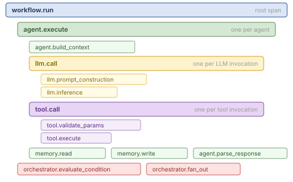

# Observability Reference

## Mental Model

Observability in AWP is not an afterthought bolted onto a black box — it is the **price of admission** for autonomous behavior. The higher up the autonomy spectrum a workflow climbs (A0 → A4), the less a human can predict what will happen at runtime, and the more the system must explain itself after the fact. At A4, observability is **mandatory** ([compliance.md](compliance.md)) because the only thing standing between a recursive delegation tree and an opaque runaway is a complete trace of every decision, span, and budget reservation.

Layer 6 defines five complementary streams that together reconstruct *what happened, why, and at what cost*:

1. **Metrics** — quantitative aggregates (token usage, latency, error rates, custom KPIs).
2. **Tracing** — causal span hierarchy (workflow → agent → tool/LLM, with sub-runs as **clustered subgraphs** for A4 recursive delegation).
3. **Logging** — structured per-event narrative with redaction.
4. **Audit Trail** — tamper-evident hash-chained record for compliance.
5. **Health Checks** — readiness/liveness probes.

On top of these, AWP adds two **decision-grade** observability surfaces unique to autonomous workflows:

- The **Decision Journal** ([manager-intelligence.md](manager-intelligence.md)) captures every manager choice — planning, hypothesis-diagnosis, strategy switches, **complexity-scored auto-promotion** of workers to submanagers, and **budget reservations** under the A4 reservation model. The journal is the single source of truth for "why did the manager do that?" and feeds directly into traces.
- The **Critique log** ([critique.md](critique.md)) captures defect diagnoses and targeted repairs at the worker level — complementary to workflow-level [evaluation](evaluation.md) scores, which are surfaced as `awp.workflow.evaluation_score` metrics and `evaluation.*` audit events.

The **Experiment paradigm** ([ui.md](ui.md)) scopes traces, metrics, and Decision Journals **per Experiment**, so each Experiment in the UI has its own Protocol tab and metric stream. The **worker model routing** information (which provider/model executed which step, auto-detected from the model string) is recorded as a span attribute (`awp.agent.model`) for audit and cost attribution.

Observability is configured in the `observability` section of [workflow.awp.yaml](manifest.md) and is wire-compatible with OpenTelemetry.

## Metrics

### Configuration

```yaml
observability:
  metrics:
    enabled: true
    exporter: otlp
    endpoint: "http://localhost:4317"
    interval: 30
    custom: []
```

| Field | Type | Default | Description |
|-------|------|---------|-------------|
| `enabled` | boolean | -- | Required. Whether metrics collection is active. |
| `exporter` | string | `"otlp"` | `"otlp"`, `"prometheus"`, `"console"`, or `"none"`. |
| `endpoint` | string | -- | Exporter endpoint URL. Required for `"otlp"` and `"prometheus"`. |
| `interval` | integer | `30` | Export interval in seconds. |
| `custom` | list | `[]` | Custom metric definitions. |

### Built-In Metrics

Conformant runtimes must collect these metrics when `metrics.enabled` is `true`:

| Metric Name | Type | Unit | Labels | Description |
|-------------|------|------|--------|-------------|
| `awp.agent.execution_time` | histogram | seconds | `agent_id`, `status` | Time per agent execution. |
| `awp.agent.token_usage` | counter | tokens | `agent_id`, `direction` | Tokens consumed per agent. |
| `awp.agent.tool_calls` | counter | calls | `agent_id`, `tool_name`, `status` | Tool calls per agent. |
| `awp.agent.errors` | counter | errors | `agent_id`, `error_type` | Errors per agent. |
| `awp.workflow.duration` | histogram | seconds | `workflow_name`, `status` | Total workflow duration. |
| `awp.workflow.agent_count` | gauge | agents | `workflow_name` | Number of agents in current execution. |
| `awp.memory.operations` | counter | ops | `tier`, `operation` | Memory read/write/search operations. |
| `awp.bus.messages` | counter | messages | `channel`, `type` | Messages on the message bus. |

### Custom Metrics

Workflows may define additional metrics:

```yaml
observability:
  metrics:
    custom:
      - name: "research.sources_found"
        type: counter
        description: "Number of research sources found."
        labels:
          - agent_id
          - source_type
      - name: "report.quality_score"
        type: gauge
        description: "Quality score of the generated report."
        labels:
          - agent_id
```

| Field | Type | Required | Description |
|-------|------|----------|-------------|
| `name` | string | Yes | Metric name. Should use dot notation. |
| `type` | string | Yes | `"counter"`, `"gauge"`, or `"histogram"`. |
| `description` | string | Yes | Human-readable description. |
| `labels` | list | No | Label keys for the metric. |
| `buckets` | list | No | Histogram bucket boundaries (for `"histogram"` type only). |

## Tracing

### Configuration

```yaml
observability:
  tracing:
    enabled: true
    exporter: otlp
    endpoint: "http://localhost:4317"
    propagation: w3c
    sampling:
      strategy: parent_based
      rate: 1.0
```

| Field | Type | Default | Description |
|-------|------|---------|-------------|
| `enabled` | boolean | -- | Required. Whether distributed tracing is active. |
| `exporter` | string | `"otlp"` | `"otlp"`, `"jaeger"`, `"zipkin"`, `"console"`, or `"none"`. |
| `endpoint` | string | -- | Exporter endpoint URL. |
| `propagation` | string | `"w3c"` | Context propagation format: `"w3c"`, `"b3"`, or `"jaeger"`. |
| `sampling.strategy` | string | `"always_on"` | `"always_on"`, `"always_off"`, `"parent_based"`, or `"probability"`. |
| `sampling.rate` | float | `1.0` | Sampling rate for `"probability"` strategy. 0.0-1.0. |

### Span Hierarchy

AWP defines a standard span hierarchy:

  

For A2+ delegation-loop workflows, the manager span owns child spans for each dispatched worker. For **A4 recursive delegation**, every submanager creates a nested **sub-run cluster** — a subgraph of spans rooted at the spawning manager — so the full delegation tree can be visualized as a hierarchy of clustered subgraphs in the AWP Studio graph view ([ui.md](ui.md)). Each sub-run cluster carries its **reserved budget** as span attributes (`awp.budget.reserved.tokens`, `awp.budget.reserved.workers`, `awp.budget.depth`), making it possible to verify that no submanager overran its envelope.

### Span Attributes

All spans must include:

| Attribute | Type | Description |
|-----------|------|-------------|
| `awp.workflow.name` | string | Workflow name from manifest. |
| `awp.workflow.version` | string | Workflow version. |
| `awp.run.id` | string | Unique run identifier. |

Agent spans must additionally include:

| Attribute | Type | Description |
|-----------|------|-------------|
| `awp.agent.id` | string | Agent identity. |
| `awp.agent.role` | string | Agent role. |
| `awp.agent.model` | string | Model name used. |

Tool spans must additionally include:

| Attribute | Type | Description |
|-----------|------|-------------|
| `awp.tool.name` | string | Tool FQN. |
| `awp.tool.status` | string | `"ok"` or `"error"`. |

LLM spans must additionally include:

| Attribute | Type | Description |
|-----------|------|-------------|
| `awp.llm.model` | string | Model identifier. |
| `awp.llm.tokens.input` | integer | Input token count. |
| `awp.llm.tokens.output` | integer | Output token count. |

### W3C TraceContext Propagation

When `propagation` is `"w3c"`, the runtime must propagate trace context using the W3C TraceContext specification:

- The `traceparent` header must be propagated across agent boundaries.
- The `tracestate` header should be propagated.
- Cross-workflow calls (subworkflows) must propagate the trace context.

## Logging

### Configuration

```yaml
observability:
  logging:
    level: INFO
    format: json
    outputs:
      - type: file
        path: "logs/app.log"
        rotation:
          max_size_mb: 10
          max_files: 5
      - type: console
        format: text
      - type: otlp
        endpoint: "http://localhost:4317"
    capture:
      agent_io: true
      state_transitions: true
      llm_prompts: true
      llm_responses: false
      tool_calls: true
      tool_results: true
    redaction:
      patterns:
        - "sk-[a-zA-Z0-9]{20,}"
        - "password\\s*[:=]\\s*\\S+"
      fields:
        - api_key
        - secret
        - token
```

### Log Levels

| Level | Description |
|-------|-------------|
| `DEBUG` | Detailed diagnostic information. |
| `INFO` | General operational messages. |
| `WARNING` | Unexpected but non-fatal conditions. |
| `ERROR` | Errors that prevent an operation from completing. |
| `CRITICAL` | Severe errors that may cause workflow termination. |

### Log Formats

| Format | Description |
|--------|-------------|
| `json` | Structured JSON. Each entry must include `timestamp`, `level`, `message`, `ctx` (trace context). |
| `text` | Human-readable text with timestamp and level prefix. |
| `structured` | Key-value pairs optimized for log aggregation systems. |

### Capture Flags

| Flag | Default | Description |
|------|---------|-------------|
| `agent_io` | `true` | Log agent input/output summaries. |
| `state_transitions` | `true` | Log state changes between agents. |
| `llm_prompts` | `true` | Log LLM prompts (should respect redaction). |
| `llm_responses` | `false` | Log full LLM responses. |
| `tool_calls` | `true` | Log tool invocations and parameters. |
| `tool_results` | `true` | Log tool return values. |

### Redaction

The runtime must apply redaction rules before writing any log entry:

- `patterns`: Regular expressions matched against all string values. Matches are replaced with `[REDACTED]`.
- `fields`: Field names whose values are always replaced with `[REDACTED]`.

Redaction must be applied to: log messages, span attributes, metric labels, and audit trail entries.

## Audit Trail

### Configuration

```yaml
observability:
  audit:
    enabled: true
    integrity: hash_chain
    hash_algorithm: sha256
    storage:
      type: file
      path: "logs/audit.jsonl"
    retention:
      max_age_days: 90
      max_size_mb: 100
    access_control:
      read:
        - admin
        - auditor
      write:
        - system
```

| Field | Type | Default | Description |
|-------|------|---------|-------------|
| `enabled` | boolean | -- | Required. Whether audit trail is active. |
| `integrity` | string | `"hash_chain"` | `"hash_chain"`, `"merkle_tree"`, or `"none"`. |
| `hash_algorithm` | string | `"sha256"` | `"sha256"`, `"sha384"`, or `"sha512"`. |
| `storage` | object | -- | Required. Storage configuration. |
| `retention.max_age_days` | integer | `90` | Maximum age before deletion. |
| `retention.max_size_mb` | float | `100` | Maximum storage size. Oldest entries deleted first. |
| `access_control` | object | -- | Access control for audit data. |

### Hash-Chain Integrity

When `integrity` is `"hash_chain"` (see [R18](validation.md)):

- Each audit entry must include a `prev_hash` field containing the hash of the previous entry.
- The first entry must have `prev_hash` set to a zero hash (all zeros).
- The runtime must compute `hash = H(prev_hash || entry_content)`.
- This provides tamper-evident logging.

### Audit Events

The runtime must record these events:

| Event | Trigger | Required Fields |
|-------|---------|-----------------|
| `workflow.start` | Workflow begins | `run_id`, `workflow_name`, `workflow_version`, `timestamp` |
| `workflow.complete` | Workflow ends | `run_id`, `status`, `reason`, `duration`, `timestamp` |
| `agent.start` | Agent begins | `run_id`, `agent_id`, `timestamp` |
| `agent.complete` | Agent ends | `run_id`, `agent_id`, `status`, `duration`, `timestamp` |
| `agent.error` | Agent fails | `run_id`, `agent_id`, `error_type`, `error_message`, `timestamp` |
| `tool.call` | Tool invoked | `run_id`, `agent_id`, `tool_name`, `timestamp` |
| `tool.result` | Tool returns | `run_id`, `agent_id`, `tool_name`, `status`, `timestamp` |
| `state.change` | State modified | `run_id`, `agent_id`, `fields_changed`, `timestamp` |
| `memory.write` | Memory modified | `run_id`, `agent_id`, `tier`, `timestamp` |
| `security.event` | Security event | `run_id`, `event_type`, `details`, `timestamp` |

## Health Checks

### Readiness (Pre-Start)

Readiness checks verify prerequisites before workflow execution begins.

```yaml
observability:
  health:
    readiness:
      checks:
        - name: llm_provider
          type: http
          endpoint: "https://openrouter.ai/api/v1/models"
          timeout: 10
          expected_status: 200
        - name: memory_dir
          type: filesystem
          path: "workspace/"
          check: exists
        - name: env_vars
          type: env
          required:
            - OPENROUTER_API_KEY
```

| Field | Type | Required | Description |
|-------|------|----------|-------------|
| `checks[].name` | string | Yes | Check identifier. |
| `checks[].type` | string | Yes | `"http"`, `"filesystem"`, `"env"`, or `"custom"`. |
| `checks[].timeout` | integer | No | Timeout in seconds. Default: 10. |

The runtime must execute all readiness checks before starting the workflow. If any check fails, the workflow must not start.

### Liveness (Runtime)

Liveness checks verify that the workflow is still making progress.

```yaml
observability:
  health:
    liveness:
      interval: 30
      timeout: 10
      failure_threshold: 3
      checks:
        - name: agent_progress
          type: custom
          condition: "time_since_last_agent_completion < 300"
```

| Field | Type | Default | Description |
|-------|------|---------|-------------|
| `interval` | integer | `30` | Seconds between checks. |
| `timeout` | integer | `10` | Seconds before a check is considered failed. |
| `failure_threshold` | integer | `3` | Consecutive failures before the workflow is unhealthy. |

When the failure threshold is reached, the runtime should log a CRITICAL-level message, record a `security.event` in the audit trail, and optionally terminate the workflow.

## Decision Journal (Manager Intelligence)

For A2+ delegation-loop workflows, the manager produces a **Decision Journal** in addition to standard spans and audit entries. Each entry records one manager decision and its rationale, which is essential for diagnosing autonomous behavior. Tracked decision types include:

| Decision | Trigger | Captured Fields |
|----------|---------|-----------------|
| `plan` | Initial task decomposition | `subtasks`, `rationale`, `estimated_complexity` |
| `dispatch` | Worker spawned | `worker_id`, `instructions`, `tools_allowed`, `reserved_budget` |
| `auto_promote` | Worker → Submanager promotion via complexity score | `complexity_score`, `threshold`, `chosen_role` |
| `budget_reserve` | A4 sub-tree reservation | `parent_remaining`, `child_reserved`, `depth` |
| `hypothesis` | Diagnose failure cause | `observed_symptom`, `candidate_causes`, `selected` |
| `strategy_switch` | Change approach mid-loop | `from_strategy`, `to_strategy`, `reason` |
| `terminate` | Stop the loop | `reason` (`success`, `budget_exhausted`, `stagnation`, `safety`) |

The Decision Journal is exposed in the AWP Studio Protocol tab per Experiment and is mirrored into the trace as span events. See [manager-intelligence.md](manager-intelligence.md) for the full schema. Decisions related to reservation and depth are the primary evidence for **A4 termination guarantees** ([compliance.md](compliance.md)).

## LLM Call Tracing

The delegation loop runner supports optional **per-call LLM tracing** that persists every LLM API call (manager and worker) to disk as structured JSON. This is a lower-level complement to the span-based tracing above — it captures the full messages, response, token usage, latency, and finish reason for each individual `chat()` call.

### Configuration

```yaml
orchestration:
  delegation_loop:
    trace_enabled: true   # default: false
```

When enabled, each LLM call produces a `call_NNN.json` file and a per-worker/manager `summary.json` with aggregated token counts, total latency, and tool-round count.

### On-disk layout

```text
iterations/001/
  manager_trace/
    call_001.json          # Manager's first LLM call
    call_002.json          # Manager's second call (tool round)
    summary.json           # Aggregated stats for this iteration's manager
  delegations/
    worker_abc123/
      llm_trace/
        call_001.json      # Worker's first LLM call
        summary.json       # Aggregated stats for this worker
```

### Trace entry fields

| Field | Type | Description |
|-------|------|-------------|
| `model` | string | Model identifier used for this call |
| `messages_in` | list | Full message array sent to the LLM |
| `response` | object | The assistant's response message |
| `usage` | object | `{prompt_tokens, completion_tokens, total_tokens}` |
| `latency_ms` | float | Wall-clock time for this API call |
| `temperature` | float | Temperature setting used |
| `max_tokens` | int | Max tokens setting used |
| `tools` | list | Tool names available for this call |
| `finish_reason` | string | `stop`, `tool_calls`, `length`, etc. |
| `timestamp` | string | ISO 8601 UTC timestamp |

### AWP Studio integration

When tracing is enabled, the **Agent Inspector** panel in Studio shows an **LLM Trace** tab for each worker and manager node. Each call is rendered as an expandable card with token counts, latency, model badge, and the full message exchange (role-colored, collapsible). The summary header shows aggregated stats (total calls, tokens, latency, tool rounds) for quick diagnosis.

Tracing is disabled by default to avoid I/O overhead in production runs. Enable it for debugging, cost analysis, or when building evaluation harnesses that need ground-truth LLM interactions.

## Run-Complete Guarantee

The delegation-loop runner guarantees that **every run** emits exactly one terminal event — `run.complete` on the event bus, and `run_completion.json` on disk — regardless of how the run ends. The event carries:

| Field | Type | Description |
|---|---|---|
| `run_id` | string | Unique run identifier |
| `status` | enum | One of `{complete, partial, failed, aborted}` |
| `reason` | string | Diagnostic cause (e.g. `defect_category_cap`, `forced_convergence`, `sigterm`, `process_exit_without_terminal_event`, `max_total_tokens`). Empty string when status is `complete` with no forced-exit reason |
| `total_iterations` | integer | Manager iterations executed |
| `final_budget` | object | Final budget snapshot |
| `completed` | string | ISO-8601 UTC timestamp |

The guarantee is enforced at three layers:

1. **Inside `DelegationLoopRunner.run`** — the main loop body is wrapped in `try / except / finally`. Uncaught exceptions become `status=failed`; `KeyboardInterrupt` becomes `status=aborted` with reason `sigint`. The `finally` branch runs `log_completion` unconditionally.
2. **At signal level** — on the root manager, `signal.signal(SIGTERM, …)` and `signal.signal(SIGINT, …)` are registered to trigger the same graceful-shutdown path. Submanagers run under the parent disposition; runner_service runs the engine in a daemon thread where signal registration is a no-op (the outer runner_service `finally` handles that case).
3. **On server restart** — orphan runs still flagged `running` in SQLite without a live owner PID are reconciled to `status=aborted` with reason `process_exit_without_terminal_event`.

This makes the `run.complete` stream **monotonically terminal**: once a consumer sees the event, no further state changes are possible for that run.

## Completion Gate Events

Every runtime completion gate (see [validation.md](validation.md)) emits a structured entry on `events.jsonl` and `gates.log` via `trace_gate(gate_name, triggered, reason, **fields)`. The envelope is identical across gates:

```json
{
  "ts": "2026-04-14T12:34:56.789+00:00",
  "type": "gate",
  "gate": "<gate_name>",
  "triggered": true,
  "reason": "<human-readable summary>",
  "iteration": <int>,
  "...gate-specific fields..."
}
```

Gate-specific field contracts:

| Gate | Required extra fields |
|------|----------------------|
| `critique` | `mean_score: float`, `threshold: float`, `n_critiques: int`, `defects: int`, `rejection_count: int` |
| `deliverable_presence` | `missing: list[str]`, `empty: list[str]`, `source: "required_outputs" \| "success_criteria"` |
| `placeholder` | `sample: list[str]` (first 3 findings) |
| `file` | `files: list[str]` (first 5 critical paths) |
| `deliverable` | (no extras — `reason` carries the diagnostic string) |
| `structural_integrity` | `sample: list[str]` (first 3 defects) |
| `eval` | `score: float` |
| `plan_loop` | `transition: "forced_delegate" \| "forced_terminate"`, `pre_progress_plans: int`, `pending_subtasks: int` |
| `completion_rejection_counter` | `gate_fired: str`, `rejected_completions: int` (bookkeeping event, `triggered=false`) |
| `completion_circuit_breaker` | `rejected_completions: int`, `repair_subtask_id: str` (empty when terminated) |
| `max_workers_per_iteration` | `requested: int`, `cap: int`, `deferred: int` |

Consumers (UI, analytics, E2E rubric scorers) MUST rely on the `gate` key to route events. New gates MUST be added with a deterministic name and MUST NOT collide with existing ones.

## Evaluation

The evaluation subsystem provides **quality scoring** for workflow results. It is configured under `observability.evaluation` and is fully optional (disabled by default). For the complete reference, see [evaluation.md](evaluation.md).

### Quick Reference

```yaml
observability:
  evaluation:
    enabled: true
    metrics:
      - name: correctness
        kind: deterministic_test
        weight: 2.0
        params:
          expr: "result.confidence > 0.7"
      - name: quality
        kind: rubric_judge
        weight: 1.0
      - name: efficiency
        kind: budget_utility
        weight: 0.5
    thresholds:
      accept: 0.85
      retry: 0.65
      fail: 0.40
    retry_policy:
      enabled: true
      max_repairs: 2
```

### Metric Kinds

| Kind | Description | Returns |
|------|-------------|---------|
| `deterministic_test` | Evaluate a single safe expression | 1.0 (truthy) or 0.0 (falsy) |
| `deterministic_assertion` | Evaluate a list of assertions | Fraction passing |
| `rubric_judge` | LLM-as-judge with rubric prompt | 0.0-1.0 from LLM |
| `budget_utility` | Score based on resource utilization | 1.0 - avg_utilization |
| `policy_score` | Check policy/governance assertions | Fraction passing |

### Validation Rules

Evaluation adds rules R27-R30 to the validator:

- **R27**: `metrics[].kind` must be a valid metric kind
- **R28**: Thresholds must satisfy `accept >= retry >= fail`, all in [0, 1]
- **R29**: Metric weights must be >= 0; at least one metric must have weight > 0
- **R30**: `step_scores.hooks` must use valid hooks; retry actions must be valid
