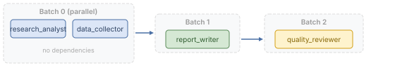

# Orchestration Reference

## Mental Model

Orchestration is **Layer 5** of AWP and answers a single question: *In what order, under which conditions, and inside which envelope do agents run?* It is the connective tissue between static agent definitions and a working workflow.

AWP deliberately ships **two orchestration engines** rather than one super-engine, because the two extremes of agent workflows have fundamentally different needs:

- **DAG engine** — a directed acyclic graph of agents with explicit `depends_on` edges. Use it when you can enumerate the steps upfront. It is predictable, cheap to budget (N agents × cost), and easy to audit. This is the right tool for A0-A1 workflows: pipelines, ETL, fan-out/fan-in, conditional branches.
- **Delegation Loop engine** — a manager agent that dynamically spawns ephemeral workers, validates their output, and iterates until the task is complete or the budget is exhausted. Use it when the steps emerge from the task content itself. This is the right tool for A2-A4 workflows: research, open-ended analysis, recursive sub-delegation.

Both engines share the same agent contract (R17 confidence output), the same tool registry, the same memory tiers, and the same observability layer. The difference is *who decides what runs next*: a static graph (DAG) or a manager LLM bounded by a deterministic envelope (Delegation Loop).

The two engines also **compose**: a DAG node may itself be a delegation loop, giving you a predictable outer flow with an adaptive inner step (see [Pattern 4 in ORCHESTRATION_ENGINES.md](ORCHESTRATION_ENGINES.md#pattern-4-dag-with-delegation-loop-inner-step-composed)).

This file is the **DAG engine reference** and the configuration surface for delegation-loop fields that live under `orchestration.delegation_loop`. For the engine comparison, philosophy, and patterns, see [ORCHESTRATION_ENGINES.md](ORCHESTRATION_ENGINES.md). For the critique and evaluation loops, see [critique.md](critique.md) and [evaluation.md](evaluation.md). For the manager's autonomous decision-making, see [manager-intelligence.md](manager-intelligence.md).

  

## Engine

### `orchestration.engine`

- **Type:** string
- **Required:** Yes
- **Allowed values:** `"dag"`

Two engines are available:

- `dag` — Directed Acyclic Graph for A0-A1 workflows (described below)
- `delegation_loop` — Manager-worker loop for A2-A4 workflows (see [ORCHESTRATION_ENGINES.md](ORCHESTRATION_ENGINES.md))

```yaml
orchestration:
  engine: dag
```

## Graph Nodes

The `orchestration.graph` section defines the agent execution graph as a list of node definitions.

### Node Fields

| Field | Type | Required | Default | Description |
|-------|------|----------|---------|-------------|
| `id` | string | Yes | -- | Unique node identifier. Must match an agent's `identity.id`. |
| `agent` | string | Yes | -- | Path to the agent directory relative to the workflow root. |
| `enabled` | boolean | No | `true` | Whether this node is active. Disabled nodes are skipped. |
| `depends_on` | list | No | `[]` | Dependencies. See below. |
| `share_input` | list | No | `[]` | State fields to inject from workflow context into this agent's input. |
| `share_output` | list | No | `[]` | Output fields this agent exposes to downstream agents. |
| `description` | string | No | -- | Human-readable description of this node's role. |
| `on_failure` | string | No | `"stop"` | Action on failure: `"stop"`, `"continue"`, `"retry"`, or `"skip"`. |
| `loop` | object | No | -- | Loop configuration. |
| `fan_out` | object | No | -- | Fan-out configuration. |
| `timeout` | integer | No | -- | Per-node timeout in seconds. Overrides `execution.timeout_per_agent`. |
| `retry` | object | No | -- | Per-node retry configuration. |

### Dependencies

The `depends_on` field defines execution ordering. It accepts two forms.

#### Simple Dependencies

A list of agent IDs. The node must not execute until all listed agents have completed successfully.

```yaml
depends_on:
  - research_analyst
  - data_collector
```

#### Conditional Dependencies

A list of objects with an `id` and `expr` field. The node executes only if all expressions evaluate to `true`.

```yaml
depends_on:
  - id: research_analyst
    expr: "state.research_analyst.decision == 'proceed'"
  - id: data_collector
    expr: "state.data_collector.status == 'complete'"
```

- Expressions must reference state fields using `state.{agent_id}.{field}` syntax.
- The runtime evaluates expressions after the dependency agent completes.
- If any conditional dependency evaluates to `false`, the node is skipped.

### Graph Validation

The runtime must validate the graph at load time:

1. The graph must contain at least one node.
2. The graph must be a valid DAG (no cycles). See [R6](validation.md).
3. Every `depends_on` reference must resolve to a valid node `id`. See [R7](validation.md).
4. Every node `id` must be unique. See [R5](validation.md).
5. Every node `id` must match an `identity.id` in the corresponding `agent.awp.yaml`.

## Execution Modes

### `orchestration.execution`

| Field | Type | Required | Default | Description |
|-------|------|----------|---------|-------------|
| `mode` | string | Yes | -- | `"sequential"`, `"parallel"`, `"conditional"`, or `"adaptive"`. |
| `timeout_per_agent` | integer | No | `120` | Default timeout per agent in seconds. |
| `timeout_total` | integer | No | `300` | Total workflow timeout in seconds. |
| `timeout_idle` | integer | No | `60` | Maximum idle time before the workflow is terminated. |
| `on_error` | string | No | `"stop"` | Default error handling: `"stop"`, `"continue"`, or `"retry"`. |

### `sequential`

Agents execute one at a time in topological order. Each agent must complete before the next begins. If two agents have no dependency relationship, their relative order is implementation-defined.

### `parallel`

Independent agents execute concurrently. Agents with no mutual dependency may run in parallel. Agents with dependencies must wait for all dependencies to complete.

### `conditional`

Execution follows the DAG with conditional branching. Conditional expressions on `depends_on` determine which branches execute. Skipped branches do not produce output. Downstream agents of skipped branches are also skipped unless they have alternative satisfied dependencies.

### `adaptive`

The runtime dynamically determines execution order based on state. The DAG serves as a constraint (no cycles, dependency ordering) but not a strict schedule. The runtime must still respect `depends_on` constraints.

## Execution Order Visualization

The runtime sorts agents topologically into batches. Agents within the same batch have no mutual dependencies and may execute in parallel (in `parallel` or `conditional` mode).

  

## Timeouts

Timeouts are resolved in order of specificity:

1. Node-level `timeout` (highest priority)
2. Execution-level `timeout_per_agent`
3. Runtime default (120 seconds)

When a timeout expires:
- The runtime must terminate the agent's execution.
- The runtime must set the agent's state to indicate a timeout error.
- The `on_failure` strategy for the node determines subsequent behavior.

## Retry Configuration

| Field | Type | Default | Description |
|-------|------|---------|-------------|
| `retry.max_attempts` | integer | `1` | Maximum execution attempts (1 = no retry). |
| `retry.backoff` | string | `"exponential"` | Backoff strategy: `"none"`, `"linear"`, or `"exponential"`. |
| `retry.backoff_base` | float | `2.0` | Base for backoff calculation in seconds. |
| `retry.backoff_max` | float | `60.0` | Maximum backoff delay in seconds. |
| `retry.retryable_errors` | list | `["timeout", "rate_limit", "server_error"]` | Error types that trigger a retry. |
| `retry.non_retryable_errors` | list | `["validation_error", "auth_error"]` | Error types that must not be retried. |

### Backoff Calculation

- **none:** No delay between retries.
- **linear:** Delay = `backoff_base * attempt_number` seconds.
- **exponential:** Delay = `min(backoff_base ^ attempt_number, backoff_max)` seconds.

## Control Flow

### Conditional Execution

The `enabled` field on a graph node may be a boolean or a string expression:

```yaml
- id: fallback_researcher
  agent: agents/fallback_researcher
  enabled: "state.research_analyst.decision == 'retry_with_fallback'"
  depends_on:
    - research_analyst
```

When `enabled` is a string, the runtime evaluates it as a boolean expression against the current state.

### Loops

The `loop` field on a graph node enables iterative execution.

#### Standard Loop

```yaml
loop:
  type: standard
  max_iterations: 5
  condition: "state.report_writer.quality_score < 0.9"
```

| Field | Type | Required | Description |
|-------|------|----------|-------------|
| `type` | string | Yes | `"standard"` or `"interactive"`. |
| `max_iterations` | integer | Yes | Maximum loop iterations. The runtime must enforce this limit. |
| `condition` | string | Yes | Expression evaluated after each iteration. Loop continues while `true`. |

#### Interactive Loop

```yaml
loop:
  type: interactive
  max_iterations: 10
  prompt_field: "state.report_writer.needs_input"
  input_channel: "user_feedback"
```

Interactive loops pause execution to await external input (e.g., human feedback) before continuing.

| Field | Type | Required | Description |
|-------|------|----------|-------------|
| `prompt_field` | string | Yes | State field that indicates input is needed. |
| `input_channel` | string | Yes | Channel or endpoint for receiving input. |

### Subworkflows

A graph node may reference a subworkflow instead of a single agent:

```yaml
- id: deep_analysis
  subworkflow: "workflows/deep-analysis"
  depends_on:
    - research_analyst
  share_input:
    - findings
  share_output:
    - detailed_report
```

- The subworkflow must be a valid AWP workflow with its own `workflow.awp.yaml`.
- State is passed via `share_input` and returned via `share_output`.
- The subworkflow executes as a single unit from the parent graph's perspective.

### Fan-Out / Fan-In

Fan-out distributes work across multiple parallel instances of an agent:

```yaml
- id: parallel_researcher
  agent: agents/researcher
  fan_out:
    source: "state.context.topics"
    variable: "topic"
    max_parallel: 5
  fan_in:
    strategy: merge
    target_field: all_findings
```

#### Fan-Out Fields

| Field | Type | Required | Description |
|-------|------|----------|-------------|
| `fan_out.source` | string | Yes | State field containing an iterable to distribute. |
| `fan_out.variable` | string | Yes | Variable name injected into each instance's state. |
| `fan_out.max_parallel` | integer | No | Maximum concurrent instances. Default: unbounded. |

#### Fan-In Fields

| Field | Type | Required | Description |
|-------|------|----------|-------------|
| `fan_in.strategy` | string | Yes | `"merge"`, `"reduce"`, `"first"`, or `"majority"`. |
| `fan_in.target_field` | string | Yes | State field where aggregated results are stored. |

Fan-in strategies:
- **merge:** Collect all outputs into a list.
- **reduce:** Apply a reduction function to combine outputs.
- **first:** Use the first completed output and cancel remaining instances.
- **majority:** Use the most common output (requires comparable outputs).

## Error Handling

### Default Strategy

The `orchestration.execution.on_error` field sets the default:

| Strategy | Behavior |
|----------|----------|
| `stop` | Halt the entire workflow immediately. |
| `continue` | Skip the failed agent and continue with agents that do not depend on it. |
| `retry` | Retry the failed agent according to the retry configuration. |

### Per-Node Override

Each graph node may override the default via `on_failure`:

| Strategy | Behavior |
|----------|----------|
| `stop` | Halt the entire workflow. |
| `continue` | Skip this node and continue. Downstream dependents are also skipped. |
| `retry` | Retry using node-level or execution-level retry configuration. |
| `skip` | Mark the node as skipped (not failed). Downstream nodes receive empty state. |

### Circuit Breaker Integration

When enabled (see [Security Reference](security.md)), the circuit breaker monitors agent failures. After consecutive failures exceed the threshold, the agent is automatically skipped until the circuit resets.

### Graceful Degradation

A workflow may define degradation rules:

```yaml
orchestration:
  degradation:
    - agent: research_analyst
      fallback: cached_results
      max_staleness: 3600
    - agent: quality_reviewer
      fallback: skip
```

| Field | Type | Description |
|-------|------|-------------|
| `agent` | string | Agent ID that may degrade. |
| `fallback` | string | Fallback behavior: agent ID, `"cached_results"`, or `"skip"`. |
| `max_staleness` | integer | Maximum age in seconds for cached results. |

## Complete Example

```yaml
orchestration:
  engine: dag

  execution:
    mode: conditional
    timeout_per_agent: 120
    timeout_total: 600
    timeout_idle: 60
    on_error: continue

  graph:
    - id: research_analyst
      agent: agents/research_analyst
      enabled: true
      depends_on: []
      share_output:
        - findings
        - summary
        - confidence_score
      description: "Researches the topic using web search."
      on_failure: retry
      timeout: 180
      retry:
        max_attempts: 3
        backoff: exponential
        backoff_base: 2.0
        retryable_errors:
          - timeout
          - rate_limit

    - id: data_collector
      agent: agents/data_collector
      depends_on: []
      share_output:
        - raw_data
        - statistics
      on_failure: continue

    - id: report_writer
      agent: agents/report_writer
      depends_on:
        - id: research_analyst
          expr: "state.research_analyst.confidence_score >= 0.7"
        - data_collector
      share_output:
        - draft
        - metadata
      loop:
        type: standard
        max_iterations: 3
        condition: "state.report_writer.quality_score < 0.9"

    - id: quality_reviewer
      agent: agents/quality_reviewer
      depends_on:
        - report_writer
      share_output:
        - review
        - approved
      on_failure: skip

  degradation:
    - agent: research_analyst
      fallback: cached_results
      max_staleness: 3600
    - agent: quality_reviewer
      fallback: skip
```

## Delegation Loop Engine

The delegation loop engine powers A2-A4 workflows. For the complete engine comparison, semantics, budget reservation model, and audit trail layout, see [ORCHESTRATION_ENGINES.md](ORCHESTRATION_ENGINES.md).

A few delegation-loop concepts that materially affect orchestration design:

- **Complexity-scored auto-promotion (A4).** The manager does not decide manually whether a worker becomes a submanager. A deterministic complexity scorer (subtask description length, action keywords like *research*/*validate*/*design*, deliverable count, priority) decides automatically. Subtasks scoring `>= complexity_threshold` are promoted; a hard `max_promotions_per_iteration_fraction` cap prevents a single iteration from blowing the parent budget. Configure under `delegation_loop.auto_promotion`. See [manager-intelligence.md](manager-intelligence.md).
- **Reservation model.** Budget allocation uses pre-charge reservation: when a submanager calls `allocate_child(fraction)`, the parent's pool is immediately debited, so concurrent siblings see a correctly shrinking pool. Unused capacity is refunded via `reclaim_child()` on completion. This is what makes the invariant `sum(children) + self <= allocation` hold even under parallel spawning, and is the source of A4's strong termination guarantees together with `max_depth` and the circuit breaker.
- **Bounded submanager fan-out.** In addition to `max_depth` (default **2**), the budget enforces `max_concurrent_submanagers` (default **3**) and `max_total_submanagers_per_run` (default **6**). Reaching either cap falls back to an ephemeral worker instead of failing the dispatch. Submanager child-budget fraction is computed dynamically as `min(0.3, 0.8 / n)` where *n* is the number of submanagers spawned in the same dispatch, so total submanager spend is bounded at 80% of the parent envelope regardless of sibling count.
- **Submanager output merging.** Each submanager writes its deliverables into its own `output/<sub_run_id>/` sandbox under the parent workflow dir. On completion, the parent runner merges those files back into the parent output dir via `_merge_submanager_outputs`; collisions are renamed `<submanager_name>__<filename>` so nothing is silently lost.
- **Convergence detector.** The manager loop force-completes (`partial: true`, `reason: forced_convergence`) when confidence deltas across the last two iterations are below 0.05 or when three consecutive iterations produce identical `key_findings`. The minimum-iteration floor is `max(5, pending_subtask_count + 3)` — the detector never fires while unstarted subtasks remain in the task plan, because confidence legitimately plateaus between phases of a multi-phase task.
- **Pre-progress planning guard.** The manager is allowed up to 2 consecutive PLAN decisions in strict mode (3 in relaxed mode) before any worker has reported progress. Once any worker reaches `in_progress`, `completed`, or `failed` status, the pre-progress plan counter resets — subsequent PLANs (refinements) are legitimate and do not count against the guard. This prevents endless planning loops while allowing iterative plan refinement and R31-rejected re-plans after initial progress.
- **Redundancy guard + critique gate on DELEGATE.** Every dispatch is signed via a sorted hash of normalized worker instructions. If a new dispatch matches a past signature *and* the last iteration's mean critique score is below `critique.min_score_to_complete` (default **0.6**), the DELEGATE decision is overridden and the manager is forced into DIAGNOSE/REPAIR on the next pass instead of re-issuing the same subtasks.
- **Per-iteration fan-out cap.** `budget.max_workers_per_iteration` (default **6**) is a pre-spawn hard cap on the number of workers the manager is allowed to dispatch in a single DELEGATE decision. When exceeded, the runner trims the dispatch list to the cap, writes the overflow summary into `state["_deferred_workers"]`, and records a `max_workers_per_iteration` trace-gate event. The manager is then forced to merge subtasks or re-dispatch the overflow in a later iteration. This prevents a single DELEGATE turn from blowing the worker budget on a wide fan-out.
- **Deliverable-presence gate.** Before a COMPLETE decision is accepted, every manager-declared deliverable path MUST exist on disk and be non-empty. The gate derives required paths in priority order: (1) `required_outputs: [<relpath>, …]` field on each subtask of the active task plan, (2) path tokens scraped from `success_criteria` / `description` using a regex anchored on the `_output_dir` / `_workspace_dir` placeholders, (3) path tokens from the original task string. When none of the three yield any path, the gate emits a WARNING and becomes a non-blocking no-op. On rejection, it emits a `deliverable_presence` gate event with `missing: [...]`, `empty: [...]`, `source: "required_outputs" | "success_criteria"` and nudges the manager with a textual repair instruction.
- **Completion-retry circuit breaker.** `budget.max_rejected_completions` (default **2**) bounds how many times the manager can have a COMPLETE decision rejected by the completion-gate chain (`deliverable_presence`, `placeholder`, `file`, `structural_integrity`, `critique`, `eval`) before the runner takes over. On the Nth rejection, if the last gate-rejection payload identifies a concrete defect, the runner synthesizes a repair subtask (`id: repair_auto_<iter>`, priority `critical`, `required_outputs` populated from the defect) and force-routes the next iteration into DELEGATE. If no repair can be derived (e.g. a pure evaluation-score miss), the run terminates as `partial` with reason `max_rejected_completions`. The counter resets on any successful DELEGATE, so the breaker only fires on true oscillation.
- **Plan-loop deterministic transition.** When the `plan_loop` gate fires (manager issued >MAX consecutive PLANs without any worker progress), the runner picks one of two transitions deterministically: `forced_delegate` (pending subtasks exist → lock the plan via `state["_plan_locked"]` and force DELEGATE on the next iteration) or `forced_terminate` (no pending subtasks → exit as `partial` with reason `plan_loop_stall`). The gate event records `transition: "forced_delegate" | "forced_terminate"` alongside `pre_progress_plans` and `pending_subtasks`.
- **Terminal status contract.** Every run ends with exactly one of `{complete, partial, failed, aborted}`, mapped from the internal termination reason via the `_finalize_terminal_status(reason)` helper. Cap-forced exits — `defect_category_cap`, `plan_loop`, `max_total_tokens`, `max_total_workers`, `max_wall_time`, `max_loops`, `max_tool_calls`, `forced_convergence`, `stall_detected` — map to **`partial`**, never `complete`. Hard evaluation/execution failures (`eval_fail`, `error: …`) map to **`failed`**. Abrupt process-level exits (SIGTERM/SIGINT, killed process, unhandled exception during teardown) map to **`aborted`** with reason `process_exit_without_terminal_event` or `sigterm`/`sigint`.
- **Finalizer + signal handling.** The delegation-loop runner wraps its main loop in `try/except/finally`, registers `SIGTERM`/`SIGINT` handlers on the root manager (submanagers inherit the parent disposition), and always emits `run_completion.json` + the `run.complete` WebSocket event before returning. The runner_service canonicalizes the status and attaches a `reason` field. On server restart, any runs still flagged `running` without a live PID are marked `aborted` in the SQLite DB so the UI sidebar never shows a permanent "running" indicator for a dead process.
- **Signal watchdog for blocking LLM calls.** The SIGTERM/SIGINT handler also invokes `LLMClient.close_all()`, which reaches into every live httpx client's connection pool and raw-socket-`shutdown()`s each in-flight connection. Without this step, the main thread stays blocked inside the C-level socket `recv()` of a slow `httpx.post()` call, so the Python-level `signal_state["pending"]` flag is never observed and the `finally` block never runs. The raw-socket abort raises `httpx.ReadError` into the blocking thread, which propagates up to the delegation loop's `except Exception` branch, the `finally` emits `run.complete` with `reason="sigterm"`/`"sigint"`, and the DB row transitions `running → aborted` immediately — no SIGKILL needed.
- **Forbidden tools envelope.** `shell.execute` and `terminal.execute` are by default forbidden inside the delegation loop. Workers do shell-like work via `code.execute` in the sandbox or via dynamically generated MCP tools. See [tools.md](tools.md).
- **Code mode + tool creation default to enabled** for delegation-loop workers, because token cost and tool coverage are the dominant constraints in A2-A4. The manager can disable them per-worker via the envelope.

### Critique Configuration

### Critique Configuration

The delegation loop supports an optional **Reflective Critique Loop** that analyzes worker outputs for defects and triggers targeted repairs. See [critique.md](critique.md) for the full reference.

```yaml
orchestration:
  engine: delegation_loop
  delegation_loop:
    critique:
      enabled: true
      mode: inline
      max_repair_attempts: 2
      repair_budget_fraction: 0.15
      pattern_memory: true
      defect_categories:
        - missing_data
        - wrong_format
        - incomplete
        - hallucinated
        - policy_violation
```

| Field | Type | Default | Description |
|-------|------|---------|-------------|
| `critique.enabled` | bool | `false` | Enable reflective critique loop |
| `critique.mode` | string | `"inline"` | `"inline"` (worker model) or `"dedicated"` (separate critic) |
| `critique.model` | string | `null` | LLM for critic. `null` = inherit worker model |
| `critique.max_repair_attempts` | int | `2` | Max repair cycles per worker |
| `critique.repair_budget_fraction` | float | `0.15` | Max budget fraction for repairs |
| `critique.pattern_memory` | bool | `true` | Accumulate cross-worker failure patterns |
| `critique.defect_categories` | list | 6 defaults | Defect types to diagnose |
