# Outer Loop Optimizer (A5, experimental)

**The outer loop treats AWP runs as a training problem.** Prompt artifacts are
the model parameters, a completed run is one forward pass, a deterministic
scalar loss quantifies how well the run went, and an LLM-as-optimizer acts as
a text-gradient to nudge the artifacts between runs. Over many runs across a
suite of tasks, the artifacts that drive manager planning, worker pitfalls,
critique rubric, and pattern priming **learn from experience** — in the
stochastic-gradient-descent sense of that phrase.

> **Status:** A5 is experimental. It ships fully-wired in the runtime and the
> UI, but is opt-in at the CLI (`--with-textgrad`) and deliberately **outside
> the compliance spec** (§2.5 of `spec/versions/1.0/compliance.md`). The
> autonomy levels A0–A4 continue to describe how *one* run behaves; A5
> describes how the system learns *across* runs.

---

## 1. Mental model

Five intuitions that make the rest of this document click into place.

### 1.1 The inner loop is *search*; the outer loop is *learning*

AWP's inner delegation loop (A2–A4) is **search under uncertainty over one
task**. The manager explores subtask decompositions, the workers try code,
the critique gate rejects bad completions, repair spawns fresh attempts.
Every run starts cold and ends when the task is done or the budget is hit.
The inner loop has no memory of *previous* tasks — each run is a one-shot
episode with its own random seed.

The outer loop adds the missing axis: it runs the inner loop many times
across many tasks, observes a scalar per run, and **edits the prompts that
bias the inner loop's search**. It is not doing any work on the task itself.
It is tuning the priors — the worker pitfalls, the manager planning
preamble, the critique rubric — that all future inner loops will inherit.
This is what "learning" means in an SGD sense: the parameters change shape
so the next forward pass is, on average, better.

Key consequence: the outer loop does **not** attempt to improve *the
current* run. A run is already complete by the time its loss is computed.
The only thing the outer loop can change is the starting condition of
*future* runs.

### 1.2 A run is a black-box function f(task, θ) → loss

The central abstraction is:

```
run(task, θ) = inner_loop(task, prompts_resolved_through(θ))
L           = loss(run_completion.json, metrics.jsonl)
```

Think of a run the way you would think of a forward pass through a deep
network: a deterministic (up to LLM sampling noise) mapping from
*(input, parameters)* to *output*, and a scalar loss on top.

- **input `task`** — a string describing what to build.
- **parameters `θ`** — the six prompt artifacts (§4). Each is a chunk of
  text, versioned in the registry.
- **output** — the run's artifacts (`run_completion.json`, deliverables,
  events) plus the derived scalar `L ∈ [0, 1]`.

The function is black-box (no derivatives available), noisy (LLMs sample at
temperatures > 0), and expensive per evaluation (one call ≈ 10⁴–10⁶
tokens). Those three properties alone tell you what kind of optimizer is
viable: something that tolerates noise, reuses evaluations, and updates
sparingly.

### 1.3 The "text-gradient" is not a metaphor — it's a finite-difference oracle

In classical SGD the gradient ∂L/∂θ is computed analytically via the chain
rule. Here there is no chain rule: we have a black-box L and a discrete θ
that lives in a textual space.

What TextGrad / OPRO / DSPy realised — and what the AWP optimizer
implements — is that an LLM can serve as a **finite-difference oracle over
text**. Given

1. the current artifact content (current θ),
2. the aggregated defect / failure summary from the recent epoch
   (∇L evidence: *which of the declared deliverables were missing?*,
   *which critique defects recurred?*, *which subtasks hit repeated gate
   rejections?*),
3. a learning rate η,

the LLM is asked to produce *new* artifact content that it *expects* would
reduce the loss — together with a self-reported `expected_loss_reduction`
and `confidence`. That numeric self-report is what the optimizer ranks
candidates by. It is **not** a calibrated gradient in the mathematical
sense (the LLM cannot compute one). It is a rough, biased, but cheap
directional hint — which is the actual trait SGD needs to converge in
expectation.

The concrete optimizer prompt and parsing rules are in §7; here it is
enough to hold in mind that "gradient" means "structured hint from an LLM
that consumes the current artifact, evidence, and η, and returns a
candidate update."

### 1.4 A worked trace — one epoch, one update, one rollback

A concrete numerical example that runs end-to-end in your head.

**Start of epoch 1.** All six artifacts at v0 (default). The suite has
three tasks. `parent_artifacts = {worker_pitfalls: 0,
manager_planning_preamble: 0, …}`.

**Inner runs (epoch 1).** Three runs produce losses `L = [0.40, 0.53,
0.31]`. `mean_loss_1 = 0.413`. The `epochs` row is written with
`mean_loss = 0.413` and the all-zeros `parent_artifacts_json`.

**Text-gradient (epoch 1 → epoch 2).** The optimizer is called with the
three candidate names `["worker_pitfalls", "manager_planning_preamble",
"critique_rubric"]` and η=0.5. Three LLM calls later, the replies are:

| candidate                   | expected_loss_reduction | confidence | product |
|-----------------------------|-------------------------|------------|---------|
| worker_pitfalls             | 0.18                    | 0.55       | 0.099   |
| manager_planning_preamble   | 0.32                    | 0.68       | **0.218** |
| critique_rubric             | 0.12                    | 0.60       | 0.072   |

Winner: `manager_planning_preamble` (argmax of the product). A new row is
written to `artifact_versions` as `(manager_planning_preamble, v1,
<new text>, parent_version=0, epoch_id=…, is_active=1)`. The v0 row's
`is_active` is flipped to 0. `child_artifacts` becomes
`{manager_planning_preamble: 1, others: 0}`.

**Inner runs (epoch 2).** Every manager call now resolves
`manager_planning_preamble` → v1 content. Runs produce
`L = [0.045, 0.62, 0.365]`. `mean_loss_2 = 0.343`.

**Regression check (epoch 2 → epoch 3).** `0.343 < 0.413` → no regression.
The next epoch may propose another update at η=0.5.

**Counterfactual.** Had `mean_loss_2` come out 0.48 instead, the regression
check would fire: `rollback_to("manager_planning_preamble", 0)` flips
active back to v0, η halves to 0.25, the optimizer is **not** called for
epoch 3 (the current epoch's probe already cost three runs). Epoch 3 simply
re-measures the baseline with η remembered for the *next* non-regressive
step.

### 1.5 Where the analogy holds, and where it breaks

**Holds cleanly:**

- Batch × epoch × learning-rate structure carries over one-to-one.
- Monotone-in-expectation decrease of the training signal (§13 shows an
  empirical 17 % drop after one non-trivial step).
- Regularisation via sparsity (one artifact per epoch — analogue to L0
  regularisation) and via rollback (analogue to line search / trust region).

**Strained but workable:**

- The parameter space is **discrete and textual**, not a continuous vector.
  SGD's convergence proofs do not apply directly; what we actually have is
  an MCMC-style acceptance loop with an LLM-proposed move kernel.
- The "gradient" is a **single-step noisy hint**, not derived from a smooth
  loss landscape. Variance across candidates is real (§13's per-task numbers
  swing from −89 % to +18 %).
- The minibatch is **tiny** (3–10 tasks). Variance reduction that comes for
  free in classical SGD at batch sizes of thousands must be replaced here
  by rollback + small η.

**Breaks:**

- There is no chain rule — updates are atomic per artifact, not a gradient
  through a computational graph. You cannot blame a specific token in
  `worker_pitfalls` for a specific defect in a specific worker's output.
- There is no guarantee of differentiability, Lipschitz continuity, or even
  monotonicity: a proposed artifact rewrite can make losses *worse* on
  some tasks while improving others. The mean-loss criterion is the only
  thing that makes this tolerable.
- LLM sampling noise contaminates both the forward pass (the run's own
  randomness) *and* the gradient estimate (the optimizer's sampling). This
  is why `rollback_on_regression=True` is the default — without it the
  optimizer can chase its own noise.

The practical upshot: treat A5 as **stochastic search with an LLM-biased
proposal distribution**, not as a proof-of-convergence optimizer. The SGD
frame is the right *pedagogical* picture because it tells you what to tune
(η, batch size, sparsity), but the implementation is closer in spirit to
Bayesian optimisation with a learned proposal than to actual gradient
descent.

---

## 2. The SGD analogy — mapping table

<p align="center">
  
</p>

| Element                    | Classical SGD                      | AWP Outer Loop                                                  |
|----------------------------|------------------------------------|-----------------------------------------------------------------|
| **Parameters** θ           | Weight vector                      | Six versioned prompt artifacts (§4)                             |
| **Batch**                  | `x_b` from data distribution       | `TaskSuite` of N tasks (typically 3–10)                         |
| **Forward pass**           | `y = f(x_b; θ)`                    | `AgentWorkflow.run(task, artifacts)` → `run_completion.json`    |
| **Loss** L                 | `‖y − y*‖²` etc., continuous       | Deterministic scalar ∈ [0, 1] from eval, critique, gate, budget, status (§6) |
| **Gradient** ∂L/∂θ         | Chain rule through the network     | LLM call that proposes a full rewrite of exactly one artifact  |
| **Update step**            | `θ ← θ − η · grad`                 | `registry.put_version(...) + set_active(...)` — discrete hop    |
| **Learning rate** η        | Step size                          | `learning_rate ∈ [0, 1]` passed into the optimizer prompt       |
| **Epoch**                  | Full pass over training set        | Full pass over all tasks in the suite                           |
| **Regularization**         | Weight decay, dropout              | *One* artifact updated per epoch + rollback-on-regression       |
| **Early stopping**         | Validation loss plateau            | `mean_loss` regresses → rollback + η halves                     |

The analogy is **intentional, not decorative.** The outer loop is literally
a gradient-free optimizer over a discrete, textual parameter space, using
an LLM as the ∂L/∂θ black-box — akin to TextGrad / DSPy / OPRO. The
discrete step size is managed by the `learning_rate` parameter that the
LLM prompt consumes: at η=1 the optimizer may rewrite the whole artifact;
at η=0.2 it is instructed to change only a narrow section.

---

## 3. Why this matters

AWP's inner loop is a **rejection-sampling** process on top of a single task:
plan → delegate → repair → complete. The inner loop correctly treats each
run as a one-shot search problem. What the inner loop cannot do is
**learn across runs** — every run starts from the same hard-coded prompt
library. Every time a manager made the same planning mistake, every time a
worker missed the same pitfall, every time critique caught the same defect
class, that signal was discarded the moment the run ended.

The outer loop closes that gap. It harvests the signal that is already
there (eval, critique, gates, budget envelope), reduces it to a scalar, and
uses an LLM to propose a *concrete textual delta* to the artifact most
likely to be responsible. Over 5–10 epochs on a moderately diverse suite,
this compounds: the system gets better at its own meta-tasks — planning,
pitfall awareness, rubric calibration — without any human editing the
prompt library.

---

## 4. The six learnable artifacts

| # | Artifact name                         | What it controls                                                          |
|---|---------------------------------------|---------------------------------------------------------------------------|
| 1 | `worker_pitfalls`                     | Hard-won pitfalls injected into every worker system prompt                |
| 2 | `manager_planning_preamble`           | Preamble shown to the manager before the PLAN decision                    |
| 3 | `experiment_context_hint_template`    | Cross-run "Previous Runs" context section                                 |
| 4 | `pattern_library`                     | Header framing for the pattern registry rendered into prompts             |
| 5 | `tool_description_templates`          | Boilerplate around induced tools in worker prompts                        |
| 6 | `critique_rubric`                     | Rubric text shown to the critique LLM                                     |

All six live under
`packages/awp-runtime/src/awp/outer_loop/defaults/`. The runtime fetches
each one through `ArtifactRegistry.get_active(name).content` — the default
implementation falls back to the hard-coded v0 string when the outer-loop
DB is absent, so turning A5 off is a no-op (A1 invariant).

Version 0 is *synthetic*: it is never written to the DB, cannot be deleted,
and is the guaranteed floor the registry can always fall back to. Versions
1, 2, … are rows in the `artifact_versions` table of
`~/.awp/outer_loop.db` (path overridable via `$AWP_OUTER_LOOP_DB`). At any
moment, at most one version of each artifact has `is_active = 1`.

---

## 5. End-to-end pipeline

<p align="center">
  
</p>

Concretely, `SuiteRunner.optimize(suite, n_epochs, learning_rate, optimizer,
rollback_on_regression)` walks the pipeline as follows:

1. **Read parent state.** Snapshot the currently-active version of each of
   the six artifacts → `parent_artifacts: dict[str, int]`. Insert a row in
   `epochs` with `started_at`, `parent_artifacts_json`, `mean_loss = NULL`.
2. **Run the inner loop N_tasks times.** For each task in the suite, invoke
   `AgentWorkflow.run(task, budget=task.budget)` — a full AWP A2+
   delegation-loop run with critique + eval + metrics emission. The run
   produces `run_completion.json`, `events.jsonl`, and `metrics.jsonl`.
3. **Compute per-task loss.** `compute_run_loss(run_dir)` reads the run
   directory and returns a `LossBreakdown(total, eval_component, …)`.
   Insert one row in `epoch_runs` with `loss` and `scores_json`.
4. **Aggregate.** `mean_loss_e = mean(per_task_losses)`. Update the `epochs`
   row with `completed_at` + `mean_loss`.
5. **Regression check.** If `e > 1` and `mean_loss_e > mean_loss_prev` and
   `rollback_on_regression=True` → pop the last update off the artifact
   stack (`registry.rollback_to(name, parent_version)`), halve the learning
   rate, record a `rollback` event in `child_artifacts_json`, and **skip
   the optimizer call for this epoch**. The counter reset makes the next
   epoch a fresh probe with a smaller step.
6. **Text-gradient (non-regressive path).** Call `TextGradOptimizer.
   propose_update(epoch_result, candidate_artifacts, learning_rate)`. For
   each candidate (§6) the optimizer emits one LLM call; the winner is the
   proposal with the highest `expected_loss_reduction × confidence`.
7. **Apply.** `registry.put_version(name, new_content, parent_version,
   epoch_id)` writes the new version; `registry.set_active(name, new_ver)`
   flips the active flag. The update is recorded in
   `epochs.child_artifacts_json.events` with the full metadata (rationale,
   expected_loss_reduction, confidence, learning_rate).
8. **Next epoch.** `mean_loss_prev = mean_loss_e`; repeat from step 1 until
   `n_epochs` is exhausted or the CLI hits `Ctrl-C`.

`awp optimize` (without `--with-textgrad`) stops at step 4 and iterates: it
runs the suite N times against unchanged artifacts, so the user can observe
the natural variance of the inner loop before turning on the optimizer.

---

## 6. The loss function

```
L = w_e · (1 − eval_score)
  + w_c · (1 − critique_score)
  + w_g · min(1, gate_rejection_count / max_rejections)
  + w_b · max(0, 1 − budget_remaining_pct / 100)
  + w_s · status_penalty      (complete=0, partial=0.5, failed=1, aborted=1)
```

Default weights `(w_e, w_c, w_g, w_b, w_s) = (0.4, 0.3, 0.15, 0.05, 0.1)` sum
to 1.0, so `L ∈ [0, 1]`. Each per-component value is clamped into [0, 1]
independently. Missing signals default to a **neutral 0.5** — the loss is
always defined, even on a partial artifact set.

Implementation: `packages/awp-runtime/src/awp/outer_loop/loss.py`
(`LossWeights`, `LossBreakdown`, `compute_run_loss`).

Why five components:

- `eval` and `critique` carry the domain-specific quality signal.
- `gate_rejection_count` penalises completion attempts the deterministic
  gate chain had to reject, which is the dominant failure mode the
  optimizer can *directly* attack by rewriting `manager_planning_preamble`
  or `critique_rubric`.
- `budget_remaining_pct` lightly rewards runs that finish under budget, so
  the optimizer gets a second-order push toward more efficient plans.
- `status_penalty` ensures `failed` and `aborted` runs cannot hide behind
  partial good signals.

---

## 7. TextGrad optimizer — internals

`packages/awp-runtime/src/awp/outer_loop/textgrad.py`:

- **System prompt** (`_OPTIMIZER_SYSTEM_PROMPT`) is **hard-coded**. It is
  *not* a learnable artifact by design — making it one would need a
  second-order stabiliser.
- For each `candidate_name` in the candidate list, the optimizer emits one
  `chat_text` call with:
  - the current artifact content (`registry.get_active(name).content`),
  - the aggregated defect summary from `EpochResult.task_results[*].scores`
    and (if available) critique output,
  - the explicit `learning_rate` (copied verbatim into the prompt so the
    LLM can scale its proposal accordingly).
- The reply is parsed as strict JSON with a lenient fallback (markdown
  fences are unwrapped; brace-matching recovers from trailing prose).
  Expected fields:
  ```json
  {
    "artifact_name": "<one of the candidates, or null>",
    "proposed_content": "<full new artifact content>",
    "rationale": "<1–2 sentences>",
    "expected_loss_reduction": 0.0,
    "confidence": 0.0
  }
  ```
- **Proposal rejection.** A candidate reply is dropped from the ranking if
  any of these hold: `artifact_name` is null or not in the candidate set,
  `proposed_content` is identical to the current content, content length
  exceeds 20 000 characters, the JSON fails to parse after the fallback,
  or the LLM call raised an exception.
- **Winner selection.** `argmax(expected_loss_reduction × confidence)`. If
  no candidate survives, `propose_update` returns `None` and the outer loop
  treats the epoch as a no-op.

This design keeps the optimizer **sparse**: at most one artifact is
updated per epoch. Sparse updates are easier to diagnose, trivial to
roll back, and deliberately slower-converging — which is the right
trade-off when each epoch costs multiple LLM-heavy runs.

---

## 8. Artifact versioning + rollback

<p align="center">
  
</p>

At every epoch boundary the outer loop makes exactly one of three moves
per artifact: **leave unchanged**, **promote to a new version**, or (if a
regression is detected) **roll back to the parent version**. The
`artifact_versions` table keeps the full `(name, version, content,
parent_version, epoch_id, is_active)` history, so every rollback is a
deterministic pointer flip — no content is ever deleted.

`ArtifactRegistry.rollback_to(name, version)` is the public surface. The
runner uses it automatically when `rollback_on_regression=True` (the
default) and `mean_loss_e > mean_loss_prev`. The CLI exposes it via
`awp optimize-rollback ARTIFACT_NAME VERSION` for manual intervention.

After every rollback, the runner halves the **next** epoch's learning
rate. This is the outer-loop analogue to SGD's line search: when a step
made things worse, step more cautiously next time.

---

## 9. Suite YAML schema

```yaml
name: research_writeup_v1            # required, unique per suite
description: "Short summary"         # optional
baseline_artifacts:                  # optional, pinned at suite start
  worker_pitfalls: 0                 # 0 = default, n = specific version
  manager_planning_preamble: 0
tasks:
  - name: summarise_paper            # required, stored in epoch_runs.task_name
    task: "Write a 200-word summary..."
    workflow: path/to/workflow.awp.yaml   # optional, uses a default if omitted
    model: "openai/gpt-5-mini"       # optional per-task override
    budget:                          # optional per-task budget overrides
      max_loops: 6
      max_total_workers: 5
      max_total_tokens: 400000
      max_wall_time: 240
    weights:                         # optional LossWeights override
      eval: 0.5
      critique: 0.3
      gate_rejections: 0.15
      budget: 0.02
      status: 0.03
```

Full schema: `packages/awp-runtime/src/awp/outer_loop/suite.py`
(`TaskSuiteSpec`, `SuiteTask`, `load_suite`).

Example:
[`examples/outer_loop/research_writeup.suite.yaml`](../examples/outer_loop/research_writeup.suite.yaml)
and [`examples/e2e/fixtures/fact_card.suite.yaml`](../examples/e2e/fixtures/fact_card.suite.yaml).

---

## 10. CLI reference

```bash
# Run suite once, no updates (A2 mode, good for baselining):
awp optimize examples/outer_loop/research_writeup.suite.yaml

# Run 5 epochs with TextGrad and auto-rollback (A3 mode):
awp optimize examples/outer_loop/research_writeup.suite.yaml \
    --epochs 5 --learning-rate 0.5 --with-textgrad

# Disable rollback (study natural variance without the safety net):
awp optimize suite.yaml --epochs 5 --with-textgrad --no-rollback

# Inspect every epoch of a suite:
awp optimize-inspect research_writeup_v1

# Inspect a single artifact's full version history with unified diffs:
awp optimize-inspect --artifact worker_pitfalls

# Manually roll one artifact back to a specific version:
awp optimize-rollback worker_pitfalls 2
```

All commands respect `$AWP_OUTER_LOOP_DB` for an alternative DB path.

---

## 11. UI — the Optimizer tab

The UI server exposes a read-only view onto `~/.awp/outer_loop.db` via the
**Optimizer** top-nav tab (`OptimizerPanel`). Two modes:

1. **Suite list** — every suite in the DB with its epoch count, latest
   mean loss, and two actions per row: **Charts** (opens analytics) and
   **Graph** (pushes the chained-epoch graph into Graph-Vis).
2. **Charts view** — three analytics charts side-by-side:

| Chart                   | What it shows                                                                                                                                                       |
|-------------------------|---------------------------------------------------------------------------------------------------------------------------------------------------------------------|
| **LossCurve**           | Mean loss per epoch (line) + dashed 3-epoch moving average. Dot color: green = update, red = rollback, grey = no event. Tooltip shows `v{from}→v{to}` transition.  |
| **ArtifactDeltaTimeline** | One row per artifact × one column per epoch. Circle = update, red ×  = rollback. Clicking a marker opens a side drawer with a line-based LCS diff.                |
| **PerTaskLossBoxplot**  | Per epoch: min–max range as a vertical bar, dot at the median. Tooltip lists every task's loss.                                                                     |

Endpoints (all degrade to empty-state when the DB is absent):

| Method | Path                                  | Purpose                                              |
|--------|---------------------------------------|------------------------------------------------------|
| `GET`  | `/api/runs/{run_id}/epoch`            | Per-run epoch context (shown in Graph-Vis)           |
| `GET`  | `/api/suites`                         | Suite list for the picker                            |
| `GET`  | `/api/suites/{suite_id}/graph`        | Chained React-Flow graph for Graph-Vis               |
| `GET`  | `/api/suites/{suite_id}/epochs`       | Per-epoch details + per-task losses + artifact events |
| `GET`  | `/api/artifacts/{name}/versions`      | Full version history of one artifact (incl. v0)       |

In a normal run, the Manager node in Graph-Vis additionally renders an
**artifact-version pill** under the model line
(e.g. `pitfalls v2 · rubric v1`) whenever the run belongs to an epoch with
non-default artifacts. Worker nodes get a small **confidence dot**
(green/amber/red) in the top-right corner, derived from `metric.confidence`.

---

## 12. Storage layout

`SqliteArtifactStore` owns four tables in `~/.awp/outer_loop.db`:

| Table              | Key columns                                                                                                |
|--------------------|------------------------------------------------------------------------------------------------------------|
| `artifact_versions` | `(id, artifact_name, version, content, parent_version, created_at, epoch_id, is_active)`, unique on `(artifact_name, version)` |
| `task_suites`      | `(id, name, tasks_json, baseline_artifacts_json, created_at)`                                              |
| `epochs`           | `(id, suite_id, epoch_num, started_at, completed_at, mean_loss, parent_artifacts_json, child_artifacts_json)` |
| `epoch_runs`       | `(epoch_id, run_id, task_name, loss, scores_json)`                                                         |

`child_artifacts_json` holds both the active-version map *and* the event
log:

```json
{
  "artifacts": {"worker_pitfalls": 0, "manager_planning_preamble": 1, ...},
  "events": [
    {"type": "update", "artifact": "manager_planning_preamble",
     "from_version": 0, "to_version": 1,
     "rationale": "Add explicit required-output checklist",
     "expected_loss_reduction": 0.32,
     "confidence": 0.68, "learning_rate": 0.5},
    {"type": "rollback", "artifact": "manager_planning_preamble",
     "from_version": 1, "to_version": 0,
     "mean_loss_prev": 0.34, "mean_loss_current": 0.45,
     "new_learning_rate": 0.25}
  ]
}
```

The store runs SQLite in **WAL mode** with `synchronous=NORMAL` and a
5 s `busy_timeout`, so concurrent `SuiteRunner.run_epoch` workers can
record `epoch_runs` rows without serialising. If WAL is not supported on
the host, the store logs a warning and falls back to the default journal.

DB location: `~/.awp/outer_loop.db` by default, overridable via
`$AWP_OUTER_LOOP_DB`. The path is intentionally **separate from the UI
DB** (`~/.awp/awp_ui.db`) so the outer loop never competes with the UI's
event store for locks.

---

## 13. Empirical results — a 2-epoch run on the fact-card suite

The E2E test at `examples/e2e/outer_loop_full_coverage.py` runs a
3-task × 2-epoch suite (octopi · neutron stars · silk road) against
`openai/gpt-5-mini`. A representative run produced:

| Task          | Epoch 1 (v0 baseline)           | Epoch 2 (after update)          | Δ loss    |
|---------------|---------------------------------|---------------------------------|-----------|
| octopi        | `failed`, loss 0.4038           | `complete`, loss **0.0454**     | **−89 %** |
| neutron_stars | `partial`, loss 0.5250          | `failed`, loss 0.6200           | +18 %     |
| silk_road     | `partial`, loss 0.3110          | `failed`, loss 0.3650           | +17 %     |
| **mean_loss** | **0.4133**                      | **0.3435**                      | **−17 %** |

The TextGrad update picked `manager_planning_preamble` with
`expected_loss_reduction = 0.32, confidence = 0.72`. The observed mean-loss
reduction (0.17) is smaller than the expected (0.32) but of the same sign
and order. The per-task variance (−89 % vs +18 %) is the canonical SGD
minibatch-noise pattern; the mean over tasks is what the optimizer is
actually following.

---

## 14. What the outer loop does **not** do

- **No LLM judge for the loss.** Every loss component is deterministic and
  derived from artifacts the inner loop already writes (`run_completion.
  json`, `metrics.jsonl`). This keeps the optimization signal cheap,
  reproducible, and immune to judge-drift.
- **No multi-artifact updates per epoch.** One artifact, one step. This
  keeps rollback clean and diagnosis tractable.
- **No automatic deployment.** Version promotion happens inside the outer
  loop's own DB. Pinning an improved artifact into `prompts.py` (i.e.
  promoting it from "learned" to "shipped") is an explicit human step.
- **No learnable optimizer prompt.** `_OPTIMIZER_SYSTEM_PROMPT` is
  hard-coded on purpose — making the meta-prompt learnable would require a
  stabiliser we have not built yet.
- **No conformance claim.** The outer loop lives outside
  `compliance.md §2`. A5 will be promoted into the spec only after A3
  shows stable behaviour on a wider set of suites.
