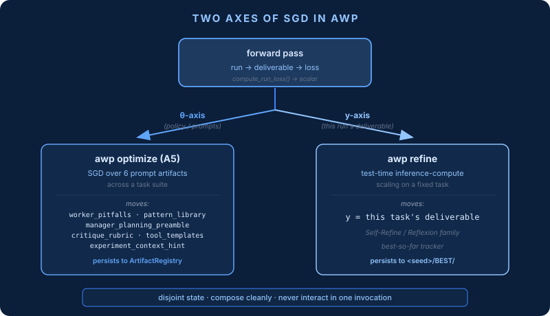
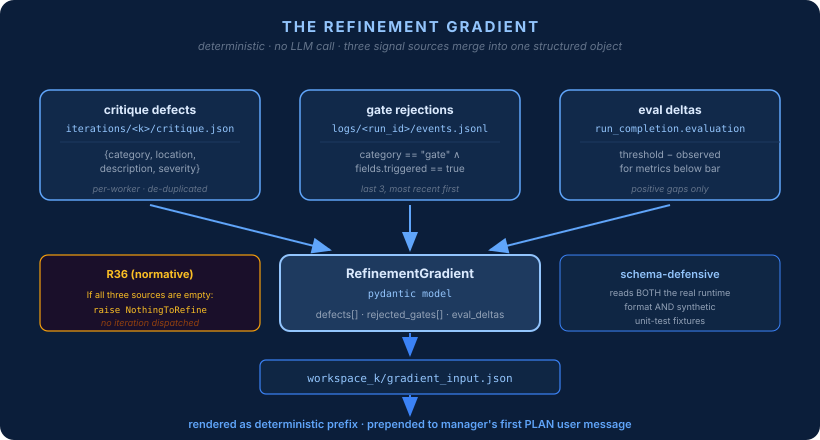
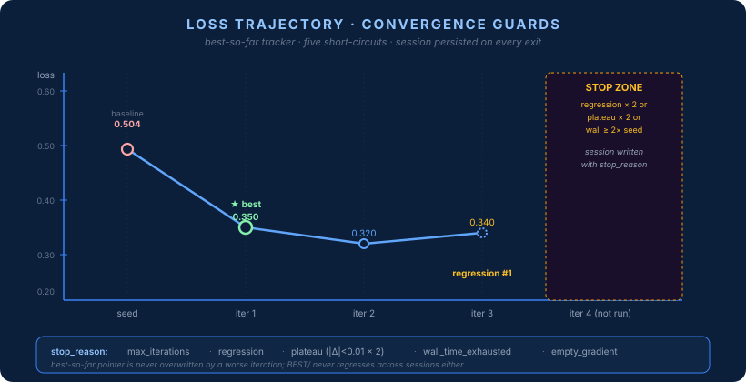
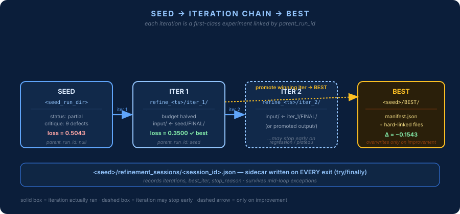
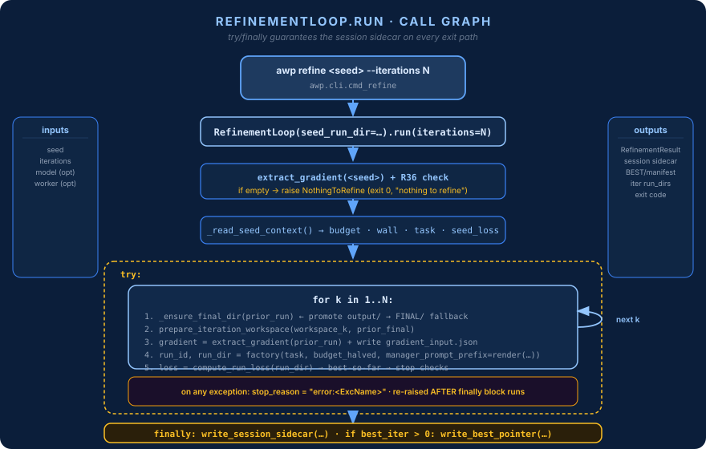

# AWP Refinement Mode

> Task-local iterative refinement of a completed run's deliverable.
> SGD on **y** (the output), not **θ** (the policy).

> **See also** — **Parent**: [docs/README.md](README.md#dynamic-concepts-what-happens-at-runtime) · **Orthogonal axis**: [outer-loop.md](outer-loop.md) moves θ (prompt artifacts) — refinement moves y (the seed run's deliverable); both reuse the same loss function · **Gradient sources**: [critique.md](critique.md) (defects, R35 fixpoint guard), [runtime.md](runtime.md) (last 3 gate rejections from the completion gate chain), [evaluation.md](evaluation.md) (score deltas) · **Never active inside `awp run`**: entered only via `awp refine` · **Guard rule**: **R36 (empty gradient)** — authoritative in [spec/versions/1.0/validation-rules.md](../spec/versions/1.0/validation-rules.md) §12, catalogued in [validation.md](validation.md) · **Autonomy mapping**: [compliance.md](compliance.md) — refinement sits outside the 7 layers of [layer-model.md](layer-model.md) · **Engine context**: [ORCHESTRATION_ENGINES.md](ORCHESTRATION_ENGINES.md) — each iteration is a standalone delegation-loop run with budget halved vs. the seed

`awp refine <seed_run_dir>` reads a completed run, extracts a
deterministic "gradient" from its [critique](../CLAUDE.md#key-protocols)
defects, [gate-chain](../CLAUDE.md#key-protocols) rejections, and
[eval](../CLAUDE.md#key-protocols) deltas, and drives an iterative
loop that re-runs the same task with the prior deliverable as
starting state until the [loss](../CLAUDE.md#4-loss--backprop-the-ml-lens)
stops decreasing. The winning iteration is promoted to
`<seed>/BEST/`. Orthogonal to [`awp optimize`](./outer-loop.md) —
they move different parameters (see §5 "Complementarity") and never
interact.

**Where this sits in AWP:**
- Layer: **6 — Orchestration** (see [CLAUDE.md §Two Orchestration Engines](../CLAUDE.md#two-orchestration-engines)). Refinement is an outer wrapper around the existing [`DelegationLoopRunner`](../packages/awp-runtime/src/awp/runtime/delegation_loop_runner.py); it does not introduce a new engine.
- Autonomy: composes with any A2+ workflow (requires manager + critique + gate chain). Does not change the [autonomy spectrum A0–A4](../CLAUDE.md#project-overview).
- Agent contract: honors [R17](../spec/versions/1.0/validation-rules.md) — every iteration's manager and workers return `{self.name: {"confidence": ..., ...}}`; refinement never reaches inside the contract.
- Budget envelope: every iteration runs under a halved copy of the seed's envelope (see §6.2). The envelope itself ([CLAUDE.md §Key Protocols](../CLAUDE.md#key-protocols)) is unchanged.
- Validation: introduces exactly one new normative rule — [**R36**](../spec/versions/1.0/validation-rules.md) (§1.2 below).

---

## 1. Mental Model

AWP treats every full run as a **forward pass** through a system of
agents. [`CLAUDE.md §4 — Loss & Backprop: the ML Lens`](../CLAUDE.md#4-loss--backprop-the-ml-lens)
formalizes this: the E2E run is the forward pass, the
[gate chain + critique + eval](../CLAUDE.md#key-protocols) produce a
scalar **loss** (computed by
[`compute_run_loss`](../packages/awp-runtime/src/awp/outer_loop/loss.py)),
and the [5-Why-by-Layer protocol](../CLAUDE.md#3-debugging-discipline-structural--conceptual-root-cause-analysis)
is the backprop that turns a symptom into a gradient you can edit
against.

That framing has two natural axes:



### 1.1 Why two axes

A policy update ([`awp optimize`](./outer-loop.md)) teaches the
system to do better *next time* on *any* similar task — it moves
**θ**, the six versioned prompt artifacts held by the
[`ArtifactRegistry`](../packages/awp-runtime/src/awp/outer_loop/artifacts.py)
(`worker_pitfalls`, `manager_planning_preamble`,
`experiment_context_hint_template`, `pattern_library`,
`tool_description_templates`, `critique_rubric` — see
[`awp.outer_loop.defaults`](../packages/awp-runtime/src/awp/outer_loop/defaults/)).
A refinement (`awp refine`) leaves θ alone and spends extra
inference compute *right now* on *this specific deliverable*
until a stricter loss signal says stop. One is meta-learning; the
other is extra forward passes. They compose cleanly because they
edit disjoint state: `optimize` writes to the artifact registry
(SQLite under `~/.awp/outer_loop.db` by default, override via
`AWP_OUTER_LOOP_DB`), `refine` writes to a specific seed's
`refinement_sessions/` and `BEST/`.

Concretely: if your critique keeps flagging *the same kind* of
defect across many runs, use `optimize` — the policy is wrong. If
*this particular* run came out imperfect but the policy is fine,
use `refine` — the instance needs more compute, not a retrained
manager.

### 1.2 What "gradient" means here

The refinement gradient is **not** a numerical vector. It is a
structured, deterministic summary of what the prior run got wrong,
extracted from on-disk artifacts without any LLM call:



| Source | Signal | Produced by |
|---|---|---|
| `iterations/<k>/critique.json` (per-worker) | defect descriptions + severity | [Critique engine](../CLAUDE.md#key-protocols) ([`packages/awp-runtime/src/awp/runtime/critique/engine.py`](../packages/awp-runtime/src/awp/runtime/critique/engine.py)) |
| `logs/<run_id>/events.jsonl` where `category=="gate"` ∧ `fields.triggered` | gate name + rejection reason | [Completion gate chain](../CLAUDE.md#key-protocols) (L0 → critique → deliverable_presence → placeholder → file → deliverable → structural_integrity → eval) |
| `run_completion.json.evaluation.per_metric` vs. `.thresholds` | per-metric gap (`threshold − observed`) | [Evaluation layer](./evaluation.md) |

All three are concatenated into a
[`RefinementGradient`](../packages/awp-runtime/src/awp/refinement/gradient.py)
Pydantic object, serialized to `<workspace_k>/gradient_input.json`,
and rendered into a deterministic text prefix that is prepended to
the manager's first `PLAN` user message on iteration `k` via the
new `manager_prompt_prefix` parameter on
[`AgentWorkflow`](../packages/awp-runtime/src/awp/data/workflow.py)
(threaded through
[`DelegationLoopRunner`](../packages/awp-runtime/src/awp/runtime/delegation_loop_runner.py)
which injects it on iteration == 1 only). Subsequent manager calls
within the same iteration do NOT see the prefix — the refinement
intent is by then persisted in plan + state.

**R36 (normative):** if the gradient is empty (no defects, no
rejections, no metric gaps), refinement aborts before iteration 1
with `"nothing to refine"`. Full text in
[`spec/versions/1.0/validation-rules.md`](../spec/versions/1.0/validation-rules.md).
R36 sits alongside [R17 (agent output contract)](../spec/versions/1.0/validation-rules.md),
[R33 (deterministic phase purity)](../spec/versions/1.0/validation-rules.md),
[R34 (L0 output contract)](../spec/versions/1.0/validation-rules.md),
and [R35 (repair fixpoint guard)](../spec/versions/1.0/validation-rules.md)
as runtime-enforced rules (not static validator rules).

### 1.3 What "one step" does

An iteration is one full AgentWorkflow run with:

- **Task** = the seed's original task text (unchanged).
- **Starting state** = hard-linked contents of the prior
  iteration's `FINAL/` at `<workspace_k>/input/` — the manager
  sees the prior deliverable on disk and is told (via the prefix)
  to iterate on it, not rewrite from scratch.
- **Budget** = halved from the seed's **observed** consumption
  (`ceil` for counts, floor for bytes/seconds, wall-time halved
  from observed-not-cap, 60 s floor). Depth unchanged — it is
  structural, not a cost.
- **Gradient prefix** = 10–40 lines of deterministic text listing
  defects, rejected gates, and metric gaps with an explicit
  "preserve what works; fix what the gradient identifies"
  directive.

After the iteration completes, the refinement loop computes loss
via [`awp.outer_loop.loss.compute_run_loss`](../packages/awp-runtime/src/awp/outer_loop/loss.py)
(reused unchanged — the same scalar that drives
[`awp optimize`](./outer-loop.md)) and updates the best-so-far
pointer.

### 1.4 Convergence and stopping

The loop is a best-so-far tracker with four short-circuits:



| Stop | Why |
|---|---|
| `max_iterations` | `k == N` (`--iterations`, clamped `[1, 10]`, default 3). |
| `regression` | Loss rose vs. previous iteration twice in a row — extra compute is making it worse. |
| `plateau` | `|Δloss| < 0.01` twice in a row — extra compute is not moving the needle. |
| `wall_time_exhausted` | Cumulative wall time ≥ 2× seed observed wall time — spending more than twice the original run is a poor trade. |
| `empty_gradient` | R36 at iter 1, or gradient becomes empty at iter `k>1`. |
| `no_prior_deliverable` | Prior iteration produced nothing to seed from. |
| `error:<ExcName>` | An iteration crashed; the session is still finalized (see §4). |

The session is always persisted, even on abort. You can always
re-read `<seed>/refinement_sessions/<ts>.json` and know exactly
what happened.

---

## 2. Architecture: the seed → BEST flow



Full on-disk tree:

```
<seed_run_dir>/                          <-- completed AWP run, returned by awp run / UI
├── run_completion.json                  <-- parsed for task + final_budget
├── iterations/<k>/critique.json         <-- mined for defects
├── FINAL/                               <-- starting deliverable (promoted from output/ if missing)
├── logs/<run_id>/events.jsonl           <-- mined for gate rejections
│                                            (may live under ../../logs/<run_id>/)
│
├── refinement_sessions/                 <-- NEW, written by awp refine
│   └── refine_20260419T182438Z.json     <-- one per session, always written
│
└── BEST/                                <-- NEW, only updated on improvement
    ├── manifest.json                    <-- best_run_id, best_loss, seed_loss, session_id
    └── <deliverable files>              <-- hard-links from the winning iteration

/tmp/awp-experiments/refine_<ts>/        <-- iteration workspaces (independent experiments)
├── iter_1/
│   ├── input/                           <-- hard-linked from <seed>/FINAL/
│   ├── gradient_input.json              <-- R36 audit trail
│   ├── workspace/runs/<run_id>/         <-- the actual agent run
│   │   ├── run_completion.json          <-- parent_run_id == <seed>.run_id
│   │   └── iterations/…
│   └── output/<run_id>/                 <-- deliverables; promoted to FINAL/ on demand
├── iter_2/
│   ├── input/                           <-- hard-linked from iter_1/…/FINAL/
│   └── …                                <-- parent_run_id == iter_1.run_id
└── …
```

Every iteration is a **first-class experiment** in the experiment
DB, linked upstream via `parent_run_id` (threaded through
[`AgentWorkflow`](../packages/awp-runtime/src/awp/data/workflow.py)
and persisted in `run_completion.json` — see commit `3fcde7b`).
The [UI](../packages/awp-ui/) renders the chain without any schema
change; see
[`RefinementSessionsList`](../packages/awp-ui/frontend/src/components/Refinement/RefinementSessionsList.tsx)
for the panel that surfaces it next to a seed run's history entry.

---

## 3. Mechanism in code



One page of call-graph (text form):

```
awp refine <seed> --iterations N
    │
    ▼
awp.cli.cmd_refine(args)
    │
    ├── guard: <seed>/run_completion.json + FINAL/ exist   → else exit 2
    │
    ▼
awp.refinement.loop.RefinementLoop(seed_run_dir=...).run(iterations=N)
    │
    ├── extract_gradient(<seed>)                            — R36 check at iter 0
    │       │
    │       ├── _extract_defects_from_iterations(…)         — reads iterations/*/critique.json
    │       ├── _extract_last_rejections(events.jsonl)      — supports real + synthetic schemas
    │       └── _extract_eval_deltas(run_completion.json)   — threshold − observed
    │
    ├── _read_seed_context()                                — parses final_budget (nested or flat)
    │
    ├── for k in 1..N:                    ┌──── try/except/finally: sidecar ALWAYS written ──┐
    │   │                                 │                                                   │
    │   ├── _ensure_final_dir(prior_run)  │  — fallback-promotes output/<run_id>/ → FINAL/   │
    │   ├── prepare_iteration_workspace   │  — hard-link FINAL → workspace_k/input/          │
    │   ├── extract_gradient(prior_run)   │  — re-extract for iter k>1                       │
    │   ├── write gradient_input.json     │                                                   │
    │   ├── render_refinement_prefix()    │                                                   │
    │   ├── budget_for_iteration(…)       │  — halve with ceil/floor, 60 s wall-time floor   │
    │   ├── default_workflow_factory(…)   │  — spawn AgentWorkflow with prefix + inputs       │
    │   ├── compute_run_loss(run_dir)     │                                                   │
    │   ├── update best_iter / best_loss  │                                                   │
    │   └── check stop conditions         │                                                   │
    │                                     │                                                   │
    │   on any exception: stop_reason = "error:<ExcName>"; finally block still runs           │
    │                                                                                         │
    │   finally:                                                                              │
    │     write_session_sidecar(<seed>, session)                                              │
    │     if best_iter > 0: write_best_pointer(<seed>, winning_run, …)                        │
    │                                                                                         │
    └── return RefinementResult ──────────┘
```

Key contracts enforced by the code:

- **Every session is observable.** `try/finally` guarantees the
  sidecar is written whether the loop ran to completion, hit a
  stop condition, or raised mid-iteration.
- **Every iteration has a starting deliverable.** `_ensure_final_dir`
  walks up from the iteration's run dir, finds the workspace-level
  `output/<run_id>/`, and hard-links it into `<run_dir>/FINAL/`.
  This bridges the gap between the runtime's stricter
  `_write_canonical_final_output` (which requires declared
  deliverables to exist) and refinement's unconditional need for
  *some* seed deliverable.
- **BEST never regresses.** `write_best_pointer` only overwrites an
  incumbent `BEST/` if the new session's `best_loss` is strictly
  lower than the stored one.

---

## 4. Reading a session

`<seed>/refinement_sessions/<session_id>.json`:

```json
{
  "session_id": "refine_20260419T182438Z",
  "seed_run_id": "2026-04-19_16-05-53_cbf28fd0",
  "started_at":  "2026-04-19T18:24:38Z",
  "completed_at": "2026-04-19T18:26:50Z",
  "stop_reason": "no_prior_deliverable",
  "best_iter":   1,
  "iterations": [
    {"k": 1, "run_id": "2026-04-19_18-24-38_1ba2c7ed",
     "loss": 0.3500, "status": "partial"}
  ]
}
```

What to read out of this:

- **`best_iter: 0`** means the seed still wins — no iteration
  beat the baseline. Open the run_dirs of the iterations to see
  *why* they failed to improve (critique, gates, trace).
- **`stop_reason: regression`** — the gradient was real but the
  policy can't act on it at its current compute budget. Consider
  a larger `--iterations` with a stronger `--model`, or move to
  `awp optimize` if the same regression appears across tasks.
- **`stop_reason: plateau`** — the system has converged. No more
  compute will help; accept the current BEST.
- **`stop_reason: empty_gradient_midloop`** — an iteration produced
  a "perfect" run (no defects, no gate rejects, eval satisfied).
  Rare. Usually accompanies `best_iter > 0`.
- **`stop_reason: error:<ExcName>`** — a crash happened mid-loop.
  The session captures every iteration that *did* complete; check
  logs for the traceback.

BEST manifest (`<seed>/BEST/manifest.json`) names the winning
iteration and records the delta against the seed. Running `awp refine`
again with a better model or more iterations overwrites BEST only
if it finds a strictly lower loss — so the canonical deliverable
monotonically improves session over session.

---

## 5. Complementarity with `awp optimize`

Both commands reduce the same scalar loss (`compute_run_loss`), but
they act on disjoint state:

| Dimension | `awp optimize` | `awp refine` |
|---|---|---|
| Parameter | θ: 6 versioned prompt artifacts | y: one task's deliverable |
| Scope | a task suite (generalization) | one seed run (instance) |
| Loop | SGD with rollback on mean-loss regression | best-so-far with regression/plateau guards |
| Persistence | artifact registry + `epochs` table | `refinement_sessions/` + `BEST/` on the seed |
| Triggered by | "our runs are systematically worse than they should be" | "this specific run is imperfect" |
| Uses | TextGrad LLM-as-optimizer | raw LLM passes with a deterministic gradient prefix |

Running one does not affect the other's state. You can (and
should) mix them: `awp optimize` trains the policy weekly, `awp refine`
polishes any individual result that matters.

---

## 6. Reference

### 6.1 CLI

```
awp refine <seed_run_dir> [--iterations N] [--model M] [--worker-model M]
```

Exit codes:

| Code | Meaning |
|------|---------|
| `0` | At least one iteration improved loss; `BEST/` updated. |
| `0` | Empty gradient — nothing to refine (prints `"nothing to refine"`). |
| `1` | No iteration improved loss; seed still wins. Session still written. |
| `2` | Setup failure — seed missing, unreadable, no `FINAL/`. |

### 6.2 Budget halving

| Field | Rule |
|-------|------|
| `max_loops`, `max_total_workers`, `max_tool_calls` | `ceil(seed × 0.5)`, floored at 1 |
| `max_total_tokens` | `seed // 2`, floored at 1 |
| `max_wall_time` | `int(observed_wall_time × 0.5)`, floored at 60 s |
| `max_depth` | inherited unchanged |

### 6.3 Event & artifact schemas parsed

Gradient extraction is defensive — it parses both the real runtime
format and the unit-test synthetic format, so lands cleanly across
the fleet:

- **Critique defects** (preferred): aggregated from
  `iterations/<k>/critique.json.critiques[].defects[]`, schema
  `{category, location, description, severity}`. De-duplicated by
  `(description[:120], severity)`.
- **Critique defects** (fallback): `run_completion.json.critique.defects[]`,
  schema `{summary, severity}`. Used by synthetic unit tests.
- **Gate rejections** (real): `events.jsonl` where
  `category == "gate"` and `fields.triggered is True`; reads
  `fields.gate` and `fields.reason`.
- **Gate rejections** (synthetic): `events.jsonl` where
  `type == "gate.reject"`; reads `gate` and `reason`.
- **Eval deltas**: `run_completion.json.evaluation.per_metric` minus
  `.thresholds`, keeping only positive gaps.

### 6.4 `events.jsonl` path resolution

The runtime writes events to `<workspace>/logs/<run_id>/events.jsonl`,
not to the run directory itself. `gradient._resolve_events_path`
walks up the parent chain of the run directory looking for a
sibling `logs/<run_id>/events.jsonl`. Falls back to a colocated
`events.jsonl` (which is what synthetic fixtures use).

### 6.5 Seed budget parsing

`run_completion.json.final_budget` uses nested dicts on real runs:

```
{
  "loops":      {"used": N, "max": M},
  "workers":    {"spawned": N, "max": M},
  "tokens":     {"consumed": N, "max": M},
  "tool_calls": {"used": N, "max": M},
  "wall_time":  {"elapsed_s": N, "max_s": M}
}
```

`RefinementLoop._read_seed_context` supports both this shape and
the flat legacy `{max_loops, max_total_tokens, …}` shape used by
unit-test fixtures.

---

## 7. Files

| Purpose | Path |
|---|---|
| Orchestrator | `packages/awp-runtime/src/awp/refinement/loop.py` |
| Gradient extractor | `packages/awp-runtime/src/awp/refinement/gradient.py` |
| Workspace seeding | `packages/awp-runtime/src/awp/refinement/seed.py` |
| Budget scaling | `packages/awp-runtime/src/awp/refinement/budget.py` |
| Session + BEST writers | `packages/awp-runtime/src/awp/refinement/session.py` |
| CLI | `packages/awp-core/src/awp/cli.py::cmd_refine` |
| Backend API | `packages/awp-ui/server/api/routes.py` (POST `/api/experiments/<run_id>/refine`, GET `/api/experiments/<run_id>/refinement_sessions`) |
| Frontend | `packages/awp-ui/frontend/src/components/Refinement/` (RefineModal, RefinementSessionsList) + hook on RunHistory |
| E2E | `packages/awp-runtime/tests/e2e/test_e2e_refinement.py` |
| Unit tests | `packages/awp-runtime/tests/refinement/` |
| Normative rule | `spec/versions/1.0/validation-rules.md § R36` |

---

## 8. Further reading

- `CLAUDE.md §4 — Loss & Backprop: the ML Lens` — the ML framing
  refinement implements at the task level.
- `docs/outer-loop.md` — the θ-axis sibling.
- `spec/versions/1.0/validation-rules.md § R36` — normative R36 text.
