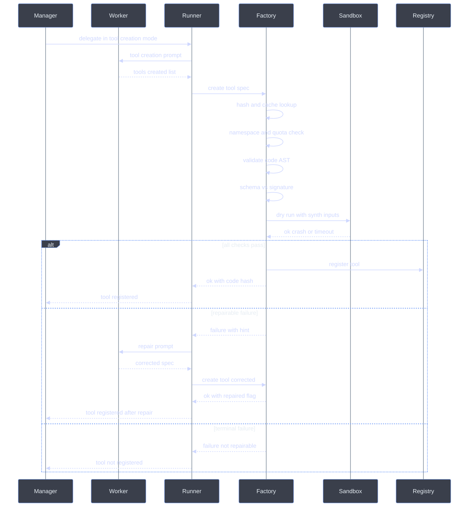
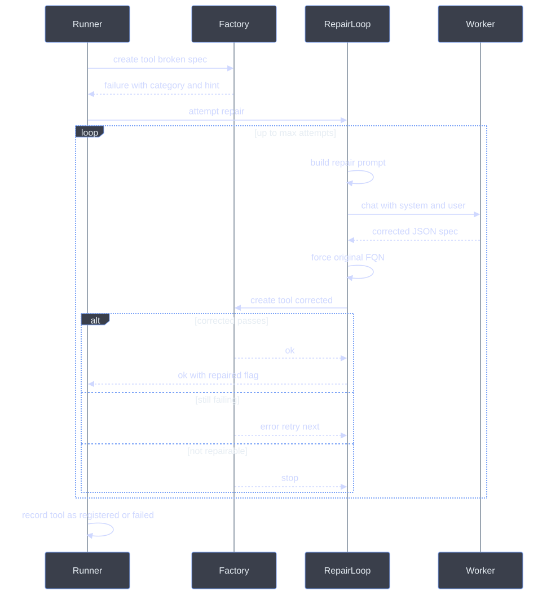
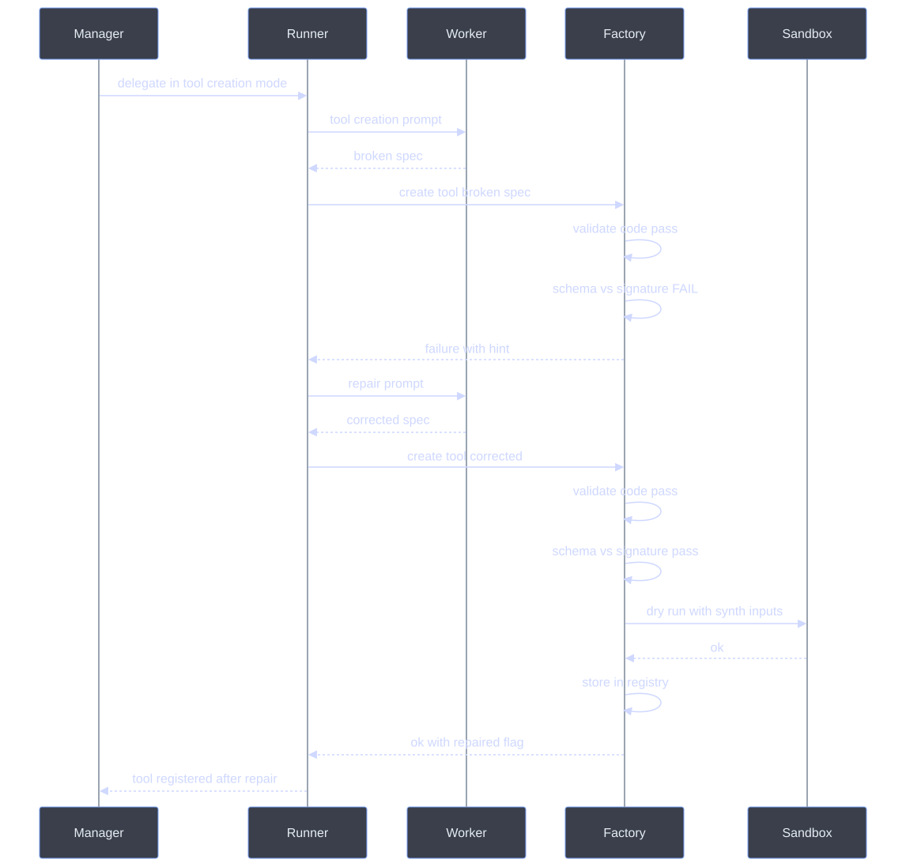

# Runtime Tool Generation Pipeline

> **Status**: implemented in `awp-runtime` ≥ 1.0.33
> **Source**: `packages/awp-runtime/src/awp/runtime/dynamic_tool_factory.py`,
> `packages/awp-runtime/src/awp/runtime/delegation_loop_runner.py`,
> `packages/awp-runtime/src/awp/runtime/tool_repair.py`

## Mental Model

Most agent frameworks ship with a fixed tool catalogue and hope it covers every task. AWP takes the opposite bet: at autonomy level A3 and above, **workers write the tools they need, the moment they need them**. The manager flips a worker into *tool creation mode*, the worker returns a JSON spec containing Python source, and the runtime turns that source into a registered, sandboxed, schema-validated tool that any subsequent worker in the same run can call by name. Tool creation is the mechanism that turns a static workflow into an *adaptive* one.

This is also the riskiest thing AWP does, which is why the pipeline below is paranoid by design. The naive version of "let an LLM write code and run it" fails ~30-40% of the time on first try (forbidden imports, missing returns, schema/signature drift, runtime crashes on edge inputs). Each failure costs a full Manager iteration plus an expensive worker LLM call. The **B1-B6 robustness pipeline + auto-repair loop** described here pushes that close to zero by validating, dry-running, and *repairing* the spec inside the same worker call — the manager only ever sees the polished result.

Code mode and tool creation are **enabled by default** in interactive contexts (Workflow Studio, Jupyter) precisely because the safety envelope is strong enough to make the default safe. The same envelope is what lets the [skill system](skill-system.md) generate tool templates without auditing every line, and what lets [auto-promoted submanagers](manager-intelligence.md#complexity-scored-auto-promotion-a4-trigger) inherit a parent's tool factory without widening the trust boundary.

This document is the canonical reference for the `DynamicToolFactory` and the inline LLM repair loop: every stage, every failure mode, every robustness check.

---

## 1. Why this matters

Each failed tool generation costs:

- 1 wasted Manager iteration (pick a worker, build a prompt, parse a response)
- 1 wasted worker LLM call (often the most expensive part of a run)
- All downstream worker actions that depended on the tool

Without robustness checks, ~30-40% of LLM-generated tools fail on first try
(forbidden imports, missing returns, schema/signature mismatches, runtime
crashes on edge inputs). The pipeline below pushes that close to zero by
catching errors *before* the Manager iteration ends and repairing them
inside the same worker call.

---

## 2. End-to-end flow (high level)



The dashed boxes are the new robustness layers. Everything outside them
existed before; everything inside is contributed by the building blocks
B1–B6 below.

---

## 3. The six robustness building blocks

```text
   B1 Prompt   B2 Schema   B3 Dry-run   B4 Repair   B5 Cache   B6 Errors
   ────────    ─────────   ──────────   ─────────   ────────   ─────────
   stronger    AST sig.    synthetic    inline      sha256     categories
   pre-flight  vs schema   inputs       LLM fix     dedup      + metrics
       │           │            │           │          │            │
       ▼           ▼            ▼           ▼          ▼            ▼
   ┌─────────────────────────────────────────────────────────────────┐
   │  worker spec  ─►  validate  ─►  dry-run  ─►  register  ─►  call │
   │                       │             │            ▲              │
   │                       └────fail─────┴────►  repair loop ────────┘
   └─────────────────────────────────────────────────────────────────┘
```


| ID | What | Where | Effect |
|---|---|---|---|
| **B1** | Stronger LLM prompt with failure-pattern list, DO/DON'T, schema rule | `delegation_loop_runner.py::_build_tool_creation_prompt` | Lower first-try error rate |
| **B2** | Pre-flight schema↔signature consistency + import-alternative hints | `dynamic_tool_factory.py::_check_schema_signature`, `validate_code` | Catch errors before any execution |
| **B3** | Dry-run probe with synthetic inputs before registration | `dynamic_tool_factory.py::_dry_run_tool` | Reject tools that crash on minimal input |
| **B4** | Inline LLM repair loop (max 2 attempts) inside worker iteration | `tool_repair.py::attempt_repair`, hooked from `_process_tool_creation` | No Manager round-trip needed for fixable errors |
| **B5** | Content-addressable cache (SHA256 of fqn+code+schema) | `dynamic_tool_factory.py::compute_tool_hash` | Parallel workers dedup automatically |
| **B6** | Structured error categories + configurable timeout + metrics | `dynamic_tool_factory.py` (`ToolValidationError`/`ToolDryRunError`/…, `_metrics`) | Repair loop knows what's repairable; observability for tuning |

---

## 4. Pre-flight pipeline in detail



### 4.1 Schema↔signature check (B2)

`_check_schema_signature` walks the handler AST and extracts every kwarg
the handler reads:

- direct kwonly params: `def handler(*, foo, bar)` → `{foo, bar}`
- subscript access on `**kwargs`: `kwargs["x"]`
- method calls on `**kwargs`: `kwargs.get("y", default)`, `kwargs.pop("z")`

It then compares this set against `parameters.properties.keys()`:

- **Missing in schema** → hard error (`schema_mismatch`, repairable). The
  router would never pass these kwargs and the tool would silently break.
- **Unused in schema** → warning only. Tools may legitimately accept
  optional fields.

The pre-defined sandbox helpers (`_secrets`, `_workspace_dir`,
`_output_dir`) are always exempt — they are injected, not router-supplied.

### 4.2 Import-alternative hints (B2/B6)

Forbidden imports now return *actionable* errors. Each common offender
maps to a concrete suggestion in `IMPORT_ALTERNATIVES`:

| Forbidden | Suggested replacement |
|---|---|
| `os` / `os.path` | `_output_dir`, `_workspace_dir`, builtin `open`, string concat or `pathlib` |
| `subprocess` | shell access not available — pure-Python only |
| `sys` | use `_secrets` for secrets; no env access |
| `socket` | declare `network` capability and use `urllib.request` / `requests` |
| `multiprocessing` | single-process implementation only |

The repair loop forwards these hints into the next LLM prompt, so the
fix usually arrives on attempt #1.

### 4.3 Dry-run probe (B3)

The probe runs the *real* handler in the *real* sandbox with synthetic
minimal inputs derived from the JSON Schema:

| Schema type | Synthetic value |
|---|---|
| `string` | `""` |
| `integer` / `number` | `0` |
| `boolean` | `false` |
| `array` | `[]` |
| `object` | `{}` |
| `enum` | first enum value |
| `default` present | the default |

Synthetic kwargs are filtered to only those the handler signature accepts
(so `def handler(*, x)` is not handed an `unused` kwarg).

The probe tolerates two cases without failing the tool:

- `ModuleNotFoundError` for an optional library — the worker is expected
  to `pip.install` it before calling the tool for real.
- Handler returns `ok: false` with an informative error — that's a
  legitimate input-validation path.

Everything else (sandbox crash, traceback, no output, timeout) is
flagged `category="dry_run"`, the tool is **not** registered, and the
repair loop kicks in.

### 4.4 Content-addressable cache (B5)

```python
def compute_tool_hash(name: str, code: str, parameters: dict) -> str:
    norm_code = "\n".join(line.rstrip() for line in code.strip().splitlines())
    schema_blob = json.dumps(parameters, sort_keys=True, default=str)
    return sha256(f"{name}\0{norm_code}\0{schema_blob}".encode()).hexdigest()
```

- Trailing whitespace and key order do **not** affect the hash.
- Two parallel workers generating the same `dyn.weighted_score` → second
  call returns the cached registration in microseconds, no validation,
  no dry-run.
- The hash is persisted with each `DynamicToolRecord` and reloaded.

---

## 5. The repair loop (B4) in detail



Key invariants:

- **No round-trip to the Manager.** The repair happens entirely inside the
  worker iteration. Manager sees a single `tools_registered` entry with
  `repaired: true, repair_attempts: N`.
- **The LLM cannot rename the tool** during repair — `name` is forced
  back to the original FQN.
- **Repair is skipped** when `repairable=false`, no `llm_client`, or
  `max_attempts` is hit.
- **The LLM cannot widen the spec maliciously**: the corrected output
  goes through the *full* pipeline (validate_code → schema check →
  dry-run → register), so it cannot bypass any sandbox rule.
- Every repair attempt bumps `factory.metrics["repair_attempts"]`;
  successes bump `repair_successes`. Tunable via the metrics snapshot.

### Repair prompt structure

The user message contains five sections in fixed order:

1. The exact error message from `factory.create_tool`
2. The structured hint (when present, e.g. import alternative)
3. The failure category and attempt number
4. A canned "how to fix" block keyed by category
5. The full broken spec as JSON (so the LLM can edit-in-place)

The system message is a single line:
> *"You are repairing a single failed AWP dynamic tool. Output ONLY a
> JSON object with the corrected tool spec — no prose. Keep the same
> name (FQN). Fix the specific error described, then double-check the
> handler signature matches the parameter schema."*

This produces tightly scoped, low-temperature responses.

---

## 6. Configuration

All knobs live under `dynamic_tools` in the workflow manifest. Defaults
preserve the previous behaviour, so existing workflows continue to work.

```yaml
dynamic_tools:
  enabled: true
  persist: true
  max_total: 50
  allowed_namespaces: [dyn]

  # --- Robustness knobs (new) ---
  cache: true                 # B5: content-addressable dedup
  dry_run: true               # B3: synthetic-input probe before register
  dry_run_timeout_seconds: 5  # B3 timeout (cap: code_executor.max_timeout)
  timeout_seconds: 10         # B6: tool-call timeout used in production
```

The repair loop is configured per worker via the `codemode` envelope:

```json
{
  "codemode": { "tool_creation": true, "repair_attempts": 2 }
}
```

`repair_attempts: 0` disables the loop.

---

## 7. Error categories (B6)

| `category` | Status | Repairable? | Triggered by |
|---|---|---|---|
| `validation` | 400 | yes | syntax / no return / wrong handler signature / two handlers |
| `import` | 403 | yes | forbidden import (carries alternative suggestion) |
| `schema_mismatch` | 400 | yes | handler reads kwargs not declared in schema |
| `dry_run` | 422 | yes | sandbox crash / timeout / no output on synthetic inputs |
| `policy` | 403/409/429 | **no** | reserved namespace, quota exceeded, FQN already registered with different code |

Every failed result includes `{ok, status, error, category, repairable, hint}`.
Downstream code (the repair loop, the UI activity feed, observability
exporters) can branch on these without parsing free-text errors.

---

## 8. Metrics

`DynamicToolFactory.metrics` returns a snapshot dict:

```python
{
    "attempts": 47,             # create_tool calls (incl. repair retries)
    "successes": 39,            # tools registered
    "cache_hits": 6,            # B5 wins
    "validation_failures": 2,
    "import_failures": 1,
    "schema_mismatches": 4,
    "dry_run_failures": 3,
    "policy_failures": 0,
    "repair_attempts": 8,       # B4 LLM calls
    "repair_successes": 6,      # tools rescued by repair
}
```

Useful health signals:

- `successes / attempts` — first-try yield (target: ≥ 0.85)
- `repair_successes / repair_attempts` — repair effectiveness
- `cache_hits / attempts` — dedup effectiveness in parallel workflows

---

## 9. Test coverage

Robustness is locked in by `packages/awp-runtime/tests/test_dynamic_tool_robustness.py`
(28 tests):

- B2: schema↔signature consistency, `**kwargs` access detection,
  `_secrets` exemption, unused-property warning
- B3: dry-run rejects crash-on-empty-input, accepts safe handlers, can
  be disabled via config
- B4: repair fixes schema mismatch, fixes forbidden import, gives up
  after max attempts, skipped when not repairable / no LLM
- B5: hash stability under whitespace/key reordering, distinct tools
  → distinct hashes, cache hit on re-creation by another agent
- B6: error categorisation, metrics counters, alternative import hints
- Integration: full `_process_tool_creation` flow with a fake LLM that
  produces a broken-then-fixed tool — verifies repair runs, tool is
  registered, metrics increment correctly

Run with:

```bash
pytest packages/awp-runtime/tests/test_dynamic_tool_robustness.py -v
```

The complete non-E2E suite (`pytest -k "not e2e"`) is **834 tests
green** with these changes — no regressions.

---

## 10. Sequence diagram: a full happy + repair path



---

## 11. References

- [Plan: robust runtime tool generation](../.claude/plans/witty-herding-cosmos.md) (working notes; not normative)
- `packages/awp-runtime/src/awp/runtime/dynamic_tool_factory.py`
- `packages/awp-runtime/src/awp/runtime/tool_repair.py`
- `packages/awp-runtime/src/awp/runtime/delegation_loop_runner.py` (`_build_tool_creation_prompt`, `_process_tool_creation`)
- `packages/awp-runtime/tests/test_dynamic_tool_robustness.py`
