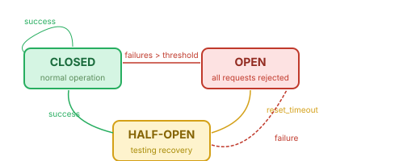

# Security Reference

Security is a cross-cutting concern that applies across all AWP layers. It is configured in the `security` section of [workflow.awp.yaml](manifest.md).

## Circuit Breaker

The circuit breaker pattern prevents cascading failures by temporarily disabling agents or tools that are repeatedly failing.

### Configuration

```yaml
security:
  circuit_breaker:
    enabled: true
    failure_threshold: 5
    reset_timeout: 60
    half_open_max: 2
    monitored_exceptions:
      - timeout
      - rate_limit
      - server_error
      - connection_error
```

### Fields

| Field | Type | Default | Description |
|-------|------|---------|-------------|
| `enabled` | boolean | -- | Required. Whether circuit breaker is active. |
| `failure_threshold` | integer | `5` | Consecutive failures before the circuit opens. |
| `reset_timeout` | integer | `60` | Seconds before the circuit transitions from open to half-open. |
| `half_open_max` | integer | `2` | Test requests allowed in half-open state. |
| `monitored_exceptions` | list | `["timeout", "server_error"]` | Exception types that count toward the threshold. |

### State Machine

  

- **CLOSED:** Normal operation. Failures are counted.
- **OPEN:** All requests are immediately rejected. No execution occurs.
- **HALF-OPEN:** A limited number of requests (`half_open_max`) are allowed. If they succeed, the circuit closes. If any fail, the circuit reopens.

### Scope

Circuit breakers may be applied at two levels:

- **Per-agent:** Monitors individual agent failures.
- **Per-tool:** Monitors individual tool call failures.

```yaml
security:
  circuit_breaker:
    enabled: true
    failure_threshold: 5
    per_tool:
      web.search:
        failure_threshold: 3
        reset_timeout: 120
```

## Rate Limiting

Rate limiting prevents excessive resource consumption.

### Per-Agent Rate Limits

```yaml
security:
  rate_limiting:
    per_agent:
      max_calls_per_minute: 60
      max_tokens_per_minute: 100000
```

| Field | Type | Default | Description |
|-------|------|---------|-------------|
| `max_calls_per_minute` | integer | `60` | Maximum LLM calls per agent per minute. |
| `max_tokens_per_minute` | integer | `100000` | Maximum tokens (input + output) per agent per minute. |

When a rate limit is exceeded, the runtime must either queue the request or reject it with a `rate_limit` error, and record the event in the audit trail.

### Per-Tool Rate Limits

```yaml
security:
  rate_limiting:
    per_tool:
      max_calls_per_minute: 30
      overrides:
        web.search:
          max_calls_per_minute: 10
        shell.execute:
          max_calls_per_minute: 5
```

| Field | Type | Default | Description |
|-------|------|---------|-------------|
| `max_calls_per_minute` | integer | `30` | Maximum tool calls per minute across all agents. |
| `overrides` | object | -- | Per-tool overrides. Keys are tool FQNs. |

## Access Control

### Tool Permissions

Per-agent tool access is defined in the [capabilities section](tools.md) of `agent.awp.yaml` (`capabilities.tools.allowed` and `capabilities.tools.denied`). The security layer adds enforcement:

- The runtime must enforce tool ACLs before executing any tool call.
- Rejected tool calls must be logged as `security.event` in the audit trail.

### Channel ACL

Per-channel access is defined in the [communication section](communication.md) (`communication.channels[].participants`). The security layer adds:

- The runtime must enforce channel ACLs before delivering any message.
- ACL violations must be logged as `security.event` in the audit trail.

### Sandbox Restrictions

Sandbox access is defined in the [capabilities section](tools.md) (`capabilities.sandbox`). The security layer adds:

- The runtime must enforce filesystem and command restrictions.
- Sandbox violations must be logged as `security.event`.

### Memory Access Control

Memory access is defined in the [memory section](memory.md) (`memory.access_control`). The security layer adds:

- The runtime must enforce memory tier permissions before any read or write.
- Violations must be logged as `security.event`.

## Secrets Management

### Configuration

```yaml
security:
  secrets:
    backend: env
    options: {}
    never_log:
      - OPENROUTER_API_KEY
      - DATABASE_PASSWORD
      - AWS_SECRET_ACCESS_KEY
```

| Field | Type | Default | Description |
|-------|------|---------|-------------|
| `backend` | string | `"env"` | `"env"`, `"vault"`, or `"aws_secrets"`. |
| `options` | object | `{}` | Backend-specific configuration. |
| `never_log` | list | `[]` | Environment variable names that must not appear in any output. |

### Backend: `env`

Secrets are read from environment variables. Variables in `workflow.env` with `sensitive: true` are automatically added to `never_log`.

### Backend: `vault`

Secrets are read from HashiCorp Vault.

```yaml
security:
  secrets:
    backend: vault
    options:
      address: "https://vault.example.com"
      auth_method: token
      secret_path: "secret/data/awp"
```

### Backend: `aws_secrets`

Secrets are read from AWS Secrets Manager.

```yaml
security:
  secrets:
    backend: aws_secrets
    options:
      region: "us-east-1"
      secret_name: "awp/production"
```

### Logging Rules

1. Values of variables in `never_log` must not appear in any log, metric label, span attribute, or audit entry.
2. Fields in `state.sharing.sensitive_fields` must be redacted in all observability output.
3. `workflow.env` entries with `sensitive: true` are treated identically to `never_log` entries.
4. Redaction must occur before the log entry is written.

## Security Events and Audit

Security events must always be logged to the audit trail regardless of the audit trail's `enabled` setting. If the audit trail is disabled, security events must still be logged to the application log at WARNING level or higher.

### Security Event Types

| Event Type | Trigger | Severity |
|------------|---------|----------|
| `acl.tool.denied` | Agent attempted to call a denied tool. | WARNING |
| `acl.channel.denied` | Agent attempted to publish/subscribe to a denied channel. | WARNING |
| `acl.memory.denied` | Agent attempted to access a denied memory tier. | WARNING |
| `acl.sandbox.denied` | Sandbox attempted to access a denied path or command. | WARNING |
| `rate_limit.exceeded` | Agent or tool exceeded rate limit. | WARNING |
| `circuit_breaker.opened` | Circuit breaker transitioned to OPEN. | WARNING |
| `circuit_breaker.half_open` | Circuit breaker transitioned to HALF-OPEN. | INFO |
| `circuit_breaker.closed` | Circuit breaker transitioned to CLOSED. | INFO |
| `secret.access` | A secret was accessed. | INFO |
| `secret.leak_prevented` | A secret value was redacted from output. | WARNING |
| `auth.failure` | Authentication to an external service failed. | ERROR |
| `integrity.violation` | Audit trail hash chain integrity check failed. | CRITICAL |

### Security Event Format

```json
{
  "timestamp": "2026-03-23T14:30:00.000Z",
  "event_type": "acl.tool.denied",
  "severity": "WARNING",
  "run_id": "abc12345",
  "agent_id": "research_analyst",
  "details": {
    "tool": "shell.execute",
    "reason": "Tool not in agent's allowed list."
  }
}
```
