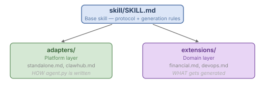

# Skill System

The AWP skill system enables AI assistants to generate complete AWP workflows from natural language descriptions. It consists of a base skill, platform adapters, and domain extensions.

## Overview

The skill system has three components:

  

An AI assistant loads these files and uses them to generate a complete AWP workflow from a user's natural language description.

## Base Skill (SKILL.md)

The base skill defines:

- The AWP 7-layer model overview
- [Autonomy levels](compliance.md) and when to use each
- [Validation rules](validation.md) R1-R30 (the strict rules)
- The generation process (5 phases)
- References to templates for every file type

### Generation Phases

#### Phase 0: Planning

Before generating files, the AI analyzes requirements:

1. What the workflow does and how data flows between agents.
2. The agent graph: distinct roles, dependencies, data flow.
3. State sharing: which fields each agent produces and consumes.
4. Autonomy level: how autonomous is the workflow.
5. Tools: which MCP tools each agent needs.
6. Memory: whether cross-session persistence is beneficial.
7. Communication: whether agents need messaging outside the DAG.

#### Phase 1: Requirements Gathering

Confirm with the user:
- Workflow name and description.
- Number and roles of agents.
- Data flow between agents.
- Required tools per agent.
- Memory and communication needs.
- Target autonomy level.

If the user provides a brief description, the AI infers reasonable defaults.

#### Phase 2: Generate the Project

Files are generated in this order:

1. **Workflow manifest** (`workflow.awp.yaml`) -- All sections needed by the autonomy level.
2. **Agent configurations** (`agent.awp.yaml` per agent) -- Model, tools, prompt, output.
3. **Agent implementations** (`agent.py` per agent) -- Platform-specific, using the adapter.
4. **System prompts** (`SYSTEM_PROMPT.md` per agent) -- Role, responsibilities, tool instructions.
5. **Intro prompts** (`00_INTRO.md` per agent) -- Task introduction and context.
6. **Output schemas** (`output_schema.json` and `output_schema_desc.json` per agent).
7. **Custom tools** (if needed) -- In `mcp/` directory.
8. **Project skills** (if needed) -- In `skills/` directory, following the standard skill structure.

##### Skill Structure

Every generated skill (project-level or agent-level) MUST follow this structure:

```markdown
---
name: {skill_name}
domain: {domain}
scope: project|agent
version: "1.0"
---

# {Skill Name}

## Purpose           ← mandatory: one sentence
## Concepts          ← mandatory: 3-7 key terms as definition list
## Rules             ← mandatory: numbered, testable constraints
## Procedure         ← conditional: step-by-step sequence (if multi-step)
## Examples          ← conditional: input → output pairs (if non-obvious)
## References        ← optional: external standards or sources
```

This applies equally to static project skills and dynamically generated delegation loop skills.

#### Phase 3: Validation

After generating all files, the AI verifies compliance with rules R1-R30:

- R1: `workflow.name` matches directory name.
- R2: All agent IDs are snake_case.
- R3: Agent classes named `Agent` (Python, recommended).
- R4: `Agent.name` returns the correct agent ID (Python, recommended).
- R5-R6: Agent directories exist, files present.
- R7-R10: Schema and prompt files exist.
- R11-R12: Dependencies reference valid agents, no cycles.
- R13-R15: share_output matches schema, tools reference valid MCP tools.
- R16: Valid execution mode.
- R17: All schemas include `confidence` field.
- R18: Valid JSON Schema draft-07 with `type: object`.

#### Phase 4: Summary

The AI presents:
- Workflow name and autonomy level.
- Agent graph visualization (text-based DAG).
- Files generated (count and list).
- Autonomy badge: `AWP A{N} {Level Name}`.
- Assumptions and recommendations.

## Adapters

Adapters define how `agent.py` is generated for a specific platform.

### Available Adapters

| Adapter | Purpose |
|---------|---------|
| `adapters/standalone.md` | Generate `agent.py` for the AWP standalone runtime (`awp-protocol` package). |
| `adapters/cloudflare-dynamic-workers.md` | Generate TypeScript project for Cloudflare Workers deployment. |
| `adapters/clawhub.md` | Publish AWP skills and workflows to the ClawHub registry. |

### How Adapters Work

Each adapter provides:
- An `agent.py` template with `{{AGENT_ID}}` placeholders.
- Execution model description (how the platform runs agents).
- Installation and dependency information.
- Examples for running workflows.

The default adapter is `standalone.md`, which generates agents using the `AWPAgent` interface from `awp-protocol`.

### Adding a New Adapter

Create a markdown file in `skill/adapters/{platform}.md` with:

1. **When to Use** -- When this adapter is appropriate.
2. **agent.py Template** -- The code template.
3. **How Execution Works** -- Platform execution model.
4. **Running a Workflow** -- API and CLI examples.
5. **Dependencies** -- Installation instructions.

Third-party platforms can distribute their own adapter files.

## Extensions (Skill Inheritance)

Extensions customize the base skill for specific domains. They work like class inheritance: the base skill defines the protocol; an extension overrides or extends specific parts.

### Extension Format

```markdown
# AWP Extension: {Name}

## Extends
base: skill/SKILL.md
adapter: skill/adapters/{platform}.md    # optional

## Description
{What this extension does.}

## Defaults
defaults:
  autonomy_level: A1
  model: anthropic/claude-sonnet-4

## Required Agents
agents:
  - id: {agent_id}
    role: {role}
    tools: [tool.a, tool.b]

## Required Output Fields
fields:
  - name: {field_name}
    type: {type}
    required: true

## Additional Rules
- **{ID}:** {rule description}

## Constraints
- denied_tools: [shell.execute]
- required_memory_tiers: [long_term, daily_log]
- min_autonomy: A1

## Additional Templates
templates:
  - file: SYSTEM_PROMPT_PREFIX.md
    inject: prepend
    content: |
      {content injected into system prompts}

## Additional Skills
skills:
  - name: {skill_name}
    content: |
      {skill content}

## Additional Tools
tools:
  - fqn: {namespace.action}
    description: {what it does}
    template: |
      {Python code}
```

### Merging Rules

When an extension is loaded alongside the base skill:

- **Rules are additive.** Extension rules (F1, D1, etc.) apply on top of R1-R30.
- **Defaults use last-wins.** The extension overrides base defaults.
- **Required agents are merged.** Union of all required agents, no duplicates by ID.
- **Constraints are additive.** Denied tools from extension are added to the deny list.

### Composition

Extensions can reference other extensions:

```markdown
## Extends
base: skill/SKILL.md
also:
  - extensions/examples/financial.md
```

When composing:
- Rules and constraints are **additive** (union).
- Defaults use **last-wins** (later extension overrides earlier).
- Required agents are **merged** (union, no duplicates).

### Available Extensions

| Extension | Domain | Key Features |
|-----------|--------|-------------|
| `extensions/examples/financial.md` | Finance | Risk assessor agent, audit trail, compliance controls. |
| `extensions/examples/devops.md` | DevOps | Safety checker agent, rollback plans, shell constraints. |

### Creating a Custom Extension

1. Copy an existing extension as a starting point (e.g., `financial.md`).
2. Adjust sections to your domain.
3. Place the file in `extensions/` or any path the AI can read.
4. Tell the AI: "Use the {name} extension when building this workflow."

## ClawHub Integration

The skill system integrates with ClawHub for publishing and discovery.

### Publishing the Build Skill

```bash
clawhub publish skill/
```

Users install it with:

```bash
clawhub install awp-workflow-builder
```

Once installed, any ClawHub-compatible AI assistant can use the skill to generate AWP workflows.

### Publishing Workflows as Skills

An AWP workflow becomes a ClawHub skill by adding a `SKILL.md` at the workflow root. See [Packaging Reference](packaging.md) for the full ClawHub integration guide.

### Publishing Extensions as Skills

Extensions can be published as standalone ClawHub skills:

```
awp-ext-financial/
├── SKILL.md                    <-- ClawHub frontmatter
└── financial.md                <-- AWP extension file
```

```bash
clawhub publish awp-ext-financial/
```

Users install and compose extensions:

```bash
clawhub install awp-workflow-builder
clawhub install awp-ext-financial
```

Then tell the AI: "Build a portfolio analysis workflow using the AWP financial extension."

### Discovery

```bash
clawhub search awp                        # All AWP skills
clawhub search awp-extension              # Just extensions
clawhub search awp-workflow               # Just workflows
```

### Code Mode Skill Auto-Generation

When an agent has `capabilities.codemode.enabled: true`, the skill system
automatically generates a **Code Mode Skill** — a Markdown file injected into
the agent's system prompt that documents the typed SDK API.

This skill is generated from `capabilities.tools.allowed` and replaces the
individual tool definitions in the system prompt. It includes:

- SDK type definitions (TypeScript interface or Python class)
- Method signatures for each allowed tool
- Usage examples
- Rules for writing valid Code Mode functions

Template: `skill/templates/codemode-skill.md`

## Templates

The `skill/templates/` directory contains starter files:

| Template | Purpose |
|----------|---------|
| `workflow.awp.yaml` | Complete workflow manifest with all sections. |
| `agent.awp.yaml` | Minimal agent configuration. |
| `agent-full.awp.yaml` | Full-featured agent configuration. |
| `agent.py` | Python agent class. |
| `SYSTEM_PROMPT.md` | System prompt with placeholders. |
| `00_INTRO.md` | Intro prompt with placeholders. |
| `output_schema.json` | Output JSON Schema template. |
| `output_schema_desc.json` | Field description template. |
| `mcp-tool.py` | Custom MCP tool template. |
| `project-skill.md` | Project-level skill template. |
| `codemode-skill.md` | Code Mode execution skill (auto-generated). |
| `adapters/cloudflare/` | Cloudflare Workers project templates. |

## References

The `skill/references/` directory contains condensed documentation for AI context windows:

| Reference | Purpose |
|-----------|---------|
| `spec-summary.md` | Condensed AWP specification. |
| `compliance-levels.md` | Quick reference for A0-A4 autonomy levels. |
| `validation-rules.md` | R1-R30 checklist format. |
| `tools-reference.md` | Built-in MCP tool catalog. |
| `architecture.md` | Architecture overview. |
